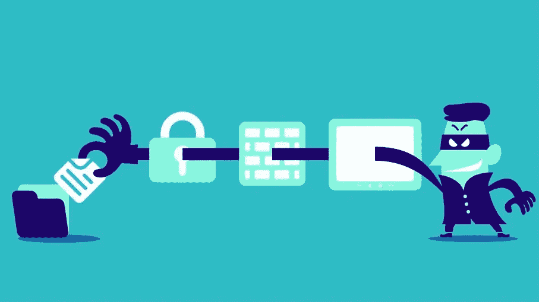

# 交易所和 ico 在保护用户数据方面可以做得更多

> 原文：<https://medium.com/hackernoon/exchanges-and-icos-can-do-a-lot-more-to-secure-users-data-a922733409d1>

*作者:Shyft 网络国际首席执行官 Bruce sil coff*

密码交易所的重大数据泄露已经变得太常见了。[据报道](https://www.cryptolinenews.com/2019/01/hacked-kyc-data/)，来自多个主要密码交易所的数千名用户的个人身份数据至少从去年 7 月就开始出售。我们谈论的不是一个抽象的数据集。这包括持有护照和驾照等敏感文件的用户的照片。交易所和 ico 是否应该在保护用户敏感数据安全方面做得更多？这是一个系统性的问题，远远超出了密码世界。

# 数据泄露是可以预测的

现在，我们几乎每天都会听到重大数据泄露事件；确切地说，当我坐下来写这篇文章时，我发现了一篇关于投资公司贝莱德如何被成功攻击的新报道[在彭博](https://www.bloomberg.com/news/articles/2019-01-19/blackrock-exposes-data-on-thousands-of-advisers-on-ishares-site)。但作为加密货币的主要加入点，交易所采取积极的安全措施对我们行业的未来非常重要。

目前关于网络安全的想法——或者，正如证交会的约翰·里德·斯塔克在彭博的文章中所说，“公司不能完全避免违规，但他们可以以重建信任的方式对违规做出反应”——并没有削弱网络安全。想象一下，雇佣一名保镖来保护你，结果却发现他们没有提供威胁评估和个人安全，而是袖手旁观，说“如果有人伤害你，就喊我一声。”

这令人愤怒，但安全专家认为这些漏洞只是生活中的一个事实，是网上做生意的成本，这是标准的做法。我认为我们能够并且应该做得更好。

数据泄露不是上帝的随机行为。它们是可预测的事件，使用我们知道的技术和策略，通过适当的系统，这些事件可以在造成损害之前被跟踪和预防。

## 黑色数据市场

正如我们的首席技术官 Chris Forrester [所说的](/shyft-network-media/shyft-tech-update-intro-to-shyft-98925b2bd939)，自从网络诞生以来，消费者的在线数据已经被审查、提取并传输给了大量的第三方。这些数据(您的数据)是许多企业的核心组成部分，也是他们向消费者提供服务的方式。如果无法获得这些数据，大多数主要科技公司不仅会盲目行事，也没有可行的商业模式可言，因此我们可以合理地预测，在未来几年，从生物识别到物联网等领域，将会有更多的数据被存储、收集和共享。

**当前数据周期如下:**

*   重大违规事件定期发生。
*   这些漏洞[向恶意第三方泄露个人信息](https://www.rand.org/content/dam/rand/pubs/testimonies/CT400/CT490/RAND_CT490.pdf)。
*   违规行为仍在继续，在网络文化中变得如此根深蒂固，以至于控制大多数特定领域的大公司[成为目标](https://www.washingtonpost.com/news/the-switch/wp/2018/04/04/facebook-said-the-personal-data-of-most-its-2-billion-users-has-been-collected-and-shared-with-outsiders)。
*   用于实施这些破坏的工具在设计上很成功，在黑市上被重新包装和出售，被改进，导致进一步的破坏。

这种做法的持续螺旋上升造成了对合法产品平台的不信任，但由于这些平台或做法本身没有可行的替代方案，结果只是动荡和监管的增加，这在众所周知的游戏中总是落后一步。这增加了服务提供商的成本，并使每个人都面临数据泄露的风险。因此，黑数据市场不断发展壮大。

我们需要一种*主动*的安全方法。说隐私已死很容易，除了坐以待毙，别无选择。有一个替代方案，如果我们未能实施，“隐私已死”将成为一个自我实现的预言。

# 老问题，新解决方案

世界上最有价值的资源不再是石油；[是数据](https://www.economist.com/leaders/2017/05/06/the-worlds-most-valuable-resource-is-no-longer-oil-but-data)。这意味着我们的数据对恶意行为者的吸引力不会很快降低，攻击的数量和严重性都会增加。

那么，隐私死了吗？没那么快。区块链可以提供新的方式来为在线交易建立一个更安全、更可靠的未来，这是恰当的。

通过与交易所合作，KYC 提供商(通常是大银行、金融服务公司和政府实体)可以充当区块链系统中的数据验证者。我的公司 Shyft 正在建设一个可以实现这一特定功能的网络。在我们的网络中，这些数据验证器被称为信任锚。这些信任锚不是简单地向区块链广播用户的个人数据，而是在需要的基础上共享关于数据的相关元数据(假设用户同意共享该元数据)。

那会是什么样子呢？让我们想象一下，你正试图在一个主要的加密交易所获得一个账户，而这个交易所连接到一个像 Shyft 这样的网络。大多数交易所真正需要知道的是:

*   您是否是购买/交易密码合法的国家的居民？
*   你满 18 岁了吗？
*   你在现有的黑名单上吗？

请注意，他们*并不*需要大量的个人身份信息(PII );然而，目前许多网站最终托管了大量的数据。在 Shyft 这样的系统上，交易所可以(在得到用户明确同意的情况下)ping 一个相关的信任锚(在这种情况下，假设它是用户的银行)来确认这三个确切的标准，他们将能够通过*证明*每个声明的真实性来做到这一点。

如果这个受信任的实体确认你符合所有三个条件，就没有必要公布，比如，你确切的街道地址或任何其他联系信息。

这意味着，在网络遭到破坏、攻击者获得元数据的情况下，它不能用来识别特定的任何人。所有的 PII 将被严格地存储在企业级数据中心的*链外*——并非不可能被侵入，但肯定比加密交换所能提供的任何东西都要困难得多。

有一些方法可以平衡隐私，而不会使数据对合规性、产品改进和数据的其他合法用途毫无用处。能够提供使当前系统相形见绌的安全特性的加密工具已经存在。

换句话说，尽管有相反的断言，但你的数据不必以容易遭受又一次网络安全漏洞的方式收集和共享。

# 是时候主动出击了

除了在“区块链”上放置一个数据验证器网络，还可以做更多的事情随着一些中央权威的元素添加到网络中，抵御 51%攻击和其他形式的加密特定攻击变得简单得多。

如果没有适当的机制来监控攻击模式并警告信任锚可能的恶意用户，那么您的计算能力将会波动，有人就可以欺骗信任锚并造成各种破坏。是时候接受某种程度的内置监督(以及特定的技术解决方案和治理模型)将是大幅提高安全性的小小代价。

在今天的信息经济中，重新启动信任并建立正确的同意和安全系统可能并不容易，但必须这样做。我们必须现在就行动。

========================================

 [## 布鲁斯·西尔科夫-首席执行官-社交网络| LinkedIn

### 查看 Bruce Silcoff 在全球最大的职业社区 LinkedIn 上的个人资料。布鲁斯有 12 项工作列在他们的…

www.linkedin.com](https://www.linkedin.com/in/brucesilcoff/) 

*在* [*Shyft 了解更多。网络*](https://www.shyft.network/) *或电报***。**