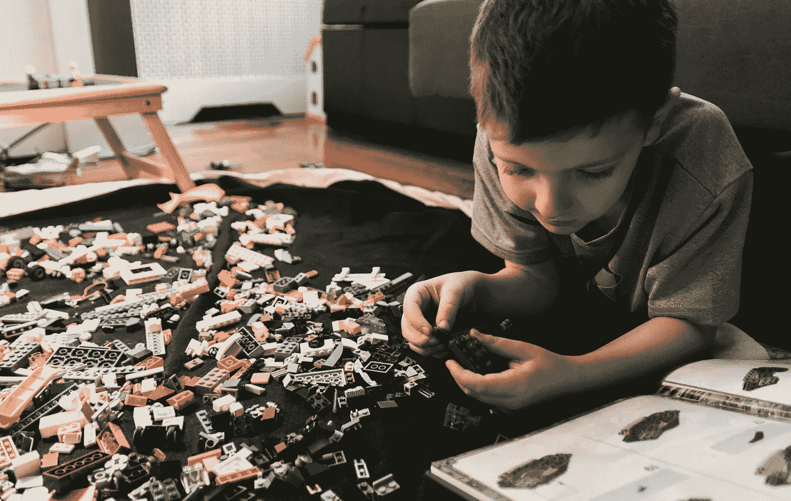

# 向一个八岁的孩子解释 Git 和 GitHub

> 原文：<https://medium.com/hackernoon/explaining-git-and-github-to-an-eight-year-old-f5fa823fa791>

当你探索广阔的编程世界时，你可能听说过 GitHub。人们一直在说你需要使用它，因为很多人都在使用它，你未来的雇主也希望知道你在使用它。所以你想用它，但你甚至不知道它是什么。或者也许你知道它是什么，但不能完全解释它。然后就是这个 Git 的东西，听起来和 GitHub 差不多。他们是两个完全不同的实体。

我们将通过向一个八岁的孩子解释什么是 Git 和 GitHub 来帮助你。

# 饭桶

想象你八岁。

你喜欢玩乐高。你用乐高建造了城堡、堡垒和船只。但是你总是不得不把你的乐高积木拆开，因为你妈妈总是告诉你她在客厅里没有空间放你的玩具。

后来有一天，你妈妈买了一个架子来放你的玩具。所以现在你可以留着你存的任何东西。她甚至给你贴纸给你的乐高项目命名。那是饭桶，我的朋友。你可以把你自己的项目保存在你自己的硬盘上，并对你的代码写评论。

*git add* 允许你将乐高积木添加到你的货架上

*git commit* 允许你保存你的乐高积木。这就像告诉你的兄弟或姐妹不要碰你的乐高玩具。

# 开源代码库

现在，假设你妈妈在你生日的时候给你买了一个巨大的乐高玩具，让你可以建造纽约城。如果你独自工作的话，这可能需要几年的时间。所以你告诉你妈妈你想让你的朋友们帮你建造它。你妈妈不想让你们弄得乱七八糟，所以你决定在公园里搭乐高积木。那是 GitHub 的“枢纽”部分。你可以把你的代码或者你的乐高带到 Github，和大家分享。

`git remote add origin [https://github.com/YOUR-USERNAME/legos](https://github.com/YOUR-USERNAME/legos)`

想用你代码的人会叉你的代码。这仅仅意味着他们会复制代码，这样他们就可以独立工作了。这几乎就像有人借用你的乐高玩具，这样他们就可以自己建造一些东西。除了…你不需要丢失任何你自己的乐高玩具。他们可以克隆你的乐高玩具。

`git clone [https://github.com/YOUR-USERNAME/legos](https://github.com/YOUR-USERNAME/legos)`

是不是很酷？现在，您的朋友可以继续您的工作。所以一个朋友可以专注于建设公寓楼，另一个朋友可以专注于办公楼。当你的朋友把所有的积木都拼在一起时，你就有了一套完整的乐高玩具。这就是所谓的推码。

`git push origin master`

当他们把碎片推到你面前时，你会把它们拉起来。要么你，要么他们会提交一个拉请求，这就像你的朋友问你是否喜欢他们如何建造他们的乐高。如果你喜欢，你会接受拉的请求。如果您希望他们修复它，您将拒绝拉请求。

# 结论

简而言之，这就是 GitHub。推送和拉取代码的过程称为版本控制。每一步，编码人员都要确保他们的版本是最新的。有时，如果你弄乱了代码，你甚至可以回到代码的早期版本来消除错误。这样，当你使用像 GithHub 这样的版本控制系统时，很少会出现“狗吃了我的作业”的情况。

当然，您必须确保提交和记录更改，以便充分利用 GitHub。关于 GitHub，除了这些最基本的理解之外，你还可以学到很多东西。我们在这里留下了一些资源，可以帮助您更深入地理解 Git。

## 资源

GitHub 关于如何使用 GitHub 的教程:

[https://guides.github.com/activities/hello-world/](https://guides.github.com/activities/hello-world/)

Git 和 Github 视频教程:

https://www.youtube.com/watch?time_continue=211&v = swyqp 7 iy _ Tc

Hubspot 初学者指南(安装帮助):

[https://product . hubspot . com/blog/git-and-github-初学者教程](https://product.hubspot.com/blog/git-and-github-tutorial-for-beginners)