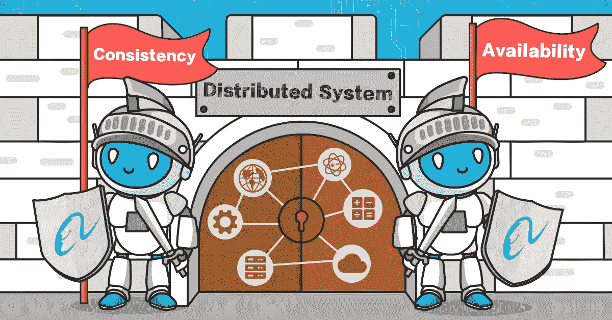
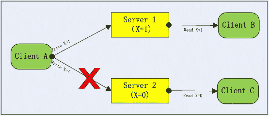

# 探索分布式系统理论:可用性和一致性

> 原文：<https://medium.com/hackernoon/exploring-distributed-system-theory-availability-and-consistency-e8c59e0875cd>

## *一位资深阿里巴巴技术专家介绍了 CAP 定理中提出的克服极限的算法*

在分布式系统中，可用性和一致性是最基本的普遍问题，因此它们之间的关系一直是广泛研究的主题。众所周知的 CAP 定理将它们的关系定义为在大规模分布式环境中互斥，在这种环境中，这种系统的第三个因素，即分区容差，不能被视为一个变量。为了试图避开这些问题，已经提出了获得图灵奖的 Paxos 协议，以最大化这种系统中的可用性和一致性的效率。为了进一步解决 Paxos 算法中普遍存在的问题，ZAB 协议随后从原始算法发展而来，远远超出了基本优化，对其前身进行了改进。

借鉴资深阿里巴巴技术专家 Jiandu 的见解，本文介绍了 CAP 定理，并概述了如何将上述算法应用于分布式系统，以更好地平衡可用性、一致性和分区容差。

# 分布式系统中的挑战

分布式系统是由位于不同联网计算机上的组件组成的系统，这些组件通过相互传递消息来进行通信并协调它们的动作。在这些系统中，一致性是一种所有节点(或组件)都可以访问最新版本数据的状态，这很容易通过使用共享内存和锁在独立场景中实现。

然而，在单机上存储数据有两个主要的限制。首先，单机故障会导致整个系统不可用。其次，系统吞吐量受限于单机的计算能力。

但是，这两个限制可以通过使用多台机器来存储数据的多个副本来克服。在这种情况下，负责更新的客户机同时更新数据的多个副本。这就产生了多台机器之间的网络无法连接的潜在问题。如果是这种情况，负责更新的客户端将无法同时连接到多台计算机，从而无法确保在所有客户端上都可以读取最新版本的数据。

为了说明这一点，让我们以下面的三个客户端和两个服务器为例。客户端 A 负责更新数据。为了确保服务器 1 和服务器 2 上的数据一致，客户端 A 同时向服务器 1 和服务器 2 发送 X=1 的写入。但是当客户端 A 和服务器 2 之间出现网络分区(不可用的网络)时，如果在服务器 1 上写入 X=1 成功，那么客户端 B 和客户端 C 将从服务器 1 和服务器 2 读取不一致的 X 值。为了保持 X 值的一致性，X=1 的写入必须在服务器 1 和服务器 2 上都失败。这类场景被纳入 CAP 定理，该定理指出，在容忍网络分区的前提下，要么必须牺牲数据的一致性，要么必须牺牲写操作的可用性。

*Schematic diagram of the CAP theory*

要解决这个问题，一个选择是让客户端 C 同时读取和使用服务器 1 和服务器 2 上的 X 值和版本信息，如下图所示。然而，网络分区也可能发生在客户机 C 和服务器 1 之间，这实质上牺牲了读可用性来换取写可用性，并且仍然没有超出 CAP 定理的范围。

*Optimization of the availability from the previous figure*

# CAP 定理

CAP 定理背后的核心思想是，基于网络的数据共享系统只能提供以下三种保证中的两种:

一致性(所有节点读取最新版本的数据)

可用性(数据高度可用)

分区容差(网络分区是容许的，并且分区之间的网络不可用)

对于大规模分布式系统，网络分区是一个必须容忍的现实，因此唯一真正的选择是在可用性和一致性之间。CAP 定理似乎为分布式系统定义了一个悲观的结局，流行的分布式系统似乎是根据该理论来判断的。比如 HBase 被认为是 CP 系统，而 Cassandra 被认为是 AP 系统。

CAP 定理断言，分布式系统中的数据无法同时实现可用性和一致性。然而，在一个系统中，通常有许多类型的数据。一些数据(例如，银行账户的余额)需要很强的一致性，而另一些数据(例如，银行账户的总数)则不需要。所以一般用定理来划分整个系统。然而，阿里巴巴团队将 CAP 定理的价值视为设计分布式系统时考虑各种数据特征的指南。当发生网络分区的可能性很小时，在数据的可用性或一致性之间谨慎选择时，这也很有用。

CAP 定理的另一个误解是在设计系统时选择一个问题而不优化其他问题。可用性和一致性的值的范围不仅仅是 0 和 1。可用性的值可以定义为 0 到 100%之间的连续区间，而一致性可以分为多个不同的级别，如强一致性、弱一致性、读写一致性和最终一致性。更准确地说，CAP 定理定义的是，在划分容差的条件下，“强一致性”和“极限可用性”是不能同时达到的。

(注意:这里使用的是“极限可用性”，而不是“100%可用性”，因为由多个服务器组成的分布式系统，即使不考虑一致性，可用性也低于 100%。如果单台服务器的可用性为 P，那么 n 台服务器的最终可用性为。这个公式意味着，只要一个或多个服务器可用，系统就被认为是可用的。)

虽然无法同时实现强一致性和终极可用性，但可以根据数据类型选择其中之一来优化另一个。Paxos 协议是在保证强一致性的前提下优化可用性的算法。

# 帕克斯协议

Paxos 协议提出，如果一个系统中 2f+1 个节点中的 f+1 个节点可用，那么系统作为一个整体是可用的，可以保证强数据一致性，这对于可用性是一个很大的提升。如果继续假设单个节点的可用性为 P，那么 2f+1 个节点中任意多于 f+1 个节点组合的正常可用性为 P(总)=；如果我们假设 P=0.99，f=2，P(总计)=0.9999901494，那么可用性将从每个节点两个 9 提高到五个 9。这意味着一个系统每年的停机时间将从 87.6 小时下降到 0.086 小时，足以满足地球上 99.99999999%应用的需求。

Paxos 协议将每条数据的写请求与一个建议进行比较。每一个具有唯一编号的提议都将被转发给提议者提交，并且必须被 2f+1 个节点中的 f+1 个节点接受才能生效。2f+1 节点称为该提案的法定人数，法定人数中的节点称为接受者。

此外，Paxos 协议流程必须满足两个条件。首先，接受者必须接受它收到的第一个建议。其次，如果一个提案的 V 值被大多数接受者接受，那么后续所有被接受的提案也必须包含 V 值(V 值可以理解为一个提案的内容，由一个或多个 V 和一个提案号组成)。

Paxos 协议流程分为两个阶段。第一阶段是提案人了解提案最新状态的准备阶段，包括以下步骤:

1.提议者选择一个提议号 n，然后向一半以上的接受者发送一个带有 n 的准备请求。

2.如果接受者接收到一个数量为 n 的准备请求，并且 n 的值大于它已经响应的所有准备请求的数量，那么它保证不接受数量小于 n 的提议。同时，它所接受的编号最大的提议(如果有的话)得到响应。

第二个 Paxos 阶段是基于学习状态的正确提案的提交阶段，包括以下步骤:

1.如果提议者收到超过一半的接受者对其准备请求(编号为 n)的响应，则它向接受者发送编号为 n 且值为 v 的提议的接受请求，其中 v 是收到的响应中编号最高的提议的值。如果响应不包含建议，则 v 是任意值。

2.如果接受者收到对编号为 n 的建议的接受请求，只要它没有响应编号大于 n 的准备请求，它就可以接受该建议

Paxos 协议的总体时序图如下所示。

*The Paxos protocol incorporates Client, Proposer, Acceptor, and Learner components*

上面的 Paxos 协议过程看起来很复杂，因为必须在许多边界条件下保证协议的完整性。例如，初始测试值必须为空，并且两个提议者同时提交提议。然而，Paxos 协议的核心可以简单地描述为:提议者首先从大多数接受者那里学习提议的最新内容，然后基于学习到的数量最多的提议形成新的提议。如果提议被大多数接受者投票，它被通过。由于学习提议的接受者和接受提议的接受者的集合超过总数的一半，所以提议者肯定可以学习最新的提议值。两个提议传递的接受者集合中还必须有一个公共接受者，这个公共接受者保证了约束 b 满足时的数据一致性。因此，Paxos 协议也被称为多数协议。

Paxos 协议的优势在于其简单性。Paxos 协议流中的任何消息都可能丢失。一致性保证不依赖于特定消息传递的成功，这大大简化了分布式系统的设计。它与分布式环境中可能的网络分区的特征非常兼容。与 Paxos 协议之前的“两阶段提交(2PC)”相比，可以保证强一致性，但是高度复杂，并且依赖于单个协调器的可用性。

尽管 Paxos 有效，但 ZAB 也成为一个强有力的协议。

# 《ZAB 议定书》

虽然 Paxos 协议是完整的，但是要将其应用到实际的分布式系统中，还有一些问题需要解决。

首先，在有多个提议者的情况下，Paxos 不保证首先提交的提议被接受。不清楚应该做些什么来确保在实际应用中按顺序接受多个提议。

此外，Paxos 允许多个提议者提交提议，因此可能会出现活锁问题。当提议 n 在第二阶段没有完成时，新提议 n+1 的第一阶段准备请求已经到达接受者。根据协议，接受者将响应新提议的准备请求，并保证它不会接受任何数量小于 n+1 的请求，这可能导致提议 n 不被接受。同样，如果提议 n+1 的第二阶段没有完成，并且提交提议 n 的提议者已经提交了提议 n+2，则提议 n+1 也可能失败。

最后，Paxos 协议规定，只要提议的 v 值被大多数接受者接受，所有随后的提议都不能修改 v 值。实际上，当需要修改 v 值时，这会造成困难。

相比之下，ZooKeeper 的核心算法，或简称为 ZAB，通过一个简单的约束来解决上述两个问题:所有的提议都被转发给一个唯一的领导者(通过领导者选举算法从接受者中选择)来提交，领导者保证多个提议的顺序，从而避免了多个提议者导致的活锁问题。

下图所示的时序图描述了 ZAB 协议的过程。与 Paxos 协议相比，省略了准备阶段，因为领导者本身具有提议的最新状态，并且不需要学习提议内容的过程。图中的跟随者对应于 Paxos 协议的接受者，观察者对应于 Paxos 中的学习者。

*Working process of the ZAB protocol*

当 ZAB 介绍领导者时，也引入了一个新问题:如果领导者崩溃了会发生什么？解决办法是选举一个新的领导人。选举领导者的过程也是一个 Paxos 提案解决过程，在此不做进一步讨论。

那么如何修改提案的 v 值呢？这不属于《ZAB 议定书》的范围。在研究了 ZooKeeper 源代码后，阿里巴巴团队意识到 ZooKeeper 提供了一个 znode 的概念，并且可以修改。ZooKeeper 为每个 znode 记录一个自动递增的连续版本号。对 znode 的任何修改(create/set/setAcl)都会触发 Paxos 多数表决流程。投票通过后，znode 的版本号加 1。这相当于使用了 znode 不同版本的多个 Paxos 协议，打破了单个 Paxos 协议不能修改提案值的限制。

就确保一致性的算法核心而言，ZAB 确实借鉴了 Paxos 的多数思想，但正是它提供的全局计时保证和可修改的 znode ZooKeeper 提供给用户，才让 Paxos 在开源世界大放异彩。ZAB 不仅仅提供了 Paxos 算法的优化实现，这清楚地表明 ZAB 是一种不同于 Paxos 的算法。

# 摘要

CAP 定理表明，网络分区在分布式环境中是不可避免的，它导致一致性和可用性之间的折衷。Paxos 协议提出了一种极其简单的算法来最大化可用性，同时保证一致性。ZooKeeper 的 ZAB 协议进一步简化了 Paxos，并提供了全球定时保证，导致 Paxos 在工业场景中的广泛应用，使其成为阿里巴巴在计算领域工作的关键参考。

*(Original article by Li Jinhui 李金辉)*

# 阿里巴巴科技

关于阿里巴巴最新技术的第一手深度资料→脸书: [**“阿里巴巴科技”**](http://www.facebook.com/AlibabaTechnology) 。推特: [**【阿里巴巴技术】**](https://twitter.com/AliTech2017) 。