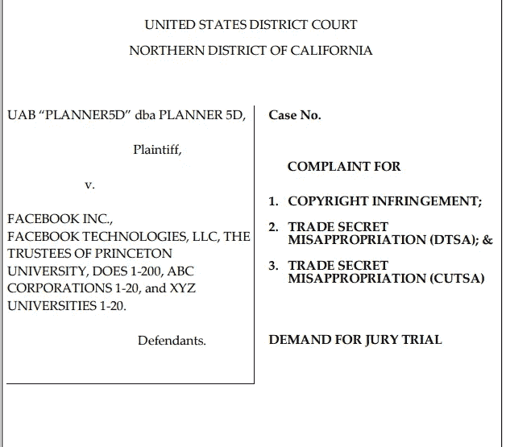

# 脸书因最近的人工智能数据侵权诉讼再次陷入困境

> 原文：<https://medium.com/hackernoon/facebook-in-trouble-again-with-recent-a-i-data-infringement-lawsuit-f89e324f69b8>

**加州三藩市——**上周四，脸书公司和普林斯顿大学[遭遇来自家居设计公司](https://www.law.com/legaltechnews/2019/06/07/home-design-site-claims-facebook-princeton-nabbed-data-for-3-d-objects-397-21165/)[策划人 5D](https://planner5d.com/) 的重大诉讼，称两被告从 2500 多个三维物体和 45000 个场景中抓取了超过 5gb 的数据，这些数据对该公司的计算机视觉技术的发展至关重要。

周四，策划人 5D 网站背后的立陶宛私营公司 UAB“Planner 5d”在美国加州北区地方法院起诉脸书和普林斯顿侵犯版权和窃取商业秘密，违反了《捍卫商业秘密法》(DTSA)和《加州统一商业秘密法》(CUTSA)。

脸书和普林斯顿的代表没有立即回复周四的消息。策划者 5D 的律师、旧金山商业诉讼集团的马克·伯恩斯坦(Marc Bernstein)周四在电话采访中说，随着对这些数据是如何被搜集和分享的了解越来越多，该公司正在考虑增加更多个人、大学和企业被告。

“该公司对此非常重视，因为他们认为这是一个重大威胁，他们认为这些数据是场景识别研究的关键成分，”他说。

Grit Daily 联系了 Planner5D，并与 Planner5D 的首席执行官兼创始人 Alexey Sheremetyev 就正在进行的诉讼进行了简短的交谈。由于案件的活跃性，谈话非常简短。

# 什么是合法的？

在当今的数字时代，我们开始看到更多关于版权问题的法律纠纷。

早在三月份，欧盟通过了其版权指令，旨在为其成员国重建知识产权法。

这场诉讼的核心围绕着“[计算机视觉](https://machinelearningmastery.com/what-is-computer-vision/)”的概念——机器识别三维场景的能力。这是当今领先的研究领域之一，因为谁首先掌握这项技术，谁就将永远改变人类与机器的关系。

据估计，计算机视觉市场到 2023 年将达到[480 亿美元，到 2025 年](https://hackernoon.com/computer-vision-the-future-of-the-future-in-more-ways-than-one-3079e741ae6f)将达到[600 亿美元。](https://www.globenewswire.com/news-release/2019/04/09/1799533/0/en/Computer-Vision-Market-Worth-USD-48-Billion-by-2023-The-Emergence-of-Computers-is-Intensifying-Global-Computer-Vision-Market-to-Prosper-with-Major-Developments-in-Virtual-Reality.html)

## 见见原告，“策划人 5D”

原告，[规划师 5D](https://planner5d.com/e/) ，是一个用户友好的家居设计工具，创建于 2011 年，允许任何人快速轻松地创建自己的家、办公室或景观设计。*投诉，27，10–12*。Planner 5D 在全球拥有超过 4000 万用户，它允许用户从成千上万的可用对象中进行选择，从结构特征如窗户、拱门、门和楼梯，到家具如沙发、床、桌子、椅子和地毯，到厨房和浴室配件如浴缸和水槽，到电器如灯、视频设备和计算机，以及外部特征如路径、草坪、树木、植物、烧烤和游泳池。 *Id* 。27, 12–16.

要创建设计，用户只需将这些对象拖到选定的平面图上或周围。 *Id* 。, 17–18.一旦被添加到设计中，这些对象可以被快速且容易地移动、旋转、倾斜、调整大小或以其他方式操纵以创建期望的设计。 *Id* 。18–19.用户可以轻松地在设计的二维和三维渲染之间切换。 *Id* 。19–20.在 3d 中，设计可以很容易地旋转和倾斜到任何需要的角度。 *Id* 。20–21.

该公司花费数百万美元，在七年多的时间里创建了一个逼真的数字化物体图书馆，并在继续增加这个图书馆。目前，该图书馆包含 4500 多件物品。该公司拥有每个对象下的数据文件的版权，以及各个数据文件的汇编的版权。这些作品是在欧洲或俄罗斯创作的。

## 被告“据称”做了什么？

在[投诉](https://www.pacermonitor.com/public/case/28494447/UAB_Planner5D_v_Facebook,_Inc_et_al)中概述的，从事计算机视觉领域工作的普林斯顿研究人员认为缺乏数据是该领域的一个重大障碍。该文件继续声称，研究人员反过来开发了一个数据集，由普林斯顿的研究人员命名为 SUNCG，是从抓取规划者 5D 的对象和场景文件库构建的，这种做法在该公司的用户协议中是被禁止的。

脸书发起了一项名为相扑挑战赛的世界范围的场景识别比赛。相扑挑战赛鼓励参赛者提交场景识别论文和算法。脸书及其相扑挑战赛附属机构发布了他们自己的 SUNCG 数据集副本，并指导参赛者下载和使用它提交竞赛材料。因此，SUNCG 数据集持有者的当前数量未知。

据称，脸书承诺提供现金奖励和向评审团(由脸书大学、普林斯顿大学和其他机构组成)提交作品的机会，以换取“永久、免版税、无成本的许可和使用及以其他方式利用”提交材料的权利，包括脸书“在任何商品销售、广告、营销、推广或任何其他商业或非商业目的”使用竞赛作品的权利。

# 这次 FACEBOOK 的盘子里有什么？

## #1 —侵犯版权

> ***“国会有权……促进科学和实用艺术的进步，在有限的时间内保护作者和发明家对他们各自的作品和发现的专有权”***
> 
> ***——美国宪法第一条第八款***

在美国，版权法受 1976 年版权法(以下简称“法案”)管辖。该法防止未经授权复制作者作品。为了使作品受到版权保护，作品必须是“原创的”，并且必须“固定”在有形的表达媒介中。

原告声称，它是版权作品，特别是 SUNCG 数据集的所有权利、所有权和利益的唯一所有者。在诉状中，该公司声称，被告，以及他们中的每一个人，直接侵犯了原告的版权，违反了美国版权法，包括 17 U.S.C. $101 等。

## #2 —根据《保护商业秘密法》盗用商业秘密

2016 年[保护商业秘密法案](https://www.ipintelligencereport.com/2016/05/17/comparing-the-defend-trade-secrets-act-and-the-uniform-trade-secrets-act/) (DTSA)，早在 2016 年 4 月奥巴马政府时期就已通过成为法律。DTSA 第一次为盗用商业秘密提供了联邦民事救济。

在 DTSA 案之前，联邦法院只受理盗窃商业秘密的刑事指控。所有其他民事诉讼都是根据《统一商业秘密法》(UTSA)提起的，该法被 47 个州采用，不包括纽约州、北卡罗来纳州和马萨诸塞州。

DTSA 为当事人提供了一个诉因，如果他们“由于错误或过度的扣押而遭受损害”这使受害方有权获得利润损失、材料成本、商誉损失的损害赔偿，以及在恶意扣押的情况下获得惩罚性损害赔偿。法院可以允许收回合理的律师费，除非法院发现情有可原的情况。

在诉状中，原告根据《DTSA》提起商业秘密盗用诉讼，声称定义其创建的对象的数据文件以及定义其大量场景汇编的数据文件(即对象和数据文件)是属于原告的商业秘密。它进一步解释说，它采取了合理的措施来保护它们的秘密，这些秘密一般不为公众所知，也不容易通过适当的手段被公众发现，它们从它们的秘密中获得独立的经济价值。

原告继续声称，被告通过不正当的手段获取了这些对象和场景文件，通过访问数千个原告的网页，并从原告服务器上的数万个其他地址中抓取这些文件，导致了这些商业秘密的获取、披露和使用。

## # 3——根据《加州统一商业秘密法》盗用商业秘密——针对所有被告

与 DTSA 不同,《加州统一商业秘密法》( CUTSA)适用于希望解决知识产权问题的公司的州特定事务。DTSA 明确规定[员工可以使用或披露商业秘密细节来获得工作或与其他雇主合作，并为举报者提供豁免权。](https://www.hg.org/legal-articles/federal-defend-trade-secrets-compared-to-the-california-uniform-trade-secrets-act-48513)

然而，根据 CUTSA，原告不能请求直接的法院命令来执行财产扣押，以阻止任何进一步的和持续的盗用商业秘密。

要根据 CUTSA 采取行动，必须满足四个要素:

*   商业秘密必须以信息的形式存在，无论数据是否有适用于产品或服务的过程、成分或方法；
*   信息必须具有经济价值；
*   必须保密；和
*   已尽了合理的努力来保密

# 下一步是什么？

根据诉状，伯恩斯坦要求陪审团对诉状中提出的所有问题进行审判。这将是一场官司，Grit Daily 将密切关注。

如需了解更多信息，您可以通过 PACER 系统输入以下信息跟踪该案件— **案件编号:3:190-cv-03132**

这篇文章最初发表在[砂砾日报](https://gritdaily.com/facebook-planner5d-copyright-lawsuit/)上。