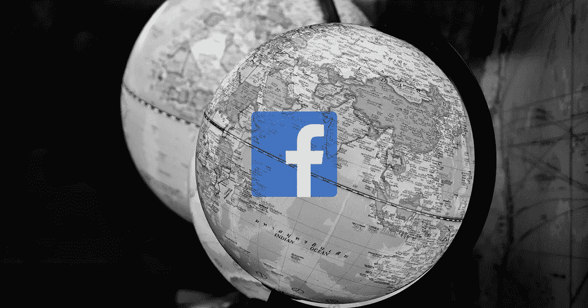

# 脸书的全球币即将面世

> 原文：<https://medium.com/hackernoon/facebooks-globalcoin-is-coming-soon-8b92460788f2>

过去几天我们了解到，脸书准备在 2020 年推出“全球币”。目前，这家媒体巨头正在与美国以及其他 11 个国家的金融监管机构就运营和监管问题进行磋商。该令牌很可能将在 2019 年底前接受测试。

显然，脸书首席执行官马克·扎克伯格也一直在与英国央行行长马克·卡尼就推出该公司的密码货币所涉及的机会和风险进行长时间的讨论。因此，英国似乎有可能成为提供全球币的国家之一。

脸书与一些世界支付巨头，如西联银行和贝宝银行，以及网上商家也在进行会谈，为没有银行账户的人寻找更便宜、更快捷的汇款和收款方式。

**脸书可能主导支付行业**

因为这是脸书的总体目标:进入这个有价值的金融领域。根据《T2 国际商务时报》T3 报道，“脸书希望将全球币发展成为一种数字货币，提供平价且安全的支付方式。脸书还希望让人们能够以最少的麻烦将美元和其他国际货币兑换成其全球货币。”

它将如何实现这一目标？似乎脸书将发行全球币，作为与美元挂钩的“稳定货币”。这消除了对密码市场而言具有挑战性的易变性，至少对商家和支付服务提供商而言是如此。

**消费者信任的缺失会损害 Globalcoin 吗？**

然而，对脸书来说，事情可能并不一帆风顺。首先是消费者信任的问题。在过去的两年里，脸书因与其他各方分享用户数据的丑闻而被点名；剑桥分析是最著名的一个。扎克伯格被迫在美国和英国政府面前就此作证，扎克伯格在这两起案件中的行为让人们感到，该公司的行为有些傲慢，并认为自己是不可触及的。因此，脸书用户可能不会急于使用新的令牌:相反，他们很可能会放弃它，以示抗议。另一方面，如果令牌被视为提供了有用的服务，它可能会做得很好。它有数十亿用户，所以一些抗议者可能不会对它的成功有多大影响。

分析师表示，脸书希望通过打破金融壁垒和降低消费者成本来扰乱现有的银行网络。然而，脸书将不得不与银行和经纪商合作，以实现这一目标。此外，在推出之前，GlobalCoin 还需要克服许多技术和监管障碍。

有些国家可能会受到热烈欢迎，而有些国家，如印度，则根本不受欢迎。值得注意的是，有传言称脸书对在印度推出特别感兴趣，当你想到人口的规模以及有很多很多没有银行账户的印度公民拥有智能手机的事实时，这是有道理的。脸书还希望 GlobalCoin 能让海外的印度工人使用 WhatsApp 给家里汇钱，这是另一个大市场。然而，由于印度迄今对加密货币相当敌视，这可能会被证明是一个重大挑战。

我们很快就会对脸书的精确战略有更好的了解，但鉴于它是社交媒体领域最大的参与者之一，它似乎不太可能满足于成为加密领域的一条小鱼。