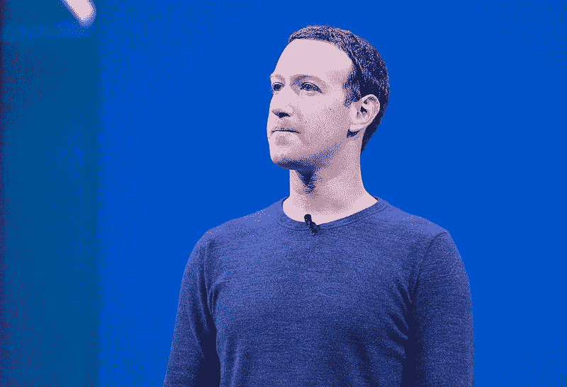

# 脸书可悲的认错

> 原文：<https://medium.com/hackernoon/facebooks-pathetic-mea-culpa-b6256e16b302>

## 马克·扎克伯格关于“注重隐私的未来”的信不会纠正脸书给社会带来的问题

三年前，剑桥分析公司(Cambridge Analytica)和唐纳德·特朗普竞选团队(Donald Trump campaign)从数百万脸书用户的数据中挖掘选举洞察，这些数据加剧了美国的政治分歧，加剧了言辞和尖刻，三年后，脸书首席执行官马克·扎克伯格(Mark Zuckerberg)终于发布了该公司的官方战略，以解决用户的各种担忧。

尽管这封信的语气充满悔意和前瞻性，但扎克伯格没有认真对待脸书众多知情批评者中的任何一位。这封信没有诚实地解决脸书社交媒体产品套件引发的问题。相反，扎克伯格试图通过提出公司已经解决的问题的技术解决方案，转移公众对隐私和数据安全等听起来有点类似的问题的注意力，如端到端加密、数据持久性和产品集成。即使粗略地看一下脸书的新策略，也主要是试图转移人们对他们给社会带来的问题的注意力。

到目前为止，脸书的问题已经很清楚了。近十年来，脸书从人们的行为中获取了宝贵的见解，然后将其打包成产品，提供给广告商、品牌经理、政治活动和外国特工。Instagram 通过商品化注意力、随机奖励和说服我们所有人应该努力追求有计划的完美，煽动了心理社交焦虑和成瘾行为。算法新闻反馈创造了回音室和反馈循环，将愤怒置于思想之上，并将假新闻和引人注目的标题推至用户新闻反馈的顶部。脸书和 WhatsApp 在缅甸、菲律宾和印度等国家煽动宗派谋杀和种族灭绝。在美国，它创造了一个分裂的政治气候，这使得煽动和威权主义威胁到西方民主的核心。

但是扎克伯格没有直接解决这些问题，而是含糊地说脸书将关注“用户隐私”。经过多年的思考，他的解决方案是优先考虑私人互动，解决加密和安全问题，重新考虑数据渗透，促进互操作性，并确保安全存储。扎克伯格表示，脸书将利用这些租户来推动 its 平台和相关生态系统(包括 Messenger、WhatsApp 和 Instagram)的改进，以允许用户保护自己和他们的数据。他在文章的开头写道:

> 在过去的 15 年里，脸书和 Instagram 帮助人们在数字城市广场中与朋友、社区和兴趣联系。但人们也越来越希望在相当于客厅的数字空间中进行私密连接……我相信，未来的通信将越来越多地转向私密的加密服务，在这种服务中，人们可以确信他们相互之间说的话是安全的，他们的消息和内容不会永远存在。

用户隐私是脸书应该追求的崇高目标，以保持用户的信任。用户应该控制他们的数据；当它被共享或存储时，它应该被加密，用户应该能够识别他们想要在哪个社交圈子中共享数据。但这些原则都不能解决这家社交网络公司目前面临的问题。

脸书已经解决了加密问题。WhatsApp 上的所有通信都已经进行了端到端加密 Messenger 允许用户打开它。所有数据都已经安全地存储在政治稳定的国家，这些国家重视法治，不会强迫脸书交出用户的敏感信息。此外，允许用户将他们的通信配置为自动过期对解决假新闻回音室、注意力商品化或针对少数民族的暴力毫无帮助。

脸书战略的巨大转变将来自优先考虑私人交往。过去，脸书和 Instagram 擅长让用户向成千上万粉丝的数百位朋友发送信息。在他的信中，扎克伯格声称，通过允许用户在更小、更有管理的朋友群中分发不同的内容，脸书可以创造更安全的空间，让用户在更小、更亲密的环境中更舒适地分享。

但是我们已经看到紧密结合的数字信息如何对宗教宽容和多元文化伦理产生破坏性的后果。在美国，私人脸书团体宣扬仇外和民族主义言论，煽动反移民、反黑人和反同性恋议程。类似地，在印度，WhatsApp 是民族主义和宗教狂热的滋生地，主张对印度的穆斯林、锡克教徒、基督徒和印度教徒实施暴力。

马克·扎克伯格没有妥善处理脸书的余波，而是选择忽视脸书生态系统给世界带来的问题，引诱美国和国际社会上钩。事实上，如果脸书想要认真解决核心问题，它需要从根本上重写其商业模式——一个与隐私、个人健康和社会自由相对立的商业模式。向广告商出售用户的注意力和行为洞察将始终优先考虑监控和数据收集。此外，在 WhatsApp、Instagram 上的 Direct Message 或 SMS 中无缝集成私人消息(扎克伯格称之为互操作性)只会通过改善网络效应来增加脸书对数字通信的垄断。最终，脸书仍在出售一样东西:我们。在扎克伯格准备好改变他的核心商业模式之前，其他一切都只是假象。