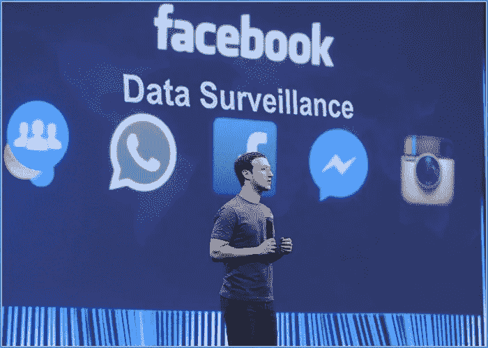
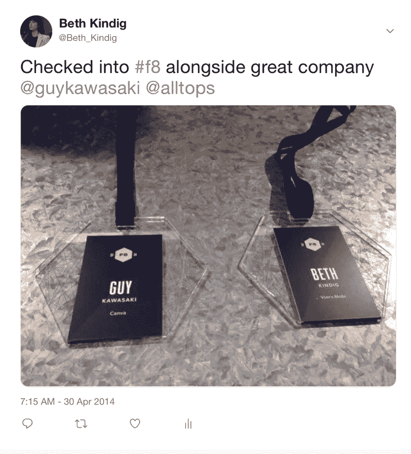
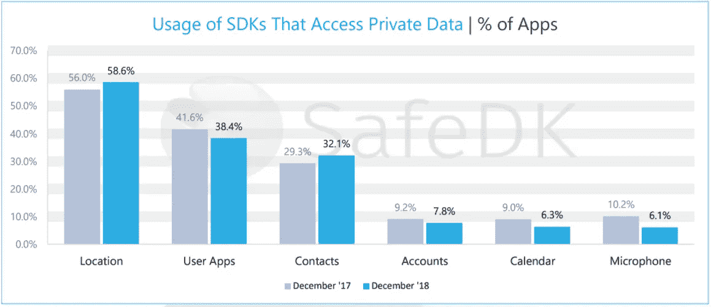
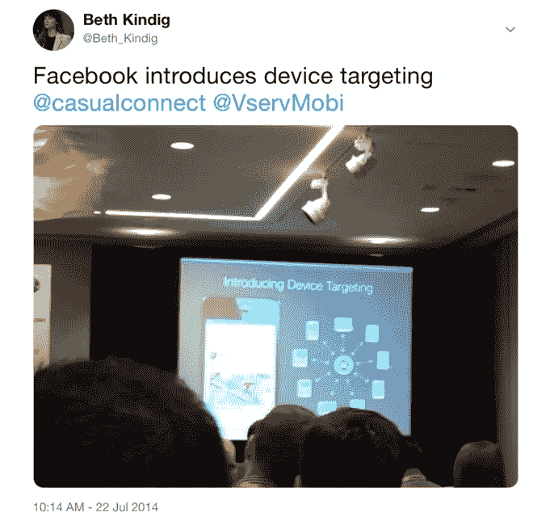
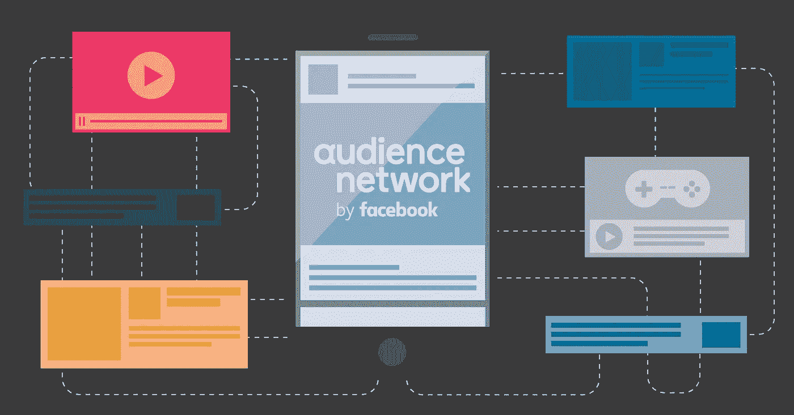
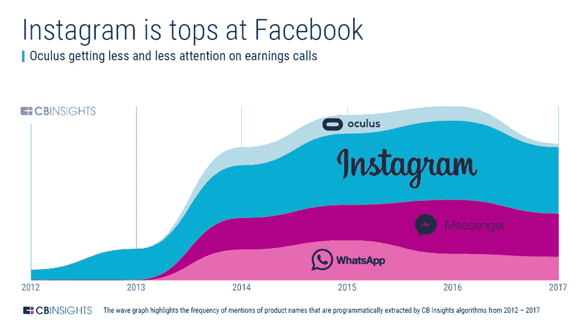
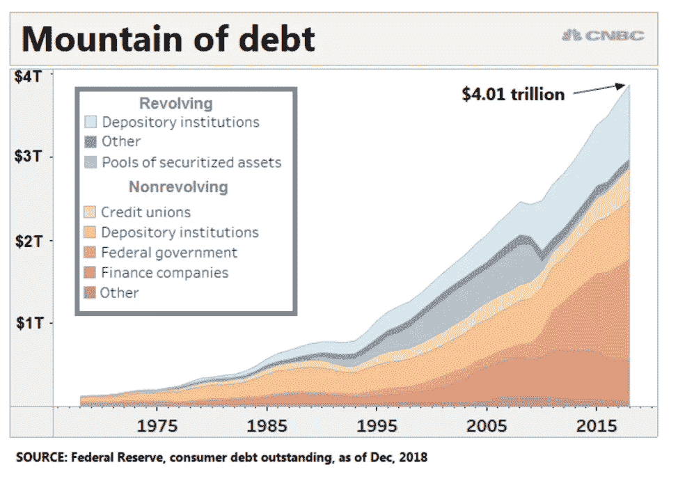

# 脸书的类似监视的软件叫做观众网络

> 原文：<https://medium.com/hackernoon/facebooks-surveillance-like-software-is-called-audience-network-56c3e76cdb89>

这在现在可能很难想象，但在 2012 年，脸书正在苦苦挣扎。这家新上市的公司没有达到华尔街对销售和利润的要求，股价从 IPO 时的每股 38 美元跌至每股 19 美元。马克·扎克伯格(Mark Zuckerberg)成为纳斯达克(NASDAQ)主要科技公司的雄心正在失败。与此同时，宏观经济状况是乐观的，因此这种低迷尤其令脸书投资者失望，这反过来给社交网络造成了越来越大的压力。

*需要注意的是,“出售数据”是正确的术语，因为广告商在脸书上购买的是数据广告，而不是基于内容购买的印刷、电视或广播广告。当你购买脸书的广告时，你也在购买数据，尽管马克·扎克伯格让国会相信并非如此。*

这种背叛是双重的。一方面，一家第一方数据公司大胆进入第三方数据市场进行数据中介，冒着失去其社交媒体用户信任的风险。其次，脸书竭尽全力确保社交媒体用户不会发现。观众网络为脸书的收入提供了相当大的一部分，但至今仍未向公众披露。在公关发布和围绕隐私的讨论中，这一点很少出现。除非脸书用户是侦探，否则他们没有合理的方法知道脸书运营 Audience Network，并在数十万个应用程序中出售私人数据，估计占应用程序市场的 40%。

观众网络建于 2012 年，于 2014 年上线，并使脸书在股票市场上演了一场引人注目的转变。自那以后，脸书一直保持着稳定的回报。这与 2012 年至 2014 年 Audience Network 之前的几年形成鲜明对比，当时脸书每个季度都步履蹒跚，经常因频繁令人失望的收益而损失 50%的股票价值。

脸书拥有的用户数据比之前估计的更有价值，让脸书幸运的是，他们发现其他公司愿意做任何事情来利用这些数据。现在，我们让移动应用程序开发者放弃他们的第一方数据来换取脸书的第一方数据，这些移动应用程序开发者效仿脸书背叛他们用户的隐私(如果你给我看你的，我就给你看我的)。

# 监管概述

请注意，有很多法律是反对第一方数据公司进入第三方广告市场的。例如，HIPAA 阻止您的医疗保健公司代理您的数据，即使这些数据非常有价值，可以在第三方市场上为医疗保健公司赚取数十亿美元(想想所有针对制药公司的受众都可以做到)。如果你的银行和信用卡公司，如大通、富国银行、维萨和万事达卡，在第三方市场上代理你的购买数据，它们的年收入很可能会超过脸书。广告客户会喜欢基于你已经用信用卡购买的东西的受众定位功能。这些广告的投资回报率对广告商来说非常有吸引力，因为你的购买行为会告诉你未来会买什么。然而，格雷厄姆-比奇-利雷法案阻止了金融行业成为第三方数据经纪人。

立法者没有赶上移动时代，也不了解移动设备信号和传感器的工作原理，这让消费者付出了沉重的代价(见下文)。

为什么广告商为脸书的数据支付如此高的价格？为什么移动应用开发者愿意出卖自己的 app 用户？因为没有其他第一方数据公司愿意承担脸书承担的道德风险，因此，脸书作为唯一一家在移动应用程序中代理第一方数据的公司，拥有最终的供需比。

请记住，除了出售数据，脸书*还在成千上万的应用程序中跟踪人*。作为第一方数据公司承担这些风险，并在成千上万的应用程序中跟踪移动用户，这是前所未有的。“我们不应该粉饰后果，”蒂姆·库克[在十月份提到脸书时说。“这是监视，这些数据储存只会让收集这些数据的公司变得富有。这应该会让我们不舒服。”](http://time.com/5433499/tim-cook-apple-data-privacy/)

到 2016 年，脸书出售第一方数据的公司(反之亦然)总数达到了数千家应用程序和公司。正如我们以前所知，隐私被彻底根除了。

与此同时，脸书用户在这件事上别无选择。这是在没有任何披露的情况下完成的，没有办法选择退出。从 2016 年开始，**不是脸书用户** 的人也被经纪和追踪。但脸书确保公众(包括投资者)不知道观众网络。观众网络不仅诡异地从公开披露中消失，而且也从重要的 SEC 收益电话会议和文件中消失。今天，即使经过了大量的隐私审查，受众网络是什么，它是如何运作的，仍然相对不为人知。

# 观众网络启动时我在哪里

我非常清楚地记得五年前观众网络启动的时候。我在三藩市第八街和汤森街的会议中心参加了 F8 开发者大会。当我拿起我的塑料聚合物徽章时，我很兴奋，在 K 商店里，我发现我的徽章就在苹果公司前名人技术布道者盖伊·川崎旁边。我也对会议分发的赠品感到非常兴奋，比如树莓派。

当脸书的观众网络公布时，第三方广告公司感到了一丝震动。第三方广告公司如何与脸书竞争，后者会利用其专有的第一方数据来代理广告？

需要明确的是，第三方数据公司为广告创造了一个至关重要的中间人，因为与直接收集数据并出售数据的第一方数据公司不存在相同的利益冲突。尽管直接向广告商和出版商交易和出售你的客户数据存在明显的利益冲突，脸书的观众网络还是摆脱了中间人。

任何与会者如果没有预测到脸书的巨大成功，那都是失职。我们是被邀请的观众，因为我们在移动开发方面的关系和影响力而被选中。那天在场的观众知道，也许比地球上任何其他人群都知道，移动设备开创了一个数据收集的新时代。

受众网络取决于移动设备的监控能力。理解这一点至关重要。当讨论在移动设备上收集数据时，网站 cookies 根本无法进行比较，也不应用作参考。

由于人们在移动设备上花费的大量时间、人们输入的信息、设备上使用的应用程序数量，以及最重要的是，移动设备收集的传感器和信号可以从安装在设备上的软件开发工具包(SDK)中提取，技术专家从未见过像移动设备这样的数据收集能力。

从数据收集的角度来看，本地移动应用与移动网络或桌面几乎没有相似之处。换句话说，你从 app store 下载的独立应用程序带有可以在后台跟踪你的软件，这在你从浏览器访问网站时是不可能的。Cookies 无法跟踪一个人。

市场上收入最高的 40%的应用程序的开发人员已经在他们的应用程序中安装了 Audience Network，并允许脸书跟踪他们的用户，以换取脸书的第一方数据，这些数据用于经纪广告以获得更高的支付(CPMs)。

以下是你可以使用 Audience Network 等软件从原生移动应用程序中提取的数据。

*   麦克风:用于拨打和接听电话，以及语音命令
*   短信对话:Facebook Messenger 访问文本时，通话记录和短信权限是宽松的。
*   加速度计:帮助跟踪你的脚步，告诉手机软件你的设备指向哪个方向，以及如果你在车里，你的加速度有多快。
*   计步器:计算步数，并访问加速度计进行跑步或慢跑等运动。
*   陀螺仪:通过 MEMS(微机电系统)检测方向
*   磁力计:测量磁场。与 GPS 协同工作，计算出你的位置和方向。
*   全球定位系统:与卫星通信，找到准确位置的交叉角度
*   气压计:测量气压，可以检测天气变化
*   接近传感器:可以告诉你什么时候你的手机靠近你的耳朵
*   环境光线传感器:根据室内光线调节屏幕亮度
*   心率传感器:通过 LED 和光学传感器测量心跳
*   温度计:测量设备和电池内部的温度
*   空气湿度传感器:测量空气中的湿度

Source: [SafeDK](https://samsungnext.com/whats-next/safedk-annual-trends-privacy-gdpr/)

脸书在追踪所有这些设备信号和传感器吗？你可以相信，这种情况正在发生，因为资金非常少的小型竞争初创公司已经能够做到这一点。一个例子是 Quettra，这是一个软件开发工具包，“当一个人打开一个应用程序[并实现](https://techcrunch.com/2015/05/15/quettra-portrait-taps-your-app-graph-to-power-personalization/)时，该应用程序可以对设备进行即时扫描，然后反馈给开发者。”当这家小公司以大约 100 万美元被收购时，它是 Audience Network 的竞争对手。2015 年价值 1000 万美元，并有能力“绘制你(和数百万其他用户)的应用图表”，并“能够基于 Quettra 在其平台上查看的[数百万数据点](https://techcrunch.com/2015/12/10/similarweb-buys-quettra-to-move-deeper-into-mobile-analytics-and-big-data/)建立全新的分析类型。"

如果一家价值 1000 万美元的初创公司可以通过安装在相对较少的应用程序中的软件开发工具包做到这一点，你认为一家市值 500 亿美元的公司可以在数十万个应用程序中做什么？

A picture I took when [Deb Liu presented in 2014](https://twitter.com/Beth_Kindig/status/491677780107476992) how Audience Network was targeting at the mobile device level to a room full of mobile app developers and advertisers.

# 移动设备上的监控

根据[韦氏词典](https://www.merriam-webster.com/dictionary/surveillance)的说法，监视是“对某人或某事的严密监视(如侦探)。”维基百科称，“在间谍和反间谍活动中，监视是对行为、活动或其他变化信息的监控，目的是影响、管理、指导或保护人们。”

脸书受众网络的问题在于，它存在于如此多的原生移动应用中，以至于构成了监控。事实上，你在智能手机上做的任何事情都会通过软件开发工具包(SDK)的黑暗网络追溯到脸书。脸书在《纽约时报》的应用程序中追踪你的一举一动。他们在收集你看 Hulu 的时候做了什么。他们从金融应用、游戏应用、健康应用和公用事业应用中收集数据。现在看看你的智能手机，想想脸书在 40%的移动应用程序中跟踪你，这些应用程序可以访问强大的设备信号和传感器。同样，你不必是脸书用户，因为这是在数百万个应用程序中未经同意而发生的。

当今市场上 40%最流行的移动应用程序中都运行着受众网络软件。您只需要在您的设备上安装其中一个应用程序，脸书就可以访问设备的信号和传感器。人们花在手机上的时间超过 4 到 5 个小时。现在，增加 10，000 名数据科学家来挖掘这些数据，你很容易明白为什么隐私是不存在的。

马克·扎克伯格一直声称脸书收集数据是一项免费服务。这不是真的。在观众网络推出之前，脸书免费服务了 7 年。从一开始，数以百万计的公司就靠广告养活自己，而不出售第一方数据，也不用监控级别的软件跟踪人。马克·扎克伯格想说的是，如果不跟踪你并出售你的数据，脸书不可能成为一家市值 5000 亿美元的公司。Audience Network 是对股市好转的孤注一掷的尝试(非常成功)——但是美国公民应该被监视软件跟踪股市收益吗？这才是需要回答的。

# 脸书告诉我们的

当脸书向投资者和媒体报告用户数量时，该公司没有报告他们正在赚钱的非脸书用户，如果包括拥有智能手机的非脸书用户，这一数字为 30-40 亿，而他们报告的数字为 20 亿。这也意味着 20 亿用户的平均收入看起来比实际高，因为这是从 30-40 亿包括非脸书用户的用户身上洗出来的，他们实际上是在赚钱，所以他们的做法看起来更容易接受。

2016 年发布的一个公告描述了脸书如何跟踪人们:“*在未来几个月里，我们将扩大脸书在观众网络上的广告覆盖范围，以包括没有账户的人。”*再次重申了这一点:“*这一更新也为脸书的广告客户提供了更准确、更完整的广告活动衡量标准，* ***因为我们现在能够统计与脸书*** *无关的人的转化率。”来源:* [*脸书*](https://www.facebook.com/business/news/facebook-powered-ads-for-more-people)

脸书上一次报告受众网络数量时，是在 2016 年底，每月向超过 10 亿人提供广告服务。这比今天的 Instagram 多，假设它遵循每 2 年增加 10 亿用户的相同轨迹(观众网络于 2014 年推出)，这个令人难以置信的基数在 2018 年应该更像 20 亿。

Facebook is much more than a “family of apps” — the SDK is inside an estimated 1 million applications with over [49% of all apps](https://samsungnext.com/whats-next/safedk-annual-trends-privacy-gdpr/) on the market having Facebook software installed.

“我们谈论每个月接触 10 亿人，这些是真实的人，”脸书出版解决方案副总裁 Brian Boland 说。“我们不是在谈论 cookies 或浏览器或设备或 ID，一个人可以看起来像六种东西。我们谈论的是可以通过观众网络接触到的 10 亿人。”-[2016 年第四季度](http://www.adweek.com/digital/facebook-audience-network-now-serves-ads-1-billion-people-each-month-175516/)

下图来自 CB Insights，显示了脸书在财报电话会议上提及每个应用的频率。到 2016 年，Audience Network 的独立用户数达到了 10 亿，超过了今天的 Instagram，是收购 Whatsapp 时的 3 倍，但却没有合理的提及。

Reference: [CB Insights](https://www.cbinsights.com/research/facebook-instagram-mentions-earnings-transcripts/)

事实上，脸书如何获得这些收入的故事一直被脸书的应用程序家族所掩盖(脸书将 Instagram、Whatsapp 和 Oculus Rift 称为应用家族)。脸书的公关术语“*家庭应用”*是一场闹剧。脸书通过代理数据和跟踪数百万应用程序中的人来赚钱，他们小心翼翼地不向消费者、投资者，更重要的是向国会披露这些信息。

# 你应该关心的更多理由

我承认，我是一个隐私倡导者，这种事情可能比一般人更让我烦恼。也许你不关心脸书正在监控你在手机上做的几乎所有事情，当你晚上看 OTT 电视时，然后以其他行业不合法的方式出售你的信息。

好吧，没关系。那就考虑这个。

消费者债务处于历史最高水平，而精准广告定位无疑促进了消费者支出。有史以来第一次，广告商能够根据你是谁，通过从本质上读懂你的思想，来促使你购买产品。他们可以通过人工智能让你买你不想要或者不需要的东西。请记住，脸书正在收集数百万应用程序的数据，并为你提供广告服务*,因为这种定位水平会影响你的行为。*

不管你在政治上站在哪一边，我们都同意脸书被用来瞄准和影响选民。共和党和民主党都同意这一点。想象一下你的购买是如何受到影响的，这种情况每天都在发生，而不仅仅是在选举年。

他们这样做是因为广告商的投资回报率更高，因此，有实际证据表明，由于精准广告定位，你会购买更多的东西。你不需要在脸书的“应用程序家族”中购买了什么东西才能被锁定或转化为销售，因为**脸书有数百万个应用程序**。

广告是生活中必不可少的一部分。也就是说，广告应该基于你消费的内容。**这创造了一个公平的竞争环境。**从第一方关系中了解我是谁，我在想什么，然后在第三方市场上将我作为观众卖给广告商，让我在脸书和 Instagram 上看到广告，这不是一个公平的竞争环境。

Precision targeting based on behavioral analytics took off in 2014\. If Facebook influenced the election, how much has Facebook’s targeted ads influenced consumer debt?

举例来说，百威啤酒和必胜客可以购买基于超级碗等内容的广告。这就是“卖广告”的含义。但这些公司不应该根据我在智能手机上的私人活动为我提供广告。这是“出售数据”，在脸书在移动软件市场无处不在的水平上，这也构成了监控。

不幸的是，一家运行精确定位软件监控的公司，已经证明了负面行为影响，现在正试图向公众推出加密支付。脸书不计后果，为了股市收益会不择手段。这并不适合将密码带给大众。事实上，如果脸书从事加密业务，该公司将违反 1999 年 11 月颁布的要求保护消费者财务隐私的《格拉姆-里奇-比利雷法案》。由于脸书坐拥大量未经同意收集的数据，该公司成为金融支付交易商将违反消费者金融隐私规则。

另一个值得关注的原因是，如果我们不小心，人工智能将会制造一场隐私灾难。到 2030 年，人工智能将推动 15.7 万亿美元的经济。从这个角度来看，今天科技行业排名前五的公司价值 4 万亿美元(苹果、亚马逊、谷歌、脸书和网飞)。这意味着，在未来十年，数据带来的利润将比大型科技公司的利润总和多 400%。我们需要确保人工智能不会在未经我们同意的情况下，成为像监视软件一样跟踪我们的蛮荒西部。

# 接下来是什么:

当前隐私问题的解决方案是显而易见的。第一方数据公司应该不能在第三方广告市场交易。随着移动设备和近期人工智能经济的到来，这一点尤为重要。

为社交媒体用户创造退出追踪的途径是不够的。我们不能把责任推给那些不知道软件开发工具包(SDK)是做什么的，也不知道精确定位是如何有害的公民。

脸书树立了一个危险的先例，我们在医疗保健(HIPAA)和金融方面的法律应该被效仿。脸书有机会披露观众网络，但这并没有发生在马克·扎克伯格去年在国会听证会上的证词。可以肯定地说，保护隐私的自我监管是理想化的，与企业的雄心壮志背道而驰。

在我看来，这是应该发生的:

1.脸书要么是第一方数据公司，要么是第三方市场。不可能两者兼得。这种利益冲突已经在其他行业中得到规范，也应该在移动设备中得到规范。

2.应用程序商店应该测试软件开发工具包，并要求软件通过隐私测试，并获得防止跟踪用户的认证，除非他们 ***选择加入*** 。应用商店也应该对像 Audience Network 这样未经同意就提供跟踪用户的应用负责。

3.选择退出不应该是社交媒体用户或应用程序用户的责任。对于选择加入功能，情况应该正好相反。

4.移动行业应该像医疗保健行业和金融行业一样受到管理，因为企业的野心与你的私人想法和私人 GPS 定位的权利相冲突。

5.谷歌和 Twitter 还在他们拥有的应用程序之外跟踪用户，并作为第一方公司在第三方市场上出售数据。脸书的私人数据更强大，因为它是一个人们分享个人生活的社交网络。

6.根据 1999 年颁布的 Gramm-Leach-Bliley 法案，任何出于广告目的获取数据的公司都应被禁止从事包括加密在内的金融服务。该法案是一项美国联邦法律，要求金融机构解释他们如何共享和保护客户的私人信息。

数据收集变得复杂，但隐私却很简单。消除存在的利益冲突，并监管可以访问私人数据的行业。