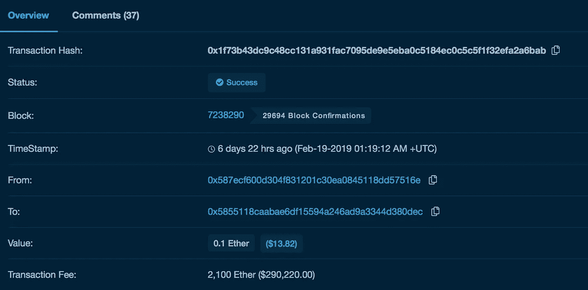
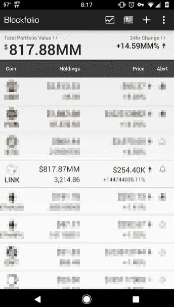

# 胖手指还是代币洗钱？解释那笔 30 万美元的以太坊交易费用

> 原文：<https://medium.com/hackernoon/fat-finger-or-token-laundering-explaining-that-300-000-fee-ethereum-transaction-bb20ba76ce40>

上周，以密码为中心的论坛因发现了一个奇怪的以太坊交易而变得沸沸扬扬。发送的数量足够正常:0.1 ETH，当时大约 14 美元。没什么奇怪的。引人注目的是费用:2100 瑞士法郎，相当于 30 万美元。当时网络运行正常，所以通常的天然气价格(约 2 美分)可能会使相同的交易通过。这在当时是一个谜——有两个可能的原因。

最简单的答案，尽管想象起来很痛苦，是发送者的一个错误。这种情况经常发生，任何拥有投资组合跟踪应用的人都可能知道。如果你使用过 Blockfolio、Delta 或类似的价格跟踪应用程序，你可能会看到小盘股货币偶尔会出现数百万%的涨幅。如果你碰巧拥有这种货币，你可能会瞬间认为自己在一个小时内成为了亿万富翁，但事实并非如此。当有人在分散交易中支付远远高于市场价格的价格时，就会发生这种情况——要么是将小数点放错了位置，要么是错误地购买了汇率不同的错误货币。这通常被密码爱好者称为胖手指。

Example of a fat-finger purchase appearing on a portfolio tracker

理论上讲，以太坊转账的荒唐费用可能是用户失误的结果，但这种可能性不大。大多数以太坊钱包都非常直观，你需要特意直接输入费用。在这种情况下，发件人也不可能将交易与费用混淆，因为 0.1 ETH 仍然会高很多。

这就剩下了另一个可能的解释:洗钱。或者更准确地说，代币洗钱。汇款人希望通过将转账指定为费用并确保他或她可以收取，来掩盖可能是他或她自己的大额转账。如果它不是如此引人注目的数量，这将是相当巧妙的。任何通过区块链跟踪用户踪迹的人都会看到价值 14 美元左右的相对微不足道的 ETH 被转到一个随机地址，而在后端，大量的 ETH 从原来的钱包中消失了。

事情就是这样。事实上，这已经不是第一次了——同样的钱包在过去也这样做过，收费分别为 [840 ETH](https://etherscan.io/tx/0xc3e6f47ffa1b1e0bf926d5727e1adedac595d24cc4fa9b2f271d35566fdaf8d6) 和 [420 ETH](https://etherscan.io/tx/0xcb59748b9b7b9732f04b66dde0009a1e4856a50ed8ff68a0dedbaa5e57807d31) ，以及一些更小的金额。这应该立即排除了错误的原因。没有一个有能力赚到 30 万美元的人会犯两次这样的错误——这对 99.9%的人来说是一个改变人生的事件。不是一个积极的改变生活的事件，但肯定是一个学习的经历。

如何安全地实现这一点？任何一家矿商都会立即抢购这笔交易，很可能一举为自己的企业提供数年的资金。没有人会冒这个险。因此，该人没有向网络广播交易，这表明他们要么是矿工，要么与矿工合作。这将是必要的，因为挖掘器将需要为下一个块获得一个随机数，然后包括所讨论的 Tx。但是，如果所有这些都可以被考虑在内，交易将是完全安全的。当我们注意到之前的可疑交易都是由同一个节点挖掘出来的，这个解释就基本得到了证实。

执行一个模糊的事务仍然需要很大的努力，因此它向我们提供了一个指示，说明了罪魁祸首正在运行哪种操作，以及为什么它可能是必要的。最有可能需要这种独创性的场景是需要打破一条被盗、被黑或以其他方式非法获得的以太坊的踪迹。黑客攻击的受害者通常会在事后观察到资金的流动，如果奖金转移到他们的某个地址，他们就会提醒交易所。在这种情况下，他们可能不会看到巨额费用，只要钱包进行了许多类似的小额交易(这一次也是如此)。在这种情况下，确实有人注意到了这种不规则性，而且考虑到这种荒谬的金额，这显然是其他人感兴趣的。不过，很明显，我们观察到了一种可以“清洗”区块链令牌的新方法，黑客在转移被盗加密资产时很可能会继续采用这种方法。

Viewnodes 编辑拜伦·墨菲的文章。所有观点均为作者个人观点。有关 Viewnodes 提供的一些服务的信息，包括我们的 Tezos 代表，请点击[此处](https://www.viewfin.com/viewnode/tezos/#aboutus)。