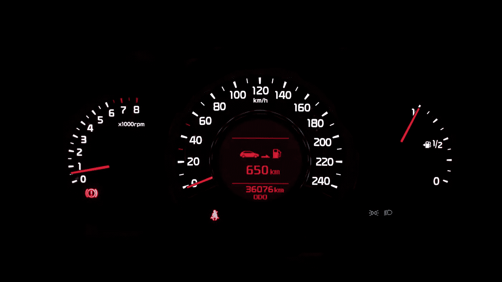

# 更少的仪表板，更多的分析

> 原文：<https://medium.com/hackernoon/fewer-dashboards-more-analysis-63581970672c>

*(Photo by* [*Marek Szturc*](https://unsplash.com/photos/ttqUsX1G3aE?utm_source=unsplash&utm_medium=referral&utm_content=creditCopyText) *on* [*Unsplash*](https://unsplash.com/search/photos/dashboard?utm_source=unsplash&utm_medium=referral&utm_content=creditCopyText)*)*

# 这么说让我很痛苦，但是商业智能已经给自己带来了坏名声。

**我们都有部分责任。**

很明显，对于数据科学领域的大多数人来说，BI 意味着构建无尽的报告和仪表板，这就是它的全部好处。

看看你自己的工作场所。我不在乎它是一家白手起家的初创企业还是一家全球企业巨头。BI 仪表板的病毒式传播很可能已经达到了流行病的程度。BI 团队正在努力构建比特斯拉工厂更多的仪表盘。而且请求还在不断增加。

业务团队的要求越来越高。“我需要一份新的销售报告”，“我需要另一份交通报告”，“我需要这个仪表板上的另外一百个指标，否则它就没用了，我无法经营我的生意，这都是你的错，还有…而且……”

**有人请在噩梦结束时叫醒我。**

# 我们。需要。停下来。喂养。的。仪表板。上瘾。

我并不是反对根据我们掌握的数据向管理层提供有价值的见解。恰恰相反。

我的大部分工作时间都在试图通过数据驱动的项目提供更好的见解。当我感觉自己在用头撞隐喻的(有时是物理的)砖墙时，我可能会感到厌倦。但我不是建议我们把孩子和洗澡水一起倒掉。

光凭直觉(或者更准确地说是专业知识和经验 )也不行。我们需要一个联合的方法将两个世界结合在一起。

我希望每个人都放慢“开车去仪表板”的速度。充满无数指标的无休止的报告不是从您的数据或数据团队获得全部价值的最佳方式。

《风尚》的首席分析师 Benn Stancil 写了一篇名为[不要选择仪表盘而不是分析](https://blog.modeanalytics.com/dont-choose-dashboards/)的优秀文章。本说:

> *“虽然这听起来不太直观，但更多的仪表板通常会让人们不那么了解情况，也不那么一致……一个拥有数百个仪表板的公司无法专注于任何事情。”*

# 他完全正确。

我看到一些仪表板塞满了指标，甚至很难弄清楚它们包含什么，更不用说它们告诉我们什么了。“更多数据/更多仪表板”的游戏计划实际上只是为优柔寡断的经理们提供了一张舒适的毯子。如果他们做了一个不太成功的决定，他们真的想让一个没有生命的物体来承担责任。

这是糟糕的公司文化的一个症状，替罪羊和牺牲羔羊必须在任何商业选择发生之前做好准备。但这通常是摆在初级和中级管理层面前的选择。他们承担了所有的风险，但几乎没有真正推动局面的责任。因此，坐着玩电子表格游戏，用 BI 仪表盘上移动的数字来代替更容易。

# 持续的仪表板构建如何影响数据团队？

我的理念是数据分析师应该分析数据。而不是盲目的建立越来越多的报表。我们的工作是分析，最重要的是解释业务中正在发生的事情。发现趋势并调查原因和可能的驱动因素是拥有强大的数据分析团队的真正价值所在。

如果你让他们做的只是构建巨型仪表盘，把数百个不同的数字混在一起，那你就是在浪费他们的时间。每一秒都至关重要，时间浪费的机会成本是无法集中思考时间来正确分析他们所掌握的真实数据。

# 什么被测量，什么被管理。

但是真的吗？Basecamp 首席执行官杰森·弗里德在蒂姆·费里斯的播客中谈到了他对这句经常被引用的商业箴言的看法。杰森建议少测量。他通过移除他所测量的元素来进行测试，然后看看这对他们的业务表现是否有任何影响。

这显然没有对[基地营](https://basecamp.com/)多年来的成功产生负面影响，所以也许杰森真的有所发现。

我建议业务人员，如果他们真的必须衡量他们的 KPI，那么他们真正关注的关键指标不要超过五个。我在[的另一篇文章](https://simpleanalytical.com/picking-your-big-5-kpis-for-corporate-business-success/)中提到了一位高管，他只对一个关键指标感兴趣。在她的级别上，这是她了解部门工作情况所需的所有管理信息。当我听到这个故事的时候，我犹豫了一下，但现在更好地理解了。

**少即是多。正如 Benn Stancil 在上面的引用中所建议的那样，不要总是盯着所有的东西，以免我们变得盲目。**

# 我从两方面都看到了这一点。

我做数据分析师很多年了。我与业务利益相关者密切合作，试图确切了解他们认为他们将从最新一轮 MI 报告请求中获得什么。

相反，我经营的企业很容易被小细节困扰。如果你不积极主动地衡量每件事，一天中的每一秒，你总会担心自己会错过一些重要的东西。

实时报告感觉像是完全控制，但这是有代价的。你获得了一个特写镜头，却失去了全局。

# 必须有所取舍。

作为一名分析经理，你的工作是说服业务部门不要认为他们**需要**在一个页面上一次看到所有内容。**他们不**。他们需要专注于真正推动他们业务领域发展的因素。

作为一名分析师，你需要空间和时间来挖掘数据，并向它提出更好的问题。如果你不停地发布更多很少被人看到的报告，那你就是在浪费每个人的时间。没有人需要这种认识。

如果你是企业主，你需要深呼吸，接受我作为你的数据顾问给你的建议。**聚焦**。不要把注意力分散得太分散。用这些数据把你带到一个地方，它会告诉你一个故事，而不仅仅是在屏幕上显示越来越多的数字。

要达到这个阶段，需要您的分析师团队中的数据侦探提供有用的帮助。但你永远不会知道，如果你把它们绑在仪表盘和舒适的毯子上一整周。释放他们。利用它们。否则你将不可避免地失去其中的精华。

# 选择权在你。

*(原载于***)。**