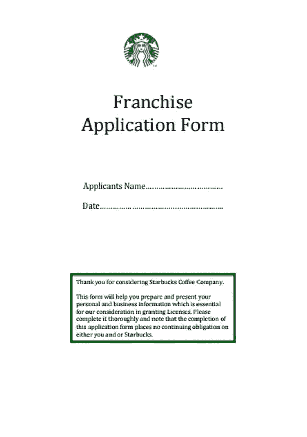

# 终于！理解接口的真正简单指南

> 原文：<https://medium.com/hackernoon/finally-the-real-simple-guide-to-understanding-interfaces-8224c78bf01f>


理解接口对许多初学编程的人来说是一个挑战。这里有一个理解它们的超级简单的指南。

经典的解释是“一个接口就是一个契约”。这是面试你的人希望听到的。但是“一个接口=一个契约”是什么意思呢？

首先，我们知道接口包含一种特殊的代码格式，它本身不执行任何任务，也就是说，一个接口可能有方法签名(方法的开始部分)，但是所有的代码功能都丢失了！实际的方法代码包含在只有*实现*接口的类中。

注意:接口不是*继承的，*而是*实现的*。C#不支持多重继承(只能从一个基类中调用 inherit ),但支持实现多个接口。

```
// The interface
// Notice that the interface only has a method signature. The method has no body.public interface IExampleInterface
{
    void MyMethod(string param1, string param2);
}
```

除了方法签名之外，接口还可以包含属性和事件。

```
// The class
// Implement the interface by having the class "inherit" it.public class MyExampleClass : IExampleInterface
{
    public void MyMethod(string param1, string param2)
    {
        // do something
    }
}// Notice that the method signature here is *exactly* the same as        the one in the interface.
```

当一个类实现一个特定的接口时，该类保证遵循接口中包含的特定代码中定义的特定规则和规定。在我们的例子中，我们的接口包含几个方法签名。当我们的类实现接口时，它保证*至少*包含与那些方法*签名完全匹配的方法。接口并不关心方法中的代码，它只是要求，就像我有{ X }个方法签名(或属性)一样，实现类有相同的确切数目(至少),并且它们完全匹配。*



这种契约如何运作的一个很好的例子是看特许经营如何运作。

很多人因为“品牌认知度”而光顾特定公司。想想你附近的一家大型连锁企业。让我们以星巴克为例，因为星巴克已经成为一家知名的咖啡店，在这里你可以保证得到一定水平的服务和产品质量。

现在，如果你想开一家小型咖啡店，你会选择开一家独立的咖啡店，还是向星巴克支付特许经营费，以使用他们的标志和营销，并遵守他们的公司规章制度？

嗯，虽然独立咖啡店为你提供了更多的灵活性，但顾客可能不太愿意光顾你的独立咖啡店，因为你提供的服务和产品质量未知，而且随时会在没有警告的情况下发生变化。另一方面，一个星巴克加盟店的数量是已知的，因为你与星巴克公司有“合同”。每个人都知道他们得到了什么，有明确制定的政策，包括退货，退款和其他客户满意度问题。星巴克做了许多早期的、艰难的工作来创建一个顾客认可和信任的品牌，你必须遵循他们的公司规则，以便从这项艰苦的工作中受益。

在我们的例子中，小企业主相当于这个类，星巴克公司就是接口。“合同”(你的面试官希望你提到的)是你，作为一个企业主，与公司(星巴克/界面)签订的合同，以便从使用他们的工作中受益。我们的界面有一套我们必须遵守的规则，这在业务和软件开发中都保持了事物的美观、整洁、有组织和可预测性。