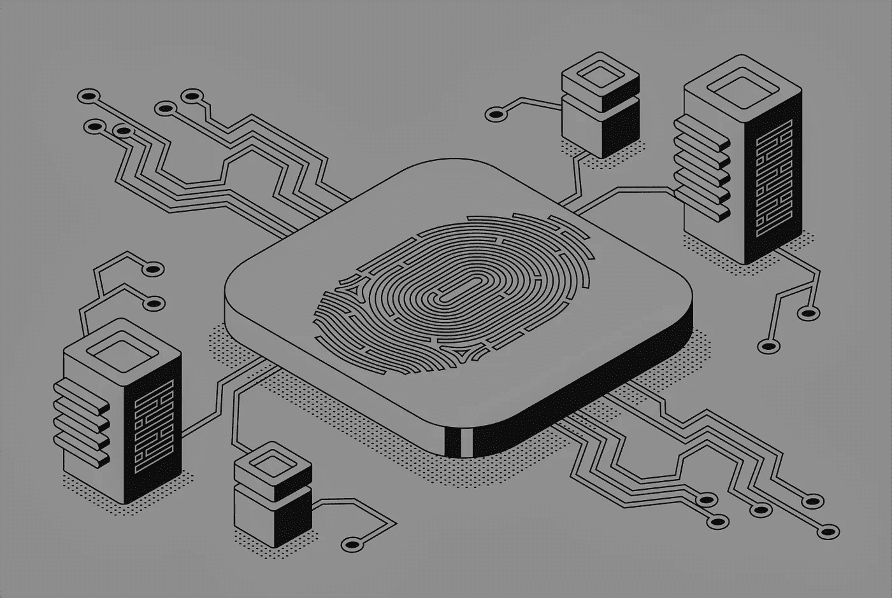
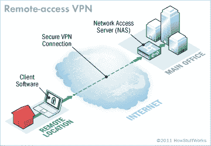

# 金融科技平台安全:外包开发时如何组织流程

> 原文：<https://medium.com/hackernoon/fintech-platform-security-how-to-organize-processes-when-outsourcing-development-9faa01c76000>

## 外包危及你的金融科技产品

最近，金融科技受到了 11 月 1 日发生的 [LPL 及其供应商 Capital Forensics 数据泄露](https://www.wealthmanagement.com/industry/tale-two-firms-lpl-capital-forensics-address-data-breach)的打击，当时 Capital Forensics 的一个第三方平台受到了攻击。后来，[贝莱德的数据泄露](https://www.financial-planning.com/articles/blackrocks-data-leak-strikes-20-000-advisers-mostly-at-lpl)意外公布了少量与销售相关的文件，暴露了姓名、电子邮件地址和其他信息，打击了 20，000 名顾问。所有这些声明都让金融科技公司对自己平台的声誉和诚信感到担忧。

Source: [https://www.freepik.com/](https://www.freepik.com/)

**产品安全始于公司安全。当一个人在内部进行开发时，更容易确保一切都是安全的。但是当一个人外包开发时，如何检查过程的安全性并不明显。如何确定供应商雇佣了可靠的工人？他们没有窃取公司的知识产权并把它交给竞争对手？如何保证团队的持续沟通？**

在本文中，我将介绍如何为安全敏感的金融科技行业建立安全的外包开发流程。仔细检查一下——忽略某些安全方面会危及你的金融科技产品！

# 外包对安全性敏感的软件开发值得吗？

软件开发安全性是一个持续的过程，它确保三个主要方面:平台**机密性**、**完整性**和**可用性**。

*   **保密性**代表受限数据和算法访问。
*   **完整性**设想平台无故障运行。
*   **可用性**意味着开发过程可以被灵活地管理，并且它的所有参与者都是实时可用的。

只要遵守一些简单的规则，安全外包就很容易。与此同时，全球经济原则使公司能够在国外找到具有高超技能或相关经验的人才，他们也不缺乏合格的劳动力。在海外雇佣人员消除了运营开销，同时允许灵活性和较低的声誉费用，因为公司将能够快速扩大和削减团队，因为外包商将亲自负责人的因素。所以，如果安排得当，它可以成为你成功的门票。

Source: [https://www.freepik.com/](https://www.freepik.com/)

# 外包安全的成功因素是什么？

以下安全方面描述了一个将使您的数据和创新免受风险的安全公司。

# 离线安全性

从物理层面开始，确保安全性至关重要。否则，陌生人可以进入你的实体办公室，了解他们不应该知道的事情。通行证进入系统允许公司确切地知道谁可以进入它的办公室。

此外，对候选人进行**背景调查也是值得的。公司应检查以下内容:**

*   执法记录
*   警方许可
*   税收控制记录
*   心理画像
*   候选人已经工作过的公司的推荐信等。

完成上述所有检查后，公司应与员工签署一份 NDA 和/或让他们作为客户与你签署。

# 代码驱动的安全性和认证

当员工加入新公司时，安全公司为员工提供**内部和外部安全培训**。最好有一个经验丰富的工程师来审查你项目的所有过程。

在以特定的方式编写代码时，有一些方法可以确保产品的安全性——例如，通过利用 UI/UX 技术。一家安全的公司会推动其员工完成软件安全课程和认证，比如这些。

此外，像证券交易委员会(SEC)这样的组织会监控公司和组织是否符合最新的安全标准。例如，SEC 最近因网络安全失败向 Voya Financial Advisors 收取了 100 万美元。**询问您的供应商是否有遵循 SEC、FINRA、SOC 2、ISO/IEC 等标准** [**工作的经验，以及他们在外包之前有哪些认证，以加速建立安全的开发流程。**](http://fintechcto.club/leveraging-fintech-startups-with-regulatory-compliance-whats-the-hitch/)

# 数据加密和通道

安全的一个重要部分是保证在截止日期前完成工作。这就是为什么遵守几条规则是值得的:

*   **建立多个互联网连接通道**以确保不间断的连接以及远程员工的安全连接通道。

Source: [http://computer.howstuffworks.com/vpn3.htm](http://computer.howstuffworks.com/vpn3.htm)

*   **准备一个装有所有工具和环境的备用笔记本电脑池**。当硬件出现问题时，员工可以使用这些笔记本，继续工作，没有延迟，为客户带来价值。笔记本电脑存储的数据也是加密的，因此即使被盗，也没有人能够访问客户的数据。
*   **实时监控谁访问数据**——用于让员工了解存储在本地和云中的图片的模型和培训记录。这样做将有助于确保没有人能够从外部访问您的数据。

# 数据混淆

通常，当数据被不直接使用它们的人访问时，它们是最危险的。因此，对于外包商来说，重要的是不要存储超过本地工作所需的数据。此外，根据美国法规，用户的商业数据被限制在境外访问。金融科技初创公司应该做些什么来让外包商获得商业数据，并确保他们(外包商)不违反任何法律？

为了确保这一点，**公司使用模糊数据**，这代表与真实姓名无关的数据。即使您的平台受到攻击，黑客访问了您客户的模糊数据，他们也永远不会知道这些数据指的是哪些客户，因此不会造成任何伤害。

一方面，模糊数据确保产品将在真实市场条件下的真实市场数据上进行测试。另一方面，冒名顶替者没有办法窃取你客户的数据。

# 本地基础设施安全

本地基础设施允许外包商快速测试和调试功能。当开发人员构建新功能时，他们可以使用安全的 VPN 连接通过暂存箱访问生产数据。然而，当测试它们时，暂存箱并不是银弹，因为过程变得太复杂了。这就是为什么有时可能有必要推出本地测试环境。请记住，记录机器或本地基础设施的所有操作以排除内部数据损坏威胁是值得的。

# **外卖**

你的产品的安全性并不取决于它是在国内还是国外开发的；这取决于你的团队如何确保他们的开发是安全的。我希望我在本文中概述的提供安全性的各个方面能够帮助您保证您的合作伙伴知道如何保护您的产品和数据的安全。