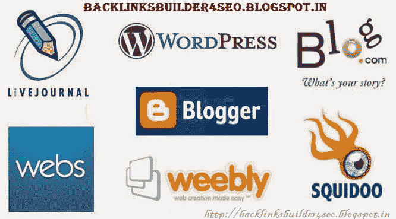
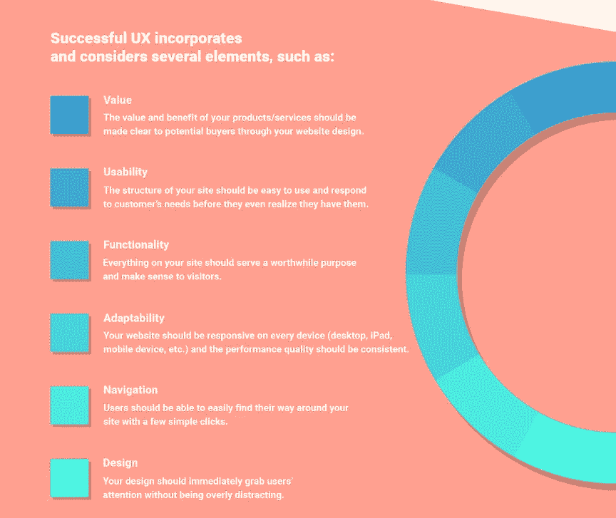
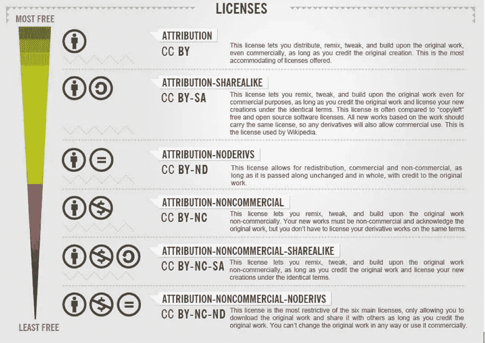
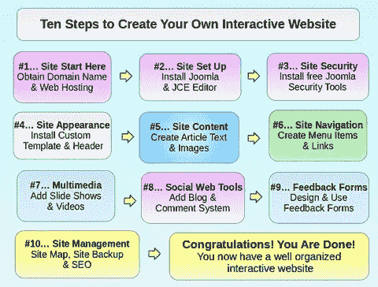

# 第一次创建自己的网站？这是你的分步指南

> 原文：<https://medium.com/hackernoon/first-time-creating-your-own-website-heres-your-step-by-step-guide-175209547a14>

你不需要知道如何编码或者成为一个网页设计师来建立你的在线形象。

在这篇文章中，我将向你展示从零开始创建自己网站的三个选项:

> ***1。与在线出版商*** 一起创建你的网站
> 
> ***2。用 CMS*** 创建你的网站
> 
> ***3。开发自己的网站***

我们将更多地关注前两个选项。如果您期望在本文中找到 HTML 教程，很抱歉让您失望了。

# 1.通过在线出版商创建您的网站(Web 2.0)

先说**最简单的解决方案**:在线网站发布商。简单地说，这是一个包罗万象的包:设计，网站设计工具，主机，域名，电子邮件地址，和技术支持通常都包括在包中。服务。所有复杂的技术方面都由发行商提供支持。

但是不要相信这种解决方案只对新手有意思。只是看项目而定。可以简单的事情为什么要复杂呢？几乎所有的在线网站出版商都提供免费的基础版，让你测试产品并决定付费版是否值得。

价格通常从每月 10 美元左右开始。但是所有的基本功能都包括在内。如果你不是绝对需要一个与你的网站域名相关的电子邮件帐户，你甚至可以少花一点钱。

## **优点:**

*   非常容易使用
*   包括支持
*   没有要安装的软件
*   不需要技术知识

## **缺点:**

*   并非总能添加功能(取决于站点编辑器)
*   总体灵活性较低，因为你依赖于供应商
*   不适合需要数据库的非常复杂的项目

最著名的是 Wix，Jimdo 和 Weebly。你会在我们更完整的列表中找到其他在线网站出版商。

# 用 CMS 创建你的网站

CMS 或内容管理系统(CMS)更复杂。原则上，他们是在线出版商，但实际上，使用起来要复杂得多。

有了在线出版商，您不仅可以轻松地插入文本和图像等内容，还可以设计整个网站。传统的 CMS 在这方面受到更多的限制，网站的外观主要取决于您选择的预定义模型。

最著名的 CMS 是 WordPress。原则是:你安装一个主题，然后用选项来调整设计。如果某件事不完全符合你的期望，你将不得不做开发(你或专业人士)。

主机、域名、电子邮件、安装和支持主要取决于你的预算和技能。如果你一个人做所有的事情，你可以以相对较低的价格创建一个网站。

一个主要的优势，尤其是在 WordPress:数以千计的可用插件。这些扩展为站点提供了默认情况下不提供的功能。例如，WooCommerce 插件允许您向站点添加一个完整的在线商店。由于 WordPress 默认只为一种语言设计，安装一个像 WPML 这样的插件将允许发布网站的翻译版本。Yoast 的 SEO 插件也很受欢迎。它可以配置所有的参数，以便为搜索引擎优化网站。

## **优点:**

*   自由选择宿主
*   非常适合多语言网站
*   该服务几乎没有任何技术限制
*   能够添加插件来丰富网站

**缺点:**

*   没有全球援助
*   创作的自由取决于所用的主题
*   付费插件会推高成本
*   比在线网站出版商复杂得多

珠姆拉。和 Drupal 是 CMS 的其他例子。但是这两个系统处理起来比 WordPress 更复杂，所以我们在这里就不详细讨论了。

# 开发自己的网站

Photo by [Daniel Korpai](https://unsplash.com/@danielkorpai?utm_source=medium&utm_medium=referral) on [Unsplash](https://unsplash.com?utm_source=medium&utm_medium=referral)

如果你需要**绝对的设计自由**，你将需要把手弄脏。当然，这是一项长期的工作，对于初学者来说，这往往是令人不知所措的(也是令人沮丧的)。

在 Codecademy 和 W3Schools 这样的网站上学习是一个很好的开始。他们的教程对初学者来说很容易理解，可以让你逐渐熟悉这门学科。但是道路是漫长的。

您不能全局定义预算，因为它取决于您的项目。请人来开发你的网站要花更多的钱。在线网站出版商每月 10 美元的费用(包括域名和电子邮件地址)比任何网页设计师或代理的时薪都要便宜。

流行的编辑器有 Atom、Coda 2(仅适用于 Mac)和括号。它们都允许用 HTML、CSS、JavaScript、PHP 等进行开发。

## **优点:**

*   没有技术限制
*   非常优惠的主机价格([最佳主机报价和点评](https://hosting.review/best-web-hosting/))
*   服务没有强加任何技术限制

## **缺点:**

*   没有技术支持
*   陡峭的学习曲线
*   难以计算的预算

# 为您选择正确的选项

你走哪条路来创建自己的网站现在将取决于几个因素:**技术难度、时间和成本**。

在做出决定之前，请考虑项目的需求和要求。你是需要一个传统的网站，上面有你的业务的一些信息，还是一个用户互相交流的平台？有了在线网站编辑器，你创建一个标准的网站就没有问题了。另一方面，你将无法克服一个更复杂的项目，比如一个社交网络。

尽管普遍认为 WordPress 是一件轻而易举的事情，我还是经常建议你首先尝试在线网站出版商。通常，这种类型的解决方案对于一个公司站点或一个经典的投资组合来说已经足够了。显然，两者都不允许你创造新的易贝或新的脸书。从纯技术的角度来看，您需要一个专门开发的解决方案。

你的日历是什么？项目到底急不急？你是想编码还是学编码？如果是这样，你可以从头开始开发一切。但是如果你没有被这个主题卡住，你将没有时间或者更糟，你将失去执行你的项目的欲望。

和往常一样，这当然也是钱的问题。在线网站出版商每月只收取 10 美元以上的费用，包括域名。一切都明白了，你可以自己设计你的网站。这在免费版本中已经是可能的了。

# 域名:它是如何工作的？

域名是可以访问你的网站的互联网地址。

这种类型的域名通常价格在 8 到 15 美元之间，取决于扩展名。例如，在。在或。info extension 比. com 便宜一点，你可以从各种提供商那里购买域名。

如果你用的是网站编辑器，也可以直接从他那里买域名。这样你就只有一个联系人，这将简化你的网站管理。如果使用 WordPress 或者自己开发网站，还需要**服务器空间(托管)**。除非你使用在线出版商，在这种情况下，主机包括在内。

你也可以使用这个域名作为你的【(info@your-company.com**电子邮件地址。无论如何，它将比 Hotmail 或 Gmail 地址更专业。您也可以通过在线发布者或您域名的主机来管理电子邮件地址。**

# 设计一个网站

Photo by [Igor Miske](https://unsplash.com/@igormiske?utm_source=medium&utm_medium=referral) on [Unsplash](https://unsplash.com?utm_source=medium&utm_medium=referral)

在厨房里，如果你按照食谱做，效果会更好。创建网站也是如此。**即兴创作并不总能成功押韵**。提前计划将帮助你决定哪些主题和内容是最合适的，以及你的网站应该是什么样的

开发思维导图将是思考你的网站需要什么的良好开端。

# 设计网站的技巧:

1.拿一张纸和一支铅笔。写下你的网站需要包含的所有内容。头脑风暴和开发思维导图是组织你的想法的好方法。

2.看看其他设计和内容让你感兴趣的网站。记下你喜欢什么和不喜欢什么。

3.当你有了一个在你的网站上想要什么的想法时，向你信任的人寻求建议。你一定会画出一些有趣的反射点。

4.开发一个包含你的站点的所有页面的列表(例如，在一个电子表格中)。写下标题、内容类型、关键词、目的、页面类型和重要性。

5.额外收获:如果你想在搜索引擎中占据有利位置，你必须为每一页选择一个关键词，并将它们添加到你在第四点中创建的列表中。

# 如何实现网站的设计？

Image Credit- webfx.com

创建一个网站设计并不容易。我还要说:互联网上糟糕设计的例子比美丽的网站还多。确保你的网站不是在篮子的底部。

长筒裤在 20 世纪 70 年代可能很流行，但在 20 世纪 80 年代和 90 年代已经变得很可笑了。网站设计的原则是一样的:五年前在顶端的东西今天可能会过时。请记住这一点！

这不是专业设计师的指南，但你会发现一些提示，在我看来，仍然是相关的:

1.对于背景，尝试使用浅色(或白色)。

2.选择合适的颜色**搭配**。如果需要帮助，请使用 Adobe Color。

3.去一个**清醒和干净的设计，不同元素之间留有空白**。

4.避免使用过多的字体:通常一种字体用于标题，一种字体用于文本。选择一致的**风格和格式**。互联网用户不应该注意到你的网页之间的任何差异。不要创造一个弗兰肯斯坦怪物！

5.此外，你的网站必须完全适应**移动视图**。

6.你添加的所有**图片**必须看起来专业。不要贴自己在浴室镜子里的自拍照。智能手机如今能拍出漂亮的照片:只要准备充分，你就能拍出漂亮的肖像。

7.**越少越好**。如果你有疑问，把自己限制在最基本的必需品上。

# 所有好网站的共同要素是什么？

对于一个看起来专业的网站来说，标志和图片的选择是决定性的。今天，网上有很多免费的股票照片:绝对可以看看[知识共享](http://search.creativecommons.org/)。

你还会在许多其他网站上找到专业质量的照片，例如 [Fotolia](http://fotolia.com/) 和 [Shutterstock](http://www.shutterstock.com/) 。然而，避免选择到处都是照片的图像库。这里有一个很好的免费图像库链接集合。

**了解现有的照片格式**很重要:主要格式有。gif(最适合徽标和动画)。jpg(理想的照片)和。png(文件较大，但也适合 logos 当照片)。您还必须为浏览器优化图像的大小和质量。

> 使用 [TinyPNG](https://tinypng.com/) 在网络上免费压缩和优化您的照片。这改善了网站的加载时间，对你在搜索引擎中的搜索引擎优化有积极的影响。

手头有一个图像编辑软件来编辑和调整图像大小也是很有帮助的。Gimp 是一个专业的免费软件，但是使用起来相当复杂。Photoshop 的另一个替代品是 **Affinity Photo** ，它的价格只有竞争对手的几分之一，而且不需要订阅。

还有其他工具可以让您轻松创建图形资源，而无需通过 Photoshop 或 Illustrator。

为了给你的访问者一个专业的印象，你应该**使用联系表**而不是简单的电子邮件地址。用 Wix、Jimdo 和 WordPress 创建联系表单非常容易。

请记住，您网站的导航菜单是非常重要的，以便您的访问者可以从一个页面移动到另一个页面。所以，确保一切都是用逻辑组织起来的**。例如，如果你想让你的访问者通过你的联系表单给你发送信息，那么不在菜单或页脚放置链接就是一个错误。**

在你的网站上线之前，你必须测试联系方式！

# 创建网站的步骤

网站的创建分为几个阶段:

> ***1。规划你的网站，用启发式地图组织你的想法。***
> 
> ***2。决定你的网站需要什么内容。***
> 
> ***3。为你的项目选择最好的在线网站出版商或最好的 CMS。***
> 
> ***4。创建内容(文本、图像等。)每一页。***
> 
> ***5。将内容整合到您的网站中，并为 SEO 优化页面。***
> 
> ***6。把你的网站放到网上并推广它。***

# 你的网站在线。现在呢？

如果你已经创建并发布了你的网站，你可以**开始推广**并对其进行优化，以增加访问量，改善用户体验。

*   更新你的网站:网页不是书。上传后可以很好的刷新它们。当你有机会的时候，创造新的相关内容。持续更新你的网站也很重要。以一家餐馆的网站为例:当菜单改变时，它必须在网站上尽快更新。
*   为了吸引尽可能多的访问者到你的网站，你必须**优化你网站的搜索引擎优化**。这不是很复杂，但这是一项需要时间的工作。为了产生流量，你应该进行页面内搜索引擎优化，页面外搜索引擎优化，并使用谷歌广告词为你的网站带来有针对性的流量。
*   **流量分析:**如果你不衡量你网站的流量，你在 SEO 上的努力将是无用的。这是知道你的行动是否有效的唯一方法。最流行的流量分析工具是谷歌分析。而且，它是免费的！
*   一旦你的网站上线，你当然应该在**谷歌搜索控制台**注册，将你的网站提交给谷歌。至少，把你网站的 URL(地址)发送给谷歌，这样[就可以被索引](https://www.google.com/webmasters/tools/submit-url)。
*   [**邮件营销**](https://en.wikipedia.org/wiki/Email_marketing) **:** 另一个常见的策略，尤其是对商家来说，就是定期给访客发邮件保持联系。这种方法对于电子商务网站、小型企业和博客作者尤其有用。电子邮件营销本身就是一门科学。你可以阅读这个指南来找到合适的电子邮件软件。
*   **社交网络:**最后，大多数网站也在社交网络(如脸书、Instagram、Twitter 和 LinkedIn)上有个人资料，以便与网站的访问者(当前和潜在的)交流。这对于图形艺术专业人士或工匠(插画师、摄影师、珠宝商等)尤其有效。).你也可以通过各种在线课程、Udemy 上的培训、Youtube、Simplilearn 等学习社交媒体营销。

我希望这个小指南已经向你展示了如何从头到尾创建一个网站。还有什么问题吗？请在评论中告诉我！