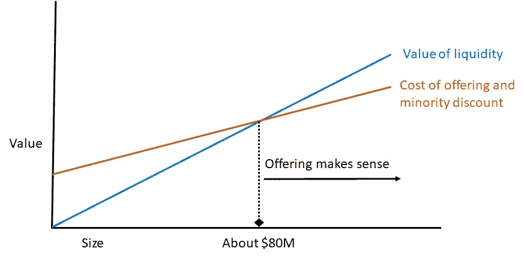
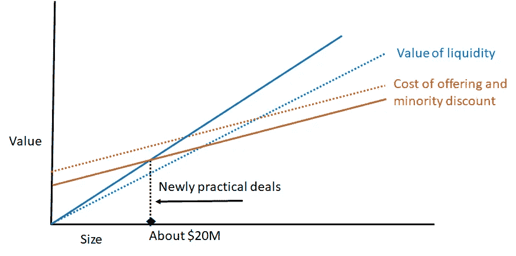

# 通过“令牌化”解决 8000 万美元的问题

> 原文：<https://medium.com/hackernoon/fixing-the-80m-problem-with-tokenization-5893e658d3a1>

“令牌化”被宣传为将 8000 万美元以下的小额交易证券化的有效方式。然而，它有一个深层次的问题，即小盘股交易是糟糕的证券投资。他们并不总是为被动的证券买家带来利润，而且投资者也不买 T1。如果没有办法为被动投资者打包小额报价，那么目前的“令牌化”推销就是死路一条。你的交易失败了吗？在本文中，我们分析了这个问题的严重性，并提出了一些改进措施。

传统的私人投资市场运转良好。有许多 8000 万美元以下的私下交易，由 1 至 20 名相当活跃的买家购买股份，并无限期持有。相比之下，被“证券化”并分发给不那么忠诚的投资者的要约数量少得可怜。

在我所观察的任何环境中，较小的安全产品都不起作用:

*   股权众筹筹集的资金数额很小，令人失望。买家往往是有其他动机的客户，而不是真正的投资者。
*   如果我们看看更活跃的交易市场，较小的交易已经被交易所冲走，细价股经常出现问题，Reg A+投资对 IPO 买家来说是一场灾难。
*   出售房地产投资的门户网站是交易规模在 300 万至 8000 万美元之间的最大类别。他们通常以一小群永久的、积极的投资者告终。
*   2017 年期间，较小的报价*似乎*在不受监管的加密 ICO 市场发挥了作用。现在我们可以看到，较小的交易将为零。

被动证券投资者有充分的理由避免这些较小的报价。他们往往没有足够的信息披露来实现公平定价，他们没有足够的股东来发展二级市场，如果出现问题，往往没有人代表被动的投资者。

# 放大和缩小

成功股票发行的最小规模一直在增加。英特尔在 1971 年首次公开募股，筹资 680 万美元。微软在 1986 年首次公开募股，筹资 6100 万美元。根据[的这项研究](https://www.perrittcap.com/the-state-of-the-ipo-market/)，最近的 IPO 平均市值为 15 亿美元，而且更大的 IPO 更有可能涨价。

代币化运动试图通过增加交易机会、降低发行和合规成本来减少证券发行的实际规模。在下图中，我们展示了增加机会(蓝色)和降低成本(橙色)的计划。

Where we are now (above) and where the tokenization teams want to go (below)

# 它符合标准吗？

这里有一个简单的三部分测试，以确定投资要约是否可以证券化或“令牌化”。

## 1)这是一项好的投资吗？

对于一个有见识的投资者来说，这是一项有吸引力的投资吗？他可以买下一大块。

对于了解交易并对交易有一定控制权的买家来说，这笔交易可能价值最高。如果这对投资者来说不是一个好的投资，那么优势较少的证券买家可能不应该购买，也可能不会购买。

我听到发行人以各种方式声称，证券购买者愚蠢到购买无竞争力的投资。然而，在我看来，证券买家似乎很聪明。他们可能暂时精神错乱。他们可能会短暂买入没有潜在价值的小型 IPO。但他们不会蠢到两次犯同样的错误。这一主题的一些变体包括:

*   新加坡神话中的家伙，他在金钱方面足够聪明，积累了大量投资资产，但愚蠢到买任何“代币”。
*   体育迷会购买赔钱球队的无投票权股票，以获得 T 恤衫和明星之夜。对于投入 500 美元的人来说，这可能是一个好主意。然而，这些交易寻求的是成千上万的合格或老练的投资者。
*   因为得不到“通路”而绝望的人。是的，他们确实不能以任何其他方式为你的独家蒙古牦牛牧场辛迪加提供资金，但他们确实有成千上万的其他资产可供选择，包括可能是更好的赌注、具有类似回报或更高流动性的资产。

第一个测试表明了为什么小型股证券市场会遭受“逆向选择”(只得到糟糕的交易)。当发行人有一笔好交易可以通过拜访少数投资者来销售时，他们不太可能花费时间和金钱来为大量投资者包装、销售和管理证券发行。

## 2)是否有分配它的经济原因？

所以我们一定要问，有理由分给更多的投资者吗？这个原因是否有支付额外费用的货币价值？

有理由进行证券发行。例如:

*   流动性。你的投资会增值，因为买卖很容易。这就是大盘股的解决方案。你的交易越大，交易就越活跃。流动性只有在实际可用的情况下才会增加价值，而不仅仅是一种承诺。
*   你是在向一个社区和一个客户群营销，你的客户会使用你的安全。他们可以把它作为公用硬币，或者作为会员资格，或者作为使用产品或服务的赌注。这是实用令牌的最初承诺。我预计它会受到普通证券的欢迎，这些证券可以用来购买会员资格。纽约证券交易所过去要求经纪人购买“席位”或“会员资格”才能在交易所交易。现在我们可以对小规模的服务做同样的事情。这为安全性增加了一些营销和产品价值。
*   你已经有很多股东了。他们可能是员工、共同客户或其他利益相关者。
*   有一类投资者希望购买你要求全球分销的产品。区块链格式证券的好处是，区块链是无国界的，他们自然有全球分布。许多新类别的买家都是虚构的。你可以假设他们不存在，直到你采访了真实的人，你知道他们愿意支付高于当地私人买家的价格。
*   你很长一段时间都不想还钱。房地产、风险投资和私募股权基金通常会在六年内收回投资。他们经营“自我清算”基金，需要按计划收回资金。一种证券可以在更长的时间内保持有效，特别是如果最初的购买者可以退出交易。如果你做长期投资，这可能很重要。

“货币价值”意味着发行者将支付更高的收益或接受更低的价格，以获得证券发行的优势。你应该可以量化这个。例如，一个企业家可能会说“我想用一笔保证金来为这个牦牛牧场融资，因为牦牛需要十年才能成熟，而我不想在五年内偿还一笔私募股权基金。”你可能会问“具体来说，在额外的五年里，你愿意给你的投资者多少额外的收益或更低的价格？”如果答案是“零”，那么你就完了。你需要一些实际的货币价值。

## 3)被动投资者是否得到代表和保护？

缺乏投资者代表会产生问题。许多令牌化证券是由发行者设计的。这在一级销售中伤害了他们，因为如果没有主要投资者的反对，发行人通常会要求没有竞争力的条款。这就是为什么这些优惠目前都卖不出去。

持有这些证券也有风险，因为大多数证券没有提供治理权，或者充其量只是分散的少数股权。不清楚如果出现问题，谁将代表被动投资者。少数股东的这种风险是有成本的，在上图中我们称之为“少数股权折价”。如果得到保护，投资者会付出更多。

我们有许多方式来代表和保护被动投资者，例如:

*   保险，就像债券保险公司。他们预先收取保险费，并为投资者的损失买单。
*   服务人员。他们收取和分发钱款的费用很少
*   受托人。他们为处理债务交易中出现的问题收取费用
*   分级，就像资产支持证券一样，主要投资者承担第一次损失，然后在没有损失的情况下获得额外报酬，本质上是向后面的投资者出售保护。
*   领投人。他们可以通过早期进入交易，并“暗示”交易的价值，然后以加价的方式引入后来的投资者来获利。
*   主要投资者/管理人员控制投资，强烈代表其他投资者，并赚取一定比例的利润

代表被动投资者的一个好方法是通过基金经理。投资者对基金做出长期承诺，比如私募股权基金或风险投资基金。然后，基金经理在小交易中持有大量股份，并积极代表投资者，如果投资产生利润，就可以获得报酬。

一个强大的牵头投资者可以解决我为小盘股证券列出的三个问题中的两个——信息披露不充分、二级市场缺乏兴趣以及投资者代表性差。他们直接代表被动投资者。而且，他们可以顺利解决一些信息披露不足的问题，因为他们可以查看非公开信息。

主要投资者有一些重要的职责:

*   谈判投资条款。
*   参与治理并报告进展情况
*   如果出现问题，投入大量的工作来收回投资
*   推动有利可图的退出

# 改进建议

## 从买方开始

我认为，如果有一个强大的牵头投资者，规模在 2000 万美元至 8000 万美元之间的一类证券发行是可行的。这个人将投入一些资金，承担起这个特定发行的主要投资者的责任，如果发行中的其他投资者赚钱，他将获得一定比例的利润。

这些主要投资者起到了分拆风险投资、再投资或私募股权基金的作用。自由职业的资产管理人可以跳过基金，把他们的服务加入到单一资产中。这种分拆失去了一些东西，因为我们没有获得基金管理团队提供的额外服务。然而，效率也有所提高。资产经理不需要预先筹集资金，也不会因为长期的勘探而获得报酬。这可以节约成本。此外，逐笔交易的方法可以快速响应新的市场机会，并吸引各种各样的资产经理。

## 然后放大

我认为，小型股证券需要被卷进更大的基金。购买小额产品的资金有限。大型机构投资者会避免这些产品，因为他们买不到足够的数量来证明分析和滑点成本的合理性。交易者会避开它们，因为很少有买价和卖价。我们可以通过将许多小盘股组合成一只提供更大购买量和更多交易的大盘股基金，来大幅增加需求。

拥有这些可用资金对于吸引优质产品也很重要。如果不清楚是否有资金可用，一个有吸引力的发行者是不会把它带到证券市场的。

幸运的是，当我们将主动管理构建到单个资产中时，我们可以有效地进行这种汇总。我们可以创建一个类似 ETF 的基金。当我们向基金中注入新资产时，我们需要小心我们支付的价格，并要求以做尽职调查和承销初始发行的很大一部分作为交换条件的折扣。然而，持续的管理并不昂贵。我们可以通过允许投资者用一篮子现金(可能是稳定的债券)和证券赎回基金份额，来降低这类基金折价交易的可能性。

因此，经过许多步骤后，我们最终得出了“区块链”的理由。令牌化的格式使我们更容易进行低成本汇总，在全球范围内分发相关证券，并赎回它们。

## 诱人的包裹

我提议出售牵头投资者服务，这将创造可购买的证券报价。合格的发行人将能够购买这些服务，就像他们可以购买保险和债务交易的托管服务一样。

*   我们的单一资产集团将为小盘股证券的投资者提供保护和利润，使用与全球最大的风险投资者和私募股权投资者相同的代表级别。
*   我们的多资产集团将通过大型、高流动性和高效率的全球 ETF 提供对小盘股资产类别的投资。这些类别具有全球范围，包括新兴经济体的风险投资、私募股权投资、房地产和流动性。

增值的成分是，这两种服务都是资产经理，他们可以代表证券市场的买方。

对于令牌化证券的潜力，媒体已经投入了大量笔墨。到目前为止，这个小小的安全问题已经扼杀了所有这些计划。本文介绍了解决方案的一些要素。首先，我们需要确定从证券化中获得价值的交易，使用类似上面列出的三部分测试。然后，我们需要达成远程安全购买者可以接受的小额交易，而且我们必须以合理的成本完成交易。然后，我们需要一种有效的方法将它们打包成更大的包。