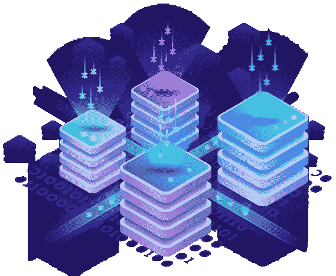

# 区块链、GraphQL 等——在一个数据库中

> 原文：<https://medium.com/hackernoon/fluree-blockchain-graphql-and-more-all-in-one-database-e17752f42da8>

> *“FlureeDB 是一款专为满足现代企业应用需求而构建的数据库，同时提供数据安全性、工作流效率和行业互操作性方面的区块链功能。”*

听起来很有趣？我也是这么想的，*如果 Fluree 背后的团队能够实现它承诺的一切，结果可能会令人震惊。*

为了了解更多关于 Fluree 的信息，我采访了它的联合首席执行官布莱恩·普拉茨。听听下面的完整采访。

二十多年来，[布莱恩·普拉茨](https://www.linkedin.com/in/brianplatz/)和[翻转·菲利波斯基](https://www.linkedin.com/in/andrewflipfilipowski/)一直在一起创建软件公司。他们监督了两次 IPO——其中一次涉及世界第八大公司——并获得了软件公司有史以来最大的现金销售。简单地说:他们有使用软件的经验。

Fluree 是 Brian 和 Flip 的最新项目，构思于四年前。这是现代应用程序的一种新型数据平台，他们创建它是因为他们经常发现自己在与数据库限制作斗争。

Brian 和 Flip 认为，虽然软件和软件交付(想想 SaaS)在过去几年里取得了飞跃性的发展，但是支撑软件的数据库却没有发展——尽管数据的重要性增加了。

Fluree 最重要的与众不同的因素之一是，它将更新数据和查询数据的过程分离开来。此外，区块链记录了曾经进行的每一次数据库更改，允许对潜在的无限数量的版本进行无限的查询。

Fluree 有“燃料”的概念，它类似于 Ethereum Gas，并基于执行的每个 DB 查询以及三个当前的 Fluree 接口进行计算: [GraphQL](https://graphql.org/) 、FlureeQL(一个 JSON 查询接口)和 SPARQL。

Fluree 去年 12 月发布了一个授权版本，到目前为止，早期采用者往往是其他科技初创公司——总部位于区块链的应用程序正在使用 Fluree 作为基础。这是因为，有了 Fluree，你可以编写自定义的区块链逻辑，而不必派生另一个区块链，也就是说，你可以在更短的时间内启动你的项目。

两个这样的早期采用者是[idea block](https://ideablock.io/)——它希望打破数字专利系统——和 Fabric——它正在挑战传统的广告生态系统，并希望帮助人们将他们的数据货币化(而不是由脸书这样的人出售)。

Brian 还提到，6 个月 Fluree 路线图中最大的亮点是它将在本季度完全开源。它的 API 已经稳定，可以使用了。

总而言之，毫无疑问，Fluree 充满了各种功能和巨大的潜力，让我们试驾一下吧。

# 亲自动手

你可以[下载并解压托管的压缩文件](https://s3.amazonaws.com/fluree-releases-public/flureeDB-latest.zip)。

然后运行以下命令启动一个 Fluree 实例:

> 。/fluree_start.sh

还有[自制水龙头](https://docs.flur.ee/docs/getting-started/installation#download-fluree-with-homebrew)和 [Docker 图像](https://docs.flur.ee/docs/getting-started/installation#fluree-with-docker)可用。

一旦启动，Fluree 就在端口 8080 上运行，并有一个 GUI 和 [REST 端点](https://docs.flur.ee/api/signed-endpoints/overview)用于您需要的大多数操作。

安装和启动之后，我按照文档的“[示例](https://docs.flur.ee/docs/examples/cryptocurrency)”部分，引导您创建加密货币。使用 Fluree，您总是可以选择使用 FlureeQL、GraphQL、SparQL 或 curl。例如，要用 curl 创建一个模式，使用下面的命令:

> curl \
> -H " Content-Type:application/JSON " \
> -H " Authorization:Bearer $ FLUREE _ TOKEN " \
> -d '[{
> " _ id ":" _ collection "，
> "name": "wallet"
> }，
> {
> "_id": "_attribute "，
> "name": "wallet/balance "，
> "type": "int"
> }，【T22 "

授权令牌是 Fluree 有趣的部分之一，因为它与密钥对绑定在一起，这是任何区块链用户都熟悉的东西。[阅读文档了解更多细节](https://docs.flur.ee/docs/getting-started/installation#setting-your-own-private-key)，但是我使用了`./fluree_start.sh :keygen`让我从自动生成的对和用户 id 开始，并且[从那个](https://docs.flur.ee/docs/identity/public-private-keys)派生了一个令牌。

您可能已经注意到，Fluree 不是 NoSQL 或无模式数据库，这意味着您需要处理模式更改，我在文档中找不到任何关于如何处理这些更改的任何特定功能的官方提及。

接下来，添加示例数据，同样有四种可用的方法。由于 Fluree 在某种程度上是一个关系数据库，您可以使用 Fluree 所谓的[“谓词”来添加“关系”](https://docs.flur.ee/docs/getting-started/basic-schema#adding-predicates) Fluree 还捆绑了一组[谓词类型](https://docs.flur.ee/docs/infrastructure/system-collections#_predicate-types)来定义关系是什么数据类型，或者您可以使用函数来定义谓词，这就是 Fluree 的有趣之处。例如，使用文档中的加密货币示例，您可以定义有点像 Solidity(以太坊智能合约语言)函数的谓词，用于检查余额或防止重复花费。

# 最后的想法

Fluree 很吸引人，但是众多的捆绑特性让人不知所措，有时太多的选择会让人有些畏缩和困惑。它有点像一个数据库引擎，外加一个类似于应用层的捆绑包。我知道过去许多老的关系数据库已经包含了这些特性，但是我已经有一段时间没有使用关系数据库了，并且已经习惯了 NoSQL 产品的简单性。不同的接口选项是受欢迎的，但我想知道选择并坚持一个可能是更好的工程决策，特别是 FlureeQL，它是 Fluree 独有的。将“区块链”添加到技术堆栈中是一个我不确定的选择。[我在](https://www.sitepoint.com/bigchaindb-blockchain-data-storage/)之前报道过 BigchainDB，它试图做同样的事情，尽管方式不同。我不确定 Fluree 的区块链功能是否包含真正的区块链，或者只是类似区块链的功能，但这没关系，如果你有它们的用例，你怎么称呼它们都没关系。

我也无法彻底测试 Fluree 的性能或可靠性指标，所以我不确定所有的功能是否会增加很多开销。总而言之，我强烈建议您测试 Fluree，看看它如何适用于您的应用程序用例。

*原载于*[*https://dzone.com*](https://dzone.com/articles/-fluree-blockchain-graphql-and-more-all-in-one-dat)*。*