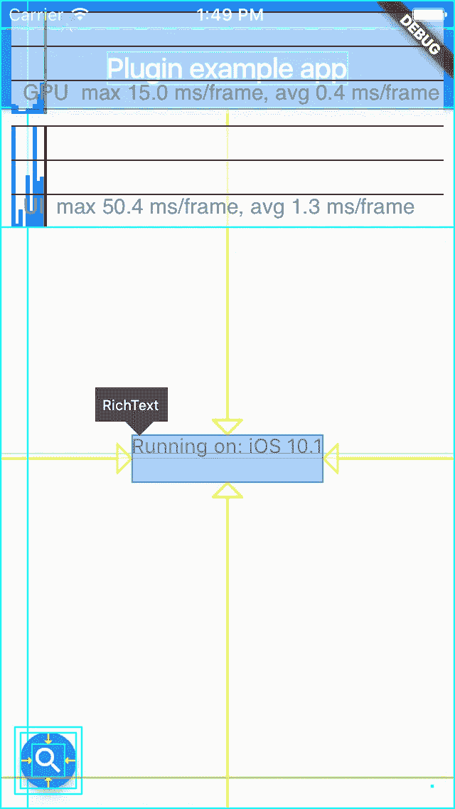
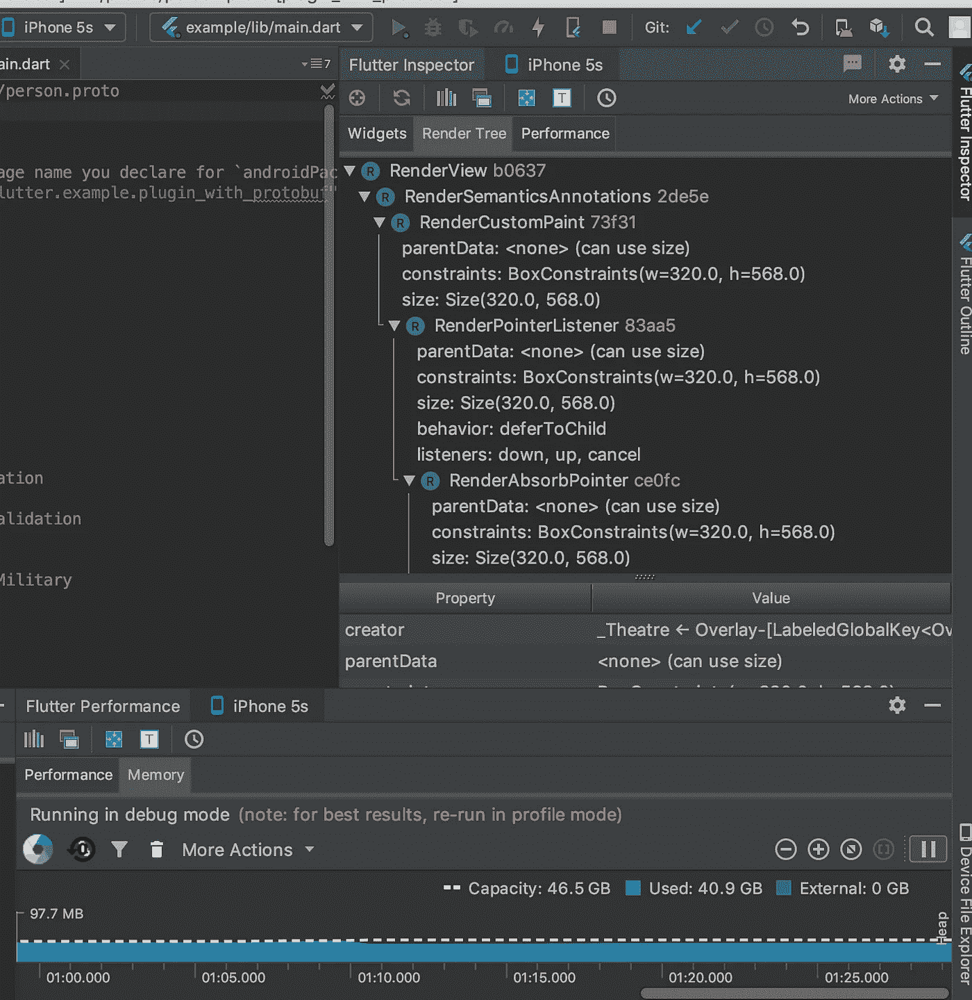
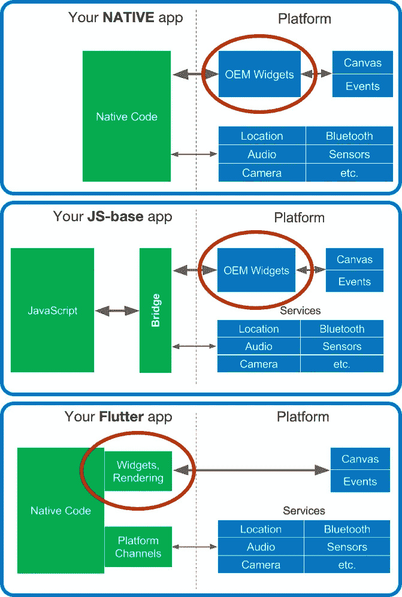
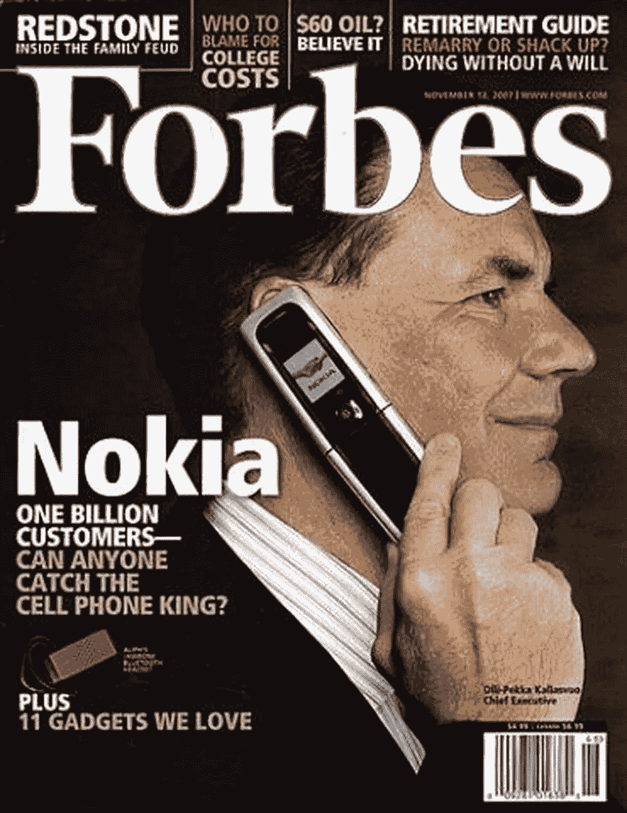
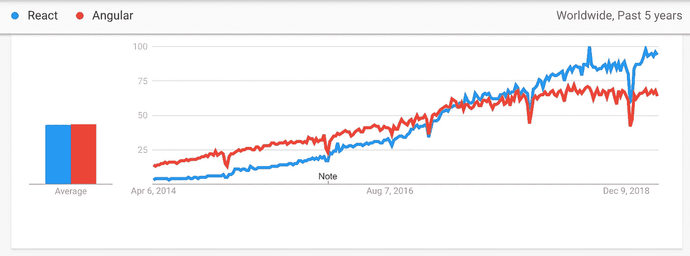

# flutter——不是另一个 x 平台框架

> 原文：<https://medium.com/hackernoon/flutter-not-yet-another-x-platform-framework-c7edfaadee65>

有过使用 NativeScript 和失败的概念验证(PoC) React Native 的痛苦经历，特别是在 Android 上，我们的开发和执行团队害怕进一步提到*跨平台移动框架*。然而，当接近 Flutter 时，我们相信它是**而不是**又一个跨平台移动开发框架。而且这并不是纯粹的*信仰*，而是基于对(1)其**技术**、( 2)其**社区**采用，以及(3)最重要的，谷歌的**战略**的观察和分析——它的原作者和支持者。

Flutter Trinity

*警告:这篇文章有点像“flutt vs XYZ”，在某种程度上的确如此，但这是从我自己领导团队和亲身体验这些技术的经历和旅程的角度出发的。我的意图不是引起一场激烈的战争。我与谷歌或其项目也没有任何关系。*

# 0.对现状感到痛苦

在我之前在芬兰的创业公司工作期间，我必须做出许多技术决策，其中一个很不幸，NativeScript(当时是用 vanilla JS，即没有 Angular2 框架)。来到现在的公司，检查团，巧合的是，他们做出了同样的决定，并带来了同样的后果。缺乏适当的一流测试自动化支持(任何级别，如单元、集成、e2e)，缺乏一流的生产力工具(调试器、检查器、堆栈跟踪)，依赖地狱(具有讽刺意味的是，它被宣传为 NativeScript 的强项，而不是等待 NativeScript 版本赶上新的 iOS 或 Android，但实际上每个新的 iOS 都会使我们用 NativeScript 编写的应用程序崩溃，而更新框架依赖平均需要 4 人团队一个多月的时间)，性能地狱，尤其是在 Android 上，并且用 ObjC/Swift/Java/kot 编写任何东西都异常困难

有了那次糟糕的经历，我们在考虑下一个项目的 React Native 时更加保守了。优点是直截了当，现代的声明式/反应式编程模式，温和的学习曲线，考虑到我们的团队一直在做的 React-Apollo-NodeJS，相同的技术堆栈。然而，正如我们所担心的那样，React 原生 PoC 在某些标准上失败了:( a) Android 性能，特别是摄像头;( b)依赖性管理([弹出或不弹出](https://docs.expo.io/versions/latest/expokit/eject/));以及(c)与物联网设备的交互。

在开始我们旅程之前，值得注意的是，在我之前的创业中，我们也评估了 Xamarin 和 RoboVM。

确切地说，任何基于 JS 的跨平台移动开发解决方案的学习曲线在制作简单的演示应用程序时都是平缓的，但在使用可测试、可扩展、高性能的应用程序时却是陡峭的。程序员总是要克制自己不要“过桥”，但反过来说，任何 UI 或者动画都只能从“ [*那边*](https://facebook.github.io/react-native/docs/animations#using-the-native-driver) *”来做。*

# 1.这项技术

> 3 点:工具、渲染引擎、编译模式

## 工具

首先，当我断言 Flutter 不是另一个跨平台框架时，是因为 Flutter 不是一个框架，而是一个 SDK。简单来说， [SDK 比一个框架](/@shashvatshukla/framework-vs-library-vs-platform-vs-api-vs-sdk-vs-toolkits-vs-ide-50a9473999db)大。一个像样的 SDK 拥有所有的工具，比如调试器、检查器、剖析、堆栈跟踪、测试框架。我们的团队惊讶于工具对 Flutter 的支持有多好。Web 开发人员对 Flutter 小部件检查很熟悉，而性能覆盖对于优化狂热者来说是完美的。这一切都是因为 Flutter 开发工具在 Android Studio 中得到一流的支持。

Web developers feel familiar with Flutter widget inspection, while the performance overlay is just perfect for optimization maniac.

Flutter development tools are first-class supported in Android Studio.

Flutter 关于测试的文档(在任何级别上，包括仪表化 UI 测试)写得很好，有易于理解的例子。

有了所有这些工具，我们摆脱了其他跨平台移动开发解决方案的一个长期问题。

## 渲染引擎

Illustration reproduced from [What’s Revolutionary about Flutter](https://hackernoon.com/whats-revolutionary-about-flutter-946915b09514), highlighted by the reproducer.

与任何其他数据密集型跨平台移动开发解决方案不同， [Flutter 配备了自己的渲染引擎——Skia](https://github.com/flutter/flutter/wiki/The-Engine-architecture),目标是在支持的设备上实现一致的 120 fps(在普通设备上实现 60 fps)。同时，NativeScript、Xamarin、React Native 都使用平台(如 iOS 12、Android 7 等)渲染的‘ui view’。事实上，另一个值得注意的跨平台移动开发解决方案是 Unity(因为 [Qt 已经放弃了](https://wiki.qt.io/Qt_for_Android_known_issues))，一个游戏引擎。一位谷歌开发专家(GDE)有一个足够疯狂的想法，在 Flutter 中编写一个 Flappy Bird 游戏。

现在，Flutter 有了自己的渲染引擎，花哨的 UI 和动画不再需要程序员“过桥”，这显著提高了任何用 Flutter 编写的 app 的 UX/流畅度。另外，由于 Flutter 对渲染引擎拥有完全的控制权，它可以轻松地引入带有 Widget 和 [Widget composition](https://flutter.dev/docs/resources/technical-overview#composition--inheritance) 的声明式编程模式，这也通过可扩展和可测试的代码提高了开发效率。随着过桥时间的减少，主要的操作系统升级不再是应用崩溃的威胁，而 Flutter SDK 版本升级也不再与依赖地狱相关联。

另一方面，现在“过桥”的唯一原因是获得“服务”数据(包括我们的物联网设备用例)，即使这样，与其他基于 JS 的解决方案相比，[也更容易做到](https://flutter.dev/docs/development/platform-integration/platform-channels)。

## 编译模式

可以说，拥有[不同的编译模式](https://flutter.dev/docs/testing/build-modes)(得益于 Dart toolchain)是 Flutter 的杀手锏，因为它带来了两个世界的最佳效果，开发期间的亚秒级热重装，以及生产中 CPU 受限任务的裸机性能。这也是为什么 [Flutter 和 Dart](https://flutter.dev/docs/resources/faq#why-did-flutter-choose-to-use-dart) 一起使用，而不是其他语言。

# 2.社区

> 3 分:设计师、程序员、总监

有趣的是，我们是如何听说 Flutter 的，因为它来自一个设计师！虽然看起来很有趣，但它强调了颤振的一个重要方面，即它是以设计为中心的，甚至是设计优先的。材料设计[宣布颤振是他们的一级平台](/flutter-io/building-beautiful-flexible-user-interfaces-with-flutter-material-theming-and-official-material-13ae9279ef19)。显然，移动开发，尤其是跨平台的移动开发，在设计社区中臭名昭著，而 Flutter 完全知道如何脱颖而出。如上所述，Flutter 通过亚秒级热重载实现了这一点，同时技术上决定[优先于继承](https://flutter.dev/docs/resources/technical-overview#composition--inheritance)，允许程序员在创纪录的时间内实现所需的设计。此外，因为它有自己的渲染引擎，实现一致的品牌标识设计比使用 OEM 小部件更容易和更快。

当然，Flutter 的主要群体是程序员。根据 LinkedIn 的数据(截至 2019 年 3 月)，由于 Dart 语言和 Flutter 声明性小部件组合模式的温和学习曲线，Flutter 是软件工程师中增长最快的技能。

谈到开源库活动，在所有跨平台移动开发解决方案中，只有 Flutter 和 React Native 可以与之媲美(其他的都远远落后)。纵观所有的数字，令人惊讶的是 Github 上的 Flutter repo 是如何赶上的，并且在某些指标上，超过了 React Native，而 React Native 的历史要长得多。

# 3.战略

> 在所有参与者中，只有谷歌既有资源又有动力让 Flutter 腾飞。

然而，技术优势或社区采用并不是 Flutter 从其他跨平台移动开发解决方案中脱颖而出的唯一原因。事实上，Flutter 是一项真实交易的最有说服力的原因是谷歌在这项技术上投入了多少资源，以及谷歌希望看到这项技术起飞的风险有多大。

在进一步深入之前，值得一提的是，NativeScript 和 React Native 是开源的，而 Xamarin 最近已经开源了(不是在我之前的创业公司做评估的时候)，Android、Kotlin、Flutter、Fuchsia 和 Dart 也是。

首先，NativeScript 来自 Telerik，这是一家规模相当大的软件公司，已经在几个层面上被收购了几次，但与脸书或谷歌根本无法相比。他们当然有动力看到 NativeScript 开始销售咨询服务，但他们没有资源让 NativeScript 成为一种现象。

Telerik has been acquired several times on several levels, and currently is a subsidiary of Progress.

其次，Xamarin 最初是由创建 Mono 的工程师创建的。那时，他们的商业模式是向每个开发者出售开发许可(如果我没记错的话，最便宜的选择是每个开发者每月 25 美元)。随后在 2016 年，微软收购了 Xamarin Inc .，并将该项目开源。他们的计划是吸引开发者使用 Xamarin 作为跨平台解决方案，为 Android 和 iOS 构建移动应用，而 Xamarin 也恰好支持 Windows Phone。微软有资源和动力让 Xamarin 起飞，以拯救他们荒废的微软商店和 Windows Phone，但事实证明，他们没有分配足够的资源，而 Windows Phone 却消亡了。

Xamarin has also been acquired, and now a subsidiary of Microsoft.

下一个是辣妹，反应自然。虽然脸书有资源将 React Native 带到下一个级别(类似于他们对 PHP 的 HipHop 所做的)，但他们就是没有这样做的动力。移动软件开发不是他们的核心业务，至少我们看不到。似乎 React Native 只是作为他们在周末黑客马拉松中为一些新的疯狂想法进行 PoC 或原型的快速方法。React 和 React Native 的另一大贡献者 Airbnb 也是 [sunset React Native](/airbnb-engineering/react-native-at-airbnb-f95aa460be1c) 。

Facebook has resources to bring React Native to the next level (similar to what they did with HipHop for PHP), they just don’t have the incentive to do so.

在分析 Flutter 之前，我们先来说说 Android。Android Inc .于 2005 年被谷歌收购，考虑到 2007 年推出的第一款 iPhone，这被证明是一个明智之举。如果谷歌当时像诺基亚或微软那样自满或无知，移动市场份额就会完全不同。

> 诺基亚十亿用户——有人能抓住手机之王吗？福布斯杂志 2007

2007 Forbes Magazin cover, © Forbes

然而，在 2010 年，在 Android Inc .被收购 5 年后，在第一个商业 Android 设备推出 2 年后，谷歌被拖入了与甲骨文的版权和专利诉讼战。直到 2019 年 1 月，该诉讼仍在进行，向美国最高法院提交了诉讼文件移送令申请。显然，对于谷歌来说，Android 是下金蛋的鹅，但长期保持它的成本太高，风险太大。Android SDK 的灵魂 Java 也和全世界的程序员是爱恨交加的关系。随着 2014 年来自 Swift for iOS 的压力，谷歌不得不在 2017 年宣布官方支持 Kotlin for Android。诚然，Kotlin 语言和 toolchain 本身是开源的，但是[语言委员会受 JetBrains](https://kotlinlang.org/foundation/kotlin-foundation.html) 的影响太大(这是理所应当的)，这对谷歌的发展又是一个风险。

我们几乎到达了 Flutter 和 Dart，但让我们再推迟一次来谈谈 Fuchsia OS，据传它可以在许多平台上运行，从嵌入式系统到智能手机、平板电脑和个人电脑，并且具有锆石内核而不是 Linux one。诚然，谷歌在过去有许多失败的项目，但试想一下，谷歌看到 Fuchsia OS 最终取代 Android OS 的风险是什么，上面提到的所有风险难道不会减轻吗？不出所料，Fuchsia 的 UI 和应用都是用 Flutter 编写的。

Imagine what is at stake for Google to see Fuchsia OS eventually replace Android OS.

因此，Dart，Flutter，Fuchsia，尽管它们都是开源的，但在技术开发方面，谷歌对它们的控制比 Kotlin 好得多，在专利和版权方面，谷歌比 Android 好得多。显而易见，对于谷歌来说，这是一场高风险的游戏，Flutter 将会腾飞。他们的应急计划是，万一 Fuchsia OS 最终像 Google+一样，仍然让 Flutter SDK 取代 Android SDK，让 NDK 统一 Android 上的开发体验。

Among all the players, only Google has both the resources and incentives to see Flutter take off.

然而，如果你问任何谷歌员工，唯一的答案是谷歌不会贬低 Android，Android 本身是开源的，社区可以超越它。当然，尽管谷歌很大，但他们不想冒奥斯本效应的风险。

哦，还有一件事，随着 React 超越 Angular 成为最受欢迎的 Web 渲染库/框架，谷歌也计划让 Flutter 的兄弟[蜂鸟](/flutter-io/hummingbird-building-flutter-for-the-web-e687c2a023a8)继续这场竞赛。

React surpasses Angular as the most popular Web rendering library/framework

# 结论

凭借其革命性的技术方法，强大而专注的社区，以及其原始作者和支持者的企业战略，Flutter 拥有成为下一个大事件所需的一切。

*本文免费，你的拍手也免费👏。你知道你可以按拍手键吗👏按钮 50 次？*