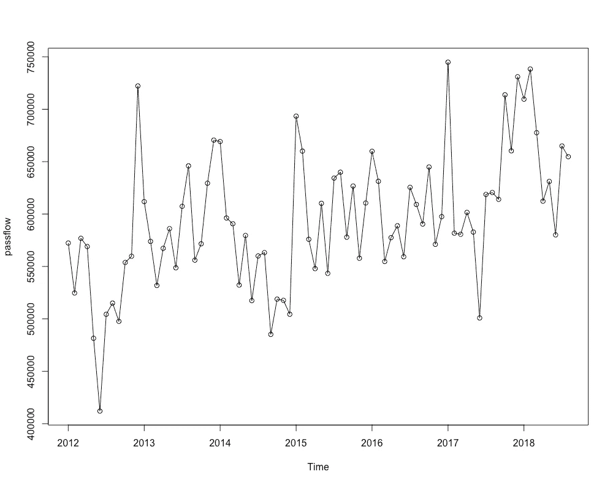
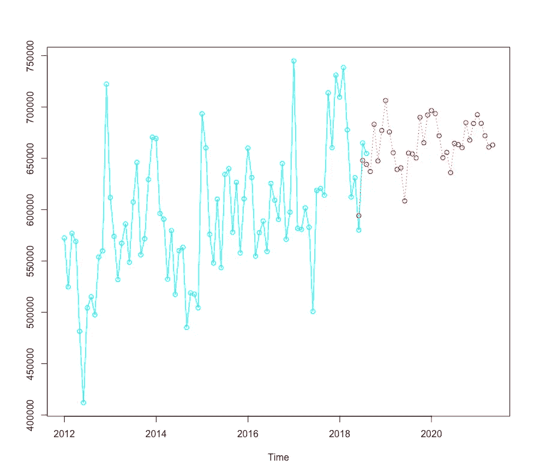
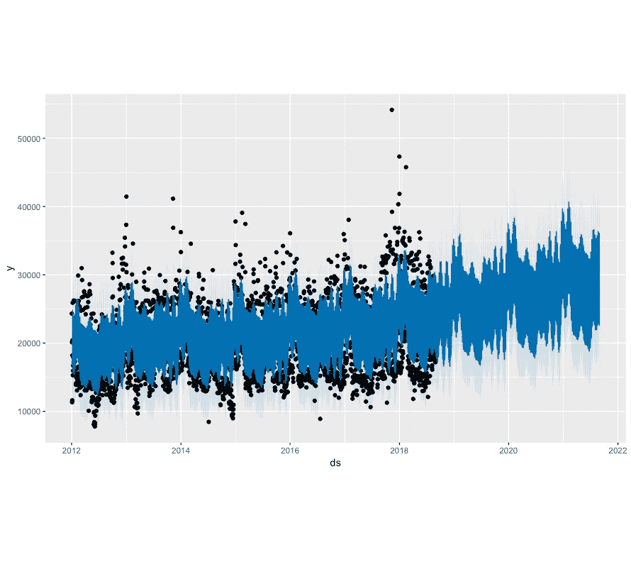
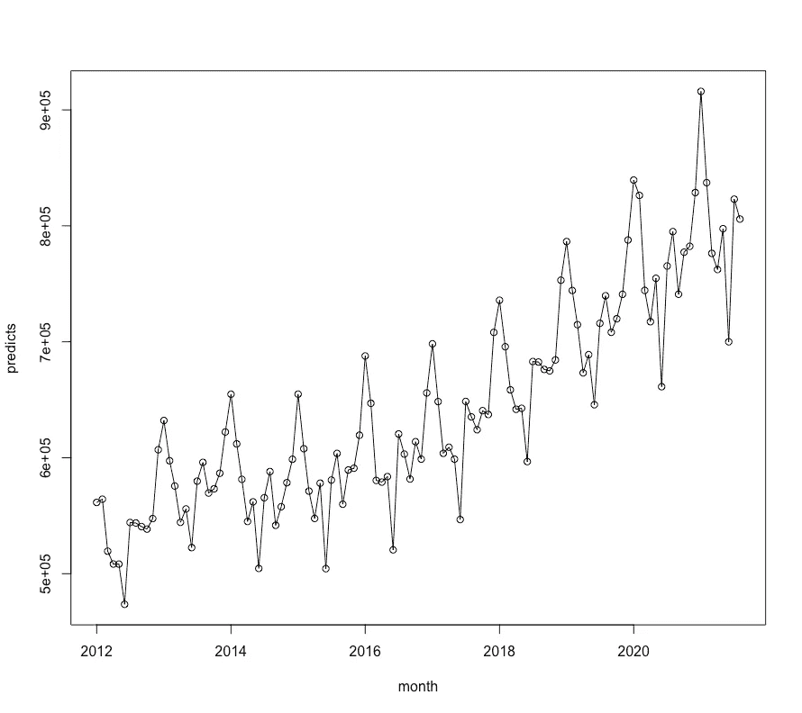
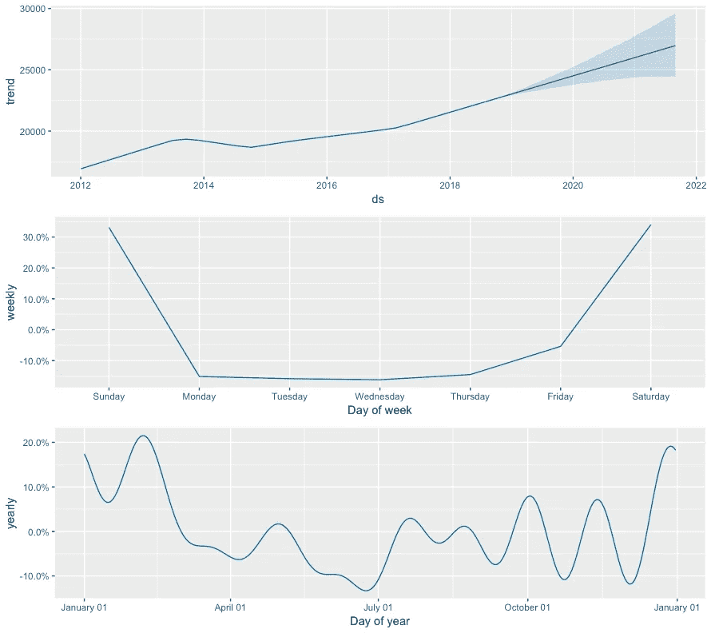
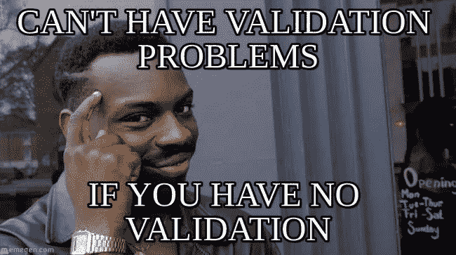

# 使用 ARIMA 和 FBProphet 预测未来客户流入量

> 原文：<https://medium.com/hackernoon/forecasting-future-customer-inflow-numbers-using-arima-and-fbprophet-2f772649ad95>


Peaking into the future

有时候，对于一个企业来说，了解未来的客流量有多大，或者他们能卖出多少产品是很重要的。这有助于更好地为未来做准备，扩大销售和客户服务团队，为未来几年/几个月的可能销售做好充分准备，并确保有需求方资源来应对预计的增长。

Mr Knuckle showing everyone the way

就像我们信任的向导，Knuckles 先生，在上面的 GIF 中，我们可以使用历史数据点来帮助我们理解不仅仅是现在，而是未来——帮助引导我们进入未知。当我们试图只根据时间和价值做出这样的预测时，这就是所谓的时间序列分析。我们首先在时间序列中寻找总体趋势，以了解值是否随着时间的推移而增加或减少。

其次，我们看周期性波动。你可以把这些看作是商业周期中的变化模式。商业周期的持续时间及其性质取决于企业所处的行业。

第三，我们评估我们的时间序列中的季节性趋势，这些是每天、每月或每年发生的振荡-取决于预测的性质。例如，如果我们预测销售额，我们可能会预计冬季销售额较低，夏季销售额达到峰值，这是我们销售周期的季节性趋势，通常会逐年重复。当然，理想情况下，我们希望这些价值每年都越来越高，这样你就可以达到那些花哨的同比增长数字，并向其他企业家炫耀。

最后，当季节性、趋势和周期性波动从我们的时间序列中去除后，我们剩下的是剩余效应或不规则性。您可以将这些视为导致异常高点或低点的不可预测事件。就其本质而言，这些是无系统的，没有明确的模式，但需要纳入我们的预测模型。


NNT and ‘black swans’

**ARIMA**

为了进行这一分析，我选择了一个关于 2012 年至 2018 年客户流量的 [Kaggle 数据集。在这种情况下，客流量是指在规定的时间段内，每天走进中国百货商店(该商店于 2010 年开业)的顾客数量。我的目标是预测未来 3 年的客流量。这大概有助于商店为未来 3 年做好准备。](https://www.kaggle.com/shaclo/retail)

我选择使用回归模型——自回归综合移动平均(ARIMA ),因为该模型相对简单、灵活，并且在预测任务中表现相对较好。

**什么是 ARIMA**

让我们从把首字母缩略词分解成单独的成分 AR、I 和 MA 开始。AR 部分简单讲一下[自相关](https://stats.stackexchange.com/questions/91967/intuition-behind-auto-cross-correlation)——用过去解释现在的数据。我们假设客户流量至少在一定程度上依赖于之前的客户流量，那么您前一天获得的流量将与您今天获得的流量有些相似。通过自相关，我们试图找出多少滞后/时间段能最好地预测我们当前的数字。我们称之为滞后。例如，如果我们发现最佳滞后时间是 4 天，查看前 4 天的值最能告诉我们今天预期的值。

“I”是指使用差分来获得平稳性。平稳性是指时间序列的统计特性，如中位数、方差和相关性在一段时间内保持稳定/恒定。如果明天一切都不一样，那么进行预测就更加困难。对我们来说，找到共同的统计特性以更好地展望未来是很重要的。差分是指我们需要对时间序列本身进行差分(从前一时间步的观测值中减去一个观测值)的次数，以达到平稳性。

当我们尝试使用预测模型预测一个值时，我们的预测和实际值之间会有一个差值。MA 部分可视为这些误差项的集合。在进行预测时，我们希望将这些误差项纳入随机波动/不规则因素。

**实施 ARIMA**

现在有趣的部分来了——实现。根据我的研究，R 似乎最适合实现时间序列预测，所以我选择它来完成我的预测任务。


Using R like a pirate

```
#uploading data series
passflow = read.csv("~/Downloads/passflow-w.csv", header = TRUE)#ensuring that dates are in the right format
passflow <- passflow %>%
  mutate(txdate=as.Date(txdate,format="%Y-%m-%d"))#grouping values in data series by month
cleanpass <- passflow %>%
  mutate(txdate=as.Date(txdate,format="%Y-%m-%d"))%>%
  group_by(floor_date(txdate,"month"))%>%
  summarize(passflow=sum(passflow))#renaming column
colnames(cleanpass)[1] <- "dates"#filtering out the last month 
cleanpass<-cleanpass %>%
  filter(dates < as.Date('2018-09-01'))
```

在加载了相关的库和我的数据集之后，我按月对时间序列进行了分组，消除了查看每日和每周趋势的需要(例如，客户流量是否会在月底达到峰值等)。然后我过滤掉了 2018 年 9 月 1 日之后的日期，因为这是最后一个观察到的月份。我认为这对我的时间序列分析没有价值，因为这是一个不完整的月份。

```
#convert to time series
cleanpasstime <- ts(cleanpass,frequency =12,start=2012)#plotting seasonal means/medians
boxplot(cleanpasstime~cycle(cleanpasstime))
```

使用 [ts 函数，](https://www.statmethods.net/advstats/timeseries.html)我将数据集中的数值转换成时间序列，指定每月的频率和开始日期。这将返回从 2012 年到 2018 年的月值时间序列。

使用箱线图来可视化，我创建了一个可视化的周期，显示了我的时间序列中的月趋势。


Seasonality

平均客户流量在 1 月份达到峰值，6 月份降至最低点，并在下半年逐步上升。没有关于业务性质的进一步背景，很难对这些趋势是由什么引起的做出任何进一步的假设。然而，它确实向我们表明，我的时间序列中需要考虑季节性趋势。

```
#plotting yearly trends
plot(aggregate(cleanpasstime,FUN=mean))
```

然后，我创建了一个年度趋势的可视化，通过查看每年的平均流量值来了解客户流量的总体下降趋势还是上升趋势。


Trend

**平稳性测试**

为了测试平稳性，我使用了扩展的 Dickey-Fuller 测试(ADF)。这是一种单位根检验，通常用于检验时间序列的平稳性。我不会声称对这个测试中进行的计算有深刻的理解，但会对结果进行一个高层次的解释。

```
#Augmented Dickey-Fuller Test to test for stationarity
lapply(cleanpasstime, function(x) adf.test(x[!is.na(x)], 
                                          alternative='stationary'))#### RESULTS ####Augmented Dickey-Fuller Testdata:  x[!is.na(x)]
Dickey-Fuller = -3.9389, Lag order = 4, p-value = 0.01676
alternative hypothesis: stationary
```

使用 ADF，检验统计量越负，就越有理由拒绝数据不稳定的零假设。由于 p 值低于 5 %, ADF 测试假设是稳定的。然而，值得注意的是，由于我选择了滞后订单的默认值，在本例中为 4，ADF 实际上是在测试过去 4 个月的信息是否能最好地解释当前值。然而，这并没有完全考虑季节性因素，季节性因素可能是超过 4 个月滞后期的周期性因素。我们可以再次可视化我们的时间序列，以了解商业周期是什么样子的。



Time series

我可以选择使用[科维亚特科夫斯基-菲利普斯-施密特-申测试](https://en.wikipedia.org/wiki/KPSS_test) (KPSS)来测试我的系列是否围绕均值或线性趋势平稳。在这种情况下，零假设表明我的序列在均值或线性趋势附近是平稳的。然而，我没有，因为我假设时间序列似乎是平稳的，但我愿意重新考虑这一假设。

**培训和测试拆分**

我希望能够测试我的预测的准确性，为了做到这一点，我创建了一个训练和测试数据。测试数据将用于衡量我和 ARIMA 一起训练的模型对观察到的顾客流的预测效果。

```
#training and test 
train_pass = window(cleanpasstime,start = c(2012,1),end=c(2018,5))
test_pass = window(cleanpasstime,start=c(2018,6),end=c(2018,8))
```

**用 ARIMA 预测**

需要调整三个参数来找到最佳的 ARIMA 拟合- p (AR)，q(MA)，d(I)。因为这可能很耗时，所以我选择使用 [auto.arima](https://www.rdocumentation.org/packages/forecast/versions/8.5/topics/auto.arima) 。该函数返回最佳 ARIMA 参数。

```
#finding best values for arima model
vals <- auto.arima(train_pass,stepwise=FALSE,approximation=FALSE,seasonal =TRUE)
#### RESULTS ####
Series: train_pass 
ARIMA(1,1,1)(2,0,0)[12
```

根据 auto.arima，我的模型的最佳参数是(1，1，1)和(2，0，0)以捕捉季节参数。

```
#fitting model and forecasting 
fit <- arima(train_pass,c(1,1,1),seasonal=list(order=c(2,0,0),period=12))
predicts<-predict(fit,n.ahead=3*12)
#plotting predictions agains observations
ts.plot(cleanpasstime,predicts$pred,lty=c(1,3),col=c(5,2),type="o")
```

在添加了规定的参数后，我创建了一个未来 3 年的预测，然后我继续绘制这些值，并确保绘制出我的测试观察值，以大致了解该模型的准确性。



Forecasting with ARIMA

**测试模型精度**

精度功能可用于通过打印多个精度测量值来诊断 ARIMA 模型的拟合度。

```
index <- c(3,5)
arima_forecasts = forecast(vals,h=3*12)
arima_acc<- accuracy(arima_forecasts,test_pass)
arima_acc[, index]
### RESULTS ####
                  MAE     MAPE
Training set 36850.42 6.219505
Test set     13896.83 2.201053
```

为了评估模型拟合，我选择使用平均绝对误差(MAE)和平均百分比误差(MPE)。


Mean Absolute Error

MAE 计算所有观测值的预测值和观测值之间的差异。


而 MAPE 执行相同的计算，但以百分比的形式返回。

对于这两个值，值越低，模型拟合得越好。

如准确度表中所述，MAE 表明，我的预测模型中的平均误差幅度为 13896 个客户，而 MAPE 为 8.6 表明，在我的测试系列中，我的预测平均误差约为 8%。

我可以将其与季节性的简单预测进行比较，以评估 ARIMA 是否比简单预测有所改进。简单预测方法产生的预测相当于上一次观察到的值。季节性天真则更进一步，将季节性因素考虑在内。每次预测都相当于同一季节的最后一次观测值。

```
#seasonal naive
naive <- snaive(train_pass, h=3*12)
naive_acc<- accuracy(naive,test_pass)
naive_acc[, index]
#### RESULTS ####
                MAE      MPE
Training set 52328.46 2.895538
Test set     53218.33 8.611081
```

这在我的测试系列中表现明显更差，进一步验证了我的 ARIMA 模型的拟合度。

**FBProphet**

我的预测问题的一个有趣的替代方案是使用脸书创造的开源软件包，它使预测任务更容易实现。欲了解更多详情，[白皮书](https://peerj.com/preprints/3190.pdf)可供进一步阅读。

fbprophet 的伟大之处在于，它可以自动检测时间序列中的变化点，并允许您考虑每小时、每天、每周、每月、每年的趋势，甚至允许您考虑预定义假日期间的趋势变化，使您的预测更加准确。

```
p <- prophet(passflow,yearly.seasonality = TRUE,seasonality.mode = 'multiplicative')
fut_vals <- make_future_dataframe(p,periods=3*365)
forecasts <- predict(p,fut_vals)
plot(p, forecasts)
```

经过几次尝试，我通过打开年度季节性并将季节性模式设置为乘法得到了最佳模型。这提高了我的模型的准确性，因为季节性随着我的时间序列的趋势而增长，它不是一个恒定的加法。



Forecasts

预测值揭示了趋势、预测上限和下限(最低和最高预测值)。



Forecasted customer flow

我还选择绘制趋势、每日和每年的季节性，以了解潜在的趋势和模型中的其他组件。

```
prophet_plot_components(p,forecasts)
```



从这些图表来看，似乎顾客流量从周四开始增加，一直持续到周末。顾客流量在周末达到高峰，大概是因为人们不在上班或上学时更有可能经常光顾这家商店。从逐月来看，我们看到 12 月至 1 月期间的向上波动和 6 月至 7 月期间的最低客户流量。看起来商店通常在一年的第一和最后一个季度会有更多的客流量。

**交叉验证**



Cross Validation

FBprophet 最大的优点是易于交叉验证。该软件包带有一个简单的交叉验证功能，允许您设置用于评估模型准确性的“测试”时间范围。

```
#cross validation
df <- cross_validation(p,initial=2300,horizon=90,units='days')
index_cv <- c(4,5)
cv_metrics <- performance_metrics(df)
mean(as.matrix(cv_metrics[,index_cv][1]))
mean(as.matrix(cv_metrics[,index_cv][2]))#### RESULTS ####
MAE: 2040.089
MAPE: 0.1134583
```

使用 MAE 和 MAPE 作为评估指标，这个模型似乎比我的 ARIMA 模型表现得更好。

鳍。

欢迎在我的推特账号@Emmoemm 上提出任何批评、反馈、意见或建议