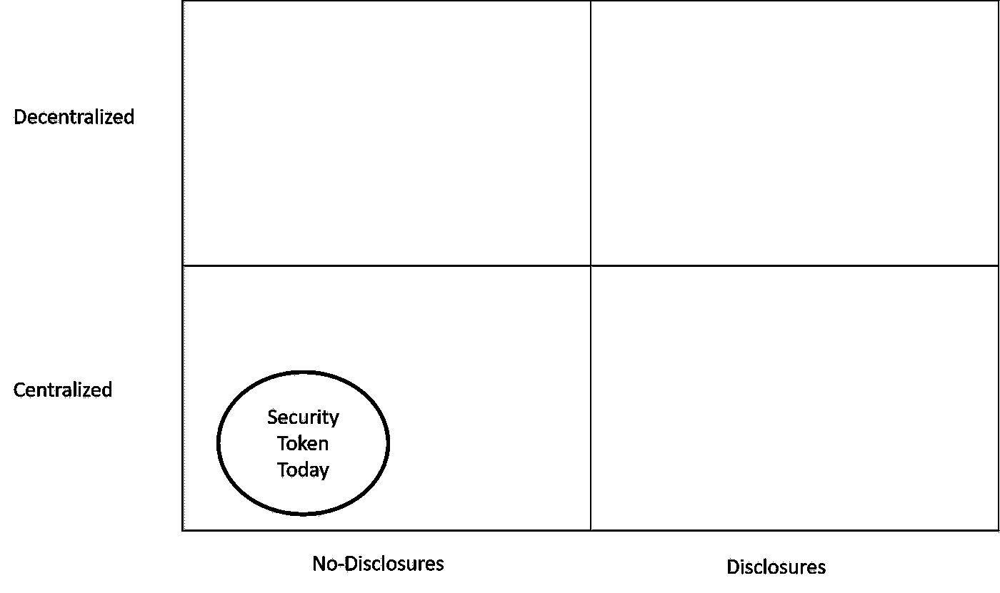
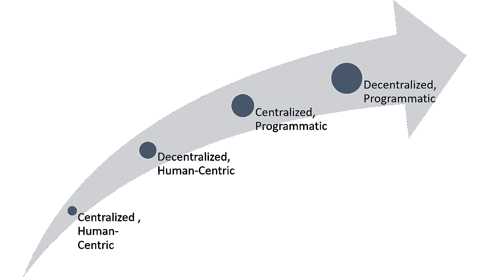
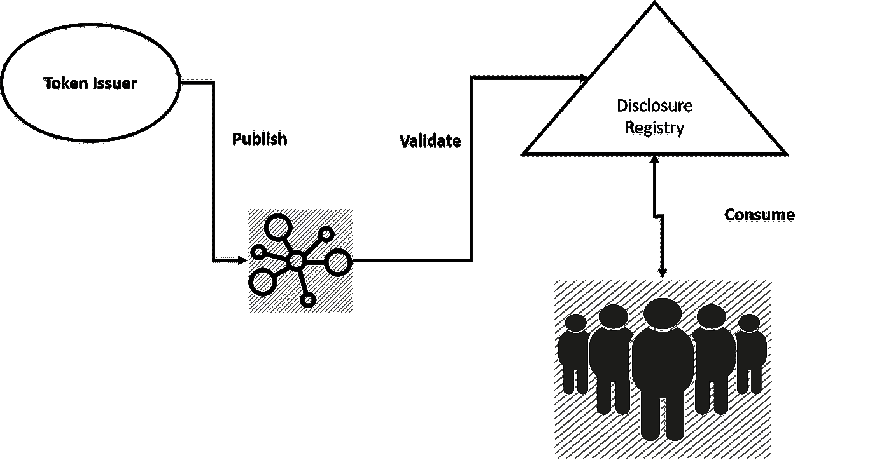
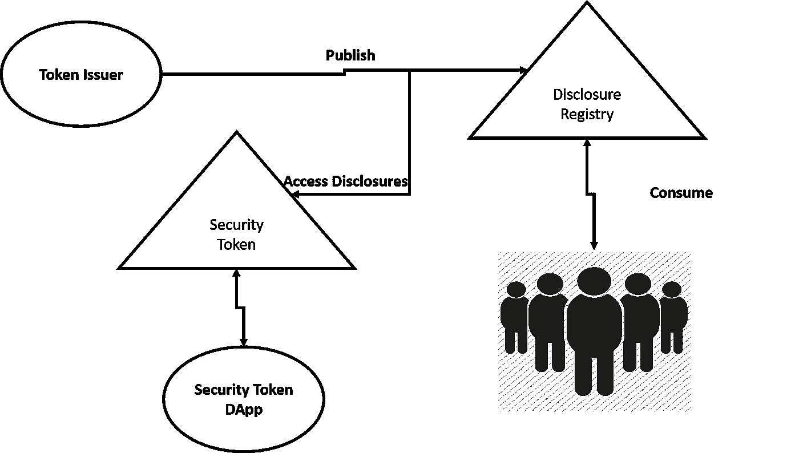
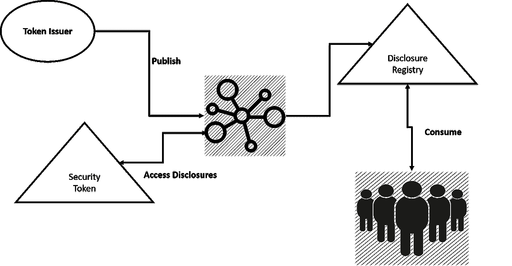

# 实现安全令牌公开的四个想法

> 原文：<https://medium.com/hackernoon/four-ideas-to-enable-disclosures-for-security-tokens-12d865249e6b>

披露仍然是安全令牌行业的生存挑战之一。在一个没有任何活跃数字证券信息的市场中，实现公平交易的机会仍然非常有限，而且随着市场的增长，这种动态会变得更糟。

当涉及到安全令牌时，披露不是唯一解决方案的问题。恰恰相反，有许多模型可以用来为数字证券提供更好的信息流。在过去，[我已经概述了一些关于安全令牌](https://hackernoon.com/about-disclosures-and-information-asymmetry-in-security-tokens-fc83c350548a)中的披露挑战的想法。今天，我想提出四种不同的模型，它们可能有助于解决基本和非常复杂的场景中的这一挑战。

将披露视为信息流问题是很自然的，但我认为当涉及到安全令牌时，这种观点会受到限制。毕竟，加密货币等资产类别也缺乏可信的信息流，它们似乎在不同的市场周期中保持价格公平。

考虑披露挑战的一个更完整的方式是将加密资产市场中的两种现象结合起来:信息不对称和分散化。

# 信息不对称与分权

在经济学中，信息不对称描述了一种市场动态，在这种市场动态中，参与交易的不同方具有与交易相关的不成比例的知识水平。这个术语因诺贝尔奖获得者[乔治·阿克洛夫](https://en.wikipedia.org/wiki/George_Akerlof)在他的论文[“柠檬市场”](https://en.wikipedia.org/wiki/The_Market_for_Lemons)中而出名，他在文中用一个生动的例子来推动一个论点，即买卖双方信息不对称的市场可能永远不会实现公平定价(我以前写过阿克洛夫的理论，所以今天我想用其他例子😉).

不管我们怎么想，信息不对称是不同市场中非常普遍的现象。保险业是知道如何利用不对称信息流的一个典型例子。

多年来，有许多研究表明，在真实市场中，保险和风险发生之间几乎没有正相关关系。对此的一个可能的解释是，个人没有更多关于其风险类型的信息，而保险公司有精算生命表和明显更多的经验。

另一个关于主流市场中不对称信息的基础分析是由经济学家迈克尔·斯彭斯在他 1973 年的论文中发表的，该论文名为[“就业市场信号”](https://msu.edu/~conlinmi/teaching/EC860/signallingscreening/SpenceQJE1973.pdf)。在他的文章中，Spence 将员工建模为公司的“不确定投资”,因为他们无法提前预测自己的生产率。

Spence 提出，双方可以通过让一方发送一个信号，向另一方透露一些相关信息，另一方将解释该信号并相应地调整价格，来解决信息不对称的问题。

与理解信息不对称相关的最后一个理论是由美国经济学家 [Joseph E. Stiglitz](https://en.wikipedia.org/wiki/Joseph_E._Stiglitz) 首创的筛选模型。在几篇研究论文中，斯蒂格利茨提出了使用筛选游戏的想法，这种游戏允许交易中信息较少的各方降低风险。

例如，在我们的就业市场场景中，一个典型的筛选游戏可能是，寻找销售人员的雇主可能会提供一份低基本工资的合同，并在销售完成时以佣金作为补充。

信息不对称是经济市场中许多低效率的根源，在某些情况下，它会成为公平贸易的障碍。一个重要的区别是，信息不对称在集中或分散的生态系统中表现不同。在集中的环境中，少数几方能够获得交易的所有相关信息，信息不对称的负面影响因信息流动受限而加剧。

然而，在大型分散市场中，参与者的行为减轻了信息不对称的脆弱性。实际上，在充分分散的生态系统中，价格公平是通过网络参与者的行为实现的，而不是通过信息流实现的。在一个分散的生态系统中，任何不公平的行为都会被其他网络参与者平衡，而不必依赖于一个集中的权威。从这个意义上说，信息披露在一个足够分散的生态系统中不如在集中的市场中重要。

如果在信息不对称和分散向量的背景下考虑安全令牌，我们会发现一个可怕的画面。数字证券不仅在其交易模式方面相当集中，而且在信息流方面非常不对称，这使得它非常容易受到市场操纵。

# 解决安全令牌泄露问题的四种模式

安全令牌的公开挑战是一个需要在多个阶段解决的问题。在像数字证券这样不成熟、低效的市场中，披露模式需要与数字资产本身的复杂性同步发展。在中短期内，我们可以模拟四种增量解决方案，以支持数字证券的披露。

## 集中的、以人为中心的披露

这是一种传统模式，在这种模式下，信息提供者(如令牌发放者)将相关信息发布到一个中央存储库，令牌持有者和其他相关方可以访问该存储库。

该模型假设对信息发布者的内在信任，并集中获取披露信息。此外，这些披露旨在供代币持有者使用，以便做出未来的投资决策。

## 分散的、以人为中心的披露

该模型通过分散信息验证，代表了对以前架构的增量改进。与前面的动态类似，令牌发行者或其他信息提供者将发布关于特定数字证券的重要信息。

然而，这种模型将依赖于一个验证者网络，以在令牌持有者获得信息之前断言信息的正确性。该模型保持了以人为中心的公开消费，但引入了一个去中心化的验证向量。

## 集中、程序化的披露

该模型将披露转换为可直接用于区块链应用的可编程协议。这一概念背后的主要思想是，披露不仅可以被人类使用，还可以通过协议级别的程序交互来使用。

在这个模型中，安全令牌将以编程方式访问和分发可能影响特定交易结果的披露。信息流仍然是集中的，主要由发行者控制，但是交互从人转移到了应用程序。

## 分散的、程序化的披露

可以说，这是安全令牌公开的最终表现形式，该模型提出了信息发布的程序化和去中心化交互。在这种模式下，信息提供者将通过一个公开协议分发相关信息，然后由网络中的其他节点进行验证。

解决安全令牌的公开挑战将是一个漫长而反复的过程，但我们需要从某个地方开始。数字证券市场在没有任何信息流的情况下发展的时间越长，效率低下的问题就会越严重，最终可能无法解决。希望本文中概述的一些想法将有助于实现安全令牌的第一代公开模型。