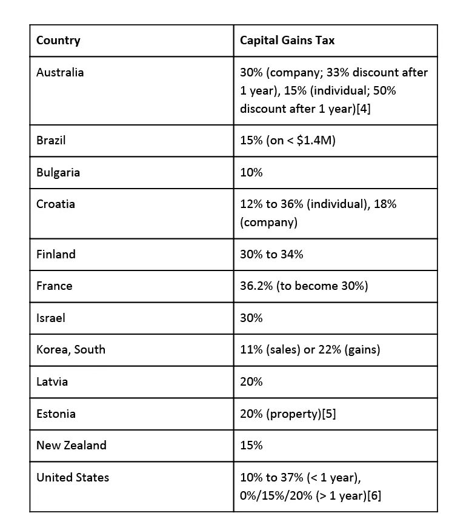

# 从 0%到 55%:全球加密货币税收简要指南

> 原文：<https://medium.com/hackernoon/from-0-to-55-a-brief-guide-to-cryptocurrency-taxation-around-the-world-f3953cd74e58>

加密税长期以来一直是加密社区中激烈争论的话题。尽管目前 crypto 正处于熊市之中，但总市值仍超过 1000 亿美元。有了这样的数字，毫不奇怪，国家当局正在寻求紧急收回对基本上躲避他们的基金的控制权。

令人困惑的是，尽管有许多国际会议和论坛，但仍没有统一的方法来定义什么是加密货币，以及各国如何制定对加密货币征税的共同政策。这部分是由于用户的匿名性，部分是由于虚拟货币规避传统金融机构的野心。

> 截至目前，大约 25%的国家存在关于加密货币税收的官方监管(尽管在某些情况下有些复杂)(见上图)。

虽然每个国家都在以自己的方式前进，但不同的税收方法可以分为三大类。这种差异是由于一个国家对加密货币的判断，这影响了用户在处理货币时的行为如何被解释。

# 阵营 1:所得税

超过一半的加密监管早期采用者将虚拟货币视为个人或公司收入的来源，对其征税类似于来自就业、生产和商业的资金。在大多数情况下，开采或交易加密货币的收入被定义为“其他活动”。要被视为收入，加密货币交易必须是以盈利为目的的支付形式。

> 对加密货币征收所得税的地方包括大多数欧盟国家以及一些拉丁美洲和亚洲国家。

以下是大多数秘密热点的所得税税率。虽然加密货币的使用方式会对税收类型和支付金额产生影响，但在引入特殊的独立制度之前，该表至少提供了一个参考。

从这一概述中，出现了一些关于加密活动的有税收吸引力的管辖区。这些国家包括列支敦士登和三个东欧国家——罗马尼亚、匈牙利和立陶宛——所有这些国家对个人和组织都实行简单而有利可图的统一所得税税率。没有联邦和地方税的累积，没有令人困惑的累进税率，也没有财富和监管收入方面的复杂问题。

这对这些国家的加密投资者和交易员来说是个好消息。

# 阵营 2:资本利得税

第二种最流行的方法是将利润视为资本收益。这一选择背后的想法是，加密货币通常是为了持有或交易而获得的，类似于股票、债券、房地产和其他形式的个人财产。因此，它们可以随时间升值或贬值。只有当加密货币的售价高于最初的购买价格时，这种活动才被视为资本利得征税。

通常，财产和资本收益比收入获得更优惠的税收待遇，有时甚至达到免税地位(例如，如果法律没有将它们归类)。

**下面的列表包括使用与加密相关的资本收益税的国家。**

快速看一下上表，就其秘密税法的简单性和吸引力而言，东欧又是一个突出的例子。那个国家是保加利亚。早在 2014 年，保加利亚的官方立场一直是，出售加密货币相当于出售任何其他金融资产。有了这一明确的区分，10%的统一税率就适用了。没有累进税或任何其他额外费用。

# 阵营 3:混合税方法

一些国家不符合上述分类，要么是因为加密货币的特定定义，要么是因为处理加密货币的混合或有争议的方法。以下是这个阵营中最值得注意的 5 个例子:

**1。新加坡。**如果正在交易数字货币，其利润需要缴税，但如果利润是长期投资，则不需要缴税。作为投资交易，加密货币的损益被视为资本收益；但作为一种非财产类型的资本收益，它们是免税的。

**2。瑞典。**从个人的角度来看，出售或交换加密货币会引发资本利得税。如果他们是作为股票持有，任何收益都被视为业务经营的收入。采矿要么作为就业收入征税，要么作为商业经营收入征税。

**3。英国。**英国从收入和资本收益两个角度解读加密货币。例如，以虚拟货币支付的员工不仅需要缴纳个人所得税，还需要缴纳相关的社保。如果用于交易，它们被视为资本收益。

**4。奥地利。**出于税收目的，加密货币属于应缴纳所得税的活动清单中的“其他商业资产”类别(最高 55%——取决于收入水平)。从事加密货币交易的公司必须缴纳 25%的企业所得税。然而，如果进行利润分配，总税率(连同资本收益)可能在 46%左右。

**5。希腊。**尽管该国仍在接受加密货币的道路上，但它已经规定加密货币可以以两种方式征税，即资本收益和收入。就公司而言，从开采或交易虚拟货币中获得的任何商业活动或资本收益都会触发 29%的统一税率。就个人而言，有一个分裂:资本收益的税率为 15%，而个人收入的税率为 22%至 45%。

# 今晚的特别嘉宾

再次向东欧致敬。白俄罗斯不属于上述任何一个“阵营”，但它作为一个加密避税天堂吸引了全球的关注:采矿和加密货币业务的收入在 2023 年前都是免税的。此外，加密货币交易所等企业可以受益于低得令人难以置信的 1%的营业额税率，直到 2049 年，前提是它们在首都明斯克郊区的高科技园区运营。

# 克服困惑

国家累进税制的复杂性，加上记录和计算交易历史上所有损益的耗时程序，可能是一场真正的噩梦，除非实现自动化。然而，一旦行动顺序和税收计算公式设置到位，一切都可以通过人工智能的应用实现自动化，从而成为一次点击程序。
早期采用该系统的一个例子是 [ORS 密码猎犬](http://c-hound.ai/)的报表小工具，它记录持有的密码资产的历史价值，并生成类似银行的报表，可以参考这些报表填写纳税申报表。一些进一步的应用程序间集成甚至可以在截止日期前完全自动化所有需要的报告信息的计算和归档。

# 摘要

加密货币税远未得到普遍认可，但这类似于正常的税收，因国而异。

> 尽管如此，几乎全世界都在这一领域开创了某种形式的政策，将加密货币视为收入来源或产生资本收益的资产。

虽然方法不同，而且在大多数情况下都是指现有的税收制度，但时间会证明哪种方法最有效。只有在这之后，全球的榜样才会被树立。

截至目前，全球领先的加密监管机构(如美国、加拿大、澳大利亚)拥有相当复杂的税务处理系统，而一些东欧国家(罗马尼亚、匈牙利、立陶宛、白俄罗斯)在简单性和有吸引力的税率方面无疑是赢家(取决于你是谁)。至少目前是这样…

—

免责声明:以上信息是在撰写本文时从公开来源收集的，并不构成任何形式的专业或其他建议。如果您发现任何不准确之处或想要分享更新，请发表评论或通过电子邮件联系我们，电子邮件地址为***comms @ c-hound . ai****。感谢您的任何反馈。*