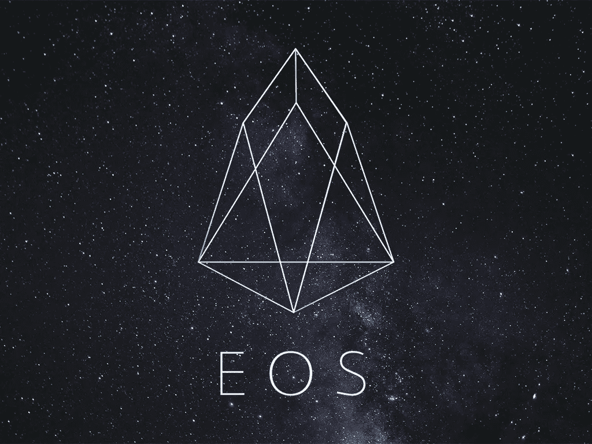
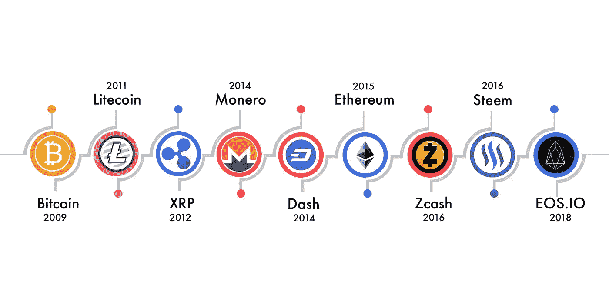

# 从加密到 Dapp

> 原文：<https://medium.com/hackernoon/from-crypto-to-dapp-9a81b958ec41>

快速浏览加密货币从 P2P 到 Dapps 的演变。

自 20 世纪 90 年代末以来，人们就一直在争论和研究使用加密技术来创造电子货币的概念。塞弗朋克们非常热衷于去除机构中的权力并将权力赋予人民的可能性和概念，他们孜孜不倦地寻求将这一梦想变为现实的方法。然而，他们花了近十年的时间来解决阻碍梦想成真的最重要的问题，即如何确保货币不会被花掉两次。

快进到 2008 年，全世界都知道密码学家，因为中本聪在 2009 年以开源软件的形式与我们分享了比特币。一种分散的货币，使用区块链来确认转账，摆脱了央行和政府的控制，网络朋克的梦想成真了。比特币拥有一个分布式账本，由运行比特币软件的用户和矿工共享，可以确认和更新区块链，从而解决重复支出的问题。

# 比特币的麻烦

自那以后，比特币震撼了世界，兴奋的加密社区期待实现其实际潜力。与此同时，至今没有人知道他、她或他们是谁的中本聪藏起了 2100 万枚比特币中的 5%，从未被转移过。很有可能我们永远不会知道中本聪的身份，因为如果创造者被揭露，他们可能会因支持恐怖主义和犯罪而受到审判。具有讽刺意味的是，由于比特币分发了账本，它帮助美国联邦调查局关闭了主要的在线黑市网站“丝绸之路”。

比特币并不完美，需要做更多的工作来让它变得有价值。它每秒只能进行 7 笔交易，无法与 Visa Network 每秒 1 万笔的交易相竞争，而且由于政府对比特币的监管不力，因此需要解决方案。因此，我们开始了替代加密货币的竞赛，基于诞生比特币的原始开源软件，或被公正地称为替代货币。

# 替代硬币:更快、更安全、更强大

替代硬币以各种形式出现，每种新的加密技术都将其能力添加到比特币原始开源代码中。莱特币是继比特币之后的第一个 Altcoin，目的是比比特币更快。然而，RippleNet 上使用的本地加密货币 Ripple (XRP)的编码目标与比特币和莱特币一样，都是在公司网络内每秒进行更多的交易。旨在商业网络内运作的更快和更安全的交易的呼吁引起了金融机构的注意，它们渴望简化其国内和国际交易程序。Ripple 的唯一缺点是，要进行交易，需要 Ripple 来运行流程。因此，每个机构总是需要钱包里有充足的钱来提供服务。

Zcash、Dash 和 Monero 通过增加每秒交易量来提高比特币的能力，并增加了额外的功能，允许任何人都无法说出硬币的数量、来源或目的地。本质上，分散的分类账是隐藏的，因此硬币的过去和现在的所有者和交易的所有信息都是私人的。这些货币允许其用户更快、更谨慎地进行点对点交易，而不用担心自己的信息被泄露或被他人读取。

# 达普斯来了

然后我们来到以太坊，向去中心化的应用发展，或者我们更熟悉的 dapps。Vitalik Buterin 是以太坊区块链的创始人或牧师(取决于你和谁说话)。2015 年推出的以太网走了一条与大多数加密货币不同的路线，特别是远离点对点交易。在 Ether 的开源代码中，Vitalik 嵌入了一个在区块链中运行的计算机代码或“智能合同”。这些智能合同本质上是必须在以太坊网络内执行的命令，使用以太作为“燃料”或“气体”来完成任务。现在，开发人员可以将他们完成的应用程序存储在分散的账本中，并允许用户向它发送命令，因此 Dapp 诞生了。

以 [CryptoKitties](https://www.dapp.com/dapp/CryptoKitties) 为例，一个以太坊区块链 Dapp，每个 Kitty，交易，Kitty 家谱都存储在去中心化的账本里。如果玩家想要繁殖、交易或出售小猫，需要一些乙醚或燃料来完成操作。

开发人员吃饭、睡觉、呼吸以太坊，因为当他们创建一个成功的 dapp 时，每当有人使用他们心爱的作品时，他们就会得到奖励。一个聪明的开发者一旦创建了 dapp 就永远不会停止，并且随着时间的推移，他们会煞费苦心地尝试删除浪费的应用程序，以提高速度并减少运行 dapp 命令所需的“气体”。然而，如果太多的用户在任何一个 dapp 上，它会降低以太坊网络的速度，dapp 本身的功能也会降低到爬行。

# 混合 Dapp 解决方案

为了绕过这个问题，一些以太坊 Dapps 已经混合了像 [Gods Unchained](https://www.dapp.com/dapp/Gods-Unchained/) 第一个区块链电子竞技。游戏类似于暴雪的炉石，CD Project Red 的 Gwent，还有《魔法:聚会》。它同时应用区块链给他们有限的卡带来真正的价值，并让区块链去管理比赛。使用这种方法，他们有效地将数字扑克牌的所有权给予了玩家，并赋予了扑克牌真正的货币价值，这与当前基于数字游戏内货币的游戏的情况相反。

# 新的 Dapp 可能性

然而，现在 Dapps 有了一个不同的平台，可以提供更多， [EOS。IO](https://eos.io/faq) 采用 [EOS](https://coinmarketcap.com/currencies/eos/) 的区块链技术的最新进展。区块链模拟了一台真实的计算机，从 CPU 和 GPU 到 RAM 和硬盘，在 EOS 持有者之间分配资源。EOS。IO 为构建健壮而复杂的应用程序提供了终极平台，具有分散式分类帐、智能合同、无用户费用以及每秒处理数百万次事务的潜力等所有优势。在线上有许多运行 EOS 的 dapp，有像 [Karma](https://www.karmaapp.io/) 这样有趣的社交媒体 dapp，在那里你可以为每一件好事获得积分，对于音乐家来说，有[为艺术家之间的合作而设计的](https://emanate.live/)。EOS 可以很好地、真正地挽救 dapps，使其免于失去吸引力，并可能为世界提供具有分散技术全部好处的替代方案。

# 古怪的硬币

最后， [Steem](https://steem.com/) 也应该出现在进化树中，但不是作为 dapps 本身的改进，而是作为一种可以包含在社交媒体网络中的加密货币，将其置于以太坊和 EOS 之间。它仍然专注于点对点转移，在交易上比比特币和以太坊更快，没有交易费。然而，代码中嵌入了大脑证明，这是一种象征性的奖励算法，旨在鼓励用户创造和关注他们的内容。每一个“赞”和“支持票”，作者都会因此获得奖励。当应用于社交媒体时，社区可以自我维持并从中成长。在 [Steemit](https://steemit.com/) 上试一试吧。

# 接下来会发生什么

谈到加密货币和下一个重大改进，未来是非常不可预测的。一些替代硬币使用类似的概念，但用于不同的目标，例如，以太坊嵌入了可以运行 dapps 的智能合同，但 Steem 选择嵌入包含算法的大脑证明。TRON 似乎是 dapp 领域最雄心勃勃的项目之一，2018 年下半年启动了 20 亿美元的 Genesis 项目，他们还在 TronArcade 上花费了 1 亿美元来推广其 dapp 生态系统。尽管如此，每一种新的加密货币都添加了自己的创新理念，在已经完成的基础上进行改进，请记住，这一演变仅发生在十年内。

*现在我们问我们的社区，你认为加密货币的下一步发展会是什么？*

来源:[财富](http://fortune.com/2017/10/02/bitcoin-sale-silk-road/)，[经济学家](https://www.economist.com/technology-quarterly/2018/09/01/from-one-cryptocurrency-to-thousands)，[经济学家 2](https://www.economist.com/technology-quarterly/2018/09/01/satoshi-nakamoto-bitcoins-enigmatic-creator) ，[经济学家 3](https://www.economist.com/technology-quarterly/2018/08/30/what-to-make-of-cryptocurrencies-and-blockchains) ，[经济学家 4](https://www.economist.com/technology-quarterly/2018/09/01/how-to-put-bitcoin-into-perspective) ，[比特币市场杂志](https://www.bitcoinmarketjournal.com/top-10-altcoins/)，[比特币杂志](https://bitcoinmagazine.com/guides/what-ripple/)，[比特币杂志 2](https://bitcoinmagazine.com/guides/what-ether/) ，[诸神被解放](https://godsunchained.com/)，[史蒂夫·弗洛伊德](/eostribe/eos-dapp-ecosystem-450fb6dac39e)