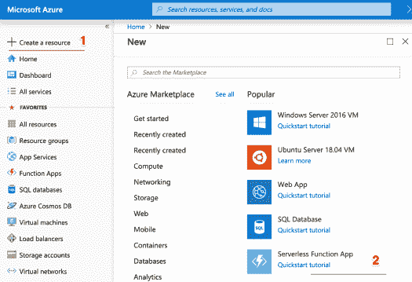
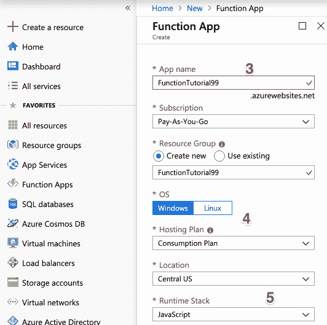
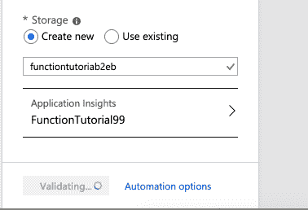
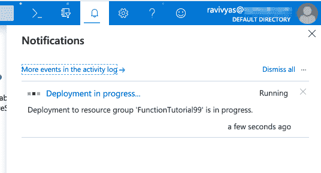
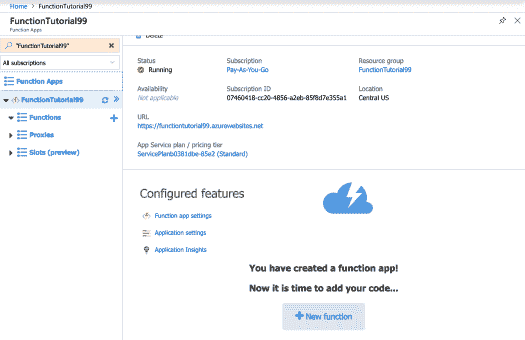
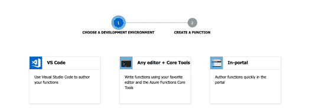
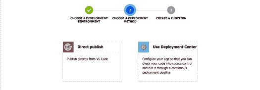
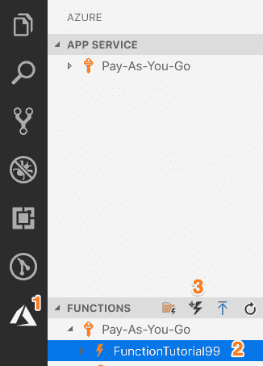
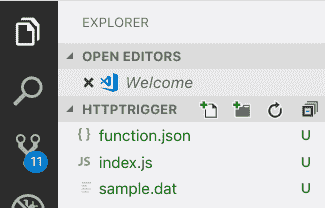

# Azure 函数及其扩展 Superpower 入门

> 原文：<https://medium.com/hackernoon/getting-started-with-azure-functions-and-their-extensions-superpower-b4bc1bb29865>

*这是我的“* [*天蓝色之旅*](https://ravivyas.com/tag/journey-with-azure/) *”系列*的一部分

我一直对托管服务和无服务器计算着迷。它始于我的第一个创业公司 PureMetics，在那里我们使用 AppEngine 和 BigQuery 建立了一个分析产品。因为 AppEngine 和 BigQuery 都是完全托管的服务，所以一个人([第一步。创建新的函数资源](https://medium.com/u/d44137f3e18c#、JS、Java、Python)编写 Azure 函数，然后这些语言为你提供了使用 Visual Studio、Visual Studio 代码、Azure 门户或任何其他编辑器来编写它的选项。对于本教程，我将使用 VSCode 和 JavaScript 来构建我的函数。</p><h1 id=)

[前往 Azure 门户，选择创建资源(1)，然后选择无服务器功能应用(2)](https://medium.com/u/d44137f3e18c#、JS、Java、Python)编写 Azure 函数，然后这些语言为你提供了使用 Visual Studio、Visual Studio 代码、Azure 门户或任何其他编辑器来编写它的选项。对于本教程，我将使用 VSCode 和 JavaScript 来构建我的函数。</p><h1 id=)

[](https://medium.com/u/d44137f3e18c#、JS、Java、Python)编写 Azure 函数，然后这些语言为你提供了使用 Visual Studio、Visual Studio 代码、Azure 门户或任何其他编辑器来编写它的选项。对于本教程，我将使用 VSCode 和 JavaScript 来构建我的函数。</p><h1 id=)

[接下来，下一个刀片你可以命名你的应用程序(3)，选择订阅(计费帐户)和托管计划和操作系统等。这些都是重要的选择。比如 Python 只在 Linux 上可用，Linux 只在少数地区可用。这里重要的选项是托管计划(4)。这里有两个选项:](https://medium.com/u/d44137f3e18c#、JS、Java、Python)编写 Azure 函数，然后这些语言为你提供了使用 Visual Studio、Visual Studio 代码、Azure 门户或任何其他编辑器来编写它的选项。对于本教程，我将使用 VSCode 和 JavaScript 来构建我的函数。</p><h1 id=)

[](https://medium.com/u/d44137f3e18c#、JS、Java、Python)编写 Azure 函数，然后这些语言为你提供了使用 Visual Studio、Visual Studio 代码、Azure 门户或任何其他编辑器来编写它的选项。对于本教程，我将使用 VSCode 和 JavaScript 来构建我的函数。</p><h1 id=)

1.  [消费计划:这里你只需为你的函数运行的次数付费](https://medium.com/u/d44137f3e18c#、JS、Java、Python)编写 Azure 函数，然后这些语言为你提供了使用 Visual Studio、Visual Studio 代码、Azure 门户或任何其他编辑器来编写它的选项。对于本教程，我将使用 VSCode 和 JavaScript 来构建我的函数。</p><h1 id=)
2.  [应用服务计划:在这里，你的功能运行在一个应用服务上的专用虚拟机上，这将需要额外的费用，但在一些情况下会很有用，这里记录了。](https://medium.com/u/d44137f3e18c#、JS、Java、Python)编写 Azure 函数，然后这些语言为你提供了使用 Visual Studio、Visual Studio 代码、Azure 门户或任何其他编辑器来编写它的选项。对于本教程，我将使用 VSCode 和 JavaScript 来构建我的函数。</p><h1 id=)

[如果你刚刚开始使用 Azure 功能，消费计划是一个不错的选择。](https://medium.com/u/d44137f3e18c#、JS、Java、Python)编写 Azure 函数，然后这些语言为你提供了使用 Visual Studio、Visual Studio 代码、Azure 门户或任何其他编辑器来编写它的选项。对于本教程，我将使用 VSCode 和 JavaScript 来构建我的函数。</p><h1 id=)

[最后，选择运行时堆栈(5)，对于本教程，我选择了 Javascript。](https://medium.com/u/d44137f3e18c#、JS、Java、Python)编写 Azure 函数，然后这些语言为你提供了使用 Visual Studio、Visual Studio 代码、Azure 门户或任何其他编辑器来编写它的选项。对于本教程，我将使用 VSCode 和 JavaScript 来构建我的函数。</p><h1 id=)

[按创建，这将需要一段时间。门户将首先验证事情，然后关闭刀片。别担心，这很正常。](https://medium.com/u/d44137f3e18c#、JS、Java、Python)编写 Azure 函数，然后这些语言为你提供了使用 Visual Studio、Visual Studio 代码、Azure 门户或任何其他编辑器来编写它的选项。对于本教程，我将使用 VSCode 和 JavaScript 来构建我的函数。</p><h1 id=)

[](https://medium.com/u/d44137f3e18c#、JS、Java、Python)编写 Azure 函数，然后这些语言为你提供了使用 Visual Studio、Visual Studio 代码、Azure 门户或任何其他编辑器来编写它的选项。对于本教程，我将使用 VSCode 和 JavaScript 来构建我的函数。</p><h1 id=)

[您将需要弹出一个通知，说明部署正在进行中。](https://medium.com/u/d44137f3e18c#、JS、Java、Python)编写 Azure 函数，然后这些语言为你提供了使用 Visual Studio、Visual Studio 代码、Azure 门户或任何其他编辑器来编写它的选项。对于本教程，我将使用 VSCode 和 JavaScript 来构建我的函数。</p><h1 id=)

[](https://medium.com/u/d44137f3e18c#、JS、Java、Python)编写 Azure 函数，然后这些语言为你提供了使用 Visual Studio、Visual Studio 代码、Azure 门户或任何其他编辑器来编写它的选项。对于本教程，我将使用 VSCode 和 JavaScript 来构建我的函数。</p><h1 id=)

[旁注:你开始注意到的一件事是 Azure Functions 提供的选项/灵活性。你也会在下一步看到。
一旦部署完成，转到 Functions 资源，您将看到下面的屏幕](https://medium.com/u/d44137f3e18c#、JS、Java、Python)编写 Azure 函数，然后这些语言为你提供了使用 Visual Studio、Visual Studio 代码、Azure 门户或任何其他编辑器来编写它的选项。对于本教程，我将使用 VSCode 和 JavaScript 来构建我的函数。</p><h1 id=)

[](https://medium.com/u/d44137f3e18c#、JS、Java、Python)编写 Azure 函数，然后这些语言为你提供了使用 Visual Studio、Visual Studio 代码、Azure 门户或任何其他编辑器来编写它的选项。对于本教程，我将使用 VSCode 和 JavaScript 来构建我的函数。</p><h1 id=)

[继续点击新功能。根据您选择的选项，您将看到不同的选项。对于我选择的选项，我看到以下内容](https://medium.com/u/d44137f3e18c#、JS、Java、Python)编写 Azure 函数，然后这些语言为你提供了使用 Visual Studio、Visual Studio 代码、Azure 门户或任何其他编辑器来编写它的选项。对于本教程，我将使用 VSCode 和 JavaScript 来构建我的函数。</p><h1 id=)

[](https://medium.com/u/d44137f3e18c#、JS、Java、Python)编写 Azure 函数，然后这些语言为你提供了使用 Visual Studio、Visual Studio 代码、Azure 门户或任何其他编辑器来编写它的选项。对于本教程，我将使用 VSCode 和 JavaScript 来构建我的函数。</p><h1 id=)

[在本教程中，我将再次选择 VS 代码，发布时我会看到两个选项，使用 VS 代码发布或通过部署中心发布。我将选择直接发布](https://medium.com/u/d44137f3e18c#、JS、Java、Python)编写 Azure 函数，然后这些语言为你提供了使用 Visual Studio、Visual Studio 代码、Azure 门户或任何其他编辑器来编写它的选项。对于本教程，我将使用 VSCode 和 JavaScript 来构建我的函数。</p><h1 id=)

[](https://medium.com/u/d44137f3e18c#、JS、Java、Python)编写 Azure 函数，然后这些语言为你提供了使用 Visual Studio、Visual Studio 代码、Azure 门户或任何其他编辑器来编写它的选项。对于本教程，我将使用 VSCode 和 JavaScript 来构建我的函数。</p><h1 id=)

# [安装各种依赖项](https://medium.com/u/d44137f3e18c#、JS、Java、Python)编写 Azure 函数，然后这些语言为你提供了使用 Visual Studio、Visual Studio 代码、Azure 门户或任何其他编辑器来编写它的选项。对于本教程，我将使用 VSCode 和 JavaScript 来构建我的函数。</p><h1 id=)

[这将为您提供安装以下依赖项的步骤](https://medium.com/u/d44137f3e18c#、JS、Java、Python)编写 Azure 函数，然后这些语言为你提供了使用 Visual Studio、Visual Studio 代码、Azure 门户或任何其他编辑器来编写它的选项。对于本教程，我将使用 VSCode 和 JavaScript 来构建我的函数。</p><h1 id=)

*   [Visual Studio 代码](http://bit.ly/2CuVaVw)
*   [NodeJS & NPM](http://bit.ly/2TXZoiB)
*   [Azure 功能核心工具](http://bit.ly/2U4WEQl)哪些需要[。网芯 2.1](http://bit.ly/2Yb8oQy)
*   用于 VS 代码的 Azure 功能，一旦安装完毕，你还需要登录 Azure。

# 步骤 3:VS 代码入门

一旦它们都安装好了，我们需要转移到 VS 代码来开始。在 VS 代码上打开 Azure 面板(1)，你会看到一个功能部分，有你的订阅计划和功能计划，选择它(2)



最后，单击新功能按钮(3)。现在，VSCode 将首先询问您一个位置，然后将要求您初始化项目，是显然的选择。VScode 将引导您通过向导创建您的函数应用程序，

1.  选择语言— Javascript
2.  选择函数模板——因为我们刚刚开始，所以选择最简单的 HttpTrigger
3.  选择提供的默认名称 *HttpTrigger*
4.  授权级别将是匿名的
5.  最后，将它添加到您选择的工作区

现在，请记住触发器是导致函数运行的事件，我们稍后将更深入地研究触发器。下一个 VSCode 将打开函数文件 index.js，如果您没有看到像我下面看到的文件夹，请打开您在上面的步骤中创建的文件夹


现在，您应该会看到这样的文件夹



两个重要的文件是 *index.js* 中的函数代码和 *function.json* 文件，它们定义了这个函数的绑定。

# 索引. js

这是你的函数代码。该函数的参数根据您使用的触发器类型而有所不同。HTTP 触发器将有一个上下文对象和一个请求对象。Azure 函数使用上下文对象与您的函数进行通信。例如，如果您有一个输出绑定，您可以使用 *context.bindings. <绑定名称>通过上下文对象引用它。*

在 http 触发器的情况下，我们也获得 HTTP 请求作为参数。

# 函数. json

这个 Json 文件定义了函数的输入和输出绑定。在我们的例子中，它们都是 HTTP 绑定。稍后将详细介绍绑定。

# 运行功能

要运行您的函数，请按 F5，您在 VSCode 中的控制台将显示如下内容


如果您在没有任何请求参数的情况下调用 URL，您将得到以下消息


只需传递一个名称作为 get 参数，像这样:[http://localhost:7071/API/http trigger？name=Ravi](http://localhost:7071/api/HttpTrigger?name=Ravi)


# 教程起作用了，接下来呢？

函数擅长在事情发生时做一些事情，一个触发器。它们是从事特殊工作的微服务或工人的理想选择。这里有几个例子

1.  使用定时器触发器每 24 小时触发一次 API，并将响应存储在一个表中，例如，您可以触发 Nasa 近地天体 Web 服务，以获取每天近地天体的数量
2.  使用一个 HTTP 触发器用一些参数访问一个 API，并将响应存储在队列中，用另一个函数处理它
3.  读取日志文件并将错误事件传递到队列中进行处理
4.  使用 HTTP 触发器将 upvote 传递给队列，然后使用函数以异步方式递增投票
5.  将个人资料图片存储在存储器中，并使用存储触发功能来生成缩略图并存储它

# 深入探究触发器和绑定

最简单的触发器是触发函数启动的事件。他们可能还带着信息。正如我们在上面看到的，http 触发器将 HTTP 请求数据传递给你的函数，队列触发器将对象从队列中取出。它们作为参数传递给函数。因此，一个函数只能有一个触发器，但可以有多个输入绑定。

# 什么是绑定？

绑定允许您的函数连接到各种资源，而无需为服务编写大量代码。如果没有绑定，你将需要添加你想要使用的服务的 SDK，为它编写所有的模板，然后开始使用它，有了绑定，Azure 函数将为你完成繁重的工作。如上所述，您可以通过上下文对象使用绑定。

# 声明触发器和绑定

这取决于你如何编写你的函数。因为我们使用 Javascript，我们需要更新 *functions.json* 文件，如果你使用 C#你需要用 C#属性修饰方法和参数。Azure 门户有一个向导/GUI 机制。

当您声明绑定时，您需要定义以下内容:

1.  名字
2.  方向—可以是输入、输出，还有一个特殊的输入输出方向
3.  类型

其余的参数取决于您使用的绑定类型。例如，如果您正在使用表或队列，您需要提供存储帐户，以及要使用的队列或表的名称。

下面是一个 *function.json* 文件的例子。在这里，我读取一个包含 JSON 对象列表的队列，然后该函数读取单个对象，并将它们推送到 output-queue-individual 队列，并将元数据推送到 output-queue-meta。

```
{
  "disabled": false,
  "bindings": [
    {
      "name": "myQueueItem",
      "type": "queueTrigger",
      "direction": "in",
      "queueName": "queue-input-list",
      "connection": "AzureWebJobsStorage"
    },
    {
      "type": "queue",
      "direction": "out",
      "name": "outputqueuemeta",
      "queueName": "output-queue-meta",
      "connection": "AzureWebJobsStorage"
    },
    {
      "type": "queue",
      "direction": "out",
      "name": "outputqueueindividual",
      "queueName": "output-queue-individual",
      "connection": "AzureWebJobsStorage"
    }
  ]
}
```

当你在本地开发时，连接字符串最好在 *local.settings.json* 文件中定义。

有关可能的触发器和绑定的完整列表，请参考本文档。

现在你已经了解了足够多的知识来开始使用 Azure 函数。

[跟随拉维·维亚斯游览 WordPress.com](https://ravivyas.com/)

*原载于 2019 年 3 月 23 日*[*ravivyas.com*](https://ravivyas.com/2019/03/23/getting-started-with-azure-functions-and-their-extensions-superpower/)*。*