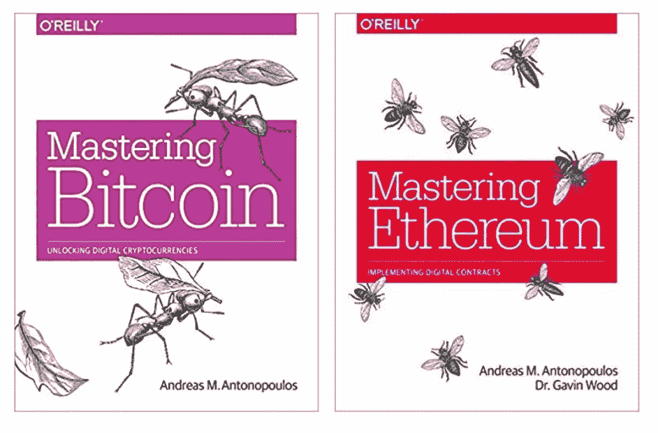
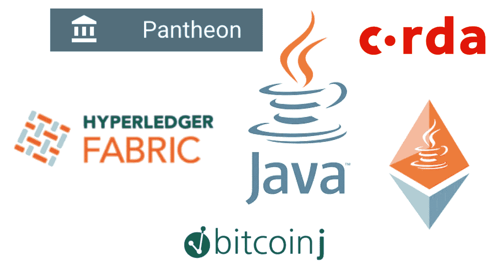

# Java 开发人员区块链入门

> 原文：<https://medium.com/hackernoon/getting-started-with-blockchain-for-java-developers-3e995a57cca2>

# 了解 7 种开源加密货币技术和资源，以利用您的 Java 专业知识。

顶尖科技预言家将[区块链](https://opensource.com/article/18/6/blockchain-guide-next-generation)列为十大新兴技术之一，这些技术有可能在未来十年彻底改变我们的世界，这使得现在投资你的时间来学习非常值得。如果您是一名具有 Java 背景的开发人员，并且希望快速了解区块链技术，本文将为您提供入门所需的基本信息。

[区块链](https://opensource.com/article/19/1/best-of-blockchain)是一个巨大的空间，导航起来会让人不知所措。它不同于其他软件技术，因为它有一个平行的非技术领域，涉及投机、诈骗、价格波动、交易、初始硬币发行(ico)、加密货币、[比特币最大化](https://www.investopedia.com/terms/b/bitcoin-maximalism.asp)、博弈论、人类贪婪等等。本文将忽略区块链的这一面，完全专注于您需要了解的技术方面。

# 区块链基础知识

不管区块链的编程语言和实现细节如何，在构建它之前，您需要对它的理论基础有一个基本的了解。我发现比特币和以太坊是你首先需要了解的，也是最基本的技术。这两个项目有几个共同点:它们在区块链领域引入了新的东西，在该领域拥有最高的市值，并拥有该领域最大的开发者社区。

大多数其他区块链项目——无论是公共的还是私人的，未经许可的还是经许可的——都是比特币或以太坊的分支，并试图改善它们的缺点，在某些方面通过做出某些权衡。如果你想了解区块链，学习比特币和以太坊就相当于在大学期间学习网络、数据库理论、消息传递、数据结构和编程语言课程。理解这两种区块链技术是如何运作的将会打开你对区块链宇宙的思维。

在你尝试用区块链技术做任何工作之前，我建议学习比特币和以太坊的技术基础。碰巧的是，我为此最推荐的两本书是安德烈亚斯·m·安东诺普洛斯写的。

Tech books to start with blockchain

*   *掌握比特币是我找到的关于比特币的最深入、最具技术性，但仍然可以理解和易于阅读的书。(其他的大部分书要么太哲学化，要么非技术化。)*
*   *在众多关于以太坊的技术书籍中，我最喜欢 [*掌握以太坊*](https://www.amazon.co.uk/Mastering-Ethereum-Andreas-Antonopoulos/dp/1491971940) 中的详细程度。*

*另外一本很好的讲述以太坊发展的书是 Roberto Infante 的 [*建筑以太坊 Dapps*](https://www.manning.com/books/building-ethereum-dapps) 。*

# *面向 Java 开发者的区块链项目*

*最终，区块链是现有技术与网络效应推动的人类行为的新结合。如果你来自一个技术背景，那么在你现有知识的基础上，看看区块链带来了什么是有意义的。但是，大多数人知道的技术，比如 Java，。NET 和关系数据库在区块链领域并不常见；相反，区块链在服务器端主要由 C、Go 和 Rust 主导，在客户端由 JavaScript 主导。也就是说，几个区块链项目和组件是用 Java 编写的，Java 开发人员可以将它们作为进入区块链的切入点。*

**

*Popular Java-based blockchain projects*

*如果您是一名 Java 开发人员，已经通过阅读我上面推荐的书籍进行了背景研究，并准备动手实践，那么可以从下面一个流行的用 Java 编写的开源区块链项目开始:*

*   *[**Corda**](https://github.com/corda/corda) 大概是一个 Java 开发者最自然的起点。Corda 是一个基于 JVM 的项目，构建在流行且广泛使用的 Java 项目之上，如 Apache Artemis、Hibernate、阿帕奇·希罗、Jackson 和关系数据库。它受比特币的启发，但也有业务流程、消息传递和其他熟悉概念的元素。作为一名 Java 开发人员，你可以阅读我对它的第一印象。*
*   *[**万神殿**](https://github.com/PegaSysEng/pantheon) 是以太坊节点在 Java 中的完整实现。它是专门为吸引 Java 生态系统的开发人员进入区块链世界而创建的。它的创作者提供了一个[介绍](https://slideslive.com/38911752/introducing-pantheon-a-mainnet-java-client-demo-roadmap)和一个[入门视频](https://youtu.be/OKWBr94J9rY)。*
*   *[**Bitcoinj**](https://github.com/bitcoinj/bitcoinj) 是比特币协议最流行的 Java 实现。如果你更喜欢直接从比特币入手，这就是 Java 项目要探索的地方。*
*   *[**Web3j**](https://github.com/web3j/web3j) 是用于连接以太坊节点的客户端库(而 Corda 和 Pantheon 是完整区块链节点实现的例子)。这是一个非常[有据可查的](https://web3j.io/)和活跃的项目，它使得与以太坊兼容的节点对话变得简单明了。我为它创建了一个 [Apache Camel](http://camel.apache.org/) 连接器，你可以[读到关于](/@bibryam/enterprise-integration-for-ethereum-fa67a1577d43)的内容。*
*   *[**Hyperledger Fabric Java SDK**](https://github.com/hyperledger/fabric-sdk-java)是最流行的企业区块链项目之一的全功能 Java SDK， [Hyperledger Fabric](https://www.hyperledger.org/projects/fabric) 。*
*   *[**FundRequest**](https://github.com/fundrequest/) 是用 Java 编写的终端用户应用程序。虽然上述项目是客户端或节点的示例，但 FundRequest 是一个在以太坊网络上实现的开源资金平台，完全用 Java 编写。这是一个很好的例子，说明了如何实现一个完整的基于区块链的项目，并与以太坊网络进行交互。*
*   *[**Eventeum**](https://github.com/ConsenSys/eventeum) 是一个 Java 项目，可以帮助你监控以太坊网络，在 Kafka 上存储事件。它解决了一些与区块链网络集成时最常见的挑战。*

*如果您准备好开始使用区块链，请访问 GitHub 并尝试上面列出的项目之一。其余的会跟着来。未来是[开放](https://opensource.com/article/18/8/open-source-tokenomics)和[分权](https://techcrunch.com/2019/02/05/blockchain-as-integration-evolution/)。*

**关注我在* [*twitter*](http://twitter.com/bibryam) *上的其他帖子。这个帖子的一个版本最初发表在*[*Opensource.com*](https://opensource.com/article/19/4/blockchain-java-developers)*下*[*CC BY-SA 4.0*](https://creativecommons.org/licenses/by-sa/4.0/)*