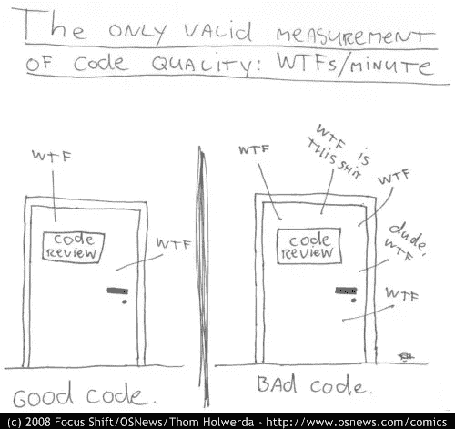

# Go 有望成为下一代企业编程语言

> 原文：<https://medium.com/hackernoon/go-is-on-a-trajectory-to-become-the-next-enterprise-programming-language-3b75d70544e>

你也可以在[InfoQ.com](https://www.infoq.cn/article/QC4yNPx8YeIfaKiE*2DS)上阅读这篇中文报道，或者在[黑客新闻](https://news.ycombinator.com/item?id=19870792#19871471)上加入讨论。

# 摘要

Go 是一种为大规模软件开发而设计的编程语言，它提供了强大的开发体验，避免了现有编程语言的许多问题。这些因素使它成为最有可能在未来接替 Java 成为主导企业软件平台的候选者之一。在未来几十年中，寻找安全和前瞻性的技术选择来创建大规模云基础设施的公司和开源项目应该考虑将 Go 作为他们的主要编程语言。围棋的优势在于:

*   是基于现实世界的经验
*   专注于大型工程
*   关注可维护性
*   保持简单明了
*   让事情变得清晰明了
*   很容易学
*   提供了一种做事的方式
*   允许简单的内置并发
*   提供面向计算的语言原语
*   使用 OO——好的部分
*   拥有现代化的标准图书馆
*   强制标准化格式
*   拥有速度极快的编译器
*   使交叉编译变得容易
*   执行速度非常快
*   需要很小的内存占用
*   导致部署规模较小
*   部署完全独立的
*   供应商依赖性
*   提供兼容性保证
*   鼓励好的文档
*   是作为商业支持的开源软件构建的

请继续阅读，了解每一点的更多细节。然而，在决定去之前，你应该留意:

*   不成熟的图书馆
*   没有硬实时

# 介绍

Go 是谷歌开发的一种编程语言，在过去几年里取得了很大的成功。现代的云、网络和 DevOps 软件有很大一部分是用 Go 编写的，比如 [Docker](https://www.docker.com/) 、 [Kubernetes](https://kubernetes.io/) 、 [Terraform](https://www.terraform.io/) 、 [etcd](https://github.com/etcd-io/etcd) ，或者 [ist.io](https://github.com/istio/istio) 。许多公司也将它用于通用开发。Go 支持的功能使这些项目吸引了大量用户，而 Go 的易用性也带来了许多贡献。

Go 的优势来自于结合了简单而成熟的思想，同时避免了其他语言中存在的许多问题。这篇博客文章概述了 Go 背后的一些设计原则和工程智慧，以展示它们如何——综合起来——使其有资格成为下一个大规模软件开发平台的优秀候选。许多语言在个别领域更强，但当把它们结合起来看时，没有其他语言得分如此一致，特别是在大规模软件工程方面。

# 基于真实世界的经验

Go 是由经验丰富的软件行业老手创建的，他们长期以来一直感受到现有语言的缺点带来的痛苦。几十年前，Rob Pike 和 Ken Thompson 在 Unix、C 和部分 Unicode 的发明中发挥了重要作用。Robert Griesemer 在从事 V8 和 HotSpot 虚拟机的 JavaScript 和 Java 工作之后，在编译器和垃圾收集方面拥有数十年的经验。他们不得不等待谷歌大小的 C++/Java 代码库编译完成，这种情况激励了他们太多次[,他们开始创造另一种编程语言，这种语言包含了他们通过半个世纪的代码编写所学到的一切。](http://radar.oreilly.com/2012/09/golang.html)

# 专注于大型工程

几乎任何编程语言都可以成功地构建小型工程项目。当数以千计的开发人员在持续的时间压力下合作开发包含数千万行代码的大规模代码库时，真正令人痛苦的问题就发生了。这导致了如下问题:

*   长编译时间会中断开发
*   代码库已经被几个人/团队/部门/公司所拥有，混合了不同的编程风格
*   该公司雇佣了数千名工程师、架构师、测试人员、运营专家、审计人员、实习生等，他们需要理解代码库，但具有广泛的编码经验
*   依赖大量的外部库或运行时，其中一些不再以原始形式存在
*   在代码库的生命周期中，每一行代码平均被[重写了 10 次](https://www.ybrikman.com/writing/2018/08/12/the-10-to-1-rule-of-writing-and-programming)，留下了伤疤、瑕疵和[技术漂移](https://codeclimate.com/blog/are-you-experiencing-technical-drift)
*   不完整的文件

Go 专注于[减轻这些大规模工程的痛苦](https://talks.golang.org/2012/splash.article)，有时是以让小规模工程变得更麻烦为代价的，例如在这里或那里需要几行额外的代码。

# 关注可维护性

Go 强调将尽可能多的工作交给自动化代码维护工具。Go 工具链提供了最常用的功能，如格式化代码和导入、查找符号的定义和用法、简单的重构以及识别代码味道。由于标准化的代码格式和一种惯用的做事方式，机器生成的代码变化看起来非常接近 Go 中人类生成的变化，并使用类似的模式，允许人类和机器进行更无缝的协作。

# 保持简单明了

> 初级程序员为简单的问题创造简单的解决方案。高级程序员为复杂的问题创造复杂的解决方案。伟大的程序员会找到复杂问题的简单解决方案。——[*查尔斯·康奈尔*](http://www.chc-3.com/pub/beautifulsoftware_v10.htm)

很多人都很惊讶，Go 没有包含他们在其他语言中喜爱的概念。Go 确实是一种非常小而简单的语言，它只包含最少的正交的和经过验证的概念。这鼓励开发人员用最少的认知开销编写尽可能简单的代码，以便其他许多人可以理解并使用它。

# 让事情变得清晰明了

> 好的代码是显而易见的，避免聪明、晦涩的语言特征、扭曲的控制流和迂回。

许多语言专注于提高编写代码的效率。然而，在整个生命周期中，人们阅读代码所花费的时间将远远超过最初编写代码所需要的时间(100 倍)。例如回顾、理解、调试、更改、重构或重用它。当查看代码时，人们通常只能看到和理解代码的一小部分，而不能全面了解整个代码库。为了说明这一点，Go 把一切都显式化了。

错误处理就是一个例子。更简单的方法是让异常在不同的点中断代码，并在调用链中冒泡。Go 要求[手动处理或返回每个错误](https://tour.golang.org/methods/19)。这使得代码在哪里可以被中断以及如何处理或包装错误变得非常清楚。总的来说，这使得错误处理写起来更麻烦，但更容易理解。

# 简单易学

Go 是如此的小而简单，以至于即使初学者也能在几天内学会整个语言和它的基本概念。根据我们的经验，经过不超过一周的训练(相比之下其他语言要花几个月的时间)，围棋初学者可以理解围棋专家编写的代码，并为之做出贡献。为了让更多人参与进来变得容易，Go 网站提供了所有需要的教程和深入的文章。这些教程在浏览器中运行，允许人们在本地机器上安装 Go 之前学习和使用它。

# 做事的一种方式

> Go 让团队合作超越个人自我表现。

在 Go 中，所有的语言特性都是相互正交和互补的，通常有一种方法可以完成某件事情。如果你让 10 个围棋程序员解决一个问题，你会得到 10 个相对相似的解决方案。不同的程序员在彼此的代码库中感觉更自在。当查看其他人的代码时，每分钟有更少的[wtf](https://www.osnews.com/story/19266/wtfsm)，人们的工作更好地相互适应，形成了一个一致的整体，每个人都为之自豪并享受工作。这避免了大规模的工程问题，例如:

*   开发人员认为好的工作代码是“混乱的”,并要求在他们能够工作之前重写它，因为他们与原作者的思维方式不同。
*   不同的团队成员用不同的语言子集编写相同代码库的部分。

source: [https://www.osnews.com/story/19266/wtfsm](https://www.osnews.com/story/19266/wtfsm/)

# 简单的内置并发

> *Go 是为现代多核硬件设计的。*

今天使用的大多数编程语言(Java、JavaScript、Python、Ruby、C、C++)都是在 20 世纪 80 年代至 21 世纪初设计的，当时大多数 CPU 只有一个计算核心。这就是为什么它们本质上是单线程的，并将并行化作为边缘情况下的事后想法，通过线程和同步点等笨重且难以正确使用的附件来实现。第三方库提供了更简单的并发形式，如 Actor 模型，但总是有多个选项可用，导致语言生态系统的碎片化。今天的硬件拥有越来越多的计算核心，软件必须并行化才能在其上高效运行。Go 是在多核 CPU 时代编写的，语言中内置了简单、高级的 CSP 风格的并发性。

# 面向计算的语言原语

在基本层面上，计算机系统接收数据，处理数据(通常需要几个步骤)，并输出结果数据。例如，web 服务器从客户端接收 HTTP 请求，并将其转换为一系列数据库或后端调用。一旦这些调用返回，它就将接收到的数据转换成 HTML 或 JSON，并输出给调用者。Go 的内置语言原语直接支持这种范式:

*   结构代表数据
*   读取器和写入器代表流 IO
*   函数转换数据
*   goroutines 提供(几乎无限制的)并发性
*   通道在并发处理步骤之间传输数据

因为所有的计算原语都是以语言的直接形式提供的，所以 Go 源代码更直接地表达了服务器的功能。

# OO —好的部分

side effects of changing something in a base class

面向对象非常有用。过去几十年来，它的使用卓有成效，让我们了解了它的哪些部分比其他部分更具扩展性。Go 采用了一种全新的面向对象的方法，将这些知识牢记在心。它保留了封装和消息传递等优点。Go 避免了继承，因为它现在[被认为是有害的](https://www.javaworld.com/article/2073649/why-extends-is-evil.html)，而代之以为 composition 提供[一流的支持。](https://golang.org/doc/effective_go.html#embedding)

# 现代标准图书馆

许多目前使用的编程语言(Java、JavaScript、Python、Ruby)都是在互联网成为今天这样无处不在的计算平台之前设计的。因此，这些语言的标准库只为网络提供了相对通用的支持，并没有针对现代互联网进行优化。围棋诞生于十年前，当时互联网已经如日中天。Go 的标准库允许在没有第三方库的情况下创建更复杂的网络服务。这防止了第三方库的常见问题:

*   **碎片化:**总是有多个实现相同功能的选择
*   膨胀:库经常会实现比它们的用途更多的东西
*   依赖地狱:库经常依赖于特定版本的其他库
*   **未知质量:**第三方代码可能存在质量和安全性问题
*   **未知支持:**第三方库的开发可以随时停止
*   **意想不到的变化:**第三方库的版本通常不如标准库严格

Russ Cox 的更多背景资料。

# 标准化格式

> *Gofmt 的风格没有人喜欢，但 Gofmt 是大家的最爱。—罗布·派克*

Gofmt 是一个以标准化方式格式化 Go 代码的程序。这不是最漂亮的格式化方式，但却是最简单、最不受欢迎的方式。标准化的源代码格式具有惊人的积极效果:

1.  将对话集中在重要的话题上:它消除了一系列围绕制表符与空格、缩进深度、行长度、空行、花括号的位置等等的争论。
2.  开发人员在彼此的代码库中感觉很自在，因为其他代码看起来很像他们自己编写的代码。每个人都喜欢拥有以自己喜欢的方式格式化代码的自由，但是每个人都讨厌别人以自己喜欢的方式格式化代码。
3.  **自动化代码更改**不会弄乱手写代码的格式，例如引入意外的空格更改。

许多其他语言社区正在开发 gofmt 的对等物。作为第三方解决方案构建时，通常会有几种相互竞争的格式标准。例如，JavaScript 世界提供了更漂亮的[和标准的](https://prettier.io/)和[。人们可以使用其中之一或两者一起使用。许多 JS 项目都不采用它们，因为这是一个额外的决策。Go 的格式化程序内置于该语言的标准工具链中，所以只有一个标准，每个人都在使用它。](https://standardjs.com/)

# 快速编译

source: [https://xkcd.com/303](https://xkcd.com/303/)

大型代码库的漫长编译时间是引发 Go 起源的沧海一粟。谷歌主要使用 C++和 Java，与 Haskell、Scala 或 Rust 等更复杂的语言相比，它们的编译速度相对更快。尽管如此，当编译大型代码库时，即使少量的缓慢也会导致令人恼火的、扰乱流程的编译延迟。Go 的设计初衷是为了提高编译效率，因此它的编译器非常快，几乎没有编译延迟。这为 Go 开发者提供了类似于脚本语言的即时反馈，并增加了静态类型检查的好处。

# 交叉编译

因为语言运行时非常简单，所以它已经被移植到许多平台上，比如 macOS、Linux、Windows、BSD、ARM 等等。Go 可以为所有这些平台编译二进制文件。这使得从单台机器进行部署变得容易。

# 快速执行

Go 的运行速度接近 c 语言。与 JITed 语言(Java、JavaScript、Python 等)不同，Go 二进制文件不需要启动或预热时间，因为它们作为编译和完全优化的本机代码发布。Go 垃圾收集器只引入了数量级为[微秒](https://twitter.com/brianhatfield/status/804355831080751104)的可忽略的暂停。除了其快速的单核性能，Go 还可以轻松利用所有 CPU 内核[。](https://tour.golang.org/concurrency/1)

# 内存占用小

像 JVM、Python 或 Node 这样的运行时并不只是在运行时加载程序代码。每次运行程序时，它们还会加载大型且高度复杂的基础结构来编译和优化程序。这使得它们的启动时间变慢，并导致它们使用大量(数百 MB)的 RAM。Go 流程的开销更少，因为它们已经完全编译和优化，只需运行即可。Go 还以非常高效的方式存储数据。这在 RAM 有限且昂贵的云环境中非常重要，在开发过程中，我们希望在一台机器上快速启动整个堆栈，同时将内存留给其他程序。

# 小部署规模

Go 二进制文件在大小上非常简洁。Go 应用程序的 Docker 映像通常比用 Java 或 Node 编写的对等映像小 10 倍以上，因为它需要较少的运行时基础设施，如编译器、优化器和去优化器。这在部署大型应用程序时很重要。想象一下，在 100 台生产服务器上部署一个简单的应用程序。当使用 Node/Java 时，我们的 docker 注册中心必须提供 100 个 docker 映像@ 200 MB =总共 20 GB。这需要一些时间来服务。假设我们想要每天部署 100 次。当使用 Go 服务时，docker 注册表只需提供 100 个 Docker 图像@ 20 MB = 2 GB。大型 Go 应用程序可以更快、更频繁地部署，允许重要更新更快地进入生产环境。

# 独立部署

Go 应用程序被部署为一个包含所有依赖项的可执行文件。不需要安装特定版本的 JVM、节点或 Python 运行时。不需要将库下载到生产服务器上。不需要对运行 Go 二进制文件的机器做任何改变。甚至没有必要将 Go 二进制文件打包到 Docker 中来共享它们。你只需将 Go 二进制文件放到一个服务器上，不管那个服务器上运行的是什么，它都会在那里运行。上述语句的唯一例外是在使用`net`和`os/user`包时针对`glibc`的动态链接。

# 供应商依赖性

Go 有意避开第三方库的中央存储库。Go 应用程序直接链接到各自的 Git 存储库，并将所有相关代码下载(“供应商”)到它们自己的代码库中。这有许多优点:

*   在将第三方代码提交到代码库之前，我们可以在代码评审过程中评审、分析和测试第三方代码。这些代码就像我们自己的代码一样，是我们应用程序的一部分，应该符合相同的质量、安全性和可靠性标准。
*   不需要永久访问存储依赖项的各个位置。从任何地方获得第三方库(包括私有 Git repos)一次，你就永远拥有了它们。
*   签出后，无需进一步下载依赖项来编译代码库。
*   如果互联网上某个地方的代码库突然提供不同的代码，这并不奇怪。
*   部署永远不会中断，即使包存储库变慢或者托管包不复存在

# 兼容性保证

Go 团队[承诺](https://golang.org/doc/go1compat)现有的程序将继续为新一代的语言工作。这使得将大型项目升级到较新版本的编译器变得很容易，并从它们带来的许多性能和安全性改进中受益。同时，由于 Go 二进制文件包含了它们所需的所有依赖项，因此可以在同一台服务器上并行运行用不同版本的 Go 编译器编译的二进制文件，而不需要复杂地设置多个版本的运行时或虚拟化。

# 证明文件

当进行大型工程时，文档对于软件的可访问性和可维护性变得非常重要。与其他特性类似，Go 中的文档简单实用:

*   它嵌入在源代码中，这样两者可以同时维护。
*   它不需要特殊的语法——文档只是普通的源代码注释。
*   可运行的单元测试通常是最好的文档形式，所以让我们[将它们嵌入到文档中](https://blog.golang.org/examples)。
*   所有的文档[工具](https://blog.golang.org/godoc-documenting-go-code)都内置在工具链中，因此每个人都使用它们。
*   Go linter 要求为导出的元素编制文档，以防止“文档债务”的累积。

# 商业支持的开源软件

当商业实体在开放的环境中开发时，一些最流行的和彻底工程化的软件就会出现。这种设置结合了商业软件开发的优势——一致性和完善使系统健壮、可靠和高性能——和开放开发的优势，如跨许多行业的广泛支持、来自多个大型实体和许多用户的支持，以及即使商业支持停止也能提供的长期支持。围棋就是这样发展起来的。

# 不足之处

当然，围棋并不完美，每个技术选择都有利弊。在决定去之前，这里有一些需要考虑的地方。

# 粗糙

虽然 Go 的标准库在支持许多新概念方面是业界领先的，如 [HTTP 2 server push](https://blog.golang.org/h2push) ，但是用于外部 API 的第三方 Go 库可能没有 JVM 生态系统中的成熟。

# 没有硬实时

虽然 Go 的垃圾收集器只引入非常短的中断，但支持硬实时需要没有垃圾收集的技术，例如 Rust。

# 结论

这篇博客文章提供了一些背景知识，介绍了 Go 设计中明智但往往不那么明显的选择，以及随着代码库和团队数量级的增长，他们如何将大型工程项目从许多痛苦中拯救出来。总的来说，他们将 Go 定位为寻找 Java 之外的现代编程语言的大型开发项目的绝佳选择。