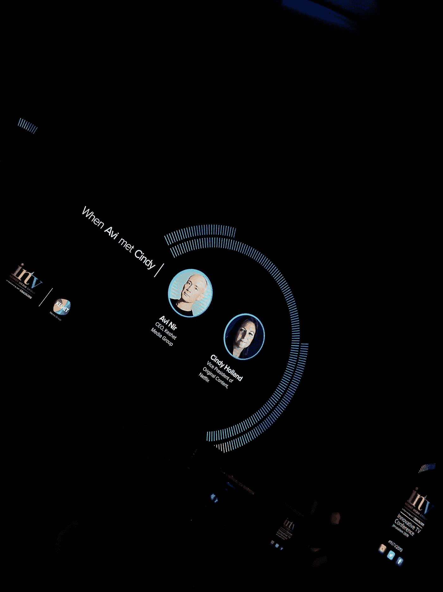

# 走向全球(还是全球本土化)？网飞如何制作惊人的全球内容

> 原文：<https://medium.com/hackernoon/going-global-or-globally-local-how-netflix-produces-amazing-global-content-5ad98d0a5ff1>

## 来自耶路撒冷#INTV2019 的教训

Netflix HQ

这家数字媒体公司是如何取得网飞近年来所取得的空前成功的？他们是全球化思考，还是用另一种内容策略来处理内容？

网飞原创内容副总裁辛迪·霍兰德(Cindy Holland)表示，本地内容创作者制作的内容越具体、越真实，就越有可能在全球市场引起共鸣。

Cindy Holland, VP Original Content, Netflix in Jerusalem

事实上，她表示，网飞不必考虑收视率(因为这是基于广告营销模式)，该公司收集的数据和见解证明了这一独特的内容战略。网飞遍布 190 个国家，SVOD 超过 80%的新收购来自美国以外，数据显示，外国客户想要的是外国作品，而不是全球内容。考虑本地，生产伟大的，真实的内容，它会上升到顶端。

Keynote Conversation at INTV 2019

作为 INTV 2019 的一部分，Holland 分享了公司的见解和愿景。这位 17 岁的网飞高管是凯舍特在耶路撒冷举行的 INTV 会议的开场主题。凯舍特国际公司的执行官 Avi Nir 的采访，提供了一个引人入胜的谈话，从网飞的策展模型和顶级表演到荷兰的自行车爱好。

即使控制着如此庞大的预算，辛迪·霍兰德也确实认为自己的角色是推动者和培育者。正如最近在《T2》采访《滚石》杂志时提到的，“我一直致力于帮助创作者充分利用他们的视觉，”她说。“人们知道我是直爽的。我尽量说得非常清楚，并给出一个快速的回答。这是一种真正的信任和简单，就像我们有相同的议程一样。”

辛迪·霍兰德的采访内容精彩，这些亮点为如何营销和创造对任何观众都有价值和有趣的内容提供了一个极好的视角。

## **很难相信网飞在 17 年前以 DVD 分销服务起家创办了网飞。公司早期的谦虚起步是如何塑造未来的？**

是的，公司已经适应了这些年。从订阅服务开始，我们向消费者交付了超过 10 万本图书。这让我们了解了很多他们的偏好，这些偏好是独特的、兼收并蓄的、多样的。虽然内容很重要，但我们收集的数据是我们业务的支柱。在许多方面，虽然内容很好，但数据让我们获得了成功。是分不开的搭配。

## 网飞背后是谁？谁是你的主要竞争对手？

老实说，大型娱乐公司，甚至是新手，都有很多成功的机会。我们仍处于数字内容的初级阶段。今天，我们必须记住，你是在争夺消费者的时间，以及他们在休息时间选择做什么。这是我们的目标。在他们最珍惜的时间里最大化他们的经历。

## 未来 3 年，谁会是网飞背后的“犀牛”?

我们是点播电视的发展方向，那些在线性电视领域停滞不前的公司将会发现越来越难保持相关性，并且可能不会长久。未来是按需的。尽管该公司统治全球的速度受到了批评，但霍兰德在接受《滚石》采访时说，“如果我们的目标是让地球上的每个人都喜欢网飞的内容，我们就需要编写大量的程序……有 3 亿人定期来这项服务寻找可看的东西。”

为了吸引更多的观众，我们必须继续制作有价值的内容来吸引新的消费者，同时吸引现有的付费会员。

## **在网飞，决定决策过程的是“人还是机器”？**

嗯，今天，更有可能是一个女人**。人类正在决定我们选择投资什么，但我们得到了我们所拥有的信息的帮助…该公司的“臭名昭著”的算法，也就是“投影模型”，只是帮助围绕绿灯“设置参数”。**

作为一个公司，就像我们早期一样，不使用它是愚蠢的。数据有助于我们真正发现机会领域，并在我们打算对某个特定标题做出决定时帮助我们，帮助我们估计受众规模，以及我们可能想要投资的内容。像任何其他努力一样，它帮助我们确定这是否是一个好主意，它是否会回来，以及我们是否相信创意团队会执行这个想法。

事实上，像传统的广播公司一样，这些数据可以帮助网飞在首映后的 28 天内确定一个节目的成功程度。

## 你和网飞是如何控制这么多内容的？

作为一个负责观看约 1500 个节目并养活 1.3 亿会员的人，Holland 指出，“支持”网飞上出现的大量内容的最佳方式是消除“高层决策的瓶颈”这可能是她在暗示一个委托权力分散的未来，与目前基于洛杉矶的内容分发模式有很大不同。与传统模式相比，这种战略转变将是一个显著的变化。事实上，Holland 表示“有几十个人对我们委托和提供的各种不同内容拥有绿灯和许可权……我们尝试和做的是建立一种自由和责任的文化，尽可能地将责任下放。”网飞并不指望向其创意团队发号施令或给出解决方案。

此外，与脸书和谷歌等大型科技公司不同，她认为这些公司是“未经雕琢的平台”，霍兰德自豪地指出了网飞的商业模式，“我们有一种不同的商业模式，更接近有线电视，”强调它有能力策划能引起公司兼收并蓄的观众共鸣的内容标题。

## 网飞是否注意到了消费者消费内容方式的转变？是在手机上还是正在出现什么趋势？

尽管有许多报道，霍兰德说，今天的活动，他们的大多数观众是在电视上观看网飞，或通过多种设备，而不仅仅是在移动设备上。有趣的是，在新兴市场，趋势是更多的人喜欢在移动设备上观看网飞，但这不是全球范围内网飞的主要观看偏好。

通过这些评论，Cindy Holland 为来自世界各地的行业领袖、创新者和颠覆者搭建了讨论现代电视世界所带来的众多问题的舞台。与此同时，耶路撒冷和以色列现在可以以一种创造性的方式将电视添加到正在发展的行业中。