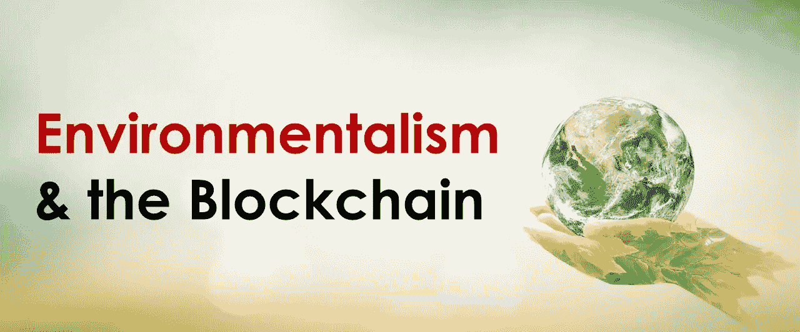
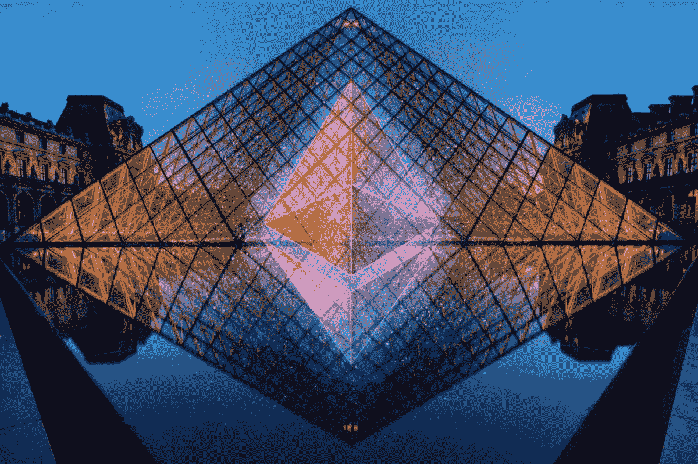
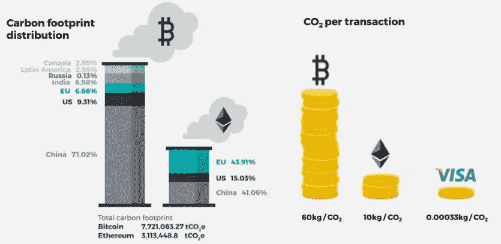
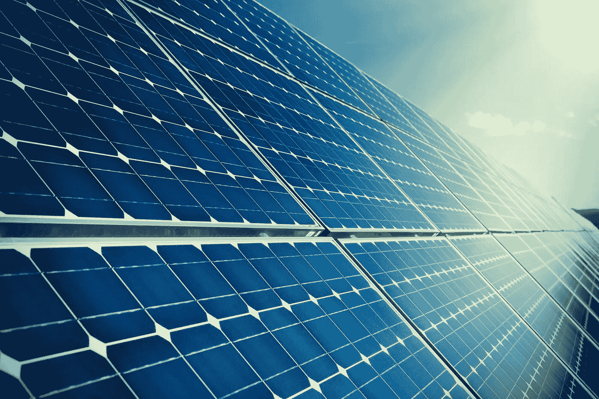

# 走向绿色:区块链能拯救地球吗？

> 原文：<https://medium.com/hackernoon/going-green-can-blockchain-save-the-planet-34edb9dc3c21>

政府间气候变化专门委员会(IPCC)最近得出结论，按照目前与全球温室气体排放途径相关的人类活动速度，我们正面临着全球变暖超过工业化前水平 1.5 摄氏度的威胁。这听起来可能不是一个很大的数字，但后果是可怕的——想想海平面上升导致低地地区洪水泛滥，苔原和雨林退化，海洋中 CO₂浓度增加导致珊瑚礁生态系统大规模漂白。最后一个打击离家特别近，因为我是一个潜水者。

为了解决这个问题，许多组织都把目光投向了技术，尤其是区块链。一个这样的组织是气候基金会的[区块链，该组织旨在“将巴黎协定放在区块链上”并“通过连接世界各国的碳账户来催化气候行动”](https://www.blockchainforclimate.org/)

Source: “[Putting the Paris Agreement on the Blockchain](/@blockforclimate/putting-the-paris-agreement-on-the-blockchain-57eda4c481af)”

当然，当谈到利用区块链技术来减少气候变化的影响时，讽刺的是，我并没有忘记——众所周知，今天工作中的分布式账本技术的许多迭代本质上是能源密集型的。事实上，数字资产挖掘的整个前提都围绕着处理能力的有意支出。

The orange areas show where global Bitcoin mining [consumes more electricity than the entire country](http://powercompare.co.uk/bitcoin)

但是有一线希望吗？

在由世界经济论坛和普华永道出版的 [*建筑模块(链)s for a Better Planet*](https://www.pwc.com/gx/en/sustainability/assets/blockchain-for-a-better-planet.pdf) 中，区块链技术被认为是“第四次工业革命”的关键驱动力与物联网(IoT)和人工智能(AI)等其他新兴技术一起，区块链技术被认为将“对未来几代人的经济、价值、身份和可能性产生地震般的影响”(4)。

普华永道报告的中心前提围绕着这样一个概念，即尽管目前处于初级阶段，因此仍然基本上是低效的，但区块链技术的未来实施可以“显著提高一些行业的运营效率，同时完全扰乱其他行业”(13)。

作为区块链技术的坚定信徒和用户，我同意这种观点，并就分布式账本技术以其当前或未来的形式如何拯救地球做出了一些发现——原谅这种夸张的说法:

## 分散的碳市场

碳信用，或代表排放一吨二氧化碳的权利的“[可交易证书或许可证](https://en.wikipedia.org/wiki/Carbon_credit)”，是出于所有正确的意图而创建的——作为对企业实施碳友好运营实践的激励，最终目标是平衡世界的碳足迹。

即使是今天这个价值数十亿美元的市场，也充满了由中介带来的限制。[碳网格协议](http://carbongrid.io/)试图通过他们开发的“补充协议层(使)区块链网络和 DApps 能够有效地获得碳信用来抵消他们的碳足迹”来改变这种情况

“Bitcoin and Ethereum transactions emit [60kg and 10kg of carbon dioxide respectively](https://www.wired.com/story/bitcoin-mining-guzzles-energyand-its-carbon-footprint-just-keeps-growing/). This is compared to just 0.3 grams of carbon dioxide being emitted for each VISA transaction”

> 区块链平台可以用来使用具有可交易价值的加密令牌来优化碳(或其他物质)的现有市场平台，并为碳信用交易创造新的机会。(预委会 7)

## 激励性促销

“prosumption”一词来源于消费者 *生产的 [*的概念。*这方面的一个假设例子是实施太阳能比特币采矿平台，其中剩余奖励用于购买碳信用额。在区块链技术的背景下，这可以联系到](https://en.wikipedia.org/wiki/Prosumer)[微型发电能源市场](https://assets.publishing.service.gov.uk/government/uploads/system/uploads/attachment_data/file/492972/gs-16-1-distributed-ledger-technology.pdf) t*

在一个区块链供电的电力系统中，有人提出“智能电表可用于在分布式账本上计算和记录微发电量”(76)。我们已经可以看到今天这种情况的反复发生，一个例子是麻省理工学院的创业公司 [SolarCoin](https://www.newscientist.com/article/dn25010-solarcoin-cryptocurrency-pays-you-to-go-green/) 。

[Can blockchain give power back to the grid?](https://www.newscientist.com/article/2079334-blockchain-based-microgrid-gives-power-to-consumers-in-new-york/)

> 分布式账本，结合智能计量系统和下一代电池(在本地积累能源)，有可能打开面向大众生产的能源市场。(政府科学办公室 76)

## 可持续金融

传统金融业的遗留发行、交易、清算和结算流程效率非常低，高延迟 T+3 周期是过去二十年的常态。

如今，像 Hashstacs Inc .这样的组织，凭借其在 T2 的证券交易资产和分类(stacs)协议，已经准备好打破传统金融的长期堡垒。通过实施由公开/许可区块链组成的混合分类账架构，STACS 实现了资本市场的完全令牌化，从而实现了更快、更便宜、更安全的证券发行、交易、清算和结算。

当谈到所述资本市场的令牌化时，除了传统的金融证券，还有无限的可能性——房地产、艺术，甚至[太阳能资产](https://thesunexchange.com/)，都可以很容易地数字化。

Imagine a world where you can seamlessly issue securities for the crowdfunding of solar energy, forest conservation, and water purification projects

> 展望未来，在寻求实现联合国可持续发展目标的项目中，区块链可能成为“混合金融”投资的真正游戏规则改变者。(预委会 25)

# 结束语

虽然区块链科技在实现其创造一个更清洁、更可持续、更和谐的地球的承诺之前还有一段路要走，但我相信我们走在正确的道路上。

每项新生技术在实现大规模采用和可扩展性之前，都必须经历三个主要阶段:

1.  **R & D** ，其中“[投入的收益为负，并且失败的可能性很高](https://en.wikipedia.org/wiki/Technology_life_cycle)
2.  **提升**，即“自付费用已经收回，技术开始积聚力量”
3.  **成熟期**，此时“收益高且稳定”，市场达到平衡

基于区块链行业的现状，我们正处于提升阶段的最重要阶段，许多上面提到的组织都获得了 B 轮融资。

如果你像我一样是一个科技和区块链极客，你无疑会感到兴奋(甚至兴奋！)在未来几个月、几年甚至更久的时间里，这个空间在拯救地球方面能为我们提供什么。

 [## Marcus Tan-brocta gon fin tech Group | LinkedIn 营销和业务发展总监

### 加入 LinkedIn 我的日常工作围绕着为金融和企业建立独特的、引人注目的、变革性的品牌

www.linkedin.com](https://www.linkedin.com/in/marcustanyh/)