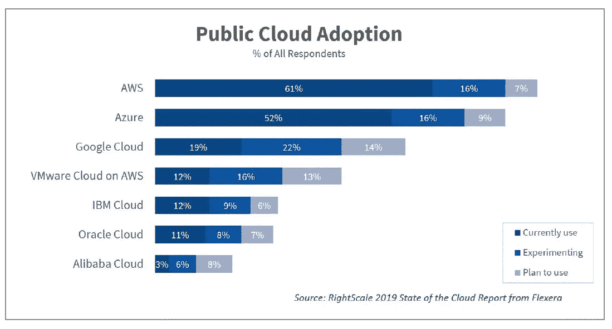
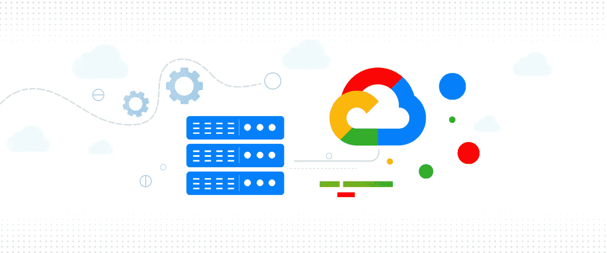
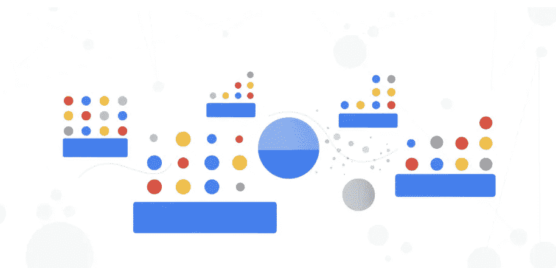
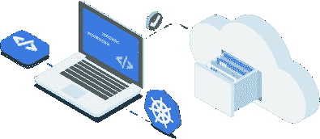
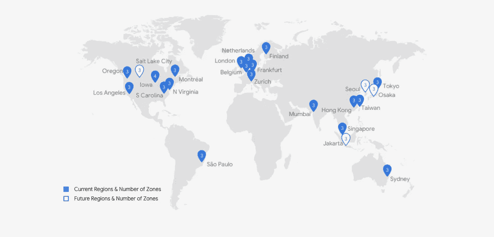
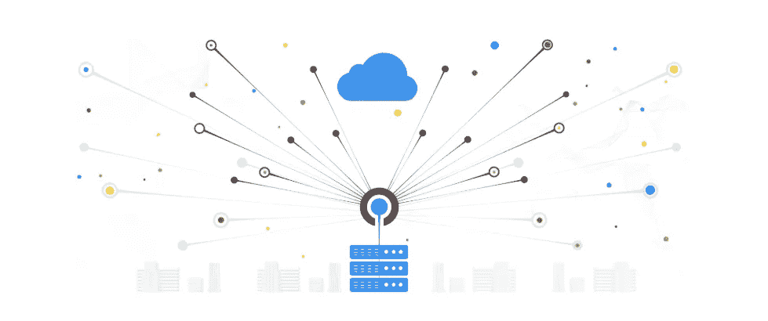

# Google Cloud Next’19

> 原文：<https://medium.com/hackernoon/google-cloud-next-19-4fbedaff95e7>

上周，科技界聚集在三藩市的莫斯康中心参加 [Google](https://hackernoon.com/tagged/google) Cloud Next，这是一年一度的活动，聚焦于 Google 最新的云解决方案，人工智能和机器学习的[未来](https://hackernoon.com/tagged/future)。宣布的许多内容对我们的工作有影响。让我们来看看激动人心的消息！

# 谷歌云与其他产品

这是第一版谷歌云 Next，托马斯·库里安是谷歌云的首席执行官，他于去年年底接替黛安·格林。他明确表示，谷歌将更加关注企业——同时仍然欢迎初创公司——和开源，以加强其云计算基础设施产品。

> *我们致力于大幅扩大我们的市场推广团队的规模，以帮助更多客户使用我们的技术*
> 
> *谷歌云首席执行官托马斯·库里安*

正如我们从下图中看到的，谷歌云不是最大的公共云提供商，落后于 AWS 和 Azure 一段距离。然而，他们提供的尖端技术，如 Kubernetes 和 TensforFlow，以及他们对开源和有竞争力的价格的承诺，无疑促使我们成为谷歌云的合作伙伴，并利用谷歌云的服务为我们的客户创建数字产品。我们和许多其他人想提到的另一件事是对谷歌提供更多支持的强烈需求，以使企业能够采用谷歌云服务。

# 混合焦点

主题演讲期间最大的公告之一是发布了一个新的开放平台，名为 [Anthos](https://cloud.google.com/anthos/) ，以前称为谷歌云服务平台。Anthos 旨在通过允许企业在现有的本地硬件投资或任何公共云中运行和管理其应用程序，实现真正的一次编写，随处运行的承诺。它不仅可以与谷歌云平台合作，甚至可以与其他几家云提供商合作，包括谷歌的一些最大竞争对手:亚马逊的 AWS 和微软的 Azure。

许多企业一直渴望能够在云提供商之间迁移他们的应用程序，特别是因为对锁定的担忧已经成为进一步采用云的障碍。通过利用谷歌开发的开源 Kubernetes 容器技术，以及许多其他企业级开源工具，Anthos 提供了一种令人惊讶的灵活方式来将工作负载从 AWS 或 Azure 转移到 GCP，它甚至允许公司选择相反的方向。通过 Anthos，Google 将提供单一的托管服务，让您可以跨云管理和部署工作负载，而不必担心不同的环境(内部和外部)和 API。

这是一件大事，也是谷歌的方法与其竞争对手明显不同的地方。

***混合云又是什么？***

*术语混合云描述了一种设置，其中公共或互连的服务部署在多个计算环境中，一个基于公共云，至少一个在本地。*

除了可以管理您的混合云的 Anthos 平台，他们还宣布了 Apigee 混合 API 管理(beta)，这反过来为您提供了跨所有环境的单一、全功能 API 管理解决方案。

# 无服务器容器

另一个新产品叫做 [Cloud Run](https://cloud.google.com/run/) ，它将无服务器的概念带到了容器中。这是一个托管计算平台，使您能够运行可通过 HTTP 请求调用的无状态容器。无服务器意味着不必担心基础设施，具有最佳的资源利用率。因为你只在你的代码运行时付费，所以这个系统对成本是透明的。不再需要扩展管理:底层无服务器基础设施将自动扩展您的应用程序和(微)服务。

一个有趣的策略是，它让你可以灵活地在 Google Cloud 或 Kubernetes 引擎上运行服务。这使得您可以更加自由地在不同的环境和平台之间移动工作负载:

*   完全在谷歌云平台上管理
*   在谷歌 Kubernetes 引擎上
*   无处不在

# 我们最喜欢的 ide 的新开发工具

谷歌肯定没有忘记它的开发人员:通过[云代码](https://cloud.google.com/cloud-code/)，他们带来了优秀的开发工具来帮助我们快速轻松地编写、部署和调试云原生应用。对 ide 的扩展，如 [VS Code](https://github.com/GoogleCloudPlatform/cloud-code-vscode) (beta)和 IntelliJ (alpha)将允许我们快速迭代、调试和部署代码到 Kubernetes。

# 新区域

三年来，谷歌云已经向 13 个国家的 15 个新地区和 45 个区域开放。他们继续扩大他们的全球足迹，以支持世界各地不断增长的客户。

谷歌云宣布为其全球基础设施增加两项新功能，新区域包括:

*   韩国首尔
*   美国犹他州盐湖城。

日本大阪将在未来几周上线，印度尼西亚雅加达将在明年年初上线。这将使 2020 年全球地区总数达到 23 个。

# 宣布合作关系

开源数据库市场很大，并且在快速增长:

> *企业用户开发的 70%以上的新应用将运行在开源数据库管理系统上*
> 
> 【SearchDataManagement.com 

有鉴于此，谷歌云宣布与数据管理和分析领域领先的以开源为中心的公司建立战略合作伙伴关系，包括 Confluent、Elastic、MongoDB 和 Redis Labs。

有了这样的合作关系，谷歌可以带来一个非常引人注目的故事:

*   **完全托管的服务**在云中运行，尽最大努力优化服务和应用程序之间的性能和延迟。
*   **管理应用的单一用户界面**，包括从谷歌云控制台供应和管理服务的能力。
*   **统一计费**，因此您可以从 Google Cloud 获得一张包含合作伙伴服务的发票。
*   **Google Cloud 支持**这些合作伙伴中的大多数，因此您可以在一个窗口中管理和记录支持票据，而不必与不同的提供商打交道。

# 人工智能作为一个平台

借助人工智能平台，谷歌继续降低机器学习工程师将人工智能应用部署到生产中的门槛。大多数底层组件，如 TensorFlow、TensorFlow Extended、Kubeflow、AutoML、BigQueryML 和 Cloud ML Engine，已经存在了一段时间，但 AI 平台很好地将它们结合在一起。

随着人工智能平台的到来，几个月前以高价提供的深度学习虚拟机映像已经与其他虚拟机映像的价格一致。

没有数据标签功能的人工智能平台是不完整的。谷歌宣布了自己的数据标签服务，看起来很有竞争力。您可以轻松地将数据上传到存储桶中，并通过他们的 API 创建标签作业。不过这并不便宜，例如，对 1000 张图像进行分类需要 35 美元，对图像中的 1000 个物体逐个像素地进行标记需要 870 美元。

BigQueryML 和 AutoML 也有一些不错的扩展。除了线性和逻辑回归模型之外，现在还可以对大型 BigQuery 表运行 k-means 聚类。如果您曾经聚集了 1000 万个例子，每个例子都有 100 个特性，您会发现这种可伸缩性非常好。

这些 BigQuery 表也可以放入新的 AutoML 表中，这允许您创建分类和回归模型。作为数据科学家，我们总是有随机森林或 xgboost 我们的袖子击中地面运行，但 AutoML 表的力量真正在于直接部署，而不必担心底层算法。也就是说，AutoML Tables 还报告了 RMSE、精确度、召回率等指标，这确实很不错。

# 结论

我们再次对 Google Cloud Next 的宣布感到非常兴奋，尤其渴望获得一些关于 Anthos、Cloud Run 和人工智能平台新东西的实践时间。

想了解我们如何利用我们的云解决方案帮助您吗？我们联手吧！[https://inthepocket.com/technologies/cloud-and-apis](https://inthepocket.com/technologies/cloud-and-apis)

由乔纳森·德·穆尔、图恩·德·波乌和肯尼·赫尔森斯撰写的原创文章:【https://inthepocket.com/blog/2019/google-cloud-next-2019