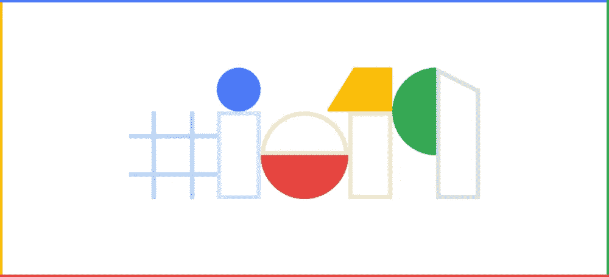

# Google I/O 2019:开发者世界有什么新东西？

> 原文：<https://medium.com/hackernoon/google-i-o-2019-whats-new-for-the-developer-world-dbc0c5761cce>

谷歌 I/O 是一个开发者大会，由这家科技巨头每年举办一次，旨在宣布其软件、硬件、应用程序和服务的最新进展。Google I/O 2019 于 5 月 7 日在加州山景城的海岸线圆形剧场拉开帷幕，并于 5 月 9 日以一些壮观的公告结束。

因此，让我们深入了解一下 Google I/O 2019 中发布的一些重大公告。

# 谷歌 2019 年主要 I/O 公告

“我们的目标是建立一个更有帮助的谷歌，让每个人增加知识、成功、健康和幸福。”—谷歌首席执行官桑德尔·皮帅

从使用增强现实(AR)在场馆内导航开始，为期 3 天的活动证明了谷歌如何利用技术改善我们的生活。他们确实向我们展示了如何利用技术“把事情做好”。今年，应用程序主要关注用户信任和隐私。强大的隐私和安全功能有了更多的补充。

# 安卓 Q Beta 3

Android Q 是谷歌发布的第十个操作系统。创新、安全和隐私以及数字福祉是驱动新操作系统的四个核心因素。Android Q 的第三个测试版已经在 Google I/O 2019 中发布。与前两个版本不同，新的测试版可以安装在 12 家原始设备制造商(OEM)的 21 款不同的智能手机上。

谷歌特别强调了 Android Q Beta 3 的以下功能:

*   原生支持可折叠设备，如三星 Galaxy Fold 和 5G 网络
*   音频和视频的实时字幕，也可离线使用
*   智能回复和建议
*   原生黑暗主题
*   完全由用户控制的全新隐私设置
*   无需重启即可应用安全补丁
*   聚焦模式，静音不想要的通知
*   控制孩子屏幕时间的家庭链接
*   手动将更新推送到已安装应用程序的选项
*   提高入门级设备的安全性

# 腹板颤振

正如承诺的那样，谷歌已经为网络和桌面扩展了 Flutter SDK，并支持移动和其他嵌入式设备。Flutter 1.5 的第一个技术预览版是在 Google I/O 上发布的。它的目标是建立高度互动和丰富的图形内容，现在也在网络上。颤振 1.5 实验的早期说明可在[这里](https://flutter.dev/web)获得。它在 Windows、Mac 和 Linux 等主流操作系统上受到支持。

# 谷歌 Firebase

Firebase 是另一个流行的 Google 移动和 web 应用程序开发平台。它于 2011 年首次发布。鉴于 Firebase 的快速采用和广泛使用，谷歌推出了一些重大更新来改进 Firebase。

*   用于设备上翻译、对象检测和跟踪以及 AutoML Vision Edge 的新 API。
*   Firebase Google Analytics 中功能丰富的受众生成器
*   支持 NoSQL 数据库云 Firestore 中的集合组查询
*   全新的云功能模拟器
*   Firebase Crashlytics 中的可配置速度警报设置

# 科特林-优先发展

谷歌已经决定让 Kotlin-first 开发 Android 手机应用程序。这是什么意思？嗯，许多新的 Jetpack APIs 和特性在出现在其他编程语言之前，将首先扩展到 Kotlin。他们决心通过投资培训、工具和文档，使 Kotlin 成为一种更高效的语言。

# 结论

从谷歌搜索和 Gmail 开始，主题演讲涵盖了有趣的新功能，如搜索中的全覆盖、相机和 AR 功能。一些显著的谷歌镜头更新也被公布，以帮助普通人阅读。谷歌助手的更新将确保零延迟。

请继续关注我们带来的商业科技世界的更多新闻！