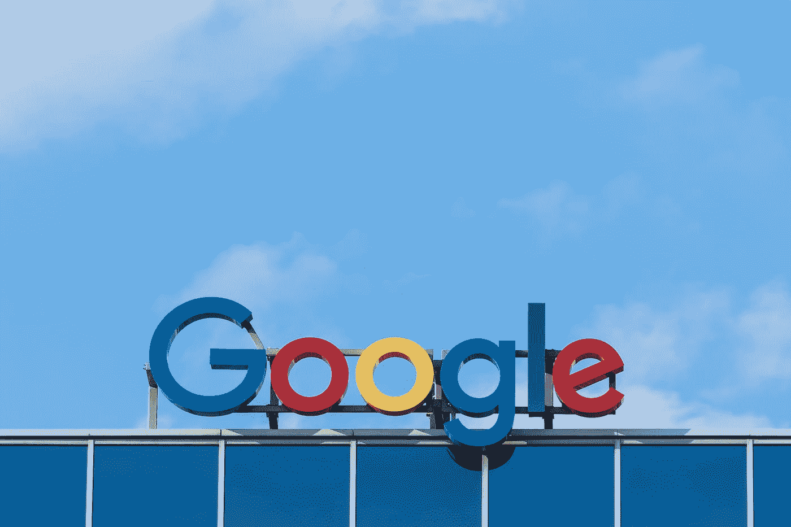

# Google+已经死了。那又怎样？

> 原文：<https://medium.com/hackernoon/google-is-dead-so-what-ec8bf9291bd9>

Photo by [Paweł Czerwiński](https://unsplash.com/@pawel_czerwinski?utm_source=medium&utm_medium=referral) on [Unsplash](https://unsplash.com?utm_source=medium&utm_medium=referral)

谷歌在 2019 年 4 月 2 日关闭了他们的社交媒体平台 Google+。很难找到一些没有提到谷歌社交网络时代结束的技术文章。但是，该公司服务内部的高水平连接一致性很少受到关注。在这篇文章中，我想分享我对谷歌服务一致性的内部方式的想法，以及当 Google+关闭时，这对谷歌 API 用户意味着什么。

从客户的角度来看，Gmail 照片的使用和向文档的进一步转移应该尽可能清晰——乍一看，这些服务是独立的，并统一在一个平台上，这是一个称为单点登录[accounts.google.com](http://accounts.google.com/)的接入点。但是作为开发人员，我们知道，术语“关闭”、“接管”、“集成”对那些参与这个过程的人来说有很大的意义(也有作用)。所以，让我们仔细看看谷歌的一个外部服务接管的过程，以及被接管的服务 API 和谷歌 API 是怎么回事。

## 帐户和用户 ID

除了使用 Gmail 和可能听说过 Google Plus 的用户之外，还有大量面向开发者的 API，包括账户标识符、臭名昭著的用户标识等。用户 ID 是谷歌的内部 ID，这是帮助谷歌服务了解谁是谁的东西。它出现在很多 API 中，我们看到它并没有因服务而改变。

## 让我们仔细看看谷歌进行外部收购的另一个例子

Chaos

显然，对于新吸收的服务中 SSO 的实现，不能简单地从旧的基础上获取和转移帐户到新的“Google 帐户基础”上。我认为根本不存在这样的东西——有许多相互交织的服务、交互级别、责任链、服务管理服务。说真的，如果你想一想，那么谷歌服务之间必须有许多许多许多层次的连接才能正常工作。但是一切都不那么顺利——为了推广 G+,它使用了全球 SSO 服务用户的 userID。

让我们回到正题。需要从 API 的吸收端和现在可以开始使用新服务的其他服务对现有 API 进行更改。这看起来没有什么特别复杂的——让这项服务的现有用户群适应“普通的谷歌”服务，创建与其他服务的互动点，以便他们可以为自己的目的使用新服务。但这不是关于小项目——一个好的公司不会在琐事上浪费时间，也不会吸收价值数百万美元的公司，这些公司很可能已经建立了基础设施——否则，它们不可能发展到现在的规模。因此，留下它的代码库，或者更确切地说，服务的核心，并重做服务链接的输入输出通道，使它们与谷歌兼容是有意义的。然后这个服务就变成了谷歌服务。让我们假设此刻它已经被测试过，并且被负责集成的 Google 的人认为是相当可信的。这是最有趣的部分——服务可以集成到其他服务中和/或在服务之间转移。总的来说，如果不是谷歌倾向于改变服务的注册，这并不可怕。以照片为例。

> Picasa 桌面应用程序(2002) => Picasa 网络相册— Google 收购 Picasa (2004) => Google Plus 合并 Picasa (2011) => Google Photos 从 Google+ (2015) => …

考虑到集成过程的惯性，在大多数产品中，Google 仍然支持非常旧的 API。在本文发表时，Picasa API 仍以 Picasa 作为独立产品时的方式工作。这让我们得出一个结论，当谷歌整合 Picasa 作为他们的下一个服务时，他们从原始产品中创建了一个“分支”，并将旧的“分支”留给命运的摆布，但没有关闭其 API。

然后是时候回忆一下关闭 G +的原因了。这是由于一个报告的安全问题，但实际上，由于不同 API 之间的不一致，可能会有更多的安全问题。

## 概念证明

例如，有一项服务叫做[PicasaWeb](https://picasa.google.com/)—[谷歌照片](https://photos.google.com/)的前身。它从 2016 年起[就不可用了，但是根据帖子末尾的注释——它的 API 仍然在运行。本 API 的终止日期为 2019 年 3 月 15 日](https://support.google.com/picasa/answer/6383491?hl=en-GB)。这项服务值得注意，因为它允许获得电子邮件和内部用户 ID 匹配。怎么会有用？

万一[我们开发一个电子邮件验证器](https://mailcheck.co/?utm_source=medium&utm_medium=inbound&utm_campaign=gplusarticle)。在这种情况下，这个 API 将是天赐之物。从 G+中知道一个帐户 ID，我们可以得到用户名、照片，甚至其他信息。诀窍在于，如果这个用户从未登录过我们的网站，你就无法获得 userID。尽管如此，用户仍然可以使用旧的 PicasaWebAlbums 在与电子邮件链接的网络相册上发布图片。这表明，旧的 API 允许使用用户 ID 或用户的电子邮件进入用户的帐户。

我们来查一下:[https://picasaweb . Google . com/data/feed/API/user/no SOV @ node art . io？deprecation-extension=true](https://picasaweb.google.com/data/feed/api/user/nosov@nodeart.io?deprecation-extension=true)

*   https://picasaweb.google.com/data/feed/api/user/—API 的终点[；](https://picasaweb.google.com/data/feed/api/user/)
*   nosov@nodeart.io —用户用于验证的电子邮件(如我们所见，不要求仅使用 Gmail 电子邮件)。用户拥有 Google Apps 帐户(这一事实有助于验证对潜在客户生成有用)，拥有 Google+帐户的用户也拥有此帐户(通过事先链接第三方电子邮件)，例如 Yandex.ru
*   deprecation-extension=true —关于即将到来的 API 端点的指示。

如果我们试图[传递不存在的电子邮件](https://picasaweb.google.com/data/feed/api/user/noname@nodeart.io?deprecation-extension=true)，我们将得到明确的解释响应:“无法找到电子邮件为 [noname@nodeart.io](mailto:noname@nodeart.io) 的用户，这导致该电子邮件无效的结论。甚至更多——如果我们试图向 API 发送一个组邮件地址，答案是“未知用户”。这样就有可能区分个人高管电子邮件和公司电子邮件的区别。如果个人数据没有被用户共享，很难说我们能以这种方式“捕获”个人数据，但是这对于通过 API 对用户列表进行全局验证是有好处的。

## 那么，这种不精确与 Google+关闭有什么联系呢？

## 结论

关闭 Google+的主要原因是安全漏洞，更准确地说，是服务从 Google+获取数据的能力，而这些数据是事先没有计划和打算的。

除了 Google+，还部分关闭了各种 API。例如，[您应该通过 payed audit 才能访问 gmail.api](https://cloud.google.com/blog/products/g-suite/elevating-user-trust-in-our-api-ecosystems) ，这使得大多数开发人员无法使用该 api。

## 引用

> 评估费用由开发人员支付，根据应用程序的大小和复杂程度，费用可能从 15，000 美元到 75，000 美元(或更多)不等。

事实上，这让我们有理由认为谷歌已经卷入了服务之间的交互系统，因为以前可以简单地通过获得所需范围来执行的操作，现在需要花费 15-75，000 美元进行手动验证，并手动包括在白名单中。现在只能猜测使用 Google 丰富的服务生态系统(尤其是 SSO 服务)的未记录功能还能做些什么。

为了对邮件列表进行定性验证，我们需要寻找新的非标准的公共 API 使用方式，因此我们将继续探索谷歌\脸书 API 和其他服务。(顺便说一下，脸书直到最近也有类似的邮件验证方式。)