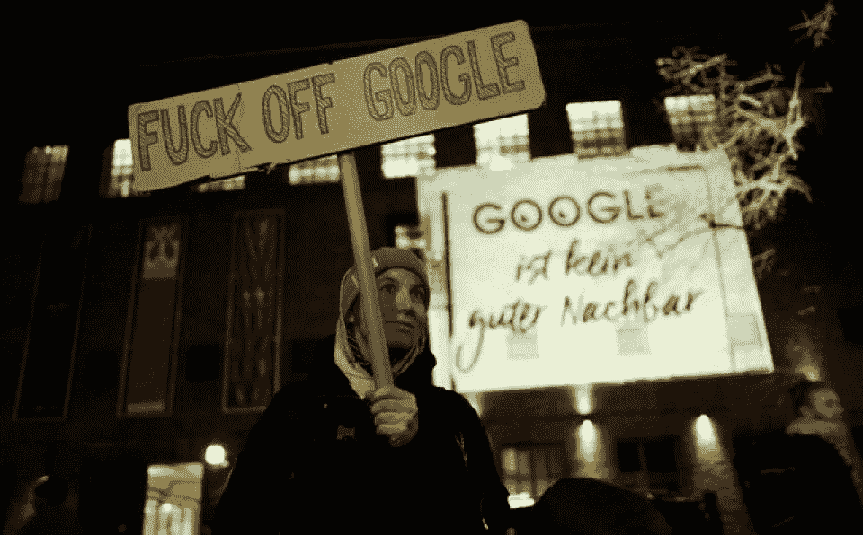
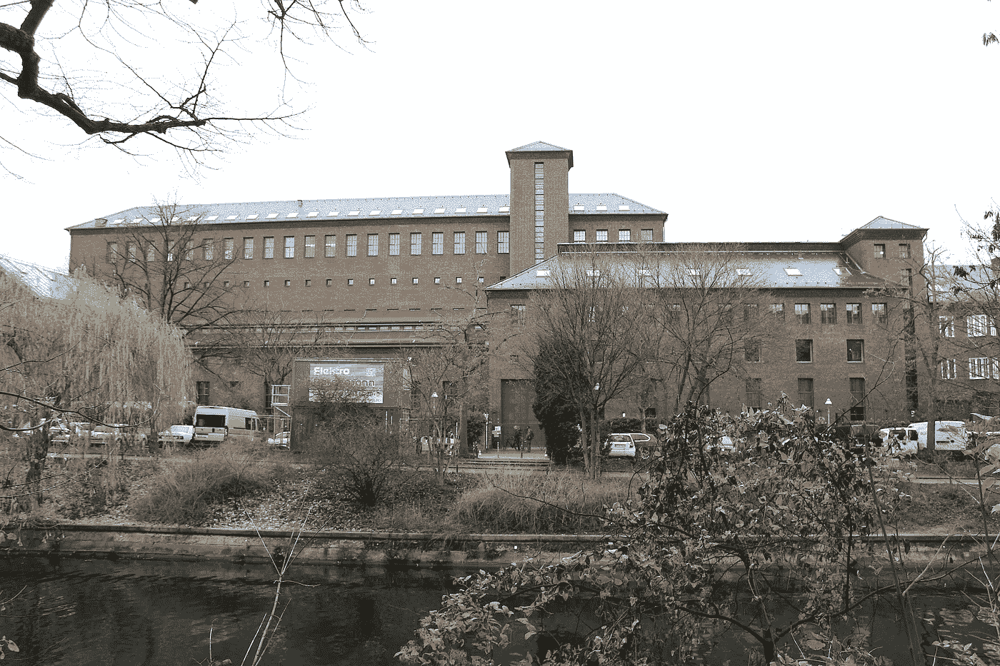
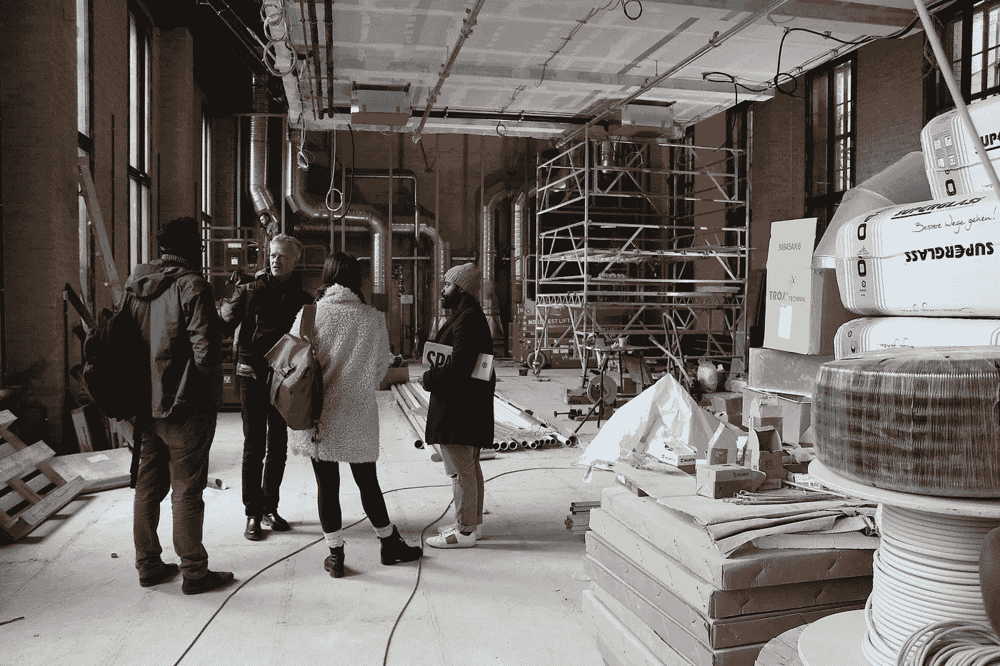

# 谷歌用他们的柏林柠檬做柠檬水

> 原文：<https://medium.com/hackernoon/google-making-lemonade-with-their-berlin-lemons-aa0e44412fe3>

## 柏林的黑客和“滚蛋谷歌”活动组织者拉里·佩奇布兰克(Larry Pageblank)认为，谷歌远没有结束柏林，因为他们采取了一种基层的方法来应对欧洲的下一个“硅谷”。

Source: [Reuters](http://cms.trust.org/item/20171218180621-dl4ys)

柏林——在谷歌决定放弃其计划在柏林建立的创业园区后，该公司将钥匙交给了两家当地非营利组织——Betterplace.org 的[和 T4 的【卡鲁纳】T5。估计投资价值为 1400 万美元，谷歌向这两个组织免费提供了五年的空间。](https://www.betterplace.org/de)

Umspannwerk, an old substation in Kreuzberg, Berlin, which would have been the Google for Startup campus will be a new social engagement house.

别名拉里·佩奇布兰克(Larry Pageblank)是对谷歌首席执行官的轻蔑致敬，他认为他们交出钥匙的决定是谷歌的一种方式，以保持他们的脚在门里，直到“社区将被‘清理’和同质化……当今天的抗议者可能已经被赶出他们的‘hood’。"

Pageblank 的观点在社区中并不罕见，从某些方面来说，是有充分理由的。这两家非营利机构与谷歌有着相当大的专业关系。最近大多数关于这一转变的新闻报道看起来更像是一场公关活动，而不是真正的新闻。许多文章都刊登了谷歌初创公司主管罗恩·巴尼特(Rowan Barnett)的照片，他在公司大门外将钥匙交给 Betterplace.org 和卡鲁纳的代表，并与他们握手，这是权力交接的象征。巴尼特也将留在柏林市中心米特的谷歌办公室。此外，这两个组织都是 2018 年谷歌影响力挑战的成员，并在谷歌在柏林建立校园的活动中提供了建议。Betterplace.org 的发言人 carolin Silbernagl[建议](https://www.eldiario.es/economia/salida-social-Google-berlines-Kreuzberg_0_835716956.html)该地区更需要社会部门的空间，而不是创业空间。

**这种关系回避了一个问题，两个非营利组织从谷歌获得财政援助有什么不好？**

看你是谁了，没毛病。然而，柏林人和谷歌并没有典型的友好关系。柏林人通常更信任政府决策和正当程序，而不是跨国公司经常无法预测的选择。此外，尽管谷歌大体上是德国最常用的搜索引擎，但公民们只是最近才开始认真使用 Gmail。事实上，与其他谷歌的创业园区不同，报道称 Gmail 在德国 T2 14 日至 T4 22%至 T5 之间的任何地方都有使用，领先的是供应商 GMX 25%和 WEB。德在 24%。这可能部分是因为 Gmail 域名在 2012 年进入德国相对较晚。德国企业家丹尼尔·吉尔施已经注册了 Gmail，这迫使谷歌使用 googlemail.com。

Karuna’s Jörg Richert shows interested locals the space.

尽管柏林与谷歌有着曲折的过去，但令人惊讶的是，社区并不完全欢迎这个新的替代提议的创业园区。这两个非营利组织计划让这个空间成为一个社交场所，口号是#KomminsHaus 或“进屋来”。该空间目前正在建设中，将于 2019 年 4 月开放，这两个组织目前正在通过电子邮件和亲临施工现场的方式向公众征求意见、建议和任何观点。这些组织已经得到了各种各样的建议，从包容性工作室到跨文化出版空间。他们的透明度和外向型方法表明，他们打算为社区成员提供持久的变化，而不仅仅是未来五年的短期计划。

Projected co-working spaces for hourly rent.

对于那些最初为谷歌创业园区辩护的人来说，他们在很大程度上也支持这一新使命。Julian Jost，一个支持谷歌园区的[邻近](https://www.spacebase.com/en/)创业公司的联合创始人，也支持这个新的倡议:“房子将是一个很好的补充，我希望本地创业公司仍然有办法参与它的社区倡议。”

然而，如果当地人认为谷歌展示他们人道主义的一面是为了获得柏林人未来的支持，我会说不要这么天真。反对者不会轻易动摇。相反，谷歌的草根方法是针对选民更信任的行政力量——政府。随着政府继续加大非欧盟企业在德国立足的难度，谷歌对当地的关注从长远来看可能会赢得政府的大力支持。

最终，谷歌从这种联盟中获得的好处相对少于这两家本地非营利组织。像“滚出谷歌”这样的组织可能最终会伤害当地非营利组织的影响力，以更大的努力避开跨国公司。不管谷歌的声誉如何，老变电站将成为该地区的社区发展中心。对于所有 Kreuzberg 潮人来说，至少你还有自己的共同工作空间。