# 图表年简讯:2019 年 4 月

> 原文：<https://medium.com/hackernoon/graphs-in-the-cloud-the-year-of-the-graph-newsletter-april-2019-aadda6d90d32>

## 云中的图表。

图空间中收敛的第一个标志在这里。图形数据库继续增长、扩展，并向云发展，已经发布了许多用于处理图形的开源框架，以及许多有趣的新用例。

最近 W3C 关于图形数据的 Web 标准化研讨会的一个收获是，RDF 和属性图(两种不同的图形建模方法)之间融合的想法似乎越来越受欢迎，而 RDF*是其中的关键。Kurt Cagle 在他的福布斯文章中也提到了这一点，不久我们就有了第一个切实的迹象:

[RDF 图数据库厂商 Cambridge Semantics 宣布支持 OpenCypher，这是一种基于 Neo4j 的 Cypher](https://www.prweb.com/releases/cambridge_semantics_adds_opencypher_to_anzograph_cambridge_semantics_is_first_vendor_to_offer_both_rdf_sparql_and_opencypher_graph_data_access/prweb16192576.htm) 的属性图查询语言。这将基于 AnzoGraph 对 RDF*的现有支持，这将是图形数据库首次同时支持 SPARQL 和 Cypher。

虽然有 [AWS Neptune 的先例，它也支持 RDF 和属性图](https://www.zdnet.com/article/aws-neptune-going-ga-the-good-the-bad-and-the-ugly-for-graph-database-users-and-vendors/)，但不同的是 Neptune 使用两个不同的引擎来实现这一点，这两个引擎不共享数据，可以分别通过 SPARQL 和 Gremlin 进行查询。

属性图更擅长遍历，而语义图通常更适合元数据。然而实际上，大多数图都需要这两个要求。当试图确定包络时，图遍历变得至关重要。类似地，当谈到断言的可靠性时，具体化也变得很重要。

Gremlin 是作为 Apache Tinkerpop 的一部分开发的属性图查询语言。Tinkerpop 基于图形虚拟机抽象图形操作的思想。这使得除了 Gremlin 之外，还可以为 Tinkerpop 开发许多来自查询语言的桥，使它成为一个通用的图形引擎。

Marko Rodriguez 是 Tinkerpop 的联合创始人和主要贡献者之一，他希望将事情推向下一个阶段。Rodriguez 与 Titan 一起创建了 Tinkerpop，Titan 是一个现已解散的开源图形数据库，在与 Aurelius 合作时被命名为 JanusGraph。Aurelius 已经在 2015 年被 DataStax 收购，Rodriguez 从那以后一直在用 DataStax 开发 Tinkerpop 3.x。

Rodriguez 想继续他在 Tinkerpop 4 上的工作，并通过他的新公司 RReduX 发布了一个筹资呼吁。如何[资助像这样的基础开源工作](https://www.zdnet.com/article/google-cloud-gives-open-source-data-vendors-a-break-will-that-save-open-source/)不仅仅是图形数据库的事情。

[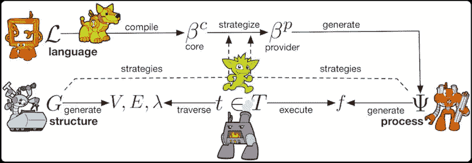](http://rredux.com/the-fabled-gmachine.html)

即使在图形空间中，不同的表示比比皆是，各种 RDF 和属性图格式也可以无损地相互映射。因此，列表、映射、表格、行、文档、图形等概念。都是简单的术语，指的是 g 结构中的递归值/指针模式。数据流经流程图，在流程图中，相互关联的功能进行映射、过滤、聚合，并最终产生一个结果。

Tinkerpop 4 完全是关于云的，它不仅仅是图形数据库。同样的情况也适用于谷歌最近宣布与一些开源数据供应商达成协议，根据收入分成计划，在谷歌的云上托管他们的产品。

Neo4j 是最初宣布选择的 7 家供应商之一。看看最初的群体是否会随着其他图形数据库而扩大，这将是一件有趣的事情。

官方消息:对于今天在 Google Cloud Next’19 满座的观众，我们正式宣布与 Google Cloud 建立新的战略合作伙伴关系，将 Neo4j 作为与 Google Cloud 平台深度集成的完全托管服务提供。现在，每个 GCP 用户都可以获得图形超能力，而不必担心运营和管理，使他们能够专注于他们最关心的事情:在云中构建应用程序。

ArangoDB 是一个(多模型)图数据库，也在上个月公布了重要消息。 [ArangoDB 获得了由 Bow Capital](https://www.arangodb.com/2019/03/arangodb-receives-series-a-funding-led-by-bow-capital/) 领投的 1000 万美元 A 轮融资，并正在开发 ArangoDB Oasis，这是一个将在 AWS、Azure 和谷歌云上运行的托管服务。

ArangoDB Oasis 是 ArangoDB 的托管服务，由创建 ArangoDB 分布式系统的人员构建和支持。Oasis 提供完全托管、管理和监控的任何规模的集群部署。专注于您的应用，我们的专家会处理其余的事情。

W3C 研讨会之后的[中更多的图形查询语言的发展。TigerGraph 正在开发其查询语言 GQL 的一些扩展。](https://www.tigergraph.com/2019/03/15/the-road-to-a-standardized-graph-query-language-gql-part-2/) [GQL 2.4](https://www.globenewswire.com/news-release/2019/03/21/1758574/0/en/TigerGraph-Brings-Together-Pattern-Matching-and-Efficient-Graph-Computation-for-the-First-Time-a-Boon-for-Fraud-Detection-Cybersecurity-Protection-AI-and-More.html) 现在支持[模式匹配](https://www.tigergraph.com/2019/03/13/graph-pattern-matching-example-in-gsql/)，对累加器的支持也即将到来。

[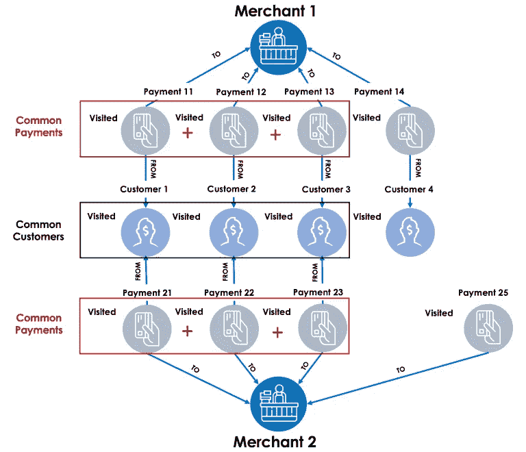](https://www.tigergraph.com/2019/04/08/hansel-and-gretel-big-data-analytics-with-graphs/)

当我思考解释累加器的最佳方式时，TigerGraph 的图形查询语言 GSQL 的一个关键特性，我意识到它与我们童年的一个故事有一些共同之处 Hansel 和 Gretel 的故事。GSQL 中的累加器可以作为图遍历算法中的“鹅卵石”。累加器带有内置的计算函数和数据结构，它们是为并行计算而设计的。

甚至更多的开源图形数据库。易贝刚刚开源了一个分布式 RDF 库 Beam。Beam 旨在存储单个服务器无法容纳的大型图形。它在存储多少数据和执行查询的速度方面是可伸缩的，但是有一些架构上的限制。

对图表的所有更改都要经过一个中央日志，这从根本上限制了总的更改率，而且它还不适合生产关键型部署。Beam 的查询语言与 SPARQL 不太兼容，其推理机也有限。

[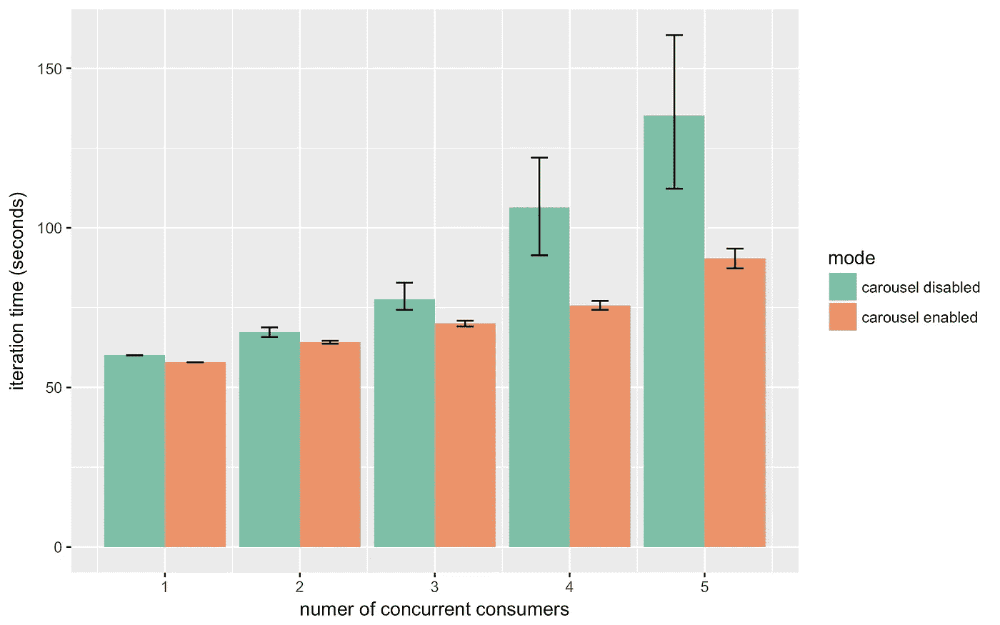](https://github.com/eBay/beam)

Beam 是一个分布式知识图存储，有时被称为 RDF 存储或三元存储。知识图适合于对通过许多类型的关系高度互联的数据进行建模，比如关于世界的百科全书式的信息。知识图存储支持对其数据的丰富查询，以补充机器学习应用。

什么时候图形数据库最适合您的用例？Optum 的 Dan McCreary 一直在深入研究何时在一家大型财富 10 强医疗保健公司中应用图表技术，并在图表用例的分类中提炼他的经验。McCreary 扩展了他的分析来解释为什么[知识图是计算的第三个时代](/@dmccreary/knowledge-graphs-the-third-era-of-computing-a8106f343450)。

[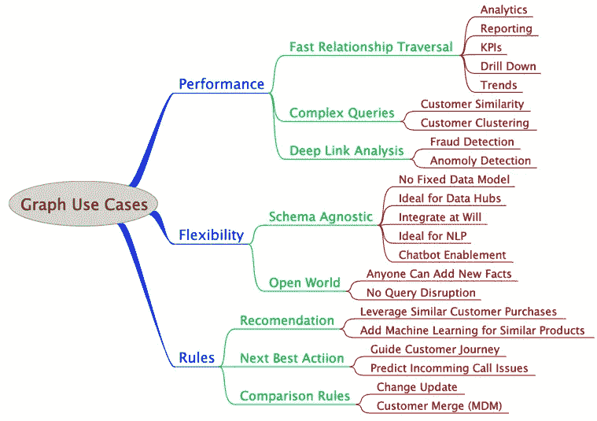](https://medium.com/@dmccreary/a-taxonomy-of-graph-use-cases-2ba34618cf78)

在过去的一年里，我一直在深入研究《财富》10 强大型医疗保健公司何时应用图表技术。我曾与数百个团队和来自不同领域的数千人一起工作过。当我开始这个过程时，我脑子里有一个小清单，关于什么类型的问题适合用图表来表示。

构建知识图的建模策略/模式怎么样？来自伯克利的 Chris Mungall 将这些应用于核心生物学知识(例如，基因、化学物质、疾病、环境、表型、疾病、变异之间的关系)。他将这些模式称为知识图建模和 OWL(又名逻辑)建模。Mungall 说，这些是互补的，可以一起工作，但发现如果在工作中知道“模式”是有用的。

[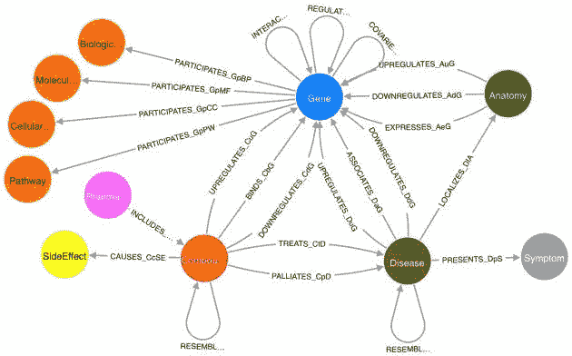](https://douroucouli.wordpress.com/2019/03/14/biological-knowledge-graph-modeling-design-patterns/)

我没有“知识图”的正式定义。我意识到这在某种程度上是一个营销术语，但是我认为有一些关键特性通常与 KGs 相关联，这些特性可能将它们与我在 RDF/OWL 中建模的方式区分开来。

奥兹曼迪斯是一个概念验证的生物多样性知识图表。该知识图谱的核心是来自澳大利亚生活地图集(ALA)的动物分类，结合了来自澳大利亚动物名录(AFD)的分类名称和出版物的数据。也可以通过 SPARQL 查询。

通过在出版物中添加大量数字标识符(如 DOIs)和可能的全文，该图得到了增强。标识符能够进一步扩大知识图表，例如通过在出版物之间添加“引用”和“被引用者”链接(来自 CrossRef 的数据)，以及显示来自生物多样性文献库(BLR)的数字。

[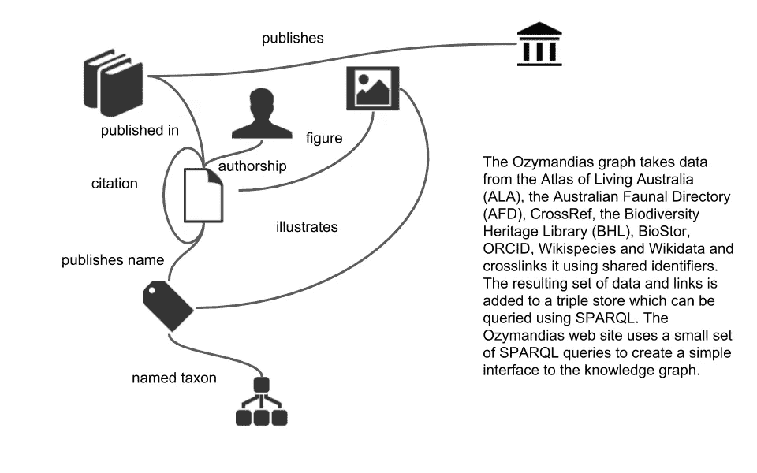](https://ozymandias-demo.herokuapp.com/)

知识图被实现为一个三重存储，其中的数据用少量的词汇表示(大部分是 schema.org 词汇，有些词汇借用了 TAXREF-LD 和 TDWG·LSID 词汇)。前两个面板中显示的所有结果都是 SPARQL 查询的结果，最右边面板中的内容来自对外部 API 的调用。

来自 Neo4j 的更多用例。通过图表暴露的消费者选择错觉，以及[如何保持冷静喝茶，图解英国最受欢迎的热饮](https://neo4j.com/blog/keep-calm-drink-tea-graphing-britains-most-beloved-hot-beverage/)。

[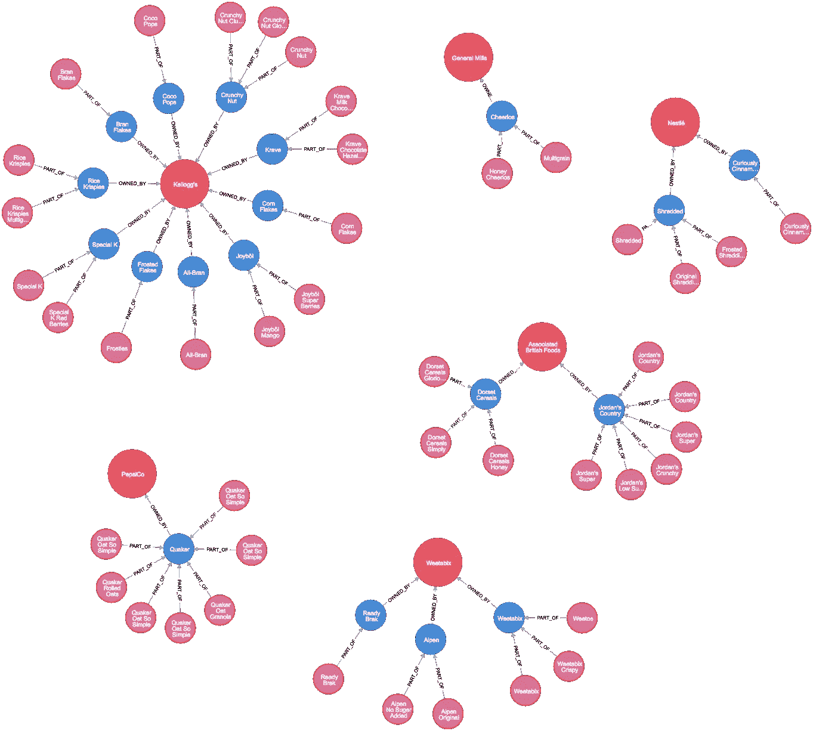](https://neo4j.com/blog/the-illusion-of-consumer-choice-a-tale-of-cereal-and-knowledge-graphs/)

几家大公司——大约 10 家——构成了普通杂货店中可供购买的绝大多数产品。你可能正站在麦片货架前，试图在几十种选择中做出决定。但是，无论你选择哪种谷物，你的钱最终都有可能流向极少数公司之一。我觉得将这些信息加载到 Neo4j 图形数据库中会很有趣，看看我们可以用它做些什么。

图表是用来看的，可视化加速了数据分析。Linkurious 的 Elise Devaux 总结了 2019 年绘制图形生态系统的第三部分，即图形可视化。

信息的可视化已经支持了许多类型的分析，包括社会网络分析。几十年来，可视化表示帮助研究人员、分析师和企业从他们的数据中获得洞察力。可视化工具代表了图形数据和分析师之间的重要桥梁。它有助于获得表面信息和见解，从而了解情况或解决问题。

脸书人工智能研究所(FAIR)宣布开放 PyTorch-BigGraph (PBG)的源代码，这是一种工具，可以更快更容易地为非常大的图形生成图形嵌入，特别是为模型太大而无法存储的图形生成多关系图形嵌入。

FAIR 声称 PBG 比通常使用的嵌入软件更快，并且在标准基准上产生与最先进模型相当质量的嵌入。有了这个新工具，任何人都可以使用一台机器或多台机器并行处理一个大图并快速生成高质量的嵌入。

[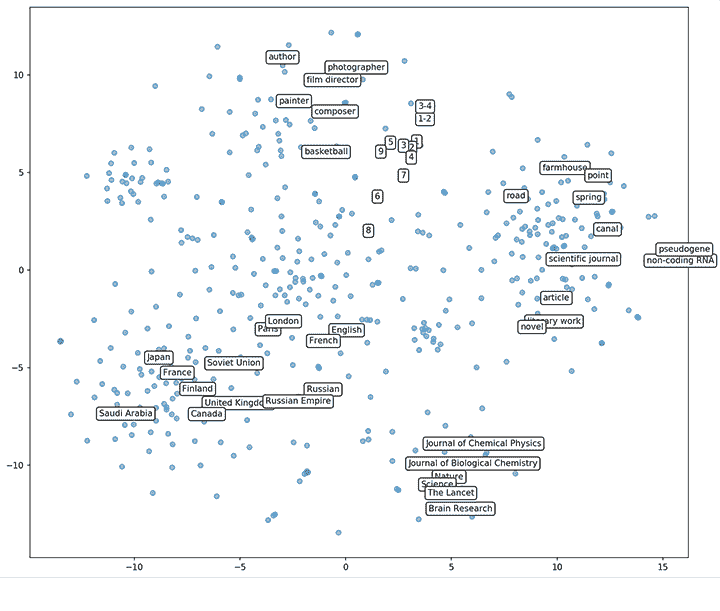](https://ai.facebook.com/blog/open-sourcing-pytorch-biggraph-for-faster-embeddings-of-extremely-large-graphs)

图形是表示多种类型数据的核心工具。它们可以用来对相关项目的网络进行编码，比如关于世界的事实。例如，像 Freebase 这样的知识库具有各种实体(例如，“斯坦·李”和“纽约市”)作为描述它们的关系的节点和边(例如，“出生于”)。

埃森哲还开源了 AmpliGraph，这是一个 Python 库，可以预测知识图中概念之间的联系。AmpliGraph 是一套用于关系学习的神经机器学习模型，关系学习是机器学习的一个分支，处理知识图上的监督学习。

AmpliGraph 的机器学习模型生成知识图嵌入，即度量空间中概念的向量表示。然后，它将嵌入与模型特定的评分函数相结合，以预测看不见的和新颖的链接。

[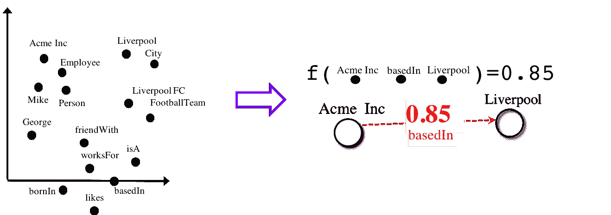](https://github.com/Accenture/AmpliGraph)

如果需要，使用 AmpliGraph:

*   从现有知识图中发现新知识。
*   用缺失语句完成大型知识图。
*   生成独立的知识图嵌入。
*   开发和评估新的关系模型。

Salesforce Research 还致力于预测知识图中看不见的和新颖的链接，并开放了他们用于此的代码。Salesforce 的研究科学家维多利亚·林(Victoria Lin)是一篇关于多跳知识图推理和奖励成形的论文的第一作者，该论文详细介绍了这项工作。

[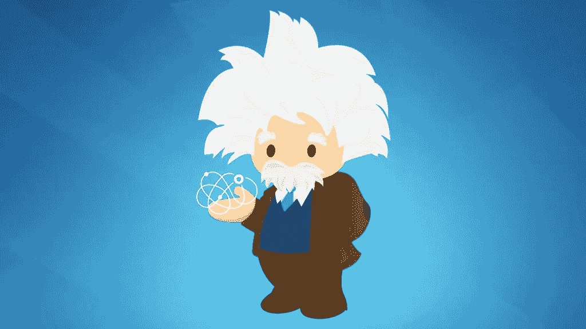](https://www.zdnet.com/article/salesforce-research-knowledge-graphs-and-machine-learning-to-power-einstein/)

现实生活中可解释的人工智能可能意味着爱因斯坦不仅会回答你的问题，还会提供证明。推进自然语言处理的艺术状态是在图和机器学习的交叉点上完成的。

帕德博恩大学的 DICE 研究小组刚刚发布了 DEER 2。DEER 是 RDF 数据集丰富的开源框架:在现有 RDF 数据集中有针对性地插入和删除三元组。

这可以是使来自一般知识图的数据符合特定于应用的本体，集成来自各种来源的数据集，收集和转换用于在 GUI 中呈现的数据，使用例如命名实体识别从文字中提取三元组等等。

[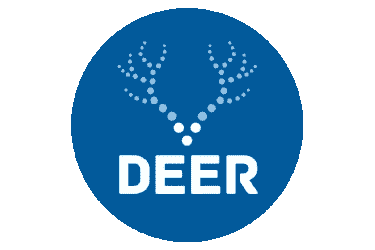](https://dice.cs.uni-paderborn.de/news/news-single/news/deer-2-released/?tx_news_pi1[controller]=News&tx_news_pi1[action]=detail&cHash=d352a8c55c2865c3e3d4bc96abded65d)

这个版本具有更新的配置词汇表，w3id.org 提供的闪亮的新前缀，DEER server 的改进版本，作为 JSON 文件输出的改进分析，一个全新的插件类型(DeerExecutionNodeWrapper)，使用 SHACL 的自动配置验证，当然还有对大多数现有丰富操作符的改进。

要每月在您的收件箱中收到图表年时事通讯，请在下面注册

贴有 [AI](https://linkeddataorchestration.com/tag/ai/) 、 [Apache](https://linkeddataorchestration.com/tag/apache/) 、 [ArangoDB](https://linkeddataorchestration.com/tag/arangodb/) 、[易贝](https://linkeddataorchestration.com/tag/ebay/)、[企业知识图谱](https://linkeddataorchestration.com/tag/enterprise-knowledge-graphs/)、[脸书](https://linkeddataorchestration.com/tag/facebook/)、[谷歌](https://linkeddataorchestration.com/tag/google/)、 [Gremlin](https://linkeddataorchestration.com/tag/gremlin/) 、[链接数据](https://linkeddataorchestration.com/tag/linked-data/)、 [Linkurious](https://linkeddataorchestration.com/tag/linkurious/) 、[机器学习](https://linkeddataorchestration.com/tag/machine-learning/)、 [Neo4j](https://linkeddataorchestration.com/tag/neo4j/)

*原载于 2019 年 4 月 15 日*[*linkeddataorchestration.com*](https://linkeddataorchestration.com/2019/04/15/graphs-in-the-cloud-the-year-of-the-graph-newsletter-april-2019/)*。*