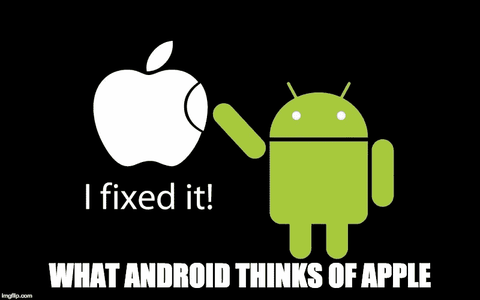

# React 原生 App 开发指南！React Native 的利弊！

> 原文：<https://medium.com/hackernoon/guide-to-react-native-app-development-why-react-native-is-the-future-of-app-development-b2372db9b775>

如果《哈姆雷特》在今天重演，开场白可能会是——到“安卓还是到 iOS”，这是个问题！在本文中，我们将告诉您为什么在 [React Native](https://hackernoon.com/tagged/react-native) 中进行跨平台应用程序开发有效，我们将为您提供 React Native 应用程序开发的 A-Z，使用 React Native 的利弊，以及为什么 React Native 是[移动应用程序开发的未来](https://www.binaryfolks.com/portfolio/solutions/mobile-development?utm_source=medium_hackernoon&utm_medium=Social&utm_campaign=content_marketing_feb_2019_react_app_development)。

据[联合市场研究](https://www.alliedmarketresearch.com/)称，预计到 2023 年，全球移动应用市场将以 19.2%的 CAGR 增长，达到 3112.49 亿美元。

Interchange 的首席执行官兼创始人 Matt Galligan 引用道:“在我看来，手机的未来是一切的未来。”因此，希望通过创新来影响人们的企业需要开发一款互动、流畅的移动应用。但是，选择哪个 app 平台呢？安卓还是 iOS？还是两者都有？

原生应用是特定于平台的，即 iOS 和 Android 分别需要单独的编码。这些将只能在目标平台上运行，并得到所有本地技术和硬件组件的支持。

有了原生应用程序，在开发和优化时会考虑特定的平台，它们的性能也会更好。它们速度更快、反应更灵敏、效率更高，也更安全。虽然有好处，但是本地应用也有一些缺点。

原生应用非常昂贵，通常有一个漫长而耗时的开发过程。原生 app 也需要频繁升级。

因此，为了抑制缺点，企业开始要求混合解决方案，即使用 HTML、CSS 和 Javascript 开发的应用程序，然后包装在原生应用程序中。虽然优势是开发速度快和代码可重用性，但混合应用程序仍在缓慢的性能和低于标准的 UI/UX 中挣扎。

为了限制混合应用中的性能和 UI/UX 相关问题，跨平台应用开发成为移动应用开发社区中的一个重要名称。跨平台应用运行在各种操作系统上。代码编写完成后，可以部署在不同的设备和平台上，而不用担心它们是否与平台不兼容。

React Native 是一个用于跨平台移动开发的开源移动开发框架。

2015 年，脸书宣布发布一个解决方案 React Native，这让世界上的每个移动应用程序开发者都喜极而泣。React Native 是一个开源框架，对 web 开发人员非常友好，因为代码只能用 Javascript 编写。React Native 一经推出，也成为了一个显而易见的选择，因为它帮助移动应用程序实现了与原生应用程序不相上下的性能水平。

**什么是 React Native？**

React Native 建立在 ReactJS 之上，是一个一次性编写和随处部署的解决方案，旨在加快移动应用程序的开发。React Native 允许开发人员基于可重用的可视组件用 JavaScript 创建 web 用户界面。React Native 还能够处理数据随时间的变化，而无需重新加载页面。

简单地说，React Native 可以帮助您开发运行起来和看起来完全像 Native 的成熟应用程序，甚至不需要一行特定于平台的代码。

开发时考虑了两种情况:

[i]更好的用户体验
[ii]可重用代码和更快的开发。

React Native 有一句口号“只需学习一次，随处编写”，意思就是如果你懂 JavaScript，你可以在你选择的任何平台上开发和实现应用程序，而不需要为每一个平台学习一套完全不同的技术。

所有企业都有一个问题，React Native 是我们的正确解决方案吗？让我们帮助回答这个问题。

**为什么要创建 React 原生应用？React 原生 app 开发有什么优势？**

5.61%的热门应用包含 React Native。让我们来看看 React Native 有什么优势，为什么它会越来越受欢迎。更重要的是，为什么要为自己的企业开发 React 原生 app？

**更好的用户体验**

React Native 使用本地组件而不是 web 组件来进行用户界面开发，以及 JSX，这是一种用于将 XML 嵌入 JavaScript 的语法。本机组件直接和独立地使用本机 API 呈现，因此提高了性能。

这将确保用 React Native 构建的应用程序有更快的加载时间和更流畅的感觉。这也使得 React Native 成为一个受欢迎的选择，因为这些应用程序提供了完美的性能和美学吸引力。

**单一代码库**

React Native 支持面向 iOS 和 Android 的 JavaScript 代码库。这意味着开发过程变得高效，测试和维护也变得更容易。这也将加快开发过程，降低应用程序开发成本。

脸书、Instagram、优步、Skype 等热门应用都使用 React Native。另一个优势是，如果需要，可以将本机代码嵌入到应用程序中。

有一些特定于平台的实例，比如说，iOS 和 Android 上的设计含义是不同的；React 提供平台特定的文件扩展名，可以检测支持应用程序的操作系统，并使用它来定义平台特定的实现。

**开发时间更少**

原生应用需要开发者投入大量时间，因为这些应用是原生编码的，
Objective C，iOS 版 Swift 和 Android 版 Java。这些应用程序需要很长的编译时间，对应用程序的任何微小更改都需要在两个完全不同的环境中进行推送和测试。

当我们谈到 React Native 时，这种开发时间减少了，因为可以在几个平台上共享一个代码。开发人员不再需要开发两个独立的应用程序，他们现在只需要开发一个应用程序，共享代码并进行必要的特定于平台的更改，从而减少开发时间。

实时重新加载使应用程序能够在代码发生变化时自动重新加载，从而进一步加快开发速度。

**性价比**

手机应用需求巨大。但是，当真正开发它的时候，我们看到需求的后续工作由于应用程序开发的过高成本而恶化。过去几年，原生应用开发成本失控。这主要是因为开发原生应用需要大量时间。原生应用的维护费用也相当高。

但是，使用 React Native，最大部分的代码可以在两个平台之间共享，因为不需要为各个平台构建单独的应用程序，所以开发成本大大降低。此外，React Native 中有一个预构建组件的开源库，也有助于降低应用程序开发成本。

延伸阅读:[如何降低手机 app 开发成本？](https://www.binaryfolks.com/blog/how-to-decrease-mobile-app-development-cost?utm_source=hackernoon&utm_medium=Social&utm_campaign=content_marketing_feb19_React_native)

**热重装**

每次保存源文件时，更改会立即部署到运行该应用程序的设备上。因此，您可以立即看到对代码所做的最新更改，并立即测试这些更改对代码的影响。

React Native 中的热重装只刷新那些有变化的文件，而不刷新 app。这避免了恼人的干扰，这是真正的不便。

尽管 React Native 是一个框架，并极大地简化了移动开发，但在开始使用 React Native 开发应用程序之前，需要记住一些事情。

React Native 是一项正在进行的工作。即使在今天，也没有多少开源库支持 React Native。React Native 高度依赖于脸书，在脸书解决 React Native 中的问题之前，您可能需要暂停开发。

[1]如果应用程序需要太复杂的功能，例如:太多的屏幕过渡、动画、设备传感器、地理定位等，本机应用程序是更好的选择。如果你的应用程序的性能对你来说是一个很高的优先级，避开 React Native 或任何跨功能的应用程序开发平台。

[2]如果你的应用程序过于依赖图形，比如说一个高性能的游戏应用程序，那么交叉开发可能不是你的最佳选择。你的用户不会想玩有任何延迟的游戏。

[3]如果你需要为 Apple watch 或 Android wears 或智能电视开发配套应用，React Native 不支持这些平台。

**结束**

React Native 在不影响性能的情况下整合了所有本机功能，并针对时间、成本和资源进行了优化。它相对较新，但正在成熟。读完这篇文章后，你就知道 React Native 提供了什么，以及为你的企业开发一个跨浏览器应用程序是否是一个好主意。

如果你正在考虑用 React Native 开发应用程序，给我们写信[,我们会很乐意倾听你的意见。](https://www.binaryfolks.com/contactus?utm_source=hackernoon&utm_medium=Social&utm_campaign=content_marketing_feb19_React_native) **咨询和评估完全免费**。

*最初发布于:*[*binary 乡亲*](https://www.binaryfolks.com/blog/guide-to-react-native-app-development-why-react-native-is-the-future-of-app-development)