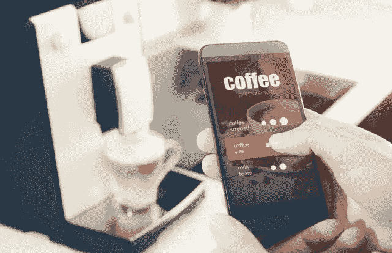

# 黑客如何在咖啡店工作

> 原文：<https://medium.com/hackernoon/hackers-can-steal-your-identity-and-bank-details-from-a-coffee-machine-5635883d4f4e>

黑客可以利用咖啡机和电视等智能家电窃取人们的敏感信息。据安全公司 Avast 的首席执行官文斯·斯特克勒(Vince Steckler)称，家庭中使用的联网设备，如笔记本电脑、手机和其他智能设备，并不安全，因为它们允许黑客利用它们来获取银行信息和其他个人信息。

斯特克勒表示，网络犯罪分子可以利用[物联网](https://www.cisomag.com/iot-cybersecurity-bill-introduced-in-senate/) (IoT)设备中的潜在漏洞，并危及它们的安全，从而窃取其所有者的敏感信息。

“咖啡机不是为了安全而设计的。电视不是为安全而设计的。它们是进入你的网络的额外媒介。你不能保护他们，”斯特克勒[在一份媒体声明中说。](https://www.dailymail.co.uk/news/article-7045105/Now-hackers-steal-ID-bank-details-coffee-machine.html)

最近的许多调查发现了我们经常使用的[智能设备](https://www.cisomag.com/tencents-security-researchers-discover-technique-to-hack-amazon-echo/)中的未知漏洞。最近，[网络安全专家 Yossi Atias](https://www.cisomag.com/cybersecurity-experts-identify-major-vulnerability-in-amazons-doorbell/) 在世界移动通信大会上展示了对亚马逊环形视频门铃的现场黑客攻击，暴露了这款流行的物联网设备中一个以前未知的漏洞。黑客发现，向 Ring 应用程序传输未加密的音频和/或视频片段允许任意监控和注入伪造的视频流量，这实际上危及了家庭安全，并将家庭成员的安全置于风险之中。

2018 年早些时候，来自[网络安全解决方案提供商 Check Point](https://www.cisomag.com/check-point-research-reveals-how-hackers-can-intrude-networks-via-fax-machines/) 的一项研究揭示了组织和个人如何容易受到通过他们的传真机进行黑客攻击。Check Point 的研究人员表示，传真机存在安全漏洞，黑客可能会利用电话线和传真号码通过公司网络窃取数据。研究人员还展示了他们如何能够利用惠普多功能一体打印机的安全缺陷。Check Point 的研究人员 Yaniv Balmas 和 Eyal Itkin 在 DEFCON 26 上展示了这些发现。

此外，德克萨斯大学的安全专家表示，黑客可以利用[联网灯泡](https://www.cisomag.com/2059-2/)作为秘密渠道来利用用户的私人数据。研究人员采用了 LIFX 和 Phillips Hue 智能照明系统进行研究。这项研究表明，黑客可以通过在智能灯和感应红外光的设备之间创建一个通信通道来操纵红外光，从而发起攻击。通过在手机上安装恶意代理，攻击者可以对私人数据进行编码，并通过红外隐蔽通道进行传输。

研究人员还指出，可以通过加强强大的网络系统，降低透光率和阻止攻击的灯泡亮度来缓解提出的威胁。

*原载于 2019 年 5 月 21 日*[*【https://www.cisomag.com*](https://www.cisomag.com/hackers-can-steal-your-identity-and-bank-details-from-a-coffee-machine/)*。*