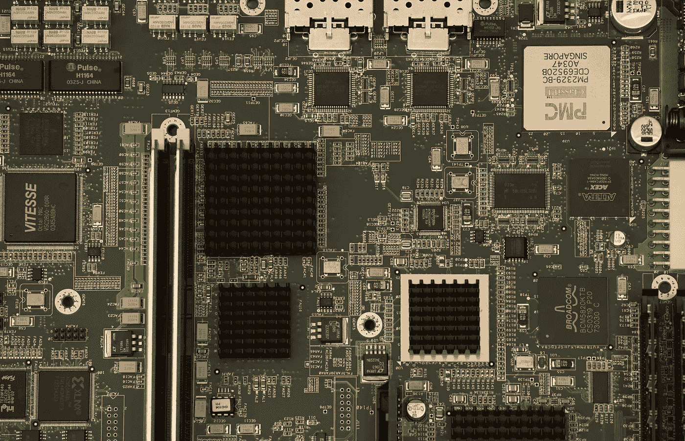

# 欧洲失去了科技巨头吗？

> 原文：<https://medium.com/hackernoon/had-europe-lost-its-tech-giants-ab8df9669aeb>

来自欧洲公司的 ech，来自芬兰诺基亚、德国西门子、法国阿尔卡特、瑞典爱立信的手机，来自荷兰飞利浦的电视等等。但现在在 2019 年，大部分似乎都消失了，所以所有欧洲科技公司都去了哪里。让我们找出答案。

> "我的第一个问题是，欧洲是否真的存在技术赤字？"

或者只是我的大脑在瞎编。所以，我开始搜索，为了简洁起见，我限制了我的搜索，只有面向消费者的技术，所以智能手机和所有搜索引擎，是的！工业自动化和会计软件，没有！我发现，消费电子硬件公司在欧洲基本上不存在。欧洲没有生产个人电脑或游戏机的大公司，智能手机的情况也好不到哪里去。HMD 生产诺基亚手机。此外，还有一些小众品牌。但所有这些加在一起卖的手机都没有一个 b 级中国手机品牌卖的多。自从飞利浦出售其电视业务后，欧洲也没有留下主流电视或显示器品牌。音频硬件似乎做得更好一点，德国森海塞尔等几个主要品牌仍然存在。但在这里，两个欧洲品牌的数量远远超过美国，许多品牌，比如奥地利的 AKG，正被出售给外部竞争对手。相机市场仍然由日本和美国公司主导，欧洲在智能手表、VR 和 AR 硬件或消费无人机等新硬件类别的竞争中几乎处于下风，甚至在组件层面也是如此。几乎没有欧洲公司。所以，虽然有一些欧洲的成功故事。我认为，可以肯定地说，在所有主要类别中，欧洲消费电子硬件公司都远远落后，它们的竞争对手来自美国或亚洲。另一方面，软件和在线服务的情况稍好一些。尽管这里也有一个大问题。我认为将这一类别分成三层会有所帮助

*   基础设施层。
*   平台层。
*   最终消费者应用层。

基础设施是互联网的支柱，它包括从云计算到内容分发网络甚至域名服务的一切，这里没有达到全球规模的欧洲公司。显然，地理距离意味着我不知道本地托管公司是否到处都存在，但美国公司在全球层面占据主导地位，潜在的竞争对手只是真正来自中国，而不是欧洲，这主要是因为中国基本上是一个不可渗透的泡沫。一个你可以在这里看到的泡泡。

平台层由支持其他软件和服务运行的软件组成，包括操作系统、网络浏览器、应用商店、搜索引擎，甚至社交媒体网络。在这里，如果你想开发一个应用程序，你必须通过这些平台交付它们，美国公司再次主导了这个领域的行业。在这些类别中没有一个单一的主要欧洲平台，唯一的潜在挑战。

在最终用户应用层，您知道运行在这两层之上的东西。欧洲公司实际上已经在这里制造了不少成功的产品。欧洲的成功故事来自开发单一产品或极少产品的公司。

与此同时，在美国和中国，除了这些专家之外，还有五加三公司，我称之为通用技术巨头公司，可以同时做成千上万件事情。他们一年可以收购数百家初创公司。欧洲没有这样的公司。

欧洲有很多小鱼，但没有大鱼。总之，欧洲很少参与基础设施或平台的软件和服务层，尽管它在最终用户方面有一些成功的故事。

它缺少老牌科技巨头的。因此，技术赤字是真实的。但是你们为什么不建立更多成功的科技公司呢？我认为这种分解实际上解释了很多这一层面向消费者的一层是欧洲唯一看起来相当成功的一层。与其他公司相比，它的不同之处在于，坦率地说，这里有成千上万家公司。应用程序和游戏越多，任何有好主意的人和一些聪明人就越开心，他们可以在宿舍里创建一个很酷的应用程序，不管这些开发者是来自欧洲、美国、印度还是其他地方。随着平台和基础设施的发展，空间变得越来越小，多样性也越来越少，世界真的只会采用几个操作系统、几个搜索引擎、几个全球云计算平台等等，一切都发生在大得多的规模上，每个平台有数万名员工。突然有了一个好主意和一群聪明的人不会把公司带到任何地方他们还需要合适的宏观经济环境许多愿意给他们钱的投资者宽松的税收和隐私法律和无穷无尽的受过高等教育的人，他们可以尽可能高效地雇用和解雇他们等等。这是关键问题，我认为欧洲正在落后。有了这些，就有受过教育的企业家，他们有伟大的想法，可以创造伟大的东西，各种调查证明了这一点。但这还不足以达到谷歌和其他公司的高度。所以，我认为这有五个主要原因

*   缺乏竞争力监管
*   投资环境地理和
*   人口统计学普通人的态度
*   欧洲公民对技术和
*   缺乏强大的创业生态系统

当然，我必须进行大量的归纳，因为这些指标在整个欧洲有很大的差异。还是从第一个问题开始，可以很有把握地说，欧洲的立法尤其是与美国的立法相比，或者说中国对科技公司来说并不理想税收很高这是一个直接的竞争劣势，劳动法可能是世界上最严格的。这使得公司很难解雇员工，这对科技公司来说尤其困难，因为科技公司的波动很大，公司不得不一直雇佣和解雇员工，以适应快速变化的环境。对于谷歌或脸书这样的公司来说，隐私法是世界上最严格的法律之一，这些公司的核心业务用户的每一次点击和每一次滚动都在不断与欧洲立法者斗争，即使是现在，至少可以说，让一家欧洲公司以同样的规模这样做是很困难的。最后，还有很多消费者保护条例和繁文缛节。因此，公司在合规性上花费大量资源，而不是花在击败竞争对手上。欧洲的投资环境也落后于美国和中国，这对初创公司尤为重要。举例来说，欧洲的初创公司更难筹集资金，尤其是当它们规模稍大时，

《财富》发现，2015 年，欧洲科技初创公司的融资收入倍数较低，为 2.6 倍，而美国为 3.9 倍。因此，总的来说，资金紧张，然后，有一个简单的地理推出全球服务只是在大型同质市场更有意义，如美国或中国首先在那里应用程序可以很快达到规模。想象一下，在欧洲这样做需要让产品适应 30 种语言、法律体系和文化。如果像 Alexa 这样的语音助手首先在欧洲推出，那就没有任何意义，然后还有更微妙的东西。我真的无法量化这一点，但欧洲人总体上对技术和商业都非常悲观。这就是为什么品牌隐私法如此严格。当我在东南亚生活和工作时。我经常惊讶地发现，我在那里遇到的大多数人都对新技术公司将解决他们的问题感到由衷的兴奋。因为在欧洲，我认识的大多数人认为科技公司是我们大多数问题的原因，而不是问题的解决方案。这种态度使得这里采用新技术的速度比世界上其他地方慢得多。我的最后一个原因是缺乏强大的现有创业公司，事实证明，让人们接触现有的蓬勃发展的生态系统，如硅谷和深圳，班加罗尔。只是有机地让他们建立新的创业公司，因为欧洲在倾销技术趋势方面有点慢。由于那里非常分散，在欧洲任何地方都还没有硅谷或深圳、班加罗尔这样规模的创业中心。这是一个先有鸡还是先有蛋的问题，更多的技术只会创造更多的技术，更少的技术只会创造更少的技术。我认为这五个季节结合起来解释了为什么欧洲没有全球科技巨头。在欧洲，融资更加困难，雇佣和解雇员工更加困难，接触人才和扩大规模更加困难，这意味着我们可以培养专家，但还不是所有的科技巨头。缺乏本土巨头也有一个相当大的副作用。由专家开创的新技术往往最终被巨头收购。在初创企业术语中，这被称为退出，大多数创始人和投资者都喜欢退出，因为这意味着他们最终可以从投资问题中获利。欧洲没有任何巨头，因此大多数创始人和投资者都会选择非欧洲巨头的退出方式。在欧洲，人才不断流失，这是我的结论。我认为，在欧洲，科技企业往往很难做大，当它们做大时，往往会被外国巨头收购。现在我知道我到目前为止听起来很悲观，但还有另一种方式来看待整个情况。同样，许多对公司不利的事情也可能对人们有利。我的意思是再次成为欧洲公民有很多好处，这是一个概括，但欧洲人往往有更长的假期，例如我的朋友在柏林有 27 天。我在马来西亚工作的时候只有 18 个。根据维基百科，存在巨大的收入不平等，是的，我引用他们的话来处理这个问题。欧洲几乎是平等主义的，因为它获得了更好的失业福利。如果说到相对便宜的全民医疗保健，高质量的教育是免费的，或者至少比各州提供的要便宜得多。

尤其是很棒而且通常很便宜的公共交通，更好的隐私，更强的消费者保护，受保护的环境等等。因此，你是否认为这些事情最终值得不要一个竞争异常激烈的技术环境，将最终取决于你的优先事项。不管是哪种情况，我认为知道我们正在做的权衡是很重要的。

open source