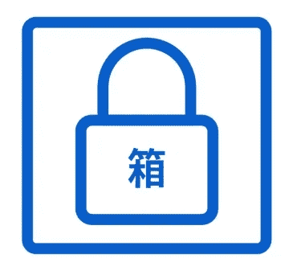
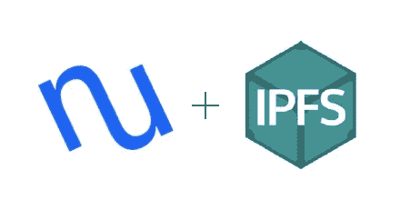
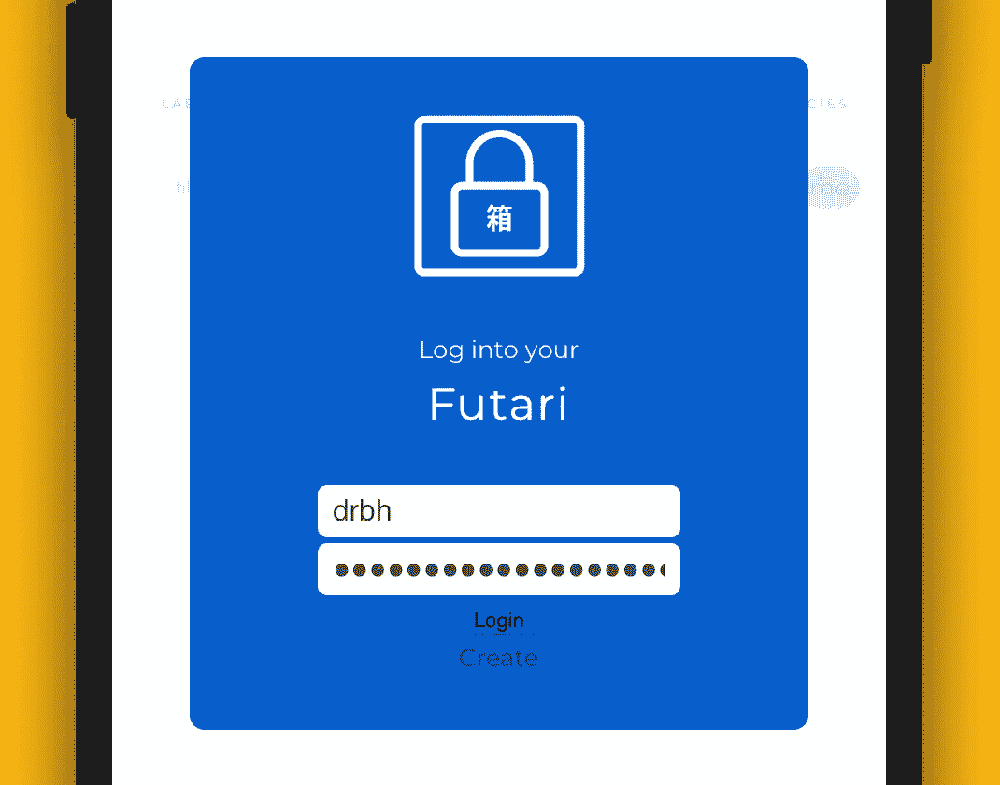
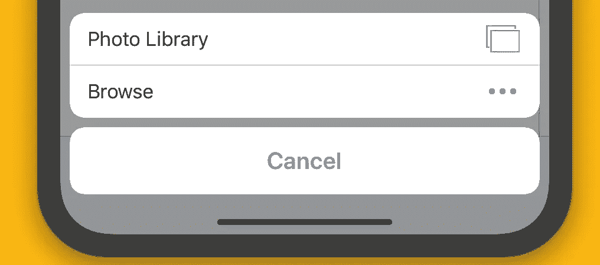
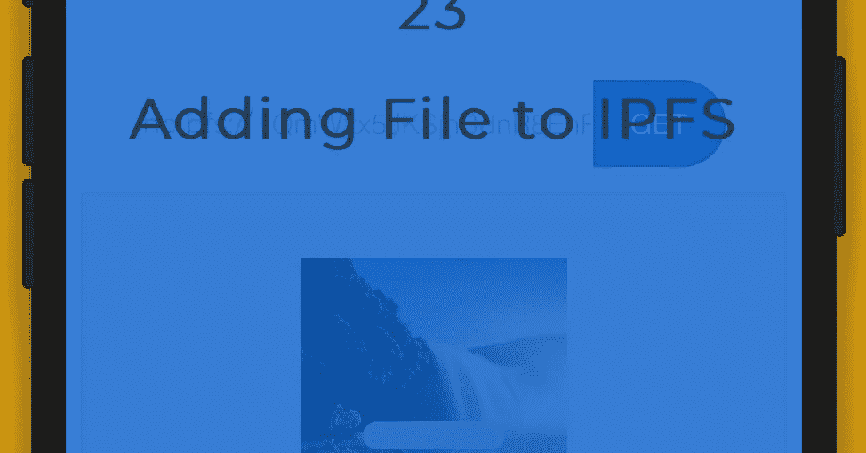
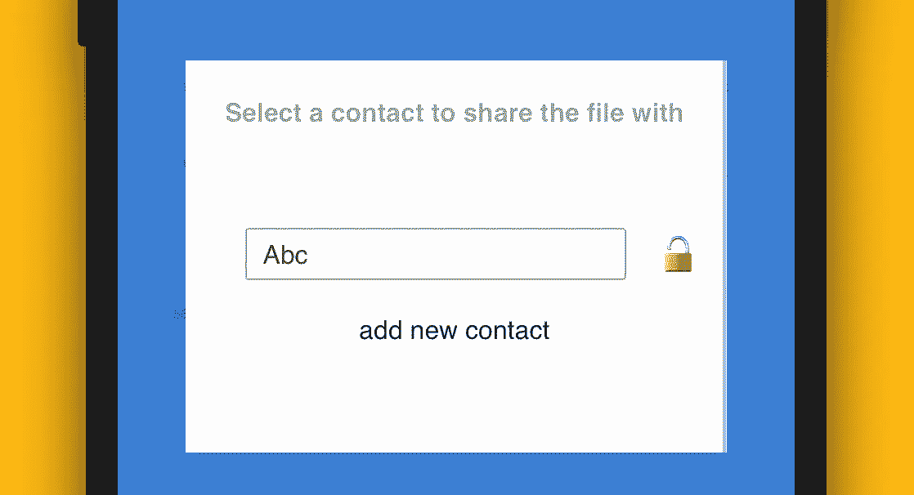
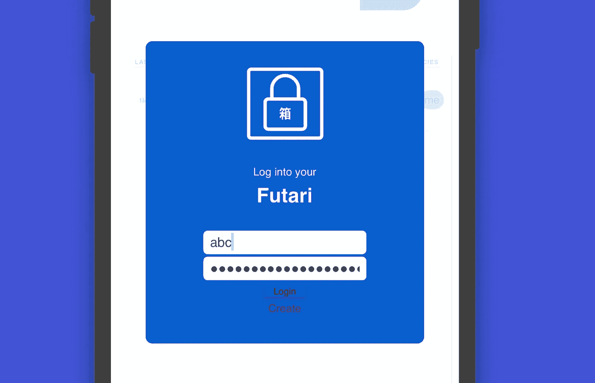
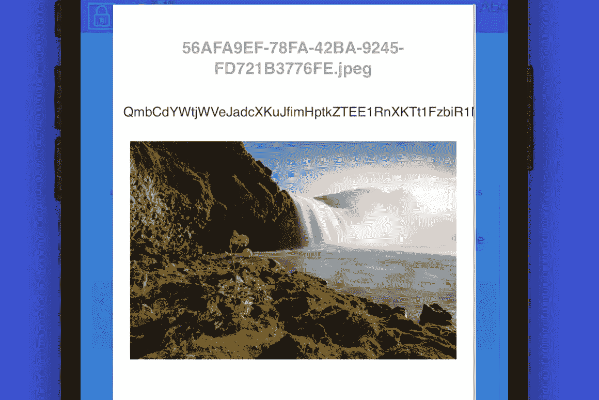
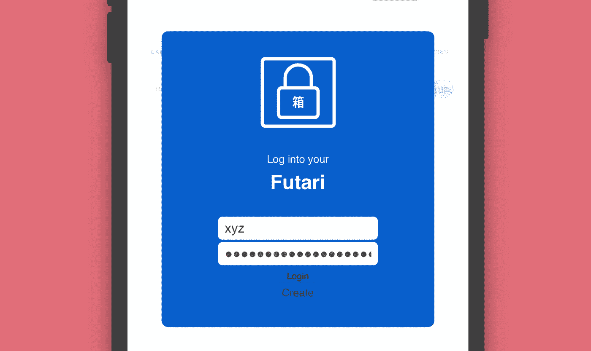
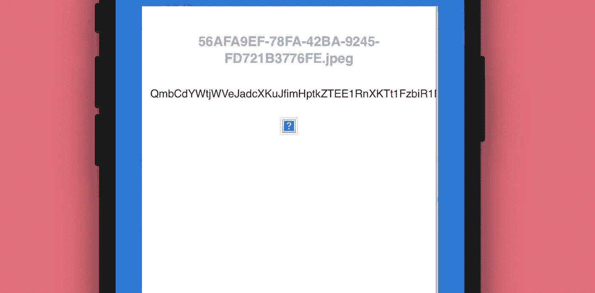

# 哈科

> 原文：<https://medium.com/hackernoon/hako-3825c3a033d7>


Hako on Iphone XR

## 由 Web 3.0 支持的超级安全的分散式文件共享应用程序

Hako 使用称为代理环加密的协议来有效地保护和许可数据。



Hako Logo

与 Dropbox 和 Google Drive 等其他文件共享服务不同， **Hako 不会将你的钥匙交给大公司**。用户总是控制着你的密钥和数据。

集中式存储存在单点故障(公司)，需要用户在线(连接到中央服务器)才能传输数据和委派访问。

## 请投票

只要在这里注册，然后向上投票两个项目:【https://coinlist.co/register】T4

[](https://coinlist.co/build/nucypher/projects/0af17a10-6b9c-4461-af05-2d63c1e4e03a) [## NCIPFS - CoinList

### 一个开发人员友好的 python 库，通过 NuCypher '的代理可以轻松存储、加密、共享和解密 IPFS 上的数据…

coinlist.co](https://coinlist.co/build/nucypher/projects/0af17a10-6b9c-4461-af05-2d63c1e4e03a) [](https://coinlist.co/build/nucypher/projects/310edf39-f55a-4ede-8a82-68be7dce6fbc) [## Hako - CoinList

### 面向 web 3.0 的分布式高效存储 dropbox

coinlist.co](https://coinlist.co/build/nucypher/projects/310edf39-f55a-4ede-8a82-68be7dce6fbc) 

# 网络的未来？



Web 3.0 protocols

Hako 利用 Web 3.0 点对点协议，因此用户可以直接共享数据，以及实时分布式 nucypher 网络，或联合网络(如在本地机器上运行)，或由您信任的某个中央机构(银行、学校、您付费的第三方)运行。

Hako 没有单点故障，并允许不可信的第三方委派对数据的访问，同时永远无法破译原始消息。

# Y.不是 Y.O.L.O

除了增加网络弹性和加密保护网络。Hako 遵循 Y.O.E.O(只加密一次)的方法，可以保存大量数据。

而不是为你想分享的每个用户复制和加密一封邮件。您只需对数据加密一次，并对密钥进行转换以允许其他用户访问。


Example data flow provide by NuCyphers Heartbeat Demo [https://github.com/nucypher/nucypher/blob/master/examples/heartbeat_demo/heartbeat_demo.md](https://github.com/nucypher/nucypher/blob/master/examples/heartbeat_demo/heartbeat_demo.md)

# 它是如何工作的？

如果您与 5 个人共享一个 1 TB 的文件，您将节省 4 TB 的加密时间和 4 倍的计算运行时间。

Hako 允许安全高效的数据共享。它依赖于 100%开源协议，以完全透明的方式加密数据，并利用内容可识别寻址和零知识证明来实现数据完整性。

# 为什么建造它？

Hako 诞生于 NuCypher + Coinlist 黑客马拉松。该项目实际上分为两部分，由一个名为 NCIPFS 的库和应用程序 Hako 组成。Hako 由 NCIPFS 提供支持，它为 NCIPFS 的底层方法提供了一个 REST 接口和 web-app。

# 建筑

重要的是，我们要将 Hako 分解成更小的部分，以全面了解它能实现什么。

知道*Hako 是如何建造的(在日本旅行时，在火车/飞机上，在允许 wifi 的咖啡店里)并不那么有用，但是*为什么*它是这样建造的。*

## 首先人们会问，为什么是另一个文件共享应用？

这很容易——随着更强大/更有弹性的通信协议的发展，很明显我们会将最有用的应用程序移植到对等网络上。

一个没有中心体的，一个先离线的，加密安全的，人力驱动的。

## 第二个人问，什么是 **Futari** ？



Futari 在日语中实际上是“两个人”的意思，对于 Hako 用户(Alice 和 Bob 角色的组合)来说似乎是一个合适的名字。Futaris 有能力在将数据放到 IPFS 之前对其进行加密，也可以从其他 Futaris 接收数据，然后从 IPFS 下载/解密数据。

好吧，那么… Futari 只是一个用户的昵称。是的，没错——但它的确切含义是什么，而在 Hako，我们没有用户。我们有 Futaris。

既然我们已经熟悉了 Hako 参与者——我们需要了解人们在分享什么。

由于 IPFS 上的数据驻留在它所要求的所有位置上，我们不想发送文件，我们只想与感兴趣的个人共享位置(和内容散列)。

然而，细心的读者会注意到，CID 并不真正共享任何有价值的东西——CID 指向的只是一个加密的比特桶。除了浪费你的电脑空间之外，没有任何用处。

因此，我们需要一种方法来传递信息，允许一个人请求适当的重新加密密钥，或者用人类的术语来说，就是将比特解码成原始文件所需的所有信息。

需要的数据有 4 部分:

```
CID + POLICY KEY + SIGNING KEY + FILENAME
```

我们用`_`将所有这些值连接在一起，创建了我们在 Hako 中称之为 NUCID 的东西

## 等等，什么是努基德？

它只是一个特殊的标识符，我们在 Hako 中使用它来获取一个文件和该文件的相关策略。如果一个人已经被文件的创建者(上传它的 Futari)授权访问，那么他们应该能够用他们自己的密钥解密文件。

这就是 NuCyphers 代理重新加密的神奇之处。它允许我们一次性加密数据，然后创建允许其他人用他们自己的密钥解密数据的策略(难以置信；我知道)但就像任何其他魔术一样——透过引擎盖下的窥视，我们可以看到让这个工作的所有美丽的数学。为 NuCypher 开发这些密码原语的天才们欢呼吧。🎉

NUCID 只是一个序列化的字符串，它包含了我们想要的所有数据(通过双击的方式)。NUCID 特意使用 Base58 编码，因此用户可以双击 NUCID 的任何部分，设备将自动突出显示整个 NUCID(使用更高的 Base 编码不会出现这种情况)。

## 包装它

所以我们现在对富塔里，努西德和哈科都很熟悉。我们看到了分布式文件共享应用的价值，以及一种与 IPFS 和 NuCypher 互动的简单方式，而无需了解任何底层工作。

1.  我们可以随心所欲地与任何人分享文件。
2.  我们可以使用久经考验的对称加密算法来保护数据
3.  我们有一个易于使用的网络应用程序，可以在我们的浏览器和移动设备上运行。
4.  我们有一个开发人员友好的库(NCIPFS ),可以很容易地与 IPFS 和 NuCypher 交互。
5.  我们有可扩展的概念，可以在分布式数据存储和隐私层的其他实现中重用。(福塔里和努西德)。
6.  我们为黑客马拉松提交了两个部分。一个开发工具和一个应用程序。

## 谁在乎

如果你渴望通过克隆回购来尝试演示，请跳到文章的底部，但是我们可能想更好地了解谁将使用这个应用程序以及他们如何使用它。它给那些用户带来了什么好处，以及他们使用模式的简短例子。

# 演示

首先，在应用加载时点击`create`创建一个新的 Futari。


Login if you have an account

接下来页面应该**重新加载**，现在我们可以登录了。


Same user/pass as you created above

现在我们在主屏幕上，可以做一些不同的事情！

如果有人已经与您共享了一个文件，并添加了一个策略来允许您新制作的 Futari 访问，您应该准备好一个 NUCID 来下载和解密。

您可以在应用程序顶部的 nucid 栏中输入该 NUCID，然后单击 GET 检索您的文件。


Enter your NUCID

另一方面，如果你没有文件下载，想上传你自己的加密文件到 IPFS，只需点击💾将出现一个符号和一个拖放框。


Landing spot for your files

您可以添加高达 4GB 的文件(目前，还没有为更大的文件添加分块，这是核心对称加密算法的限制)

在桌面上，你可以拖放到移动设备上，只需点击灰色窗格，你将得到如下菜单



native iPhone photo access

一旦照片或文件被选中，一系列的幕后过程将开始。


The photo well use for this article

1.  文件被转换为多部分上传，并发送到 Hako 服务器
2.  文件是用当前 Futari 的 Alice 加密密钥加密的。
3.  加密文件将存储在 IPFS。作为回报，CID 将被发送到应用程序。
4.  Hako 现在为你的 Bob 密钥重新加密数据。这样，即使我们更改 pier Alice 密钥，我们也可以访问数据。



up up up loading to Web 3.0

这么🙌我们现在已经成功地将文件加密并存储在 IPFS，并且可以访问该文件的解密副本(因为我们授予了自己权限)。

我们现在可以在文件列表中看到我们的文件，并有一些关于我们下一步做什么的选项。


The file list — with example file

这张桌子上发生了很多事情，所以我们将分别查看每一列。

**Label**——是人类可读的文件名——我们将其截断以便查看，但是如果您将鼠标悬停在它上面，您可以看到完整的文件名。

**CID**——这是内容可识别的地址，有点像 URL，但标识符在 IPFS。任何人都可以在这个地址获取这些字节，但如果你没有访问权限，它将返回一堆加密的胡言乱语。自己试试，在你最喜欢的 IPFS 门户网站上轻敲 CID，比如:`https://cloudflare-ipfs/ipfs/YOUR_CID_HERE`，你就会明白我说它是胡言乱语是什么意思。

**Size** —加密后放置在 IPFS 的可读文件大小。您会注意到，此文件的大小比原始文件稍大。还需要少量开销来实现 NuCyphers 的重新加密模式。

**Open**——现在我们进入可点击选项。在这里我们可以打开并查看文件！您将能够看到解密的文件内容(假设您具有访问权限)

**权限** —这是我们为文件添加策略和查看权限的方式。当你点击这个🔓系统将提示您选择或添加一个 Futari 以与其共享该文件(将在下面详细介绍)

**策略** —这是查看文件已与谁共享的方式。如果你上传了文件，你应该会看到你的 Futaris 的名字，因为 Hako 自动允许自己查看访问自己的文件。

# 共享

现在我们已经添加了我们的文件，并且理解了文件表，我们将开始与朋友、同事甚至我们的医生共享文件。

为了与某人共享文件，我们必须首先将他们的 Futari 的收件人密钥(或他们在 NuCypher world 中的 Bob 密钥)添加到我们的联系人列表中。


一旦我们将他们添加为联系人，我们就可以与他们共享我们想要的任何文件。

只需点击🔑符号将密钥复制到剪贴板。

请注意，我们还会复制用户名，以便其他人知道如何称呼您的 Futari


复制后，您可以将它们以任何您想要的方式发送给另一个人(电子邮件、slack、承运人洋泾滨)。

注意:这些密钥是*public*的，所以不必担心意外共享它们。

有人唯一能做的事就是用这些密钥让你访问他们的 Hako 安全文件。

我们想分享我们刚刚上传的照片，所以我们点击🔓符号，并提示添加联系人。

到目前为止，我们还没有接触，所以我们将复制一些密钥从一个演示 Futari 的我早些时候。


我们所需要做的就是复制他们的密钥(和用户名)，他们发送到输入框，并按下添加。


这么🎊，现在我们有了一个可以允许访问的联系人。


很好。🤙当我们授予访问权限时，一个多步骤过程在幕后启动。



1.  为所讨论的文件制定了新的策略。
2.  该策略将被发送到 NuCypher 网络，并在节点之间分发。
3.  Hako 为策略创建了一个 NUCID，其中包括文件 CID 和人类可读的文件名。
4.  Hako 会更新 UI，以反映我们授予新 Futari 的权限。


如果我们点击他们的名字，它会将 NUCID 复制到我们的剪贴板，我们可以与他们分享。再说一次，这可以公开分享，没有价值，除非你是那个 Futari。你需要他们的 Bob 私人钥匙来使用 NUCID。

完成✔️✔️✔️我们现在已经成功添加了一个文件，授予了自己访问权限，在应用程序中查看了该文件，添加了一个朋友，并授予了他们权限。我们都完成了我们的任务。

为了完整起见，我们将登录到我们刚刚共享文件的演示 Futari，并检索、下载和解密它。



We login as Abc

我们进去了，现在我们只需要把那个核号复制过来，粘贴到我们的核号栏里。


只需按 GET。瞧，✨文件被添加到这个 Futaris 文件列表中


快速浏览一下，您可以看到文件大小相同，并且具有相同的文件名/CID。看起来不错。

我们可以通过单击📖按钮并查看图像。



我们现在已经看到了使用 Hako 安全共享数据的端到端过程！不难，我们保持最高级别的安全性，我们以对等的方式共享数据，没有安全漏洞👏

## 如果其他人看到那个努希德怎么办？

为了显示完整的安全性，我们也将作为另一个用户登录，并尝试从上面共享的 NUCID 中解密文件。由于照片创作者没有授予此用户访问权限，他们应该看不到解密的照片。



我们以名为 xyz 的用户身份登录。


使用 Abc 解密的同一 NUCID—我们将其复制到我们的 NUCID 栏中


一个文件被返回…但是它很小，只有 17 个字节。(这实际上是我们试图向 NuCypher 请求 re 加密密钥时得到的无效响应。)



打开文件显示 IPFS 上相同的 CID，但是用户实际上看不到任何东西。他们没有被授权访问，这导致他们的解密尝试失败。

太好了！我们已成功与一个人共享了我们的文件，但只在 IPFS 上加密了一次

注意:因为 IPFS 是不可变的——同一个 CID 证明我们只加密了数据一次。

# 用户故事

## 与许多人共享大型加密文件

用户可以从 Hako 中受益的一个很好的例子是一个想要共享大型安全文件的人。因为 Hako 只需要加密数据并存储一次。它消除了与你共享的每个人的存储冗余。

而不是用每个接收者的密钥加密相同数据的多个副本。我们只存储一次。节省大量的存储空间。想想一个 5gb 或 100 TB 的文件意味着什么！这是全硬盘的节省量。

## 与多个参与者共享敏感数据

另一个很好的例子，也是其他 NuCypher 应用程序的主要关注点是有选择地与你想要的人分享私人数据的能力。以医学数据为例。

假设你在 Hako 里储存了一份你的 DNA 序列。这是非常敏感的数据，你只希望某些人能够访问。假设你搬到一个新的城市，想和你的新医生分享你的数据。传统上，你必须有一份 DNA(未加密)的副本，然后当你发现你的新医生的公钥时，你可以加密该数据，将其存储在某个地方，然后他们应该能够解密它。然而，当使用 Hako 时，数据已经加密并存储在 IPFS 上，你所需要做的就是将新医生的公钥添加到你的文件权限中，这将允许你从 IPFS 检索你的 DNA 序列并解密。不需要移动数据，不需要重新加密，您可以随时随地以您想要的方式共享数据。

## 离线共享数据

Hako 的另一个很棒的用途是允许用户离线共享数据。IPFS 是一种离线优先协议，不需要持续连接到网络的其余部分。如果选择使用本地托管的 IPFS 网关，并在本地运行小型 NuCypher 联合网络。他们可以获得在线 Hako 用户拥有的所有安全性和数据共享优势。

离线用户可能位于互联网不稳定或不可用的区域。这可能是在一个管理机构试图审查数据传输的国家。在这两种情况下，Hako 都可以用于在各方之间共享、许可和查看数据。Hako 首先是离线构建的，以保持安全性和数据完整性，并且易于使用。不管你与世界其他地方的联系如何，你都应该能够安全地分享信息。

Hako 还支持许多其他用途，上面的用户故事只是个开始。

底层技术有了很多发展，使得 Hakos 拥有了令人惊叹的特性。例如，NuCypher 正致力于发布 NU 令牌——这将实现真正的分布式网络访问控制。IPFS 很快将在 Chrome 等浏览器中实现，并且已经在 Brave 中可用(作为一个开发分支，尚未公开发布)，因此访问 IPFS 文件将像任何 http 站点一样容易。

# 下一步是什么

分布式 web 技术的未来是光明的，Hako 只是共享数据的强大方法的开始。

Hako 在不到 4 周的时间内制作完成，目前仍处于黑客马拉松的 alpha 阶段。要使 Hako 成为 Web 3.0 的首要数据共享应用，还有很多工作要做，提交后将继续开发。请帮助我们让 Hako 更牛逼！查看演示，留下评论，克隆回购，并提出一些拉请求。哈科是民有、民享的！

# GIF 演示以及如何尝试


为了完全访问 Hako，请克隆回购并在您的计算机上运行应用程序。这样你就可以掌管自己所有的钥匙，甚至可以离线运行 Hako。

## Python 库

https://github.com/drbh/ncipfs 是处理 NUCIDs 和 Futari 的库。它连接到 IPFS 和 NuCypher 网络的选择。这是一个开发者友好的库，可以集成到许多应用程序中。

## Hako 应用程序

https://github.com/drbh/hako 是为 Hako 运行提供 UI 和服务器端点的 web 应用。这可以在本地托管或运行。Hako 还处理与 Futari 相关的所有密钥，因此它应该保存在一个安全的运行位置。

注意:您将需要 NCIPFS 来运行 hako。Hako 希望在与 Hako 相同的目录中找到 NCIPFS 库，但是这可以很容易地在服务器文件中更改。

## 演示视频

上面的 GIF 是根据这个 youtube 视频创建的。如果您有兴趣按照自己的进度浏览演示，请观看视频。

link [https://www.youtube.com/watch?v=_0Jl836ETLo](https://www.youtube.com/watch?v=_0Jl836ETLo)