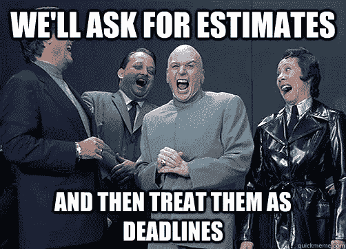
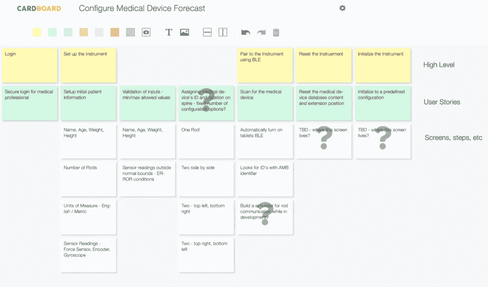
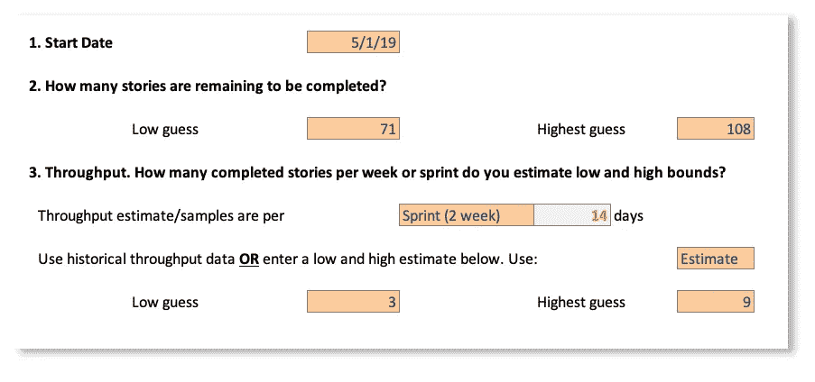
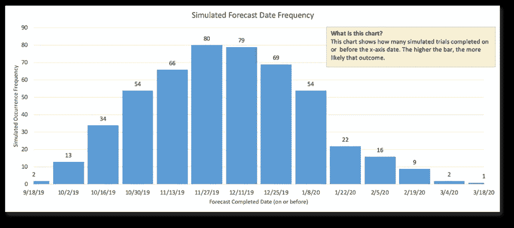

# 讨厌估算？试着做一个用户故事地图

> 原文：<https://medium.com/hackernoon/hate-estimating-try-doing-a-user-story-map-instead-1dfc12994d48>

不缺少厌恶评估软件项目的人。商人喜欢确定性。他们总是想知道某样东西要花多少钱，要花多长时间。软件工程师就没那么多了。我们已经被烧伤了很多次，给别人我们最好的“猜测”，只是为了让他们认为这是对我们的承诺。

我看到了故事的两面。

我们来谈谈更好的方法— *用户故事映射和预测。*

我已经用了几次这种方法，把我讨厌做的事情变成了我喜欢做的事情。

# 第 1 步—收集尽可能多的信息，了解需要什么

要开始，你需要与想建造东西的人交谈。你需要问尽可能多的问题，以了解他们对产品的目标和期望。有可能一份需求文档最终会摆在你的面前。那也很好，但是在你读完之后，一定要进行对话。

**重要的**:我们并不打算在这里进行评估的基础上深入血淋淋的细节。有些事情不明确或不确定是完全可以的。我们稍后将学习如何管理它。

# 步骤 2 —构建用户故事地图

这就是乐趣所在。

就我个人而言，我喜欢构建用户故事地图。它对我有用，因为我是一个视觉思考者(一张图> = 1000 字)。在我们与客户谈论他们想要构建什么之后，我们开始使用[纸板构建用户故事地图。](https://cardboardit.com/tours/)

我们希望把问题分解成易于处理的部分。我们不会陷入细节的细枝末节。我们捕捉骨科医疗器械不同角色的故事。

接下来，我们确保我们概述了需要开发的每个屏幕以及 UI 之外的任何重要内容。在所有这些之后，我们了解了需要构建什么。我肯定我们错过了一些东西，但没关系，预测工具将有助于这一点。

# 第三步——加起来

一旦工作被分解，我们行业中的大多数人要么使用工作量估算(小时/人-天)，要么使用故事点来估算工作。有几个选项我更喜欢:

*   t 恤尺寸
*   计数

t 恤尺寸相当简单。对于每个任务，您从一小组评估值中进行选择。比如小号，中号，大号，特大号。这可以简化事情，因为你不必担心数字。相反，你会根据每项任务与其他任务的比较，给每项任务一件 t 恤的尺寸。

我最喜欢用的是计数。这里假设每个任务的大小大致相同，因此您只需计算任务的总数，然后乘以某个因子就可以得到估计值。

有些人可能会说这种方法很疯狂。假设你分解的每项任务都是一样大的，差异太大了。我也是这么想的，但是数据显示没那么重要。

事实是，如果你能把它们分解成容易理解的作品，你的大部分故事将平均达到一定的数量，几乎没有变化。

# 第四步——预测它

整个过程中最棒的部分是使用 Troy Magennis 开发的预测工具。您可以从[这里](https://github.com/FocusedObjective/FocusedObjective.Resources/raw/master/Spreadsheets/Multiple%20Feature%20Cut%20Line%20Forecaster.xlsx)下载该工具。

该工具使用蒙特卡罗模拟给你一个日期范围，你什么时候会完成。更重要的是，每个日期都是确定的。

要开始预测，请在“预测”标签中输入以下参数:

*   开始日期——你认为什么时候开始
*   低猜测—为此，我计算了我的用户故事地图中的故事数量
*   高度猜测——这个数字包括我的返工、错误、未覆盖范围的可能性(换句话说，风险已经实现)
*   你的冲刺(或迭代)有多少天
*   对你在一次冲刺中能完成多少故事的最低猜测
*   对你在一次冲刺中能完成多少故事的高度猜测

在我们输入这些数据后，该工具为项目运行 500 次模拟，并收集结果。在这里，我们可以看到在特定日期模拟完成次数的直方图。例如，80 次模拟于 2019 年 11 月 27 日完成。

我们从工具中获得的另一个视图以一个漂亮的表格格式显示了项目在某个日期完成的确定性或可能性。当我想为某人回答问题“你什么时候能完成？“这是我在那次谈话中带来的信息。

我的目标是交流，不是一个日期，而是我们可能结束的一系列日期。我很少使用少于 50%的日期。只有当项目很小，我们没有依赖关系，并且我们知道风险很低时，才会发生这种情况。

大多数项目将落在 50% — 90%的范围内。

这就是我的预算和计划。我倾向于少承诺多兑现，所以我通常会给人们更保守的估计。我这样做是因为我知道软件开发中会发生一些事情。我们会有事情不顺心的时候。但是没关系，因为预测工具会帮助我们考虑到这一点。

我们适应并继续前进。

要记住的另一件大事是，人们会不停地问你“什么时候能完成？”在项目期间，人们希望知道变更和未计划的工作如何影响“完成”日期。这就是我喜欢这个过程和我使用的工具的原因。随着我们了解的越来越多，我们可以更新我们的用户故事地图，然后将其输入到预测工具中。

天气预报会一直变化，那么我们对软件产品的预测不也应该这样吗？不要在项目开始时给出一个单一的日期。相反，给出一个范围，并随着情况的变化更新这个范围。最后，通过传达你的预测让人们了解情况。