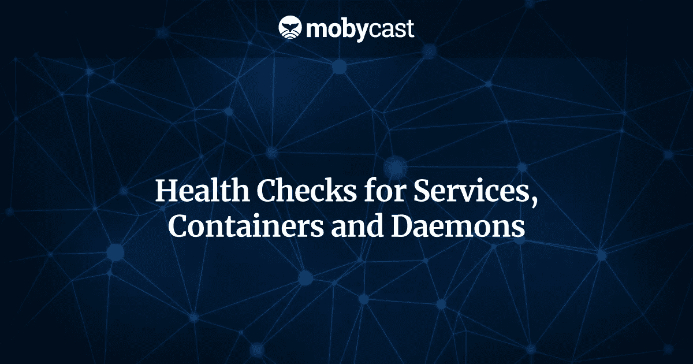

# 服务、容器和守护程序的运行状况检查

> 原文：<https://medium.com/hackernoon/health-checks-for-services-containers-and-daemons-7f326a66430e>

凯尔萨斯的乔恩·克里斯滕森和克里斯·希克曼讨论了服务、容器和守护进程的健康检查。他们用它们来保持 Kelsus 的分布式系统和服务正常运行。

该节目的一些亮点包括:

*   健康检查:从操作角度来看，在生产环境中运行任何软件时的第一道防线，用于检测错误并确定何时需要重新创建服务
*   健康检查涉及到某个东西击中一个端点来执行应用程序代码，并确定它是否在那个端口上响应并返回给它
*   两种主要类型的健康检查:浅层:使用服务代码创建新的端点；通过前端，路由到您的代码，执行代码，并返回一个表示成功的响应。深:不太常见，有几个优点和缺点；不测试任何依赖关系，仅识别服务是否正在运行并响应请求
*   如果您的服务没有依赖项就无法运行，请进行深入的健康检查
*   将您的系统设计为能够适度降级；如果深度健康检查访问了您的数据库，您需要确保它已启动并正在运行，并且可以连接到它
*   深度健康检查的注意事项:
*   昂贵的
*   启动延迟问题
*   多米诺效应
*   旋转:负载平衡器放在事物的前面，开始路由请求
*   配置健康检查时要记住的参数包括:(1)设置间隔，因为健康检查定期运行，而不是实时运行；加入 30 到 60 秒的延迟，让系统有时间启动。(2)确定您想要发送健康检查的频率(即，每秒、半秒、20 秒、5 分钟)；取决于服务类型。(3)确定你希望你的健康检查多长时间成功或失败；它是否在 100 毫秒或 30 秒后未能满足延迟要求
*   实现风格:您在哪里使用健康检查？
*   ELB 水平
*   后台作业或守护程序
*   综合:从调用者的角度进行健康检查，验证您的服务已经启动并正在运行，最终用户所期望的是正确的

**链接和资源**

[亚马逊弹性容器服务(ECS)](https://aws.amazon.com/ecs/)
[亚马逊弹性计算云(EC2)](https://aws.amazon.com/ec2/)
[亚马逊弹性负载均衡器(ELB)](https://aws.amazon.com/elasticloadbalancing/)
[凯尔苏斯](https://kelsus.com)
[秘密存储媒体](https://www.secretstache.com/)

**成绩单**

Rich:在 Mobycast 的第 53 集，Jon 和 Chris 讨论了服务、容器和守护进程的健康检查。欢迎来到 Mobycast，这是一个关于云原生开发、AWS 和构建分布式系统的每周对话。让我们直接开始吧。

乔恩:欢迎克里斯，这是 Mobycast 的又一集。这次，你就坐在我旁边。

克里斯:这是第一次。

乔恩:是的。

克里斯:很高兴回来，乔恩。

乔恩:我想，在巴西美丽的弗洛里亚诺波利斯，我们坐在一起唯一会发生变化的是，我们互相打扰的情况可能会少一些。但我认为，除此之外，这一集将和其他任何一集一样。本周，我们将讨论健康检查，我们如何在团队中使用这些检查，以及我们可能希望如何改变使用它们来保持分布式系统和服务正常运行的方式。在我们开始之前，因为这是一个特殊的一周，克里斯，你这一周都在忙些什么？

克里斯:我基本上一直生活在飞机上，感觉就像。我花了大约 32 个小时，从白雪皑皑的寒冷的西雅图，穿越半个世界，来到美丽、阳光明媚的巴西。我们和整个团队在我们公司的静修处，看到这个团队成长得如此之大真是令人惊讶。自从上次公司务虚会以来，有很多新面孔，非常有趣。

乔恩:是啊，真的很有趣。它足够大，我觉得这一次我没有与团队中的每个人共度美好时光，每个人都开始形成自己的团体和社交圈，看到这种增长真的很有趣。太好玩了，克里斯，这是你第二次来巴西。我已经来过这里六次了，我非常喜欢这个地方。今天早些时候我还在想，这个地方就像是一个不会改变的地方。你一次又一次地回来，你可以期待事情会像以前一样。在生活在快节奏的美国后，有些事情我真的很难跟上。

克里斯:当然。

乔恩:在健康检查下，也许我们应该像很多集一样开始，你可以给我们一个定义。

克里斯:当然。从操作的角度来看，健康检查是在生产中运行任何类型软件的基础。这是基本的检查，只需确保您的代码、您的服务正常运行，并且能够满足请求。当事情出错时，这是检测这些错误的第一道防线。通常，这些用于标识何时需要重新创建服务。在过去，许多已经重新启动，云真的只是基本上你拍它的头，并旋转一个新的了。运行状况检查为我们提供了识别何时出现问题并基本上重启的核心能力。

Jon:回想我的职业生涯，我想我第一次接触到健康检查是在我们为 Java web 应用服务器集群配置负载平衡器的时候。我认为在那个时候，我们所做的健康检查并不能真正告诉我们应用程序内部发生了什么，因为负载平衡器本身并不能真正告诉我们。它无法在应用程序级别实现负载平衡。它只能平衡计算机和网络的响应，而不是应用程序的快乐。但是它仍然一直向集群中的每台机器发送 pings 或网络请求。

每当我看到一个是不可用的，我就会停止运行该方向的交通。我认为从那以后事情已经有了很大的进展。健康检查要复杂得多，但归根结底，基本前提还是一样的。如果您看到某个系统或服务不可用，请停止向其发送流量。

克里斯:对。我认为你所描述的基本上是端口级、网络级的健康检查。您的服务运行在端口 80 或 443 上，所以 ping 那个端口，您得到响应了吗？这是一个基本的检查。现在，正常情况下，健康检查包括触及某个端点本身。您实际上是在执行应用程序代码，不仅要确定它是否在该端口上做出响应，还要确定代码是否在实际运行中对它做出响应。

乔恩:我认为这是了解你可能进行的健康检查类型的好方法。如果您将到达一个端点，并期待来自该端点的响应，那么为了查看您正在查看的系统是否正常，您可能会做些什么？

克里斯:对。也许这是一个很好的时机，在这里大致解释一下两种主要的健康检查，浅层和深层。浅肯定是最常见的。这是你通常会做的。我们有我们的微服务，或一些 API 服务，无论它可能是公开一个端点，通常是非常简单的。我们将深入探讨浅健康检查和深健康检查有何不同，以及为什么要考虑这一点。同样，最基本的是，通过这些肤浅的健康检查，保持严密。这是一件非常迅速的事情。这是在运用你的实际服役准则。它是一个端点，在那里作出回应，所以它通过所有的前端，路由到您的代码，执行代码，并返回一个表示成功的响应。

乔恩:简单的健康检查，让我们试着用例子来思考。也许我们有博客服务。你可以在帖子上做 crud。您可以创建帖子、更新帖子、获取帖子。一个肤浅的健康检查，真的会得到一个特别的职位吗？或者你会试着去找一些更肤浅的东西吗？

克里斯:是的。对于一个肤浅的检查，你肯定想要更肤浅的东西。通常情况下，你肤浅的健康检查是要经常执行的。

Jon:你是想提前得到一个帖子，还是告诉我这个端点存在，我可以向它发送消息，比如 head 而不是 GET？你明白我在说什么吗？如果你能做的只是创建、更新、阅读和删除帖子，那会怎么样？这是一个非常小、非常小、非常微小的服务，您希望对它进行简单的运行状况检查，并且您不希望拥有数据库。这是我从肤浅的健康检查中听到的。你能不能做一些轻量级的 HTTP 请求，比如 HEAD 或者类似的东西来保持它的浅层次？

克里斯:对。我只是建议您为浅层健康检查创建一个新的端点。称之为/状态。您创建了一个新的端点/状态，基本上它所做的只是回显类似“只返回一个 200”的内容

Jon:这告诉你你的服务是活的，因为如果它不响应，那么整个服务就死了。

克里斯:没错。它非常轻便。它非常快。你没有测试其他任何东西。您没有测试上游依赖性。你没有给你的服务增加任何负担。它只是基本上验证我的流程启动并运行，在最高级别上，一切都在工作。请求传入，它们被路由，代码被执行，响应被返回。

Jon:是的，你可以从中学到很多，因为如果你的进程颠簸，它没有足够的内存，它有问题，那么即使是肤浅的健康检查也可能有问题，或者在许多情况下会有问题。

克里斯:当然。肤浅的健康检查顾名思义，这并不是一件坏事。这是你想做的。它们非常有用，会给你提示，比如这里有问题，我们无法满足请求。

乔恩:是的。因为如果您的浅层健康检查没有通过，那么您肯定希望立即停止将流量路由到您的服务的特定实例。

克里斯:对。用我们的朋友 Chrome 的话说，“它死了，Jim。哦，太好了。”

乔恩:对。然后是另一种明显的检查，它很深。让我们稍微讨论一下，你什么时候会用到它们，它们是什么。

克里斯:深度健康检查有点意思。绝对不太常见，有很多优点和缺点，以及围绕它们的许多合理的考虑。我们谈到了肤浅的健康检查。它非常快。它不测试任何依赖性，非常轻量级。它只是简单地说，“嘿，这项服务已经启动并运行，它正在响应您的请求。”

深度健康检查。所以我有了这个微服务架构。我的服务是其他服务的消费者。如果我的服务的一些依赖项没有启动和运行，可能我的服务就完全不可用了。深度健康检查是一种更高级、更全面的检查。您不仅要检查您的服务是否在运行，还要检查您的依赖项是否也在运行。你的依赖也可能是你真正依赖的其他微服务。可能是你的数据库。你之前的例子，比如，“嘿，我们用这个调用访问数据库了吗？”这肯定是深度健康检查要考虑的事情。

乔恩:好的，很好。它们是什么很有意义。我们谈到了使用浅层健康检查的重要性和好处。如果我们的主要想法是，我们只是想停止路由流量到一个进程，只是颠簸或死亡，那么浅有道理。什么时候用才有意义？你说也许你依赖的其他服务正在运行，但你能举个例子吗？我们使用过深度健康检查吗？什么时候才真正有意义？你什么时候做？

Chris:我认为真正有意义的地方是，如果你的服务没有依赖就无法运行。那样的话，你得做一次深度健康检查。让我们假设你有一个数据库，你的微服务与之对话，如果不能与该数据库对话，你的服务将无法运行。你很可能会改变你的健康检查来测试这一点。同样，如果这是您的要求，即如果没有这种依赖性，您的服务就无法运行，那么您需要查看深层运行状况检查。

当然，设计您的系统以便它们可以优雅地降级也是一件非常好的事情。像数据库这样的东西，你可能不会太优雅地降级，但你很可能会这样决定，“与其对此进行故障切换，我会显示一条错误消息，或者我会切换到这样的系统…”

乔恩:美国在线？

克里斯:对，没错。美国在线。这可能是你的策略，而你有一个依赖服务的警报，“嘿，这个东西需要修复。”

Jon:之前你说过，为了让你的浅层健康检查真正轻量级，并让它远离其他更重要的处理，你应该为此创建自己的端点。你会做类似的事情吗？假设您的深度健康检查需要确保数据库在那里。你能不能做一个状态表，里面只有一行，然后你只需要得到那一行，然后这是一个简单的方法来确保你的数据库是活动的，它不会对任何其他表做任何事情，而且对数据库来说非常简单。

克里斯:这是一个伟大的观点。如果您正在进行深度健康检查，并且它将触及您的数据库，那么您要确保数据库已经启动并正在运行，并且您可以连接到它。如果您有一个包含数百万条记录的表，不要在健康检查中选择那个表。你用这个测试的不是这个。你只是在测试基本的连通性。去敲一个只有一条记录的表。即使这是一次深度健康检查，你还是想保持轻松。

乔恩:没错。我们将何去何从？我们知道什么是浅层健康检查，什么是深层健康检查。也许我们可以进入一些实现风格？

克里斯:对。关于深度健康检查，也许有一些事情需要讨论。再说一次，它们很贵，所以你需要考虑到这一点。您还会遇到启动延迟的问题。通常情况下，当您启动一个新的服务实例时，正在进行的事情之一是执行健康检查。一旦成功通过，系统就知道这个新服务已经正确启动，现在可以有效地投入使用了。

乔恩:你介意我用稍微不同的方式说吗？我的意思是，这是绝对正确的，但我只是觉得有点复杂，当我听到它。我只想说，如果你使用 ECS，你会得到不同的容器；如果你使用 EC2，你会得到不同的机器；如果你使用另一种服务，谁知道会怎样。它们都是可用的。你有一个集群。你有很多事情要做。你希望他们每个人都能满足你的要求。当你说把它放进旋转时，那就是你的意思。所有这些东西前面的负载平衡器将能够开始将请求路由到那个东西。现在在轮换。我必须澄清一个术语。

克里斯:对。绝对的。你有，你有启动延迟来考虑很多系统，比如 ELBs 或者你正在使用的任何集群机制。在失败之前，他们还有一定的时间。他们将进行运行状况检查，如果它在五秒钟内没有响应，则它没有通过运行状况检查。它不会永远呆在那里。会有一段时间与之相关。如果你做了一次深度健康检查，费用很高，而且无法在规定时间内回复，那你就有大问题了，因为你永远也不会通过健康检查。

即使你的系统一切正常，它也永远不会通过测试。你需要考虑到这一点。这将是一个好主意，就像有一个初步的健康检查，相当深入和昂贵。然后在那之后，你切换到浅层。很多时候，就像当你启动时，你想确保一切都正常运行。一旦这样做了，然后你可以切换到一个浅。这肯定有点复杂和高级，但肯定是要考虑的事情。

深层健康检查要考虑的另一个问题就是多米诺骨牌效应的概念。你的深度健康检查触及多个服务。想象一下，在您的主服务上对您的利基进行健康检查需要一些时间，然后它会对一个依赖服务进行健康检查。也许其实是另一种微服务。它不像关系数据库。那么，如果那个微服务的运行状况检查出现问题，并影响到另一个微服务呢？你开始把这些请求串联起来，你必须考虑所有的时间。如果是中间的一个失败了，或者是末端，会发生什么呢？深度健康检查变得更加复杂。这就是为什么几乎所有的时间你都将停留在浅层的健康检查，你将依赖你的监测和你的警报独立于你的上游依赖。

乔恩:对，有道理。我只是在试图思考多米诺效应是如何工作的，因为当你调用的微服务调用它所依赖的微服务时，如果它碰巧遇到了 100 个可用服务中的一个，那么它会认为整个服务都关闭了，它会说，“我也要关闭。我也没在工作，”但真的很不幸。随着你对微服务的依赖越来越深，这种不幸的可能性会越来越大。是啊，看起来像是微服务，深度健康检查，在你把这些放在适当的位置之前，真的要好好想想。

克里斯:是的，在这种特殊情况下，希望其他一切都正常，所以你的上游服务应该有自己的健康检查，它们在一个集群中。理想情况下，你甚至不应该打。如果您的集群中有一个笔记是坏的，它应该没有通过其集群的健康检查，然后被删除。希望在它试图去连接它之前就已经发生了。它甚至不在这条路线上，但它可能会失败。运行状况检查定期运行。它们不是实时运行的。你必须每隔一段时间做一次健康检查。你会有失败，他们会站起来。在那周围使用它。

Jon:您刚才谈到了时间间隔，因为您已经谈到了在设置健康检查时需要考虑的几个参数。我认为，我们不妨就 AWS 而言，将这一点具体化。我只是打算冒险一试。我记不清了，但我认为有三个基本参数你必须牢记在心。一个是在你开始做健康检查之前的延迟。在我向该系统发送第一次运行状况检查之前，我希望等待 30 秒、45 秒、1 分钟，以便给它时间启动。另一个问题是我希望多久发送一次健康检查。我希望每秒、每半秒、每 20 秒、每 5 分钟发送一次健康检查，这实际上取决于服务的类型。没有最佳实践，这完全取决于服务的类型以及它的古怪和挑剔程度。我认为第三个是你希望你的健康检查多长时间才能成功或失败。是 100 毫秒后失败，因为你有一个超高超低的延迟要求，还是 1 秒，5 秒，30 秒后失败。我认为这是三个参数，但如果我错了，请纠正我。

克里斯:总的来说，我认为这些就是类别。特别是 AWS，对于 ELB 运行状况检查，一些参数有点像是在想象，它需要通过多少次运行状况检查才能确定运行状况良好。是参数吗？可以设置为 1。我想默认是两个。在投入使用之前，它必须成功通过两项健康检查。你还会知道在你被认为不健康之前你需要通过多少次健康检查。你有你的健康检查间隔。您多久进行一次健康检查。

乔恩:我得到的那个。

克里斯:是的。一旦某个东西被标记为不健康，它需要通过多少次成功的健康检查才能重新投入使用。初始健康检查的延迟，不是因为 ELB，通常是因为其他一些服务。ECS 有这个。ECS 将启动一项任务，您可以指定。ECS 在将其注册为目标组的一部分之前会有一个延迟。

乔恩:这有点复杂，如果你能在一个地方解决这些问题，那不是很好吗？但是 ECS 是告诉负载平衡器“现在我在为你而跑”的那个，而不是负载平衡器说“我在那里看到你了”。我会给你时间做好准备，”我可以在一个地方配置我所有的健康检查需求，但这很有意义。ECS 意识到启动负载平衡器需要时间。它不知道。搬运工就像这样，“让我把交通引到某个地方。”

克里斯:负载平衡器非常通用。你可以做很多事情来结束这一切。

Jon:我们将继续讨论实现风格吗？我之前操之过急了。

克里斯:对。这实际上只是实施，比如您在哪里使用这些运行状况检查。毫无疑问，就服务和集装箱而言，最常见的是在 ELB 层面进行健康检查。这是负载均衡器的内置功能。这只是一部分。负载平衡器只是保持所有不同主机、目标的成员集，不管它作为一个集管理什么。这是我的一组节点，可以响应请求。它有一个成员集。这些健康检查内置于负载平衡器中。

负载平衡器知道，“嘿，对于成员集中的每一个节点，定期进行健康检查，如果失败，将其从成员集中删除，将其标记为不健康。继续点击它，如果我让它恢复正常，那么我会把它放回会员集中。”所有这些都是在 ELB 完成的。你免费得到它。除了配置健康检查之外，您不需要做任何事情，让您服务实现一个适当的健康检查，然后就可以开始了。如果你愿意的话，这和普通的程序一样简单。任何有入站流量的微服务，由 ELB 更好地处理，这是一个很好的模式。

当你的服务不是 ELB 的朋友时，情况会变得更复杂，因为现在你必须问自己，它会做什么健康检查。常见的例子是，如果您有后台作业或守护进程。基本上，你可以把它看作是推和拉。ELB 前端服务，它们的请求被推送给它们，它们走到前端，而这些守护进程服务通常是拉取的。他们是出去拉活的人，定期找工作做这类事情。他们没有收到入站请求。相反，他们在做工作，他们基本上是一个客户，他们可能会碰到其他由 ELB 主持的事情。为此，您将需要一个定制的实现来进行这些健康检查。它变得有点复杂，但也是非常重要的。有很多不同的方法可以做到这一点。

Jon:我想我从来没有在一家软件公司工作过，它有一些守护进程在运行，但没有人知道它。当你有了一家新公司，你在开发计费系统，你的速度很快，你建立了一个恶魔，你会想，“等等，为什么我们有一段时间没有看到任何 pdf 生成了？啊，守护进程没有运行。”

克里斯:通常在这种情况下，你会在几分钟、几小时、几天后注意到，你会说，“啊哦，这东西整个周末都坏了”，而你永远不会知道。这是一个大坏。这类事情的健康检查非常重要。但同样，这要复杂得多。你必须弄清楚如何实现它。

乔恩:对，你肯定想在周日早上或周六下午找到答案，而不是周一早上九点。你出现了，“我能修好它，这是我的工作，”从来没有那么方便。

克里斯:当然。同样，各种不同的攻击计划。你可以有一些非常简单甚至有点傻的东西，但是继续前进，在这些守护进程作业前面放置一个 ELB，让它们有一个入站路由。这是你的状态检查。有一个私人面对 ELB，基本上有一个工作，只有一个工作，那就是检查，看看这些东西是否启动和运行。

乔恩:太好了。配置某种警报或云监控警报，以便在这些东西不可用时得到通知，这真的很容易吗？

克里斯:在这个特殊的例子中，你不需要做任何事情，因为 ELB…

乔恩:哦，它会重新开始。

克里斯:对。你做了简单的健康检查。这有点奇怪，因为你只是在它前面放了一个 ELB 做健康检查。想想就像，“我不知道，为什么不呢？”这是最少的代码量，你可以利用你所使用的。

Jon:为了确保我理解了这一点，因为 ELB 将向 ECS 发出信号，你应该保持服务运行，至少有一个服务实例在运行，ELB 告诉 ECS，“这东西坏了。重启它。”这就是为什么你会在它前面放一个 ELB？

克里斯:我把 ELB 放在前面的原因是因为你需要做健康检查。这实际上就是像微服务一样在 ECS 上运行的普通服务。不是 ECS 检测到它已关闭，而是负载平衡器进行运行状况检查，确定它已关闭。它会将其标记为不健康。ECS 订阅了该事件，它看到了该事件，然后它终止了该任务并启动了一个新的任务。然后它会返回并将其插入成员集。然后，ELB 接管并执行其运行状况检查。如果通过，它将返回成员集。这是他们之间来回的舞蹈。

您可以对这些后台、这些守护进程作业做同样的事情。实际上，您唯一需要做的额外工作就是更新守护进程以接受一些 HTTP 流量。这就像你必须有一个小的微型 HTTP 服务只是监听，并能满足进入你的 HTTP 或 HTTPS 的请求，无论它可能是什么。

乔恩:我喜欢那个黑客。它很小，只是利用了 AWS 已经知道如何做的所有这些繁重的工作。

克里斯:对。对我来说感觉像是欺骗，感觉不对。但同样，它简单快捷。你可以做一些更复杂的事情。有很多不同的技术可以使用，但基本上，你只需要有一个定期运行的东西，它可以走，伸出手，和这些东西说话，并判断它们是否在运行。

无论是云手表警报触发 Lambda 来判断某个东西是否正在运行，您都可以移除这些东西，或者让它们失败并标记它们，然后让 ECS 杀死它并重新启动它。这是一种更复杂的方法，也有一些优点，但同样，需要更多的努力。

乔恩:对。太好了。我想这是我们今天的最后一个要点了。合成纤维，这是什么？

克里斯:对。我想说的最后一件事就是合成材料的概念。运行状况检查正在验证您的服务已启动并正在运行。它可以响应你的请求，但这并不一定意味着事情进展顺利，用户看到的东西实际上是正确的。一个非常好的例子是，你有一个网站，可能有一个登录页面，它必须与数据库或其他相关的微服务进行对话，然后出现了问题，代码中有一个错误，它没有在登录屏幕上显示登录框、用户名和密码。这是一个破网页。

你的健康检查不会发现这个的。当它到达端口 80 或端口 443 时就会这样做。它通过了健康检查，但实际上你的网站不工作。从呼叫者的角度，从最终用户的角度来看，合成材料基本上是健康检查。在这个特殊的例子中，你会有一个合成的，基本上是出去，它不只是测试它是否回到 200。它实际上是检查响应并验证响应是否正确。你真的可以把这当成一个测试案例。

乔恩:我猜是生产整合测试。

克里斯:对。我们今天和团队进行了一次很好的谈话，讨论了如何为移动应用程序做 UI 测试，以及如何实际创建这些残余。这就是你可以使用的合成材料，这将是一个有用的东西。它会去获取 HTML。然后，它会把它加载到 DOM 中，检查它们期望的元素是否在那里，它们是否有正确的文本标签。同样，这是另一个非常有用的东西。您不仅验证了您的服务是否正常运行，还验证了最终用户的期望是否正确。

乔恩:让我想到的是，当我们谈论健康检查时，我在某种程度上想，我们也希望我们的代码在事情不顺利时做出反应。我们希望我们的代码能够捕捉错误，并开始以一种适合所看到的错误类型的方式运行。如果数据库或我们依赖的另一个服务出现问题，代码应该开始能够关闭一些东西，但这真的很难。

很多时候，当你写系统的时候，你没有时间让你的代码写得那么深。这就是说代码可能会返回一些不好的东西，整个系统可能会进入一些不好的状态，但如果我们可以编写这些合成代码，从用户的角度来测试这个世界，那么我们至少有机会在用户之前或在这个过程的早期发现世界是否不是他们应该的样子。即使不是我们所有的错误处理和对每一个微服务的思考，以及它在错误情况下应该做什么，都是完全审查、烘焙和完美的，因为它从来都不是。

克里斯:对。绝对的。你认为合成材料是你进行浅层健康检查的一种组合方式，而合成材料给了你深层健康检查的优势。他们真的是这么做的。如果您的最终用户没有按照他们期望的方式响应您的调用者，即 API，如果它没有得到预期的响应，则代码中有错误，或者可能是某个上游依赖项出现故障，您的 synthetic 将会发现这一点。它让你两全其美。

不要将深度健康检查用于标准健康检查。这是以更频繁的速度击打它们，但是相反，使用合成音，你也可以判断你想要在那里使用什么音程。与肤浅的健康检查相结合，这是非常有用的。

乔恩:非常酷。嗯，这让我很着迷。最近没怎么做这方面的工作，所以学到了很多。谢谢你。

克里斯:太棒了。去看看你的状态。

乔恩:没错。

克里斯:好的。

乔恩:下周再聊。

克里斯:好吧。谢谢你乔恩。再见。

亲爱的听众，你坚持到了最后。感谢您抽出时间，并邀请您继续与我们在线交流。这一集，以及节目笔记和其他有价值的资源可在 mobycast.fm/53.获得。如果你有任何问题或其他见解，我们鼓励你在那里给我们留下评论。谢谢你，我们下周再见。