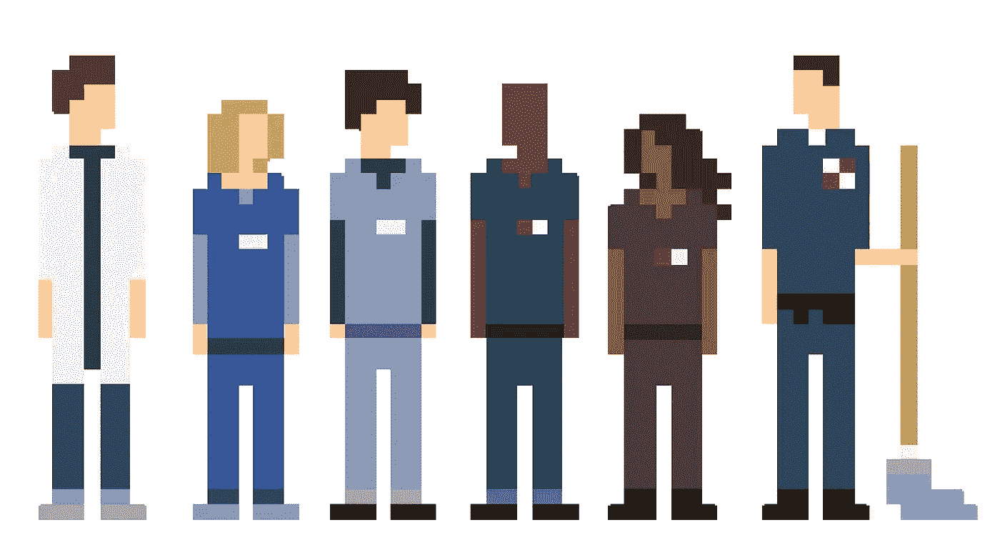
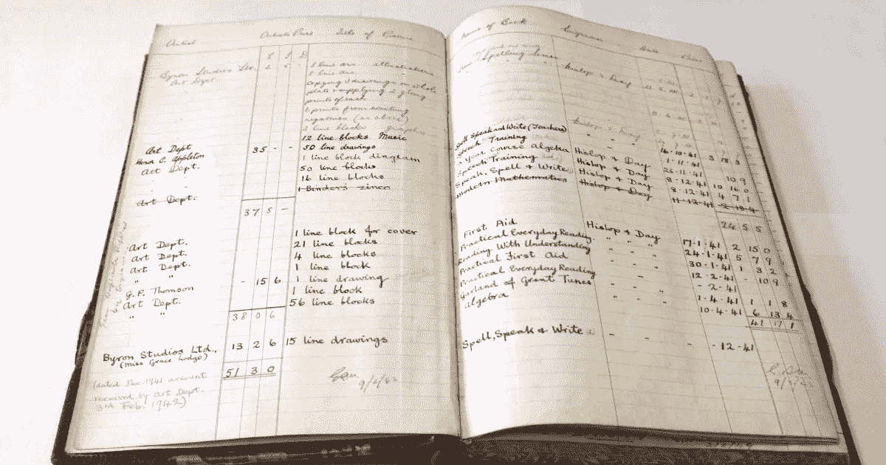
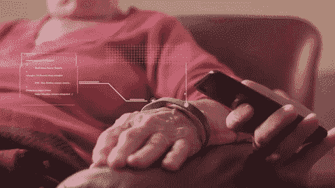

# 医疗保健和区块链——智能合同、保险和供应链；带着一丝人工智能

> 原文：<https://medium.com/hackernoon/healthcare-and-blockchain-of-smart-contracts-insurance-and-supply-chain-with-a-hint-of-ai-bfbb4234b93>

区块链是大多数加密货币背后的运行引擎，是一种适应性强的技术，有可能彻底改变几乎每个主要行业。它最初是为通过分散的公共分类账管理交易和维护共识而设计的，同时避免了对中介的需要。最终，区块链更胜一筹；一种高度可扩展的技术，可以在不需要第三方的情况下安全地存储和传输数据，为行业管理和审查数据提供了新的方法。

随之而来的是智能合同、可编程的 T2 if/then 语句，这些语句可以在区块链网络中实现。这使得利用存储的数据快速有效地计算和执行决策成为可能，而无需人工处理。

已经建立了许多项目来探索如何使用这种技术来改善服务。受益于区块链的一个主要行业是医疗保健。使用区块链系统，医院记录、保险索赔、医疗验证和医疗供应链都有可能得到显著改善。

本文将探讨区块链如何让医疗保健行业变得更加高效、安全和可靠。

# 记录和保险索赔

医院和保险公司之间的有效沟通是对提交的索赔做出及时回应的关键。如今，医院必须遵守与患者文档处理相关的特定法律。确保患者的保密性会使保险提供商在做出索赔决定时难以获得所需的文件。

这可能导致漫长的处理时间和索赔被拒，每年给患者和[医院造成数十亿美元的债务。一些人认为这是医疗费用上涨的主要原因。](https://www.beckershospitalreview.com/finance/denial-rework-costs-providers-roughly-118-per-claim-4-takeaways.html)

区块链可以帮助缓解这种沟通。区块链背后的加密技术可以提供将患者数据文件传输给保险提供商所需的安全性。未来的发展甚至可能将医院和保险公司之间的集成区块链总账投入使用，允许双方实时更新病例文件。

# 智能合同

然后，保险公司可以使用智能合同来评估数据——取代今天使用的大量纸质系统。这些集成系统减少了人为错误的可能性，同时为管理索赔提供了一种更稳定、更高效的方式。他们还提供建立所有权的数字证书，这降低了潜在的伪造风险。

智能合同可以被编码以满足各种各样的条件，提供所需的灵活性以与当今保险公司使用的当前遗留系统竞争。

# 医疗验证和医疗供应链

区块链的另一个用例是它提供验证的能力。

医疗供应链是医疗保健行业中的一个大行业。区块链可以努力提高其透明度和效率，使其更安全、更稳定、更具成本效益。医疗供应链不仅包括全球范围内的药物运输，还包括易碎的设备和检测工具。这些昂贵的物品需要专门的运输和方便的跟踪。

# 区块链账本

与医疗保健一样，医疗供应链可以使用区块链的[分布式分类账](https://pdfs.semanticscholar.org/1b36/ff4cd44f819734ffa5ff97285cf915acbc70.pdf)来更好地跟踪和记录装运数据。综合系统将使不同的实体能够记录沿途不同地点的装运进度，从制造地开始，到储存仓库、转运，最后到交货地点。

更好的跟踪将有助于确保货物顺利到达交货地点。如果发现产品丢失或损坏，无可争议的区块链记录将有助于确定过程中发生管理不善的环节。

在家等待药物的用户可以登录访问门户网站，显示产品的确切位置，跟踪产品沿途经过的每个位置。这将使医疗提供者和患者放心，因为他们知道他们购买的物品来自经过验证的起点，并且正在安全地到达交付点。

某些开源加密货币项目，如以太坊网络，也被用于类似的目的。诸如药品之类的产品可以通过以太坊区块链网络发行验证签名。客户可以交叉参考验证，以确保他们的购买不是错误或假冒的。

## 一些利用区块链验证的项目:

1.  [Midas Caps](https://midascaps.io/)——一家为健康、运动和日常生活活动生产营养片剂胶囊的公司
2.  [保险网络](https://www.insurenetwork.io/) —想要以分散的方式创建一个新的保险市场，以降低验证、联网流程和提供透明度的成本
3.  [贝卡里克](http://baikalika.io/)——将使用区块链技术验证贝加尔湖饮用水的真实性和运输控制
4.  [checkits real](http://checkitsreal.io/)——一款允许人们通过移动设备即时验证产品真伪的应用
5.  [ECOS](http://www.ecos.ee/) —旨在通过分布式数据库使用区块链来控制交通和威胁生命的产品

# 区块链和人工智能

区块链的智能合同与人工智能技术合作，可用于改善医疗供应链中的运输安全。温度规定和其他专门条件可以被编程为智能合同。未能满足合同的令人满意的条件将提醒人工智能机器考虑错误的条件。例如，需要低温的实验室套件可以通过智能合同进行调节——温度的波动可以触发人工智能驱动的设备，根据需要调节温度。

一个致力于创造区块链/人工智能驱动的解决方案的项目是 [IOTA](https://www.iota.org/) 。这个加密货币项目也使人工智能设备能够实时支付自己的能耗。

# 回顾

区块链是一种适应性强、用途广泛的技术，具有深远的影响。旨在提供一个安全和分散的货币系统，提供了一种技术，可以通过无可争议的分类账和原产地证书大大提高效率。

凭借其智能合同，区块链拥有所有必要的资源来帮助减轻医院和诊所的保险索赔流程和内部数据系统。这种不断扩展的技术还可以用于提高供应链网络的透明度，帮助确保真实性和安全性，同时节省成本。

区块链技术需要更多的发展才能用来取代现有的遗留系统，但概述的用例证明了所需的投资是值得的。