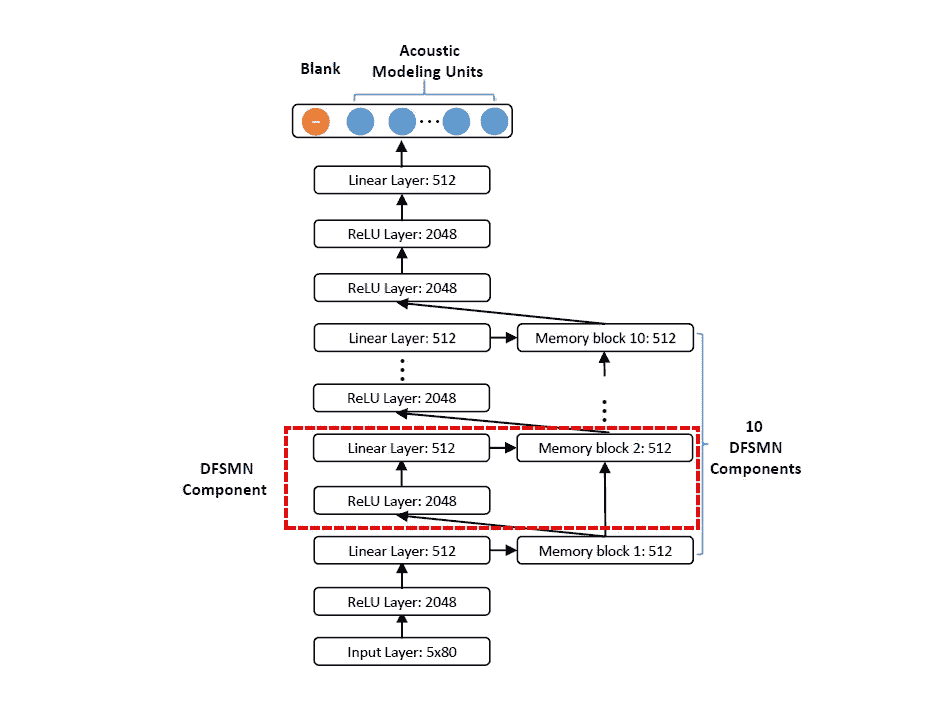
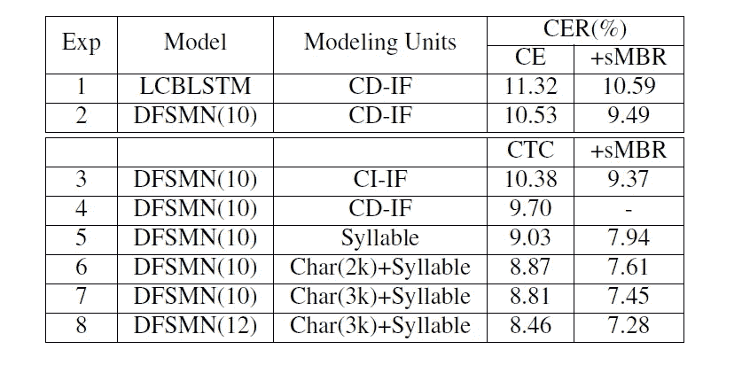

# 听到事物中的性格:阿里巴巴改进普通话语音识别

> 原文：<https://medium.com/hackernoon/hearing-the-character-in-things-alibaba-improves-mandarin-speech-recognition-c2f8650c4ebf>

*本文是* [***学术阿里巴巴***](/@alitech_2017/academic-alibaba-b56f4176a838) *系列的一部分，摘自 ICASSP 2019 年题为“使用 DFSMN-CTC-sMBR 的普通话语音识别建模单元的调查”的论文，作者是张世良、雷明、刘源和李玮。全文可以在这里阅读***。**

*如果你曾经试图学习普通话，甚至想知道别人是如何做到的，了解尖端的语音识别技术也发现这非常困难可能会有所帮助。像人一样，大词汇量连续语音识别(LVCSR)系统与普通话独特的字符-音节关系和庞大的词汇相斗争，导致频繁混淆同音字和词汇外(OOV)问题。因为这些工具的最终目标是将口头语言转换成书面记录，所以这些问题会削弱它们的有效性。*

*为了应对这些挑战，阿里巴巴的研究人员现在开发了一种 DFSMN-CTC-sMBR 神经网络模型，以更好地转录普通话中的人对人语音。该模型采用混合字符-音节单元，将最常见的汉字及其音节结合在一起，在 20，000 小时的普通话语音识别测试中，该模型大大减少了替换错误，优于传统的混合模型。*

# *重新解释语音识别*

*顾名思义，阿里巴巴的 DFSMN-CTC-sMBR 模型反映了语音识别几个前沿的创新。*

**

**Technical overview of the DFSMN-CTC-sMBR model**

*该模型的核心功能，连接主义者时间分类(CTC)，是传统混合模型的相对较新的替代方案，传统混合模型受到基于训练标准的声学建模单元的有限选择的影响。尽管以前的 CTC 工作主要采用长短期记忆(LSTM)神经网络，但该模型采用深度前馈顺序记忆网络(DFSMN)来增强其性能，同时将上下文无关(CI)和上下文相关(CD)音素作为目标标签。借鉴 LSTM-CTC 的优化技术，它进一步结合了一个州级最小贝叶斯风险(sMBR)准则，以支持序列级判别训练。*

*总的来说，这种设计的主要成就是它支持更大范围的非常适合普通话语音的声学建模单元。普通话的一个主要考虑因素是词的声母和韵母之间的关系:有 23 个可能的声母音节和 35 个韵母音节，每个音节可以在五个声调之间变化，总共有 185 个韵母。为了解释这种差异，研究人员引入了一个上下文无关的声母/韵母(CI-IF)单元，它可以识别所有 23 个声母和 185 个韵母，以及一个上下文相关的(CD-IF)单元，用于由数据驱动的决策树确定的另外 7951 对关系。*

*此外，该模型还具有一个音节单元，用于单独建模普通话的 1，319 个声调音节，以及两个混合字符-音节单元，分别针对一组 2，000 个和一组 3，000 个常用汉字。由于普通话的数千个音节对应数万个字符，这大大提高了模型区分同音字的能力，并消除了音节无法正确匹配正确字符的 OOV 问题。*

**

**Overview of the DFSMN-CTC-sMBR model’s acoustic modeling units**

# *逐个单元的珩磨结果*

*为了测试所提出的模型，阿里巴巴的研究人员使用了大约 2 万小时的普通话音频数据，这些数据来自新闻、体育、旅游、游戏、文学和教育环境，使用字符错误率(CER)百分比作为关键的性能指标。在试验中，它与各种不同的配置进行了对抗，这些配置采用了上一节中讨论的一些而不是全部声学建模单元。*

**

**Performance results for different modeling unit configurations with and without sMBR training; lower scores indicate better performance.**

*如上所示，结果表明，与基础 CTC 培训相比，包含 sMBR 培训可以将模型的相对性能提高 10%以上。更重要的是，包含所有声学建模单元(CI-IF、CD-IF、音节、Char(2k)+音节和 Char(3k)+音节)的 DFSMN-CTC-sMBR 模型实现了最低的错误率，验证了这些单元在应对普通话特定挑战方面的功效。*

**

**全文可在此阅读***。***

# **阿里巴巴科技**

**关于阿里巴巴最新技术的第一手深度资料→脸书: [**【阿里巴巴科技】**](http://www.facebook.com/AlibabaTechnology) 。Twitter:[**【AlibabaTech】**](https://twitter.com/AliTech2017)。**