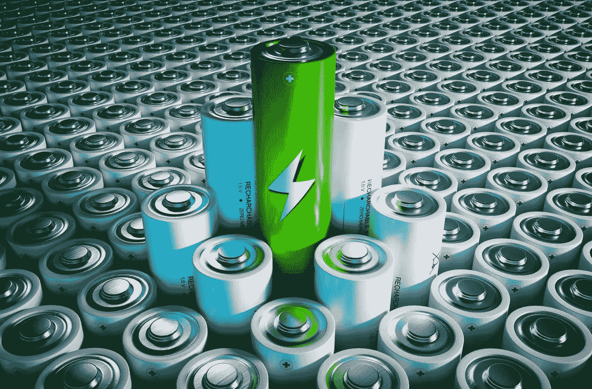
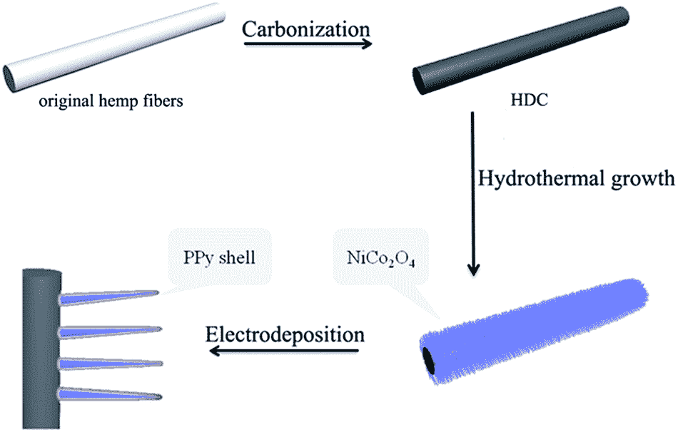

# 大麻纤维作为潜在的超级电容器

> 原文：<https://medium.com/hackernoon/hemp-fiber-as-potential-supercapacitor-d610e5818960>

大麻，大麻，大麻，随便你怎么称呼——这种植物物种在医学和技术上都为更美好的未来打开了大门。在医疗领域，CBD 或草药已经证明了它的价值，它也准备好颠覆科技领域。一些天才已经找到了利用大麻纤维作为超级电容器的方法。这些科学家表示，大麻纤维可以转化为高性能的设备来储存能量。

根据马克·克劳福德的说法:

> “储能行业开始注意到这一点，这要归功于加拿大的一项新研究，该研究显示，电极由大麻基纳米碳片制成的超级电容器的性能比标准超级电容器高出近 200%。”

这种说法不仅仅是理论上的，科学家们通过烹饪大麻并将其转化为碳纳米片来证明这种方法，然后用它来建造超级电容器，结果证明这种超级电容器比石墨烯制成的超级电容器更好。

由某种大麻纤维设计的电极可以提高[超级电容器](https://pubs.acs.org/doi/abs/10.1021/nn400731g#)的能量密度，并可以保持类似于或相当于石墨烯的能量。这种技术更便宜，因为电极是用生物废料生产的，过程相当简单。

早些时候，为了引领超级电容器市场，制造商们只专注于石墨烯，当时也没有其他办法，因为它的原子厚度的碳层可以通过堆叠转化为电极。唯一的问题是，石墨烯很贵。

欧洲最大的大麻生产商已经计划提取、加工和利用大麻生物质，形成一系列产品系列。公司可以在改变电动汽车和电池的未来方面发挥重要作用。

科学界对大麻纤维的使用有很长一段时间的怀疑，他们只是没有一个正确的方法把它纳入折叠。

大卫·米特林是这一发现的幕后策划者，他使用大麻纤维碳纳米片来构建电极，并添加电解质，一种离子液体，以成功制造超级电容器。一旦完成，该设备每千克产生 12 瓦时的能量密度，比现有的和正在使用的同类产品好 3 倍。所有这些好东西的价格都很低。

像加拿大、中国甚至英国这样的国家生产大麻来制作衣服和其他建筑材料。废品也就是韧皮纤维最终被填埋了。不知何故，如果这些废物可以用来制造超级电容器和储存大量能量的设备，为我们的电子设备提供动力。

米特林博士说，“你可以用生物垃圾做真正有趣的事情。我们差不多已经找到了它的秘方。”这个过程很棘手，需要从正确的工厂为正确的设备选择正确的纤维。

早些时候，香蕉皮被用来制造一种致密的碳块，又名伪石墨，适用于钠离子电池。另一方面，大麻纤维和它的结构完全相反。如果大麻制成的床单有更高的表面积，非常有利于超级电容器。

利用大麻纤维的过程被称为水热合成，其中大麻纤维被蒸煮，溶解所有的木质素和半纤维素物质，留下碳纳米片，也可能是假石墨烯。剩下的过程包括将它们转化成电极。

基于大麻的超级电容器和电池的应用领域是无限的。电容器可以减少电池高功率需求的压力，延长电池的使用寿命。由于从机械摩擦中吸收能量并将其转化为电能的特性，它已经在运输行业中用于动力密集型操作，如启动或加速甚至停止汽车、地铁、火车等。

它也可以应用于风力发电站来控制螺旋桨(翅膀)的速度。对于快速增长的智能手机行业来说，它可以很好地支持更强大的智能手机功能，更大容量的内存需求。

对于市场上便宜得多的基于大麻的超级电容器价格来说，这是科学家们加快研究如何吸收和使用照明电力的一个好机会。如上所述，从家用到工业规模，这种动物的应用领域是无限的。

也就是说，与石墨烯不同，大麻纤维还远未得到充分利用。但是大麻绝对可以大幅降低能源储存设备的成本。如果大麻纤维的全部潜力能够发挥出来，它本身将创造一个全新的行业，农民将有一些有利可图的东西，企业可以在很大程度上推动人类文明走向更美好和更绿色的未来。

0