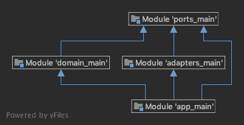

# 六边形建筑，有科特林、克特和桂思

> 原文：<https://medium.com/hackernoon/hexagonal-architecture-with-kotlin-ktor-and-guice-f1b68fbdf2d9>

## 我们的服务模板指南

Photo by [Ilnur Kalimullin](https://unsplash.com/@kalimullin?utm_source=medium&utm_medium=referral) on [Unsplash](https://unsplash.com?utm_source=medium&utm_medium=referral) … Came up when I searched for ‘hexagon’. But surely more sides is better, so we’ll let it pass.

有一天，我所在的一个团队发现了一个问题的正确答案，即“Kotlin 和 Ktor 使用端口和适配器架构，用 Kotlin Gradle DSL 构建多模块 Gradle 项目”。以及依赖注入的指导。

只有在互联网上没有人似乎已经实现了微服务与结构和技术的特定组合之前。或者至少，没有人谈论过它。我提到的每一件事情，是的，都有一些可用的信息——但是将这些信息整合在一起是一个挑战。

那么…你在听网络蜘蛛吗？你在听吗，page-rank？我说:

*   科特林与 Ktor
*   端口和适配器
*   使用 Kotlin DSL 的 Gradle 多模块项目
*   Guice

为什么是这些东西？

**科特林**:因为科特林是[牛逼](https://kotlin.link/)。大家[都这么说](https://hackernoon.com/9-fascinating-things-i-learned-while-coding-up-the-rules-of-a-board-game-81df3330b938)。

因为如果为了简化你的[框架](https://spring.io/projects/spring-framework)你需要一个[框架](https://spring.io/projects/spring-cloud)在一个[框架](https://spring.io/projects/spring-boot)之上，那么某个地方可能出了问题。

**端口和适配器:** P & A，也称为‘六角形架构’，是一个[非常强大的金属](https://hackernoon.com/demystifying-the-hexagon-5e58cb57bbda)工具，用于产生可测试的、[干净的架构](https://blog.cleancoder.com/uncle-bob/2012/08/13/the-clean-architecture.html)。我努力了很长时间来解释为什么我发现它比“带 DI 的 n 层架构”更强大。我认为这可以归结为巩固“内部”和“外部”的概念。业务逻辑和领域模型进入“内部”。其他一切都在外面。我毫不怀疑，通过足够的训练，你可以用其他的建筑风格完成同样的事情。但是应用 P & A 会给你一些强有力的惯例来帮助引导你的思想。

大多是出于好奇。我过去曾广泛使用 Maven，并与它和平相处。但是我听说过关于格雷德尔的好事情，我很好奇用它来表达愤怒。

**格雷尔·科特林 DSL:** 因为 Groovy 和我已经分道扬镳了。还有，好奇心。还有，受虐狂。

**多模块:**啊哈。嗯，现在…我发现向项目添加模块的反应，尤其是相对琐碎的微服务，相当复杂。从“这很好——这种结构很有帮助”到“让你的肮脏的模块远离我的代码”的一切。(嗯，实际的话是‘什么？“不！”—但我的超能力是听到没说的话。)这是一个令人惊讶的分歧问题！我选择多模块的原因是为了管理依赖性。它帮助你保持诚实，帮助你执行自己的规则。例如，'*域不应该知道任何关于 JSON 的信息，因为这是一个传输层问题，*或'*控制器不能直接与数据库*对话。当然，它增加了一些复杂性，对于一个小的服务来说可能感觉不合理。但是，如果您正在生产多种服务，那么您只需要承受一次这种复杂性的冲击，然后您就有了一个简单的模板来遵循所有其他的服务。老实说，你的“微”服务有多长时间是微的？

**Guice** :因为还不是春天，我们习惯用 Guice 搭配 Play，ktor 网站上也有一些辅助。

代码就是真相。您可以在此找到我们的“hello world”服务模板:

[https://github . com/sger ber-hyperanna/ktor-hexagon-multi-module-template](https://github.com/sgerber-hyperanna/ktor-hexagonal-multi-module-template)

让我们快速浏览一下不同的模块，它们之间的依赖关系以及设置它们所面临的挑战。

# 模块布局

Module diagram auto-generated by IntelliJ

我们的端口和适配器实现有四个模块:应用程序、域、端口和适配器。

“域”和“适配器”都依赖于“端口”。“域”和“适配器”看不到彼此。‘app’可以看到所有模块。

# 什么去哪里？

## 领域

六边形的中心。包含核心业务逻辑和领域模型。重要的是，它没有提到像 JSON、特定的持久性技术或 *time 这样的传输问题。*是的，时间。`DateTime.now()`是领域层的反模式，因为它使测试变得复杂，并产生了一定程度的时间耦合。如果需要，可以从适配器层传入日期和时间戳。

## 适配器

六边形以外的所有东西。与商业逻辑无关。将包含 JSON 转换器、REST 端点、消息处理程序、事件发布程序、数据库存储库、预定事件等等

## 港口

ports 模块包含接口和 dto(在我们的例子中是 Kotlin 数据类)。它应该没有实际的逻辑，因此不需要任何测试。人们安排和命名端口的方式各不相同，但我喜欢的结构是细分为两类:必需的和提供的。

**必需的**“域”需要端口，应用程序才能运行。因此它们由适配器模块实现。存储库、事件发布者和 API 客户端可以通过“必需的”端口进行访问。

**假设**端口由“域”提供，供适配器层使用。因此它们是由域模块实现的*。从控制器、事件处理程序和计划任务调用的服务类是“提供的”端口的最典型的例子。*

## 应用

“应用”模块将所有内容绑定在一起，并配置用于运行服务的框架。在这种情况下，它加载 Guice 模块并配置 Ktor。

# 导游:

## 领域逻辑

在我们的玩具领域里没什么。只是一个`SimpleGreeter`，它实现了我们的`Greeter`接口(一个‘提供的’端口)，并被注入了一个`GreetingsRepository`(一个‘必需的’端口)。

SimpleGreeter.kt

测试这一点很容易，我们只需模拟存储库。一般来说，当测试“域”时，我们想要模拟“适配器”的实现。顺便说一下，我更喜欢在 JUnit5 和 Mockito-kotlin 中使用 kotlintest 断言。

SimpleGreeterTest.kt

## 适配器层

关于适配器层最有趣的事情是如何将域服务“注入”到 Ktor 路由中。第一步是假设我们可以注入 Ktor `Application`以及任何“提供的”服务，并编写一个简单的类来设置路由。

HelloRoutes.kt

你可以在上面看到，一旦我们注入了应用程序类，你就可以像平常一样启动 ktor 路由 DSL。我们也可以让多个类设置路由。实际上，这让我们的“route”类扮演了与 SpringMVC 应用程序中的控制器相同的角色。

下一步是设置 ktor 的其余部分，比如异常处理和内容转换器。我们在`ApplicationConfig.kt`做这个

The application configuration

最后一步是创建一个 Guice 模块，该模块绑定用于注入的应用程序，然后将其提供给 route 和 config 类。这里的关键是在绑定配置和路由时使用`asEagerSingleton`。正如 Javadoc 所说的那样，“*对应用程序初始化逻辑有用”*

The Guice module for configuring Adapters

## 编写适配器测试

这就是事情变得有趣的地方。当我们编写“领域”测试时，我们不需要担心太多的管道或线路。然而，适配器测试是您可能想要编写一些集成测试的地方。考虑到我们的六边形架构，我们正在寻找一种方法来启动一个测试 Ktor 应用程序，但是要为所有的域服务提供模拟。

在我们的玩具示例中，我们没有“真正的”数据库，所以我们可以编写类似集成的测试来演示概念，而不需要集成 Docker 或类似的东西来提供外部依赖。

**第一步:为我们的核心服务创建模拟**

我们的模板中只有一个，但它说明了这一点。

**第二步:创建一个 Guice 注入器**

在上面的第 3 行，我们注入了真正的适配器模块。这意味着我们可以放心地测试实际路线。我们也注入我们的模拟域服务。

这里的`MainModule`让我们将测试应用程序注入适配器模块。

还要注意，上面第 2 行的`module`函数是应用程序的扩展函数。

**步骤 3:创建测试应用程序的安装/拆卸方法**

Starting and stopping a ktor test server

上面的第 6 行我们使用 Ktor testkit 来创建一个测试环境。

第 10 行通过调用第 2 步中的扩展方法，将测试应用程序与我们的路由和模拟连接起来。

第 12 行将 Guice 上下文中的任何内容注入测试类本身，这样我们就可以将模型连接到我们的测试中，我们将在下一步中看到。

**第四步:编写测试**

在这一步中，我们将测试基础子类化，以调用 ktor 路由。

Sample route test

这里值得一提的是，在第 4/5 行，我们将模拟的域服务注入到我们的测试类中。

第 17 行演示了测试 ktor 路由的简单方法。

这项适配器集成测试让我们确信:

1.  这条路线行得通
2.  该服务被称为
3.  HTTP 调用返回了预期的状态和内容(例如，我们可以检查 JSON 封送和解封正在工作)

## 连接应用程序

我们的“应用程序”模块可以看到“域”和“适配器”,并负责连接一切和启动应用程序。除了实际的主模块和一个入口点，这里没有什么。

The application entry point

但是，如果您觉得有必要针对实际运行的服务编写一个真正的端到端集成测试，这是一个合适的模块。

不过，我不确定你是否应该。如果你信任这个框架，并且相信你的“跨层测试”给了你足够的覆盖率，适配器以正确的方式调用域，反之亦然，你可以不需要写这些测试。

另一方面，作为集成测试阶段的一部分执行的一两个“健全性测试”可能不会有太大的伤害。您可以在 GitHub 资源库中找到一个[示例](https://github.com/sgerber-hyperanna/ktor-hexagonal-multi-module-template/blob/master/app/src/test/kotlin/ApplicationTest.kt)，但是在这里查看一段代码并不能学到太多东西。它在外观上与适配器测试非常相似。只是更少的设置，因为一切都是真实的。

# 其余的一切…

好了，我们的旅行到此结束！还有一点要看你是否愿意探索这个库。你可以看到我们如何设法用 Kotlin DSL 拼凑出一个多模块项目的例子。您还可以看到我们如何将一些简单的 JWT 认证集成到我们的终端中。

现在我意识到，在这个玩具应用程序中，设置代码和 Gradle 配置的数量大大超过了实际应用程序代码的数量。可以理解，这可能会让你觉得这一切都是多余的。

我接受你的观点，我同意。但我的反驳是，端口和适配器作为一种架构风格，作为一门学科，直到我用它构建了几个服务，并看到一切是多么干净、多么美好地结合在一起，我才真正喜欢上它。请试一试，即使你没有完全被说服。

如果你正好在用 Kotlin 和 ktor，希望这篇教程有直接的好处！这些大部分都是在对 ktor 或 Kotlin 知之甚少的情况下从零开始想出来的。可能有更好的方法来实现同样的目标！欢迎针对 GitHub 中的服务模板进行讨论和请求。如果您目前没有使用 Kotlin，我希望它至少能让您了解如何将您选择的技术堆栈组织到端口和适配器结构中。