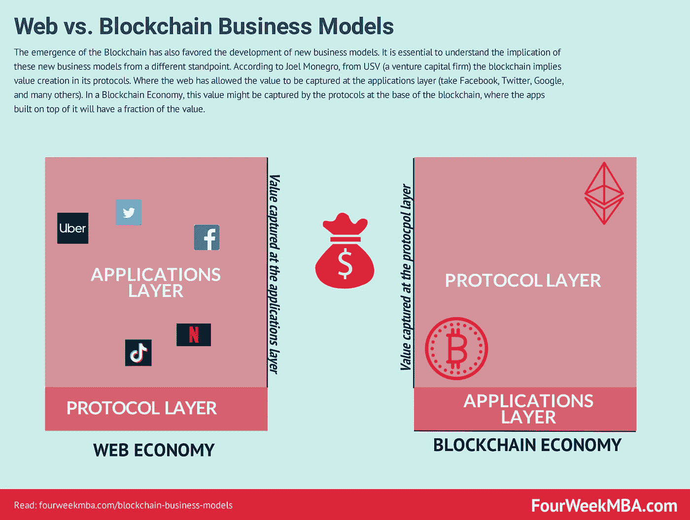
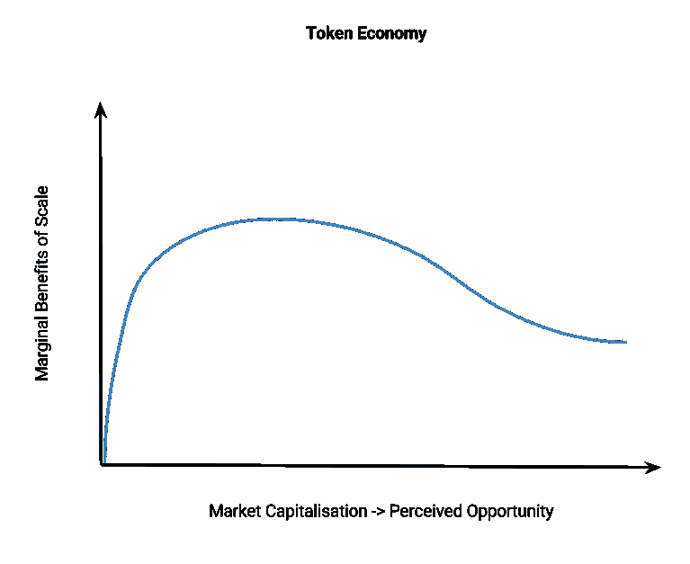
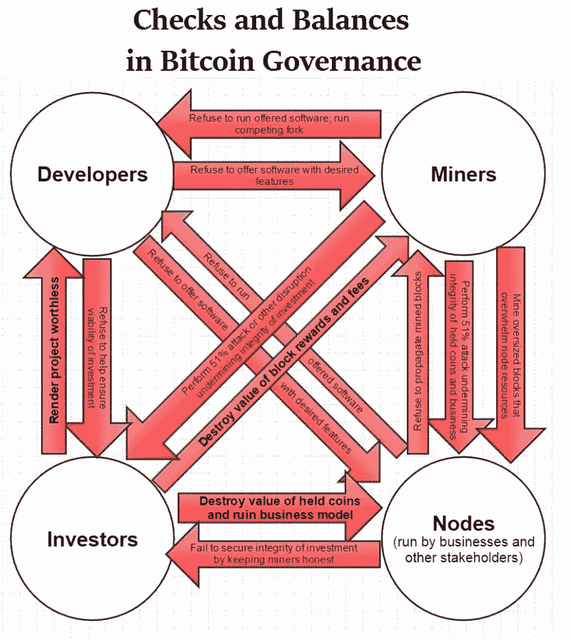

# 区块链驱动的世界会是什么样子

> 原文：<https://medium.com/hackernoon/how-a-world-driven-by-the-blockchain-might-look-like-6ebff6ee3e50>

根据 USV(一家风险投资公司)的前分析师乔尔·莫内格罗的说法，区块链在其协议中暗示了价值创造。web 允许在应用层获取价值(以脸书、 [*、Twitter*](https://fourweekmba.com/how-does-twitter-make-money/) *、谷歌和许多其他公司为例)。*

*在区块链经济中，这个价值可能会被区块链底层的协议捕获(例如比特币和以太坊)。*

*然而，根据区块链投资者 Paivinen 的说法，由于区块链经济中分叉的容易性、竞争的激励以及改进的互操作性和互换性，协议可能会变得更薄。*

*尽管与基于网络的经济相比，规模的边际价值可能较低，但在基于网络的经济中，大规模创造了经济优势。区块链的成功将取决于其商业可行性！*

# 区块链:开端

2009 年 1 月 10 日，一个叫中本聪的人给另一个来自圣巴巴拉的人哈尔·芬尼发了一封电子邮件。由[举报*online.wsj.com*举报](http://online.wsj.com/public/resources/documents/finneynakamotoemails.pdf)，邮件称:

> 通常我会保留这些符号，但它们将 EXE 文件的大小从 6.5MB 增加到了 50MB，所以我无法证明不删除它们是正确的。我想我做了错误的决定，至少对于这个早期版本来说是这样。
> 
> 我有点惊讶会有崩溃，我已经进行了大量的测试，有一段时间没有出现完全的异常。想起来了；在 debug.log 的末尾甚至没有异常打印。我一直在 XP SP2 上测试，也许 SP3 是什么。
> 
> 我把 bitcoin.exe 和符号联系在一起。(gcc 符号代表 gdb，如果你使用 MSVC，我可以发送给你一个带有符号的 MSVC 版本)
> 
> 谢谢你的帮助！

那封邮件的主题是“比特币 0.1.0 崩溃”

中本聪(最终没人知道他是真人、假名还是一群人)正在向哈尔·芬尼解释如何让比特币工作！

比特币将是区块链(T21)的第一个应用，区块链是一种去中心化的方式来处理这种加密货币的交易，不需要中央机构或中介。

作为一名商业人士，你可能想了解区块链价值捕捉机制是如何工作的。在一个由 web 应用驱动的世界中，到目前为止，大部分商业价值都是在应用层获取的。

要理解这种机制，请看下面的信息图:

在区块链的所谓“[胖协议和瘦应用](https://fourweekmba.com/blockchain-business-models/)”理论中，与更传统经济的“胖应用和瘦协议”相比，这是理解在这两种形式的经济系统中在什么水平上捕捉商业价值的良好起点。

然而，该理论也最小化了两个显著的影响:

*   区块链经济中分流的力量
*   在基于网络的经济中，开放的商业模式[的力量](https://fourweekmba.com/what-is-a-business-model/)

我认为，理解这两者对于理解一个以区块链为基础的经济体系可能如何演变至关重要。

# 什么是分叉，为什么它在区块链经济中很重要？

简而言之，分叉是一种机制，在这里区块链路径分成两条独立的路径，这两条路径意味着不同的结果。然而，这是最难的分叉形式。

正如 coindesk.com[解释的那样，作为分布式共识的副产品，分叉发生在两个矿工几乎同时找到一个区块的任何时候。当随后的块被添加到一个块中，使其成为最长的链，而另一个块被网络“孤立”(或抛弃)时，这种模糊性得到解决。”](https://www.coindesk.com/short-guide-bitcoin-forks-explained)

因此，在最基本的层面上，分叉是一种解决区块链中歧义的方法。另一方面，有两种不同形式的分叉具有更彻底的影响:

*   硬叉子
*   和一把软叉子

硬分叉类似于软件更新，以前的版本不再有效，因此要工作的设备必须更新到该软件的最新版本。分叉是对区块链协议的“集体同意的更新”。

**来源** : [数字资产研究](/digitalassetresearch/blockchain-forks-explained-8ccf304b97c8)

当此更新发生时，软件的新版本将与旧版本不兼容。这意味着一个“硬分叉”或一个使旧版本不兼容的机制。因此，如果在“说服”旧福克斯加入更新的区块链方面缺乏共识，这将导致区块链的分裂。当大多数区块链人不能就叉子达成一致时，就会发生这种情况。分裂发生了，曾经团结一致的区块链分裂成不同的版本，这些版本有着不同的共识规则、特征和“文化”然而，在其他情况下，当新版本的区块链仍然与旧版本兼容时，这被称为“软分叉”理解分叉在区块链经济中的含义是一个基本问题。 [Teemu Paivinen](https://blog.zeppelin.solutions/@teempai) ，区块链企业家、投资人[参考 fat 协议理论指出](https://blog.zeppelin.solutions/thin-protocols-cc872258379f):

> *我想说的是，虽然这些协议总体上将继续获取大部分价值，但由于分叉和竞争市场力量的综合影响，单个协议实际上将非常单薄，并倾向于获取最小价值。*

简而言之，Paivinen 引入了三个可能适用于代币经济或区块链经济的重要变量:

*   易于分叉
*   竞争激励
*   提高协议的互操作性和互换性

他将这种现象定义为“大稀释”现象，即协议越大，扩大协议的边际收益越小。在基于网络的经济中，科技巨头已经用“规模”来主导市场。因此，这个概念听起来可能违反直觉。

当一个较大的协议变薄时，较小的协议就形成了。这些更小的协议在执行特定任务时可能会变得更有用、更高效。由于区块链上的大多数分叉都是软分叉，这些是“向后兼容的”,这使得出现了几种协议。

一旦这些协议变得可互操作，这就是新生态系统的创建方式。正如 Paivinen 指出的:

> *随着这些力量将行业推向更加专业化，分叉允许几乎无限的竞争，减少传统技术行业的反竞争信息和数据优势，协议似乎只会越来越薄。*

当这些协议变得更薄，并且它们变得可互操作时，这种现象可能会出现:

**来源**:[blog . zeppelin . solutions](https://blog.zeppelin.solutions/thin-protocols-cc872258379f)

同样，这个概念最初并不容易理解。在传统经济中，随着公司变得越来越大，它们的规模也越来越大，但也变得更加集中。这些公司倾向于通过创建一个封闭的系统来释放价值。

# 区块链经济中可伸缩性的边际效益

在传统的基于网络的经济中，竞争对手无法访问数据。主要论点实际上是数据所有权使这些公司价值数十亿。一个传统的例子是脸书和谷歌。随着网络变得越来越集中(尽管世界是通过一些应用程序和网站连接的)。

这些科技巨头也制定了游戏规则。当谷歌“强加”AMP(加速移动网页)作为移动搜索的主流格式时，出版商也跟着效仿。当谷歌使用开放手机联盟(Android 的开发者)时，谷歌这样做是为了让它能在尽可能多的移动设备上出现。

当 Android(归谷歌所有)在这些设备上时，谷歌可以以更高的速率交换数据。这些数据被转化为资产，并锁定在公司的算法中，以产生更多的广告收入。

因此，一个封闭的中央集权公司使用开放系统来扩大规模。在一个以区块链为基础的经济体中，理论上，数据应该被共享，这将创造一个更具竞争力的生态系统，规模优势在某个阈值下降。

这就是 [Teemu Paivinen](https://blog.zeppelin.solutions/@teempai) 所代表的:

**来源**:[blog . zeppelin . solutions](https://blog.zeppelin.solutions/thin-protocols-cc872258379f)

重要的是要注意到，到目前为止表达的都是理论。它们是否可靠，只有时间能证明。

在我们结束这一分析之前，我们需要看看对我们理解一个以区块链为基础的经济体至关重要的另外两点。

当网络应该开放的时候

网络可能已经改变了它的方式，应用程序获取了它的大部分商业价值，但人们可能会怀疑这是否是唯一可能的途径。

这个困境的答案当然不是。当使网络成为可能的协议被免费提供，或者它们不一定有一个赚钱的策略，这些允许其他私人公司利用它们。

那些开放的协议不一定是因为它是一个内在的特征。相反，这是一种选择。开发网络的第一批人希望它是开放的、分散的和透明的。

然后，科技巨头利用开放模式来挤压利润，并在此过程中集中数据。因此，网络变得更加封闭、集中和不透明。当然，这是一种简化。然而，这里的要点是，网络应该具有某些特征。

但是“商业网络”颠覆了他们。这个不好也不坏。但在我看来，是什么让基于网络的经济被配置为“瘦协议和胖应用程序。”

从封闭网络到开放网络的战争还没有结束。随着开放的商业模式可能会回归，区块链可能会有助于这一进程，除非现有的科技巨头能够利用它。

例如，脸书已经成立了一个区块链团队，以找出平台内可能的应用和集成(可能是为了支付基础设施，尽管我们无法确定):

# 区块链杀手级 app 信任去中心化了吗？

如果你问我区块链有什么特别之处，它可以从根本上改变我们经济系统的工作方式，我会说是信任去中心化。

这个概念对我们的社会来说是全新的。事实上，即使几个世纪以来我们一直被用来处理非个人的实体，我们称之为政府，但它们仍然是由人在中央层面运作的。虽然我们都讨厌的官僚是一个人，但我们都想象这个人有某些特征。

然而，我们也知道权力是集中的，我们分散权力的方式是表达我们的投票。随着区块链经济的发展，事情发生了变化。简而言之，你不必相信一个中间人、一家公司或任何确保双方交易的人。

你只需要相信它背后的数学系统。这是数学，科学，都证明了，这一切都可以工作没有信任！到目前为止一切顺利。但是真的有看起来那么好吗？我们经常忘记区块链是一种技术。

就像 AI 和机器学习可以帮助你最终处理海量数据一样。尽管如此，如果你给人工智能垃圾，它不仅会给你垃圾，甚至会给你更多。

以亚马逊为例，它不得不阻止性别歧视的人工智能想要雇用所有男性候选人。所以，这一切都要回到数据上来！允许在分散的级别审计数据的技术首先不会使数据变好。

Kai Stinchcombe 指出，通过从等式中移除信任来工作的区块链不会让事情变得更好。这实际上会让他们变得更糟。例如，他[指出](https://hackernoon.com/ten-years-in-nobody-has-come-up-with-a-use-case-for-blockchain-ee98c180100)“*一个新的支付系统的关键特征——想想早期的*[*PayPal*](https://fourweekmba.com/how-does-paypal-make-money/)*——是一种信心，即如果商品不像描述的那样，你会得到退款。*

换句话说，在一个金融体系中，信任是它变得厚实的原因。在一个没有信任、人们只能依靠自己的设备的系统中，事情是不会发生的。

例如， [Kai Stinchcombe](https://hackernoon.com/@kaistinchcombe) 还指出了“政府支持的银行系统”的例子，该系统“提供 FDIC 担保、ACH 的可逆性、身份验证、审计标准以及出现问题时的调查系统。”

简而言之，从长远来看，一个有效的系统并不是一个能让事情更有效率的系统。相反，这是一个当一切都出错时仍然存在的系统。

当你是一名比特币交易者或比特币持有者，你丢失了你的密钥，或者由于系统的安全故障，你丢失了你所有的加密货币，没有人可以帮助你，这感觉更像是一个地狱，而不是一个我们都想生活的世界。

因此，制衡体系对区块链的成功至关重要，这一体系似乎由四个关键角色组成，他们都按照自己的利益行事，但合在一起可能会形成一个稳固的生态系统:

*   开发商
*   矿工
*   投资者
*   和节点

**来源**:[hackernoon.com](https://hackernoon.com/decentralized-data-why-blockchain-is-meaningless-and-trustless-is-everything-318fd14d3827)

为了保持系统的完整性，每个利益相关者不要积聚太多的权力变得至关重要。当然，区块链经济的一个风险是，几个关键节点可能会控制整个系统。

因此，虽然我们都喜欢对区块链及其功能有乌托邦式的看法。我们必须认识到这是一项强大的技术，但它也随着主流文化而发展。

然而，除了乌托邦的一面，一个以区块链为基础的经济是否会成功将取决于人们是否会发现它比其他现有的解决方案和技术更有用、更适合。

当像谷歌和亚马逊这样的科技巨头最终被证明在商业上可行，并且实际上非常成功时，这最终证明了网络不仅仅是建立在稀薄的空气中。

因此，为了证明区块链的成功，它将需要它的第一个商业突破。

# 区块链的突破会是什么？

[CB Insights](https://www.cbinsights.com/research/industries-disrupted-blockchain/) 列出了区块链可能产生强烈影响的五十个潜在行业。从银行业到废物管理。十大榜单包括:

*   筑堤
*   消息应用
*   对冲基金
*   投票
*   互联网标识符和 DNS
*   关键基础设施安全
*   拼车
*   互联网广告
*   密码交换
*   教育和学术界

这些技术中有哪些会在商业上获得成功还很难说。然而，当商业上的成功被证明时，我们终于可以说我们生活在一个以区块链为基础的经济体中！

*原载于 2019 年 1 月 15 日*[*fourweekmba.com*](https://fourweekmba.com/blockchain-economics/)*。*