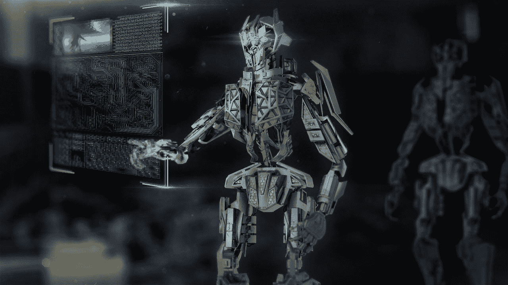
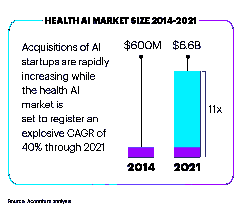
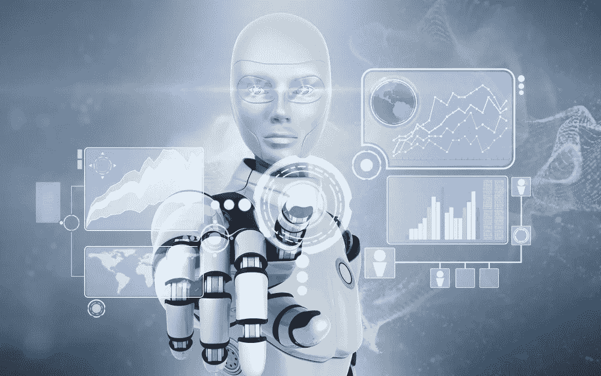
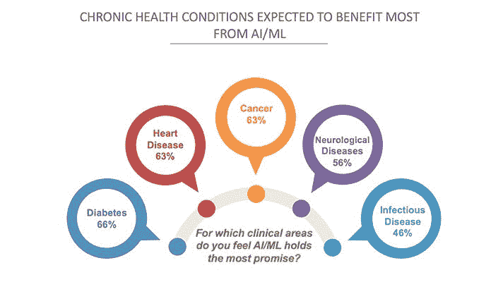

# 人工智能如何改变医疗保健行业的未来

> 原文：<https://medium.com/hackernoon/how-ai-is-transforming-the-future-of-healthcare-industry-f6020cc18323>

人工智能的力量正在许多行业回荡。但是它对医疗保健的影响是真正改变生活的。凭借其模仿人类认知功能的能力，人工智能正在医疗保健行业带来范式转变。

这项变革性的技术正在许多方面给卫生部门带来革命性的变化。从药物开发到临床研究，人工智能已经帮助以更低的成本改善了患者的结果。此外，这项技术在医疗保健领域的引入有望带来便捷、经济和高效。

出于同样的原因，公共和私营部门对医疗保健行业进行了大量投资。根据[一项研究](https://benhamouglobalventures.com/2018/08/02/digital-transformation-of-healthcare-state-of-the-union/)，到 2021 年投资将达到 66 亿美元。埃森哲的报告更加惊人。根据他们的分析，到 2026 年，人工智能应用可以为美国医疗保健行业每年节省[1500 亿美元。](https://www.accenture.com/us-en/insight-artificial-intelligence-healthcare)

# 医疗保健中的大数据和人工智能

人工智能的最新进展引发了关于人工智能医生未来是否会取代人类医生的讨论。虽然取代人类医生的想法听起来可能很荒谬，但人工智能可以帮助人类医生做出更好的决定。在某些医疗保健领域，如放射学，它可以完全取代人类的判断。

大数据已经成功地将人工智能应用于医疗保健。大数据分析方法发展迅速，有如此多的医疗保健数据可用。利用这些数据，隐藏在大量数据中的大量临床相关信息可以通过强大的 AI 技术解锁。这将有助于做出更好的临床决策。

# 动机

人工智能使用复杂算法和从大量数据中学习特征的能力确实值得称赞。在这些算法的帮助下，可以获得用于辅助临床实践的见解。人工智能可以配备自我纠正和学习能力，这有助于系统根据收到的反馈获得更好的准确性。

因此，随着时间的推移，它会变得更好。这些人工智能系统可以在许多方面帮助医生。由于他们掌握了大量的信息，他们可以帮助临床决策。此外，可以最小化诊断错误和治疗错误。

此外，人工智能系统可以访问大量数据；他们可以通过提取有用的信息来预测 T4 潜在的健康风险。

## 但是我们真的需要它吗？

AI 又大又强大。我们不能质疑它的有效性。这将对医疗保健行业产生巨大影响。下面列出的事实告诉我们为什么:

*   医院差错是患者死亡的主要原因之一。这种错误可以通过人工智能来解决和防止。
*   每年有近 440，000 美国人死于医疗失误，而人工智能可以很容易地预防这些失误。
*   在医疗保健行业，几乎 86%的错误是可以避免的。
*   未来 5 年，人工智能健康市场将增长 10%以上。

# 人工智能的应用

人工正在更好地改变医疗保健行业。从早期检测到改进诊断，人工智能和 RPA 正积极促进人类的进步。在一些领域，它已经在使用，在未来的时间里，我们可以看到 AI 的引入。在包括制药、放射学和病理学在内的专业护理中，人工智能正在提供高价值。

慢性健康状况有望从人工智能系统中受益最多。癌症、糖尿病、心脏病是流行文化和精准医疗等医疗保健趋势的巨大机遇。

**以下是人工智能正在(或将)改变医疗保健行业的几种方式:**

# 个人健康虚拟助理

在当今时代，大多数人都有智能手机。他们很可能在他们的移动设备上有他们的虚拟助手。先进的人工智能算法为 Cortana、谷歌助手、Siri 等助手提供支持。当与医疗保健应用结合时，它们将为用户提供巨大的价值。

医疗保健应用程序可以充当个人健康助理。它们还将用于提供药物警报，类似人类的交互也将成为可能。当临床人员不在时，AI 作为个人助理也将帮助协助患者。

# 人工智能提高了睡眠质量

事实证明，晚上睡个好觉对身心健康非常重要。晚上睡得好的人白天会更快乐、更健康、更有效率。

市面上有很多[有效的睡眠小工具](https://smartifylife.com/best-sleep-trackers/)帮助你晚上睡得更好。从人工智能驱动的智能床垫到婴儿监控器、睡眠应用，人工智能技术正在不断努力提高整体睡眠质量。

一家名为 AXA PPP 的医疗保健公司创作了两首摇篮曲；一个是人工智能，另一个是人类。通过深度学习，人工智能系统可以感受到节奏与和谐，从而创作出新的作品。这首曲子在人类的帮助下被转换成一首歌，它可以帮助你睡得更好。

# 医学影像分析

医疗保健中使用人工智能的另一个重要领域是放射学。人工智能系统可以帮助诊断过程。它可以检查医学图像，如 x 光、CT 扫描、核磁共振成像等。并且可以提供它认为人眼可能错过的反馈。

因此，医学成像分析变得更加准确和有效。它减少了出错的机会。

IBM Watson 就是一个活生生的例子。在肿瘤学领域，它可以基于纪念斯隆凯特琳(MSK)医生提供的培训，为临床医生提供癌症患者的[循证治疗方案](https://www.ibm.com/us-en/marketplace/ibm-watson-for-oncology)。

# 精确医学

基因组学是分子生物学的一个分支，研究基因组的结构、进化、功能和作图。它从 DNA 获得的信息中寻找与疾病的联系。

当与人工智能结合时，有可能在非常早期的阶段发现癌症和一些血管疾病。此外，它可以根据患者的基因预测他们可能面临的健康问题。AI 也在帮助[的医疗零件加工](https://artmachining.com/cnc-machining-services/)，并交付了出色的成果。

# 医疗保健机器人

人工智能技术在客户服务领域也越来越受欢迎。世界可能很快就会看到医疗保健机器人。患者将能够通过聊天窗口或电话与网站上的这些人工智能机器人进行互动。

医疗保健机器人将用于安排与患者的医疗保健提供者的预约。这些机器人也可以帮助病人进行药物治疗。他们还可以通过提供全天候支持来改善客户服务。

这些是人工智能可以做的一些伟大的事情。但并不仅限于此。随着创新推动医疗保健的发展，节省时间、金钱和效率的更好的解决方案将成为可能。