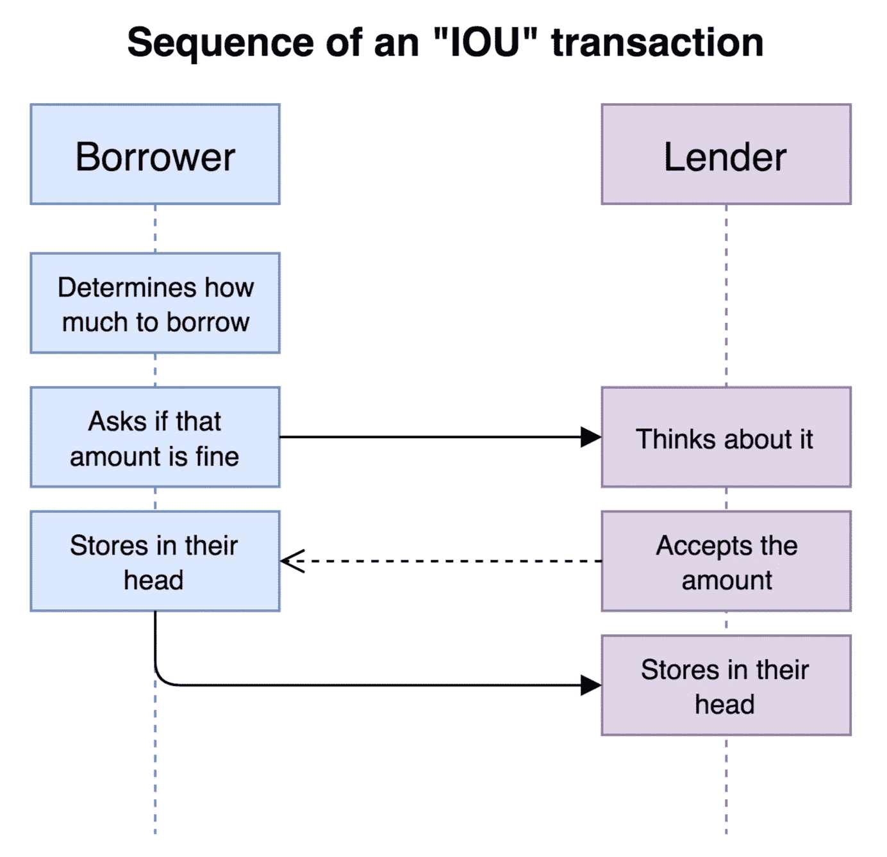
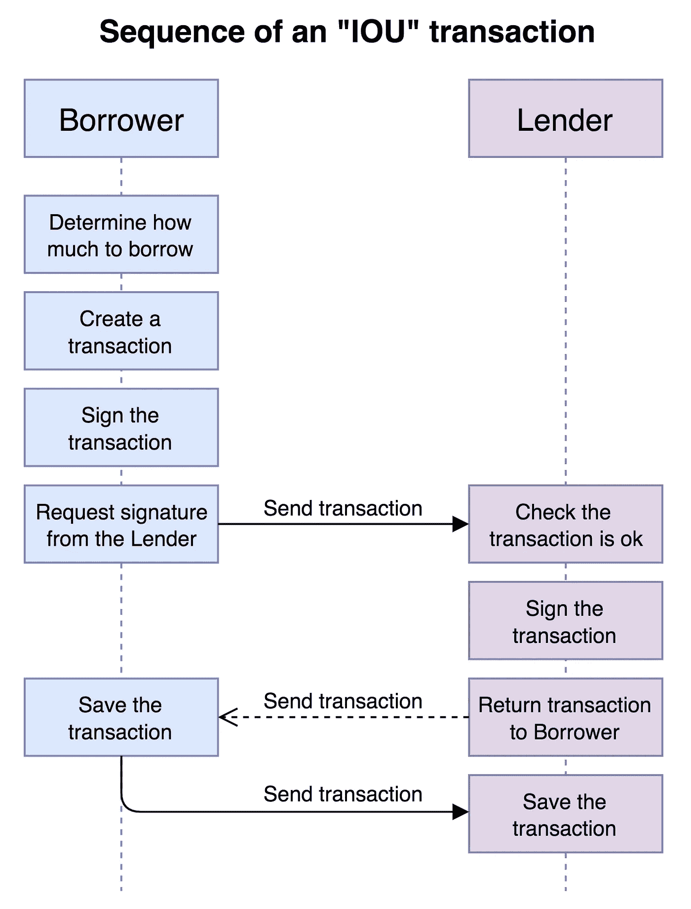

# 如何用 Corda 开发什么

> 原文：<https://medium.com/hackernoon/how-and-what-to-develop-with-corda-d2a3ecba0dfb>


这是我去年写的用 Corda 开发的文章的更新版本。从那以后发生了很大的变化，但是从你的角度来看，作为一个开发者，应该感觉非常相似。Corda 做了很多改变，提高了性能，改善了安全性，提供了更好的开发者体验。谈到最后一点，改善开发人员体验需要添加更好的功能，同时删除不太理想的部分。但是，在保持向后兼容性的同时这样做可以让您顺利完成使用 Corda 3 到 4 的过程。尽管如此，还是有一些不同之处。这些都是这篇文章将重点强调的内容，同时主要是为阅读这篇文章的新 Corda 开发人员提供一个基础。

如果你以前已经使用过 Corda，那么浏览一下这篇文章就足够了。也许您已经使用过 Corda 3，并希望升级到 4，那么快速浏览一下代码示例，看看是否有什么不同，这可能会让您从本文中得到您所需要的。但是，如果你是 Corda 的新手，那么我建议你花些时间通读这篇文章以及[什么是 Corda？](https://lankydanblog.com/2018/06/05/what-is-corda/)并观看 [Corda 关键概念](https://docs.corda.net/key-concepts.html)。

从现在开始，你将会读到用 Corda 开发的[的更新版本。](https://lankydanblog.com/2018/06/05/developing-with-corda/)

在[什么是 Corda？我概述了 Corda 试图实现的目标以及为此做出的设计决策。知道这些信息很好，这样我们可以对平台有一些了解，但它不会帮助我们编写一个可以利用 Corda 的系统。要做到这一点，我们需要知道 Corda 的组件是如何工作和配合在一起的，只有这样，我们才能开始编写一个应用程序，从 Corda 的角度来看，它实际上做了一些事情并正确地工作。我认为这和学习任何其他框架是一样的。但是，我们需要头脑中的声音不时提醒我们，我们实际上是在设计一个分布式账本技术平台。需要采取措施来确保我们创建的应用程序是正确设计的。](https://lankydanblog.com/2018/06/05/what-is-corda/)

在这篇文章中，我们将看看如何编写一个非常简单的 Corda 应用程序。

Corda 兼容任何 JVM 语言。我知道你在想它，但是不，它不是用 Java 写的。它实际上是用科特林语写的。如果您通常使用 Java(像我一样)，这可能需要额外学习一点点来掌握 Kotlin，但您应该不会花太多时间来熟悉它。由于这一点，我个人建议用 Kotlin 编写自己的代码，以保持整个堆栈使用同一种语言。当你需要深入研究 Corda 自己的代码时，这会很有帮助，因为与你刚刚写的相比，它看起来不那么陌生。显然，这只是我的建议，你可以使用 Clojure。但是，如果不首先将它们转换成 Clojure 的等价物，您会发现很难掌握任何现有的示例。

如果不首先理解 Corda 的[关键概念，直接进入代码有点困难。我个人认为，在这个主题上提供的文档非常有帮助，应该可以帮助你完成大部分工作。](https://docs.corda.net/key-concepts.html)

就本文的目的而言，我认为最好忽略实际设置 Corda 节点所需的配置，相反，我们应该完全专注于编写 Corda 应用程序。

# 应用程序概述

在我们开始编写任何代码之前，我们需要了解应用程序试图实现什么。我将依靠 [r3 的培训材料](https://github.com/corda/corda-training-solutions)，而不是拿出我自己的例子，因为这个例子相当容易理解。这个例子是“借据”过程(我欠你的)，其中有人要求一些钱，这些钱将在以后偿还。在这篇文章中，我们将只关注借据的发行。

下面是一个序列图，其中包含了两个人之间签发借据所涉及的非常简化的步骤:



正如你所看到的，借款人要求一些钱，如果贷款人同意，那么他们都试图记住借款人欠贷款人一些钱。这个过程很简单，但即使如此，它已经被简化了一些。在这个过程中，我们实际上并没有提到这些钱是何时以及如何在他们之间转移的。出于本教程的目的，我们将把这种转移放在一边，只关注保存他们之间的借贷意图。

那么，这种过程是如何在 Corda 中建模的呢？同样，在我们继续之前，我想提一下 [Corda 的关键概念](https://docs.corda.net/key-concepts.html)，因为它们对于正确理解正在发生的事情极其重要。

为了在 Corda 中建模这个过程，我们需要替换一些步骤。决定借多少钱，就变成了创建一个包含这些信息的事务。对所提议的感到满意的一方现在用他们的密钥在交易上签名来表示。借款人和贷款人之间的通信被他们之间发送交易所取代。最后，记住谁欠谁的现在是固定的，双方都保存着他们之间发生的交易。通过用这些新信息修改简单的图表，创建了一个新的版本:



有更多的步骤，但过程仍然非常简单。这张图表本身就说明了一切，我想我没有什么可以补充的了。我要说的是，我已经通过删除公证人进一步简化了图表，但只关注我们试图建模的流程。稍后我们将非常、非常、非常简要地触及什么是公证人，但是我将再次建议 [Corda 关于这个主题的文档](https://docs.corda.net/key-concepts-notaries.html)(稍后我将再次这样做)。

这些图表应该为我们提供足够的指导，将我们的 Corda 应用程序放在一起，以便在双方之间签发 IOU。

# 州

在编码部分，让我们从状态开始。关于状态的信息可以在 Corda 文档的[这里](https://docs.corda.net/key-concepts-states.html)找到。状态在节点之间的网络中传递，并最终存储在分类帐中。就事务而言，状态可以是输入或输出，其中许多可以存在于单个事务中。它们也是不可变的，这是构建事务中使用的状态链所必需的。

如前所述，我依赖于 [r3 培训材料](https://github.com/corda/corda-training-solutions)。下面是将在应用程序中传递的`IOUState`:

由于“IOU”的概念，几乎所有的字段都有意义，无需太多解释；`amount`是借出金额，`lender`是借出资金的一方等等。唯一需要解释的属性是类型为`UniqueIdentifier`的`linearId`，这个类基本上是一个 UUID，事实上，它的`internalId`是从`UUID`类生成的。

状态扩展了`LinearState`，这是 Corda 使用的一种通用状态类型，另一种是`FungibleState`。这两个都是`ContractState`的实现。`LinearState` s 用于表示状态，引用其文档，*通过取代自身*而演变。因此，当状态被更新时，它应该作为事务的输入被包括进来，并输出较新的版本。当保存到 vault (Corda 对数据库的抽象)时，旧状态现在将从`UNCONSUMED`标记为`CONSUMED`。

`ContractState`需要一个返回参与者状态的属性。

参与者是国家非常重要的一部分。在此列表中定义的各方决定谁可以将状态保存到他们自己的保险库/数据库中。如果您发现您的状态没有保存到应该知道它的一方，这很可能就是问题所在。我亲身经历并感受到了这个错误的痛苦。

在上面的代码中，参与者没有包含在构造函数中，而是依赖于定义一个可以用来检索它们的`get`函数。这里它返回`lender`和`borrower`，因为它们是事务中仅有的两个参与方。如果您愿意，您可以将`participants`添加到构造函数中，如下所示:

这允许您定义可能不包括在状态中的参与者。您采用哪种方法取决于您的用例，对于本教程来说，这两种方法都可以。

在进入下一部分之前，有一个小问题。前面没有提到的`@BelongsToContract`注释将一个状态绑定到一个契约上(我们很快就会看到)。另一种编写相同代码而不需要注释的方法是将状态移动到契约的内部类中，如下所示:

如果您不这样做或添加注释，那么您将得到以下警告:

幸运的是，这是一个明确的信息，应该给你指出正确的方向。如果你有时间研究一下 Corda 的代码库，你会发现拥有自己契约的内置状态就像上面的例子一样。有关这方面的更多信息可以在 [Corda 3 至 4 升级说明](https://docs.corda.net/head/upgrade-notes.html#step-7-security-add-belongstocontract-annotations)中找到。

# 契约

接下来是合同。契约用于由事务中涉及的所有各方验证给定命令的输入和输出状态。例如，该命令可以是发布状态或付清欠款。我们将在本节稍晚的时候查看命令，但是现在我们应该能够浏览它们。

合同因其表达能力而非常好写。我们能够在合同中写下交易生效必须满足的条件。如果任何一个都不满足，那么将抛出一个异常。这通常以终止当前交易而告终，因为相关方发现该交易无效。

这些条件使用 Corda 定义的`requireThat` DSL 来指定条件以及错误消息，详细说明事务中的错误。这使得浏览一个契约并理解它在做什么变得很好也很容易，因为代码条件被英文消息很好地补充了(或者你想用什么语言写它们)。

下面是一个用于验证上面定义的`IOUState`的合同示例:

出于本文的目的，我简化了契约，因为我们将只关注于实现一种命令类型。让我们从顶部开始，一步一步往下。

`IOUContract`实现了`Contract`，要求它现在有一个`verify`函数，该函数被调用来验证(因此得名)一个事务。

## 合同类别名称

此处包含了合同的类名:

当需要反射时，这用于 Corda 的其他部分。如果你不想直接输入字符串，另一种写法如下:

## 命令

现在我们可以讨论一下我在本节前面简要提到的命令。我已经把它们放在下面了，所以你不需要再滚动了:

这些命令用于指定事务的意图。将它们放在这里是因为它们与合同相关，因为它们决定了必须验证哪些条件。也就是说，如果您愿意，可以将这些命令放在其他地方，比如放在它们自己的文件中，或者放在 contract 类之外但在同一个文件中。只要你的解决方案最好地描述了你的意图，那么你可能正朝着正确的方向前进。

由于这些命令很简单，仅用于指定意图，`TypeOnlyCommandData`被扩展。其他抽象类可以指定我们可能想要使用的命令，比如`MoveCommand`。

我们将在下一节看到如何使用这些命令。

## 实施验证

这里是最神奇的地方，代码被复制并粘贴到下面:

验证功能检查提议的交易是否有效。如果是这样，交易将继续向前，并且很可能被签署并提交到分类帐。但是，如果不满足任何条件，就会抛出`IllegalArgumentException`，从而导致提议的交易终止。

例外通常是 Corda 如何处理未满足的需求。当抛出异常时，假设没有任何东西试图捕获它，执行将被终止并向上传播，直到它被捕获或在控制台输出中结束。这提供了一种控制事务流的简单方法，因为它可以在执行过程中的任何地方停止，甚至可以在交易对手的节点上停止，因为异常将被传递回发起者。

到验证码本身上。检索事务正在其状态上执行的命令，并且根据类型，进行不同的检查以检查事务的有效性。Corda 提供的`requireThat` DSL 允许您编写一个条件，该条件必须为真，否则将输出一条错误消息。

让我们更仔细地看看`requireThat`的一句话:

这里不多解释了。DSL 负责声明的意图。我要指出的是语法:

```
<string message of what condition should be met> using <condition it must pass>
```

很简单。虽然我会强调这一点。当我开始使用 Corda 时，曾经愚蠢地发现，如果条件包含任何空格，就需要在`using`语句中使用括号。忘记这一点会给你带来一些错误🤦‍.最后，DSL 可以包含不在条件表达式中的代码，允许您初始化变量，这样就可以在实际条件中使用。

目前合同已经够多了。当我们将`IOUContract`付诸行动时，它们会在下一节中再次出现。

# 流

在 Corda 中，流是我们联系所有前面部分的中心点。国家、合同和命令一起编写提议新交易的代码，发送给所有交易方签字，如果每个人都满意，就提交给分类账。您可以在流中做更复杂的事情，但是对于本教程，我们将坚持基础。

根据前面章节中的例子，我们现在将实现`IOUIssueFlow`。下面是整个代码，我们将对其进行拆分和检查:

这段代码的流程(是的，这是一个双关语😅)相当简单，可能是您在自己的应用程序中编写的典型流程之一。我可以说，在过去一年左右的时间里，我为工作和其他博客文章所写的大多数信息流都遵循了这种结构。老实说，每当我开始一个新的，我复制并粘贴一个像这样的流，然后从那里开始。还没有让我失望🙂。

显然，您不必以完全相同的方式编写您的流程。我已经将`call`函数分解成一系列更小的函数。这实际上增加了代码的长度。但是，我认为没有比这更容易阅读的了😎。

无论如何，关于我自己和回到代码足够了。

它的作用:

*   创建一个国家
*   将状态添加到新事务中
*   用合同验证交易
*   签署交易
*   要求交易对手签名
*   为所有参与者保存交易

既然我们已经知道了这个流程中的步骤，我们就可以浏览并解释这是如何在代码中完成的。

## 初始流程

下面是代码，只是从中提取了初始流:

首先，用`@InitiatingFlow`注释流类，并扩展`FlowLogic`。任何请求与交易对手通信的流程都需要这种组合。`FlowLogic`包含一个需要由流程实现的抽象函数`call`。这是所有奇迹发生的地方。当流程被触发时，我们将在后面看到，`call`被执行，任何放入函数中的逻辑都会运行。`FlowLogic`是泛型(`FlowLogic<T>`)，其中`T`决定了`call`的返回类型。在上面的例子中，返回了一个`SignedTransaction`,但是如果您不想将任何东西返回给流的调用者，使用`FlowLogic<Unit>`是完全可行的。

接下来是`@StartableByRPC`注释。这允许从 RPC 连接调用流，RPC 连接是 Corda 节点外部和内部之间的接口。当我们看到触发心流时，我们会更多地触及这一点。

又一个注释出现了。`@Suspendable`其实来源于`quasar-core`而不是 Corda 自己的某个库。如果您忘记添加它，您将会看到下面的错误，您的流程将会挂起:

```
java.lang.IllegalArgumentException: Transaction context is missing. This might happen if a suspendable method is not annotated with @Suspendable annotation.
```

与交易对手沟通的所有职能都需要`@Suspendable`。正如名称*suspended able*所暗示的，注释允许在交易对手处理交易时暂停该功能。这里有相当多的神奇之处，在 [Corda 关于流的文档](https://docs.corda.net/flow-state-machines.html#suspendable-functions)中会有简要介绍。

在这篇文章的最初版本中，我谈到了这个令人困惑和不相关的错误。但是，看起来这个问题已经解决了，并且抛出了一个错误消息，解释到底是什么问题。也就是说，如果你确实曾经得到一些奇怪的错误，仍然值得再次检查你是否在正确的地方得到了`@Suspendable`。

把这个和例子联系起来。`call`、`collectSignatures`、`recordTransaction`均注有`@Suspendable`。`collectSignatures`和`recordTransaction`都调用与交易对手交互的`subFlow`。另一方面,`call`需要注释，因为它委托给我们自己的函数，而这些函数是*挂起的*。

这是我们第一次遇到`subFlow` s。我将进一步展开一小段来快速涵盖这一点，并给这个主题应有的解释。

回到手头的任务。

遗漏`@Suspendable`注释是我见过的其他开发人员陷入的最常见的陷阱之一。所以让我再次重申这一点。

> *您需要将* `*@Suspendable*` *注释添加到任何与交易对手*有交互的函数中

你不知道不把它简化到🤦‍

> *你需要给任何挂起*的函数添加 `*@Suspendable*` *注释*

只要看哪一本能表达我的观点就行了。

现在我们完成了注释，我们可以更仔细地看一下`call`函数的内容。

## 创建交易

首先，我们将查看如何构建提议的事务，相关代码摘录如下:

出于本文的目的，我们将假设只有一个公证人允许我们偷懒，只从列表中检索第一个。如果你不知道什么是公证人，就像之前一样，我建议你复习一下 [Corda 关键概念](https://docs.corda.net/key-concepts-notaries.html)以获得关于这个主题的很好的解释。现在，我会给你提供最基本的支持。公证人是一个节点，其唯一目的是验证在发送给它的交易中没有发生重复花费。如果设置了额外验证，也可以运行额外验证。

自从我们扩展了`FlowLogic`之后，`serviceHub`就出现了；功能`networkMapCache`然后将提供网络上各方的身份，`notaryIdentities`进一步缩小范围。正如我前面提到的，我们会偷懒，只从这个列表中检索第一个。如何检索您希望在交易中使用的公证可能会根据您的要求而有所不同。

然后，我们创建一个表示事务意图的命令。在这种情况下，我们使用前面定义的`IOUContract.Commands.Issue`。在创建命令时，我们还需要提供签署交易所需的各方的公钥。`it`是一个`Party`和`owningKey`代表他们的公钥。该事务中唯一的签名者包含在 states `participants`属性中，但是也可以传入一个独立的列表。

现在已经检索或创建了事务所需的所有组件。现在我们需要真正开始把它放在一起。`TransactionBuilder`确实如此。公证人是通过`TransactionBuilder`的一个构造函数添加的，但是如果愿意的话，可以稍后设置。`addOutputState`接受传递给流的`state`以及将验证它的契约名。记得我提到过两种获得这个名字的方法；通过对象中的一个公共属性(Corda 通常是这样做的)或者通过自己手动添加类名，无论哪种方式，最终目标都是一样的。我们添加到这个事务中的最后一个组件是我们创建的命令。

## 验证和签署交易

下一个代码块主要用于验证和签署交易，相关代码也粘贴在下面:

一旦我们高兴地看到我们希望包含在交易中的所有内容都已包含在内，我们就需要对其进行验证。简单地调用`TransactionBuilder`提供的`verify`函数。该函数导致在针对事务运行的契约内部进行验证。正如前面在契约部分提到的，如果契约中的任何条件失败，就会抛出异常。因为在这段代码中，没有试图捕捉异常，所以当异常沿堆栈向上传播时，流程将失败。

交易通过验证后，就我们(发起方)而言，交易是有效的，应该签名。为此，`serviceHub.signInitialTransaction`被称为。这创建了一个新的`SignedTransaction`，它当前仅由发起者签名。当公证员检查交易是否由所有相关方签署时，签署该交易将变得非常重要。

## 从交易对手处收集签名

交易现在由发起者验证和签名。下一步是要求参与交易的交易方签名。一旦完成，交易就可以被持久化到每个人的金库中，因为他们都同意交易是正确的并且满足他们的需求。

以下是负责从交易对手处收集签名的代码:

该交易中的交易对手由`participants`清单中的各方确定。如果我们回想一下州的`participants`字段是如何构造的，其中只包含两方，因此只需要两方签署交易。尽管这种说法是正确的，但交易已经由发起人签署，因此现在只需要一个交易对手(`lender`)签署。

要将交易发送给交易对手，我们首先需要与他们建立一个会话。下面的代码就是这样做的，它返回的会话是上面函数的输入:

`initiateFlow`函数创建一个到另一个节点的会话，它接收一个`Party`并返回一个`FlowSession`用于通信。如前所述，发起者不需要通过该结构再次对事务进行签名，因此在代码中，他们已经从为其创建通信会话的各方中移除。由于我们知道谁参与了该事务，因此可以使用下面的代码创建单个`FlowSession`:

我们不依赖于`participants`列表，而是为`lender`创建一个会话，因为我们对状态的了解表明他们是唯一的交易对手。

`FlowSession`需要在`CollectSignaturesFlow`中与`SignedTransaction`一起使用，此时后者仍然只由发起者签名。`CollectSignaturesFlow`将`SignedTransaction`发送给交易对手(如果有多个交易对手需要签署，则发送给交易对手)并等待他们的响应。我们将在下一节中研究如何发送回响应。一旦返回，`SignedTransaction`现在就完成了，因为它已经被每个人签名，可以被持久化。

## 持久化已签名的事务

以下代码保存了事务:

虽然，对于一行程序来说，这段代码很有冲击力。最有可能总是在流的末尾被调用，至少对于更简单的流是这样。

调用`FinalityFlow`将:

*   将交易发送给公证人(如果需要)
*   将交易记录到发起方的保险库中
*   向交易的参与者广播以将其记录到他们的金库中

在第一点上稍微扩大。只有当事务有任何正在被消费的输入状态时，才将其发送给公证人。这是因为公证人检查以前花费的状态，以防止双重花费。因此，如果没有输入状态，那么公证人就没有什么可做的。不将其发送给公证人主要是一种优化，消除了浪费的工作。

最后两步取决于公证人认定交易有效。如果没有，像往常一样，抛出一个异常，从而导致退出流程。

## 响应者流

到目前为止，我们所看到的流程中的所有内容都在流程的发起者端。在这个例子中，有几次交易被发送给交易对手，发生了一些“事情”。在这个简短的部分中，我们将检查交易对手将运行的代码:

和以前一样，这段代码包含在帖子的前面。

这个类中最重要的一行是`@InitiatedBy`注释，它指定接受来自哪个流的请求并对其做出响应。在本例中，是我们已经经历过的`IOUIssueFlow`。

因为`IOUIssueFlowResponder`也是一个流，它扩展了`FlowLogic`，并且需要实现自己版本的`call`。构造器中的`FlowSession`是发起者用来与这个流通信的会话。`@Suspendable`也用在`call`上，就像它用在启动流程中一样。

`SignTransactionFlow`是在启动器中调用的`CollectSignaturesFlow`的另一半。它是一个抽象类，需要`checkTransaction`来实现。这包含交易对手可能希望对交易进行的任何额外验证。`SignTransaction`的`call`函数仍将根据合同验证交易，因此这是做其他事情的机会；确保交易符合交易对手的标准。也就是说，`checkTransaction`也可以包含尽可能少的代码，如果契约验证足够的话，甚至可以为空。我不会向您展示那会是什么样子，而是让您用生动的想象力来想象一个空的函数…

然后在`SignTransactionFlow`的实现上调用`subFlow`，导致它被执行。契约中的验证运行，随后是`checkTransaction`的内容，如果所有检查都没有问题，则交易被签署并被发送回其来源。

最后一步是调用`ReceiveFinalityFlow`。这与以前在 Corda 3 中的工作方式不同，在 Corda 3 中，您不需要手动接收事务。无论如何，这个`subFlow`需要被调用来记录交易到交易对手的金库。要记录的预期事务的 id 是从预先签名的事务中提取的。此后，交易双方都将交易保存在各自的金库中，以备将来使用。

这个类中的代码可以根据需要简单或复杂。对于本教程中使用的示例，简单就足够了。这将根据您的需求以及发起方和响应方之间必须沟通的内容而变化。

## 利用分流

您会看到`subFlow`函数分散在代码示例中。最后，我想我们已经到了我可以多谈一点的时候了。

是从其他流中调用的流，类似于我们在这篇文章中看到的。例如，`CollectSignaturesFlow`和`FinalityFlow`不能被它们自己触发，因为它们没有用`@InitiatingFlow`标注，因此它们只能在`subFlow`中使用。Corda 提供的大部分开箱即用的流都属于这一类。

所有的`subFlow`都是通过调用流的`call`函数来运行传递给它的流，并返回流通常会返回的内容。一个流不需要任何特殊的东西被传入`subFlow`，如果我们需要的话，可以从另一个流传入`IOUIssueFlow`。

Corda 为许多需要在我们自己的流程中重复的典型操作提供了流程。这些通过`subFlow`调用，包括(以及更多):`CollectSignaturesFlow`、`SignTransactionFlow`、`SendTransactionFlow`和`ReceiveTransactionFlow`。

# 开始流动

在最后一节中，我们将看看如何从 Corda 节点外部调用流。

有几种方法可以做到这一点，每种方法的工作原理略有不同。但是，让我们长话短说，只看 bog 标准`startFlow`函数:

就是这样。如我所说，简短而甜蜜。`proxy`属于`CordaRPCOps`类型，它包含一系列通过 RPC 与 Corda 节点交互的功能。`startFlow`就是这些功能之一。它接受流类的名称以及作为流构造函数一部分的任何参数。因此，在这个例子中，`IOUIssueFlow`的`call`函数将被调用，同时传入一个`IOUState`在流中使用。

返回一个`FlowHandle<T>`，其中`T`是被调用流的相同通用类型，在本例中是一个`SignedTransaction`。然后可以调用`returnValue`来检索一个`CordaFuture`，允许结果一旦可用就被检索。`CordaFuture`是标准`Future`的一个子类型，提供了一些额外的方法，其中一个是`toCompletableFuture`，可能对你有用，也可能没用(反正这对我有用)。

# 包扎

我们终于到了终点。

这篇文章有望帮助你理解如何使用 Corda 进行开发。还有很多东西要学，因为我在这篇文章中只讲述了基础知识。在这篇文章中，我们实现了 IOU 的过程，同时检查了这样做所需的组件。状态是网络中各方共享的事实，契约用于验证事务，而流包含提出新事务的逻辑。有了这些信息，您应该可以开始编写自己的流程了。关于流，你可以做的还有很多，这些在这篇文章中没有涉及到，但是这些基础知识应该可以很好地服务于你尝试编写的任何流。

如果你觉得这篇文章很有帮助，并且想在我写文章的时候关注我，那么你可以在 Twitter 上关注我，地址是 [@LankyDanDev](https://twitter.com/lankydandev) 。

如果你有任何问题或者在阅读这篇文章后有兴趣进一步了解 Corda，你也可以加入 [Corda slack 频道](https://slack.corda.net/)。

我在 r3 工作，是一名平台开发人员。

*原载于 2019 年 4 月 5 日*[*lankydan . dev*](https://lankydan.dev/developing-with-corda-4)*。*