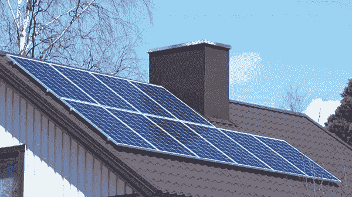

# 区块链如何通过其革命性的应用为能源更加充足的世界做出贡献

> 原文：<https://medium.com/hackernoon/how-blockchain-is-contributing-to-a-more-energy-sufficient-world-with-its-revolutionary-51a4debd6bd0>

区块链病毒在全球范围内的攻击仍处于初期阶段，但其惊人的用途似乎令人难以置信。它对人类经验和努力的影响，如能量领域，正在展现。

Blockchain Contributing to an Energy-Sufficient world- powermag.com

区块链是一种分布式分类帐技术(DLT ),它使数据存储不受中央机构的限制。这使得金融交易的记录可以分布到本地存储数据的其他几台计算机(称为节点)。每笔交易都被记录下来，并与前一笔交易相关联，从而形成一个不断上升的区块链。

自 2009 年比特币加密货币推出区块链技术以来，这一创新的惊人应用已经被发现。这些解决方案改变了金融、零售和医疗保健行业以及其他行业，提高了金融交易的数据安全性和完整性。

渐渐地，区块链技术的采用在能源行业产生了影响。与其他几个部门一样，尽管该行业最初对其接受程度有所抵制，但这些问题还是出现了。有人声称，区块链有能力解决能源销售和共享数据的复杂性问题。

该技术可以确保公开和适时的能源价值交换，恢复消费者和供应商之间的信任。反过来，这些解决方案将增加服务提供商之间的竞争，并大幅降低服务成本。

[一项旨在检验区块链是否真的对电力和能源行业产生影响](https://www.linkedin.com/pulse/slow-getting-ey-survey-state-blockchain-power-sector-thierry-mortier/)的调查显示，只有那些敢于尝试和利用这项技术的公司才能体验到[区块链的技术优势](https://www.coinreview.com/blockchain-technology/)。

# **区块链在能源方面的应用**

## **石油和天然气**

区块链技术应用处于早期。欧洲的能源交易商在 BTL 设计的区块链交易平台上进行了为期 12 周的测试。这种新的兴趣是由石油巨头英国石油公司和埃尼集团推动的。

其目标是在实时交易平台上运行独立的区块链石油和天然气交易。这项测试可以快速发现交易量中的错误，节省了纠正错误的时间。人们还认为，区块链技术可以确保交易系统免受黑客攻击和欺诈交易。

## **资产完整性和维护**

一个值得注意的即将到来的应用程序处理从放置在设备和其他资产上的传感器收集的数据。这个想法是用它们来识别缺陷和防止损失。该系统还通过[区块链物联网](https://hackernoon.com/resolving-iot-security-issues-with-blockchain-technology-3ffb36357094)帮助收集数据，以开发一个预测事件的模型，从而实现预期规划。这确保了促进资产的完整性和工人的安全。

## **替代能源分布**

世界正逐步摆脱对化石燃料和其他有害能源的依赖。太阳能是最重要的，其次是其他新的替代产业，如风能和氢能系统。区块链还被用于设计一种点对点能源交易模式。

近来，分布式能源网(der)或独立的可再生能源(太阳能电池板)有所增加。这些能源连接到电网，将能源消费者转变为生产者，将多余的电力出售给电网。

布鲁克林微电网项目[可能是由区块链技术支持的最重要的能源相关项目。由纽约的 LO3 能源公司发起，它帮助人们通过当地的可再生能源为他们的家庭供电。](https://www.google.com/url?sa=t&rct=j&q=&esrc=s&source=web&cd=1&cad=rja&uact=8&ved=2ahUKEwij8be816ngAhWSa1AKHXGIAk4QFjAAegQIDBAB&url=https%3A%2F%2Flo3energy.com%2F&usg=AOvVaw00FazhG11f-c7N_JVIoTlk)

拥有太阳能电池板的人可以将多余的电能卖给邻居。区块链为电力创造了第一个点对点系统，以保证交易的准确记录。它还通过权力下放优化会计和计量；确保向网络用户透明地共享信息。

## **能源支付系统**

区块链在能源行业的另一个应用是为服务支付设计加密货币。一些公司推出了示范项目来促进这种交易。日本的[丸红株式会社](https://finance.yahoo.com/quote/MARUY/) (MARUY)在部分地区接受加密货币支付。

一些公司甚至将区块链的使用案例扩展到了支付之外。总部位于南非的区块链初创公司 Bankymoon 就是一个例子。与 Usizo 合作。由于兼容比特币的智能电表位于偏远地区，通过加密货币进行货币支付是可能的。

另外值得一提的是智能合约的发展，这使得个人无缝交易过剩能源成为可能。随着剩余能源在全球范围内从生物技术企业中涌现出来，区块链将开启各种可能性。

分配和消费的会计不再必须是沉重的软件和昂贵的机器的事情。区块链是可审查的，对审计开放，并且存储不可变的数据。在这方面，不能忽视区块链加。

# **区块链应用于能源的优势**

迄今为止，区块链技术在能源行业的应用带来了诸多好处。一些公司提到，计算显示[由于这项技术，结构成本节约了 30-60%](http://www.ey.com/Publication/vwLUAssets/ey-overview-of-blockchain-for-energy-and-commodity-trading/$FILE/ey-overview-of-blockchain-for-energy-and-commodity-trading.pdf)。这意味着，从长远来看，公司将通过使用区块链来转变其服务提供方式，从而获得更多利润。

个人也将从将区块链纳入能源分配中获益良多。人们发现，P2P 能源销售比从国家电网购买更便宜。消费者因此可以从电费中节省更多的钱，并有更多的可支配收入。

P2P Energy Trading Model- energy.sia-partners.com

区块链也有能力为电动汽车电池充电提供支付解决方案。它还可以使电动汽车将储存的能量传输回电网，以满足需求。能源用户还可以无缝地更换供应商，以利用不稳定的服务费。

关于网络，它可以帮助检测和解决电源干扰。交易平台上的能源商品交易也将做到无可置疑的诚信和透明。

# **实施挑战**

在能源行业使用区块链的主要挑战之一是区块链三难困境。这个三难问题包括系统的集中化、安全性和可伸缩性。在利用以区块链为基础的能源系统时，可能会有一点需要权衡。

这可能会妨碍系统的最佳性能并影响服务的提供。因此，系统必须被设计成使得所有三个因素在不损害系统的情况下以最佳水平组合。

另一个挑战是，一些客户可能不希望他们的交易公开。由于区块链是一个公共分类账系统，这几乎是不可避免的。这是不为人知的研究领域之一。

可再生能源的成本也是一个问题，因为这是区块链关注的能源。许多潜在客户可能无法获得合适的融资选择，从而阻碍[区块链的采用](https://zycrypto.com/mainstream-adoption-of-blockchain-whats-the-current-progress/)和使用。

尽管公众对区块链技术有着广泛的了解，但是好消息却被无知所掩盖。这使得很大一部分人不欢迎区块链技术，影响了他们的发电和消费。

这一挑战必须通过对人们进行关于该技术的运作和好处的深入教育来克服。

# **结论**

很明显，区块链技术的浪潮是一场海啸，将挑战传统的服务交付模式。它的影响已经开始在能源和电力部门显现，支持正在建立。

因此，重要的是启蒙必须面向展示其巨大的潜力。同样重要的是，艰苦的研究将继续释放这项技术改造电力系统的无限能力。