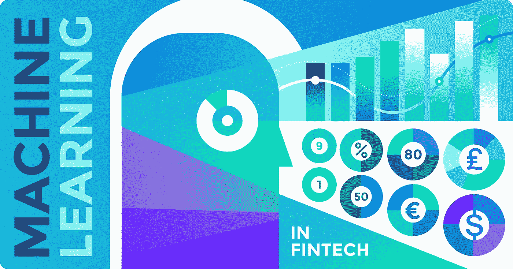

# 机器学习能防止银行业欺诈吗？

> 原文：<https://medium.com/hackernoon/how-can-machine-learning-prevent-fraud-in-banking-industry-e7351bf19fc5>

机器学习是当前科技界最具趋势的事情之一。从电子商务到银行和金融应用程序开发解决方案，许多企业正在寻求从顶级公司招聘能够为其业务开发惊人的 ML 应用程序的 ML 开发人员。据[builtwith.com](https://builtwith.com/)称，45%的科技公司更喜欢在他们正在进行的项目中使用人工智能和机器学习。

即使没有明确的编程，机器学习的力量也可以在世界各地的各种行业中即兴发挥。因此，金融业处于拥抱创新的最前沿。

**在这篇博客中，我们将讨论机器学习应用程序如何防止金融欺诈&移动银行开发公司。在此之前，你必须了解机器学习应用程序的基础知识，如下所述。**

# 什么是机器学习 app，它是如何工作的？

说到机器学习概念，顾名思义，就是机器学习的力量，并据此对事物进行即兴创作。机器学习应用程序从自己的经验中学习，而无需显式编程。这些应用程序可以访问信息，并使用这些数据来学习和改进自己。

一些行业也使用 ML 进行操作，例如识别不需要的电子邮件、向客户提供适当的产品推荐以及提供准确的医疗诊断。例如，可口可乐公司正在使用机器学习进行产品开发。利用他们从各种汽水来源的药房收集的数据，他们能够说出大多数人更喜欢什么口味。这就是帮助他们在全国推出“樱桃雪碧”的原因。

这是另一个如何使用 ML 应用程序来减少欺诈的例子。华为技术公司正在使用分析数据库实时识别欺诈行为。他们使用自动学习模型来分析批准或拒绝的交易。系统很容易发现使用这些数据的欺诈交易。

因此，机器学习应用程序有助于解决任何企业的重大欺诈。机器学习和人工智能的出现使得今天防止商业欺诈变得更加容易。网上货币交易现在是安全的，没有风险。

**阅读更多:**[**2019 年有哪些顶级机器学习 GitHub 库要求？**](https://www.valuecoders.com/blog/technology-and-apps/which-top-machine-learning-github-repositories-to-seek-in-2019/)

# 使用机器学习的欺诈检测过程解释如下:

该过程开始收集和分割数据。此后，机器学习模型被输入训练集，以便预测欺诈概率。这是一个 3 步流程，解释如下:

> 第一步:提取数据

提取的数据将分为三个不同的部分:训练、测试和交叉验证。该算法将在部分数据集中进行训练，并在测试集中调整参数。使用交叉验证集测量数据的性能。高性能模型将针对几个随机的数据部分进行测试，以确保结果的一致性。

> 第二步:提供训练集

预测是用于欺诈检测的机器学习的主要应用。用于训练 ML 模型的数据由多个输入值的两个输出值的记录组成。记录通常从历史数据中获得。

> 第三步:构建模型

建模是预测数据集中欺诈或异常的重要步骤。首先，根据以前的输入和输出数据示例，确定如何进行预测。现在，您可以将预测问题进一步划分为两种类型的任务:

–分类
—回归

# 让我们来看一下 it 如何在金融和移动银行开发公司中防止欺诈的要点列表:

# 1)经济高效且易于维护

当你输入大量数据时，机器学习应用程序可以表现得更好。在依靠规则的系统中，要维持一个欺诈检测系统， [**金融&移动银行开发公司**](https://www.valuecoders.com/industries/banking-financial-services) 不得不花费大量资金。

但是，当涉及到 ML 时，事情会变得容易得多，也更有利可图。你输入系统的数据越多，机器的运行效率就越高。当您这样做时，区分好的和坏的事务变得简单多了。

# 2)快速验证

在一个主要依赖规则的系统中，事情可能会变得过于复杂，检查大数据需要大量时间。商家更喜欢更快地获得资金，如果有一个实现的系统可以在几毫秒内验证大量数据，他们会非常高兴。

选择此选项后，欺诈检测将变得简单易行。只有使用基于 ML 的系统，才能对大量交易进行实时验证。

# 3)未来解决方案

说到网络罪犯，他们很聪明，使用先进的工具和策略来实施他们的欺诈活动。无论您的内部欺诈团队多么高效，您都不会轻易发现欺诈交易，因为事情会变得更加复杂。

人工智能和机器学习是未来，因此，金融机构和其他行业在防止欺诈时必须依靠 ML。这些系统可以快速了解实施欺诈的人的模式和行为，并保护他们的组织免受此类事情的影响。

# 4)高效

接受适当训练的机器会比人类表现得更好。他们可以轻松地做数据分析的重复性工作。这些机器将迅速处理所有需要人工干预的案件。防止欺诈交易的发生将会很容易，因为他们可以毫无困难地识别非直觉和微妙的模式。

# 5)可扩展

随着数据集的增加，机器学习模型中的算法变得更加有效。而在基于规则的模型中，维护欺诈检测系统的成本会随着客户群的增加而成倍增加。

定制银行和金融软件开发服务以及机器学习随着更多数据而改进，因为 ML 模型可以检测多种行为之间的差异和相似性。一旦他们被告知哪些交易是真实的，哪些是欺诈的，系统就可以处理这些交易，并开始选择符合其中任何一项的交易。

他们还可以在未来处理新交易时预测它们。规模上的风险在快速增长。如果在训练数据机器中没有检测到欺诈，学习将使系统能够在将来忽略该类型的欺诈。

# 包装说明:

有许多公司仍然怀疑是否值得投资人工智能和 ML。那么，答案是肯定的。事实上，这将是 2019 年企业卓有成效的投资。然而，看到一个组织或机构使用 [**银行手机 app 解决方案**](https://www.valuecoders.com/industries/banking-financial-services) 将获得的所有利益以及他们在未来将节省的资金是无法理解的。因此，是时候采用 ML 来维护金钱和客户数据以及品牌的声誉了。

现在，如果你对使用机器学习或它的任何框架来开发你的下一个项目感到好奇，那么这是开始的正确时间。你也可以 [**从**](https://www.valuecoders.com/hire-developers/hire-machine-learning-experts) **[**可靠的软件开发公司**](https://www.valuecoders.com/) 雇佣熟练的 ML 网站开发人员** ，比如**估价师**。

*原载于 2019 年 3 月 5 日*[*【www.valuecoders.com】*](https://www.valuecoders.com/blog/technology-and-apps/reasons-how-machine-learning-can-prevent-fraud-in-banking-industry/)*。*