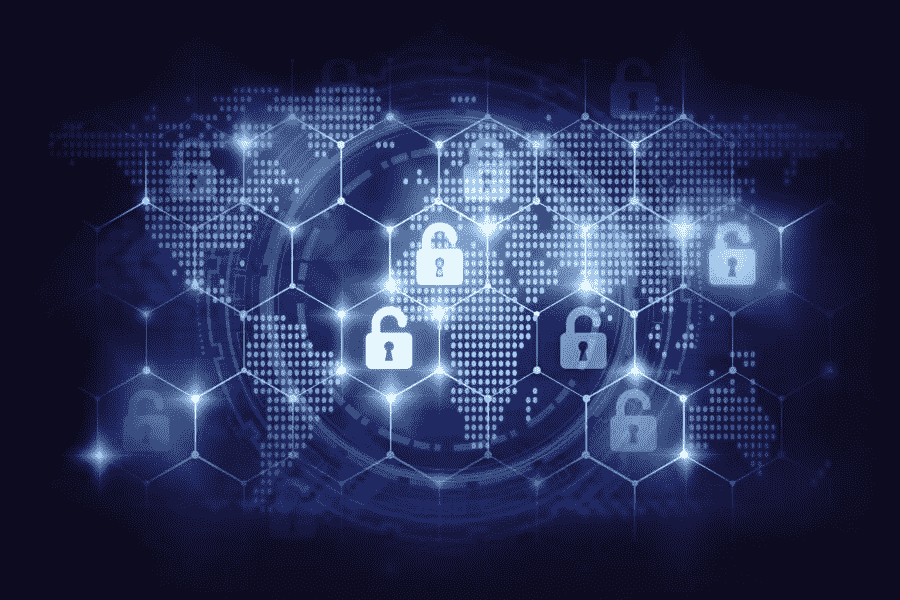

# 您如何通过持续身份认证来提高网络安全性

> 原文：<https://medium.com/hackernoon/how-can-you-improve-your-cybersecurity-with-continuous-authentication-3e5a943889f6>

*多因素身份认证(MFA)和一次性密码等标准身份认证方法在受保护边界的入口处起到过滤器的作用。但是如果有人设法欺骗这些过滤器或者在他们成功登录后改变用户呢？网络攻击者可能使用恶意软件和不同的网络钓鱼技术窃取合法用户的凭据，甚至一次性密码。员工经常漫不经心地与同事分享他们的登录名和密码。最后，总有一种风险，即有人获得了笔记本电脑或智能手机等企业设备，可以完全访问企业网络、关键资源和应用程序。*

[连续认证](https://www.ekransystem.com/en/blog/continuous-authentication)似乎是这个问题的正确解决方案。在本文中，我们将告诉您关于这项技术的更多信息，以及通过连续身份验证提高安全性的一些最佳实践。

# 连续身份验证是保护数据访问的关键

连续身份验证基本上是一套方法和技术，旨在确保在整个会话过程中不断重新验证用户。换句话说，这项技术将常规身份认证从一次性事件转变为持续的过程。

这项技术旨在帮助您缓解一些网络安全问题，包括:

*   网络钓鱼攻击和[凭据填充](https://en.wikipedia.org/wiki/Credential_stuffing)
*   共享登录凭据
*   共享设备

与传统的身份认证工具不同，持续身份和访问管理(IAM)借助行为生物识别技术来验证用户，行为生物识别技术是每个人都具有的独特生理和行为模式，就像视网膜扫描或指纹一样。机器学习是一种支持连续身份验证的技术，可以在不中断工作流程的情况下不断地[重新验证用户的身份](https://www.ekransystem.com/pl/blog/zero-trust-security-model)。由于机器学习，连续 IAM 可以及时收集和处理关于用户的大量数据。

具有连续身份验证功能的 IAM 解决方案应该能够完成这三项任务:

*   **收集信息** —使用不同的传感器，IAM 解决方案应不断收集和更新特定用户的数据、他们独特的生理特征、行为模式等。
*   **处理数据并从中学习** —持续身份认证解决方案应该能够分析收集的信息，并为特定用户构建行为模式。
*   **管理访问** —基于构建的行为特征，IAM 解决方案应该能够区分合法用户和可能的入侵者，并允许或拒绝对关键数据的访问。

持续身份认证解决方案不断监控和分析特定用户与系统交互的方式，以计算该用户是其所声称的用户的概率。该解决方案用于构建高质量用户行为档案的数据可分为三类:

*   **生理数据** —用户手臂的大小，他们在键盘上按键的力度，右利手/左利手等。
*   **认知数据**——你拿手机的方式，你在键盘上打字的速度，手眼协调等。
*   **上下文数据** —用户的位置、当前时区等。

行为生物统计学最常见的例子是击键动力学:你在键盘上打字的速度有多快，找到正确的键需要多长时间，你按键的力度有多大，等等。在智能手机上，这样的解决方案可能会分析你抓取手机或点击屏幕的方式。

现在，让我们来讨论一下持续身份验证如何增强贵公司的安全性。

# 连续身份认证的三大优势

实施连续身份认证可以为您带来很多好处，并帮助您显著提升公司的网络安全。这项技术的主要优势如下:

*   *正在进行的用户身份验证*
*   *快速检测会话内的用户变更*
*   *不间断工作流程*

让我们仔细看看这三项优势。

**正在进行的用户身份验证**。连续身份验证的主要思想是将用户身份验证变成一个持续不断的过程。标准身份验证工具只有两个选项:要么授予用户访问系统的权限，要么拒绝用户访问。另一方面，连续身份验证计算当前用户是他们登录的帐户的实际所有者的概率。

理想情况下，如果概率达到某个水平，比如说 50 %,就应该初始化一个额外的验证程序。并且如果概率水平进一步下降，则应该完全终止会话。

**快速检测会话内的用户变化。你的手机、平板电脑、笔记本电脑甚至台式机总有可能被他人窃取。员工可能会借用同事的电脑来访问他们无权访问的数据或应用程序。小孩子可能会开始玩父母的智能手机，并意外启动一个关键应用程序，更改甚至删除重要数据。连续身份验证可以帮助您及时检测到用户可能发生的变化，从而足够快地做出响应，以降低可能的风险。**

**不间断的工作流程。**阻碍连续身份认证的主要障碍之一是需要限制可能的工作流中断次数。人们讨厌在工作过程中不断被要求重新输入密码、回答机密问题或提供其他验证数据。但由于使用了机器学习，连续认证现在可以在后台运行，而不会打扰用户。

但是，这些优势是否足以让连续身份认证取代诸如[双因素身份认证](https://www.ekransystem.com/en/two-factor-authentication-tool)或二次身份认证等安全黄金标准呢？这种网络安全创新仍然需要应对的主要挑战是什么？

# 连续身份验证与 MFA

的确，通过持续的身份和访问管理，尤其是持续的身份认证，您可以显著提高安全性。但是，这种技术绝不应该被视为 MFA、单点登录(SSO)、一次性密码和二次身份验证等工具的替代品。如果有的话，这些工具应该一起使用，以弥补彼此的缺点。

您可能知道，MFA 基于三个因素:

*   *知识(登录凭证)*
*   *拥有(经验证的移动设备)*
*   *继承(生物识别)*

网络犯罪分子发明了许多工具和技术来窃取这些数据，从而绕过 MFA。因此，理论上，入侵者总是有可能以合法用户的身份进入您公司网络的受保护边界。

另一方面，行为生物识别无法被攻击者复制和重复使用，因为它可能发生在密码、一次性代码甚至视网膜扫描中。因此，使用连续身份验证，您可以为公司网络增加一层保护。这使得一旦攻击者的行为开始偏离用户的行为模式，就可以检测到可能的入侵。

同时，连续认证是一项正在发展的技术，有许多问题需要解决。为每个网络用户建立一个高质量的[基线行为档案](https://www.ekransystem.com/en/blog/best-practices-building-baseline-user-behavior)并减少误报的数量是这项技术在不久的将来需要应对的主要挑战之一。

# 结论

连续身份验证是一种很有前途的技术，可以弥补 MFA 留下的安全漏洞。有了这项技术，身份验证不再是在会话开始时进行的一次性身份验证过程。现在，这是一个持续的过程，在整个会话过程中，用户的身份会被不断地检查和评估。

虽然持续身份验证在减少网络钓鱼攻击和解决共享密码和借用设备的问题方面潜力巨大，但它不能取代其他 IAM 工具，如 MFA 或二次身份验证。这些工具都追求不同的目标，理想情况下，它们应该一起使用。