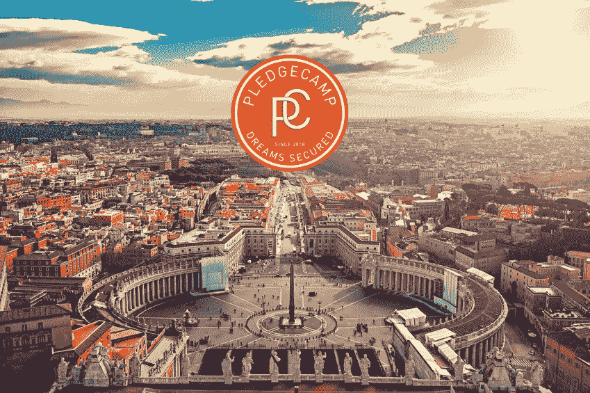

# 众筹 2.0 如何解决教皇的美好世界愿景

> 原文：<https://medium.com/hackernoon/how-crowdfunding-2-0-solves-the-popes-vision-of-a-better-world-66ac84ee4f6a>

世界各地的商业企业已经开始不仅仅着眼于创收手段，并开始采取措施解决社会问题。我们身边并不缺少需要解决的问题，公司已经提出了创新的想法，将他们的核心商业实践与社会企业机会联系起来。

例如，英国的 Kenco Coffee 正试图通过像种植园工人一样训练失业青年加入洪都拉斯当地帮派来解决他们的问题。另一方面，总部位于费城的服装和配饰品牌 *United by Blue* 正专注于[海洋保护](https://unitedbyblue.com/blogs/united-by-blue-journal/why-we-re-calling-it-blue-friday)。

在某些情况下，甚至投资者也会寻找对社会有积极影响的创业公司。总部位于多伦多的社会风险投资机构专门与从绿色技术到儿童教育等各个领域的公司合作，从潜在投资者那里筹集资金。

今天的企业家不仅仅专注于创造赚钱的项目；相反，他们正在建立组织，努力解决影响我们和我们周围世界的问题。今年复活节，区块链众筹平台“誓言营”也决定通过与“赞美诗”项目的合作，为解决社会问题尽一份力。

# **什么是赞美斯？**

2015 年 5 月 24 日，教皇方济各向罗马天主教会的所有主教发出了一封名为 [Laudato Si'](http://w2.vatican.va/content/francesco/en/encyclicals/documents/papa-francesco_20150524_enciclica-laudato-si.html) (翻译为*赞美你*)的教皇信函。该书的副标题是“关爱我们共同的家园”。在信中，教皇批评了导致环境破坏和全球变暖的消费主义倾向和垃圾文化。他向“生活在这个星球上的每一个人”发表讲话，承认这些问题的严重性，并敦促他们迅速采取统一行动，拯救我们共同的家园——地球。

这封信还谈到提高经济上较弱和受压迫的社会阶层的地位，并以可持续和公平的方式利用现有资源。《赞美诗》受到了全球社会各界的赞誉。

出于这封信，创业加速器[*Laudato Si‘挑战赛*](https://lsc18.org/) 诞生了。针对教皇的一些担忧，Laudato Si 的挑战旨在通过与专注于以可持续方式解决社会和环境问题的营利性企业合作，改善*“到 2020 年，1000 万人的生活被排除在我们的共同家园之外”*。

根据联合国难民署全球趋势报告，2017 年，由于冲突、迫害和环境恶化等原因，超过 6800 万人流离失所。打算参与这一倡议的组织要么努力帮助这些人留在他们原来的家园，要么确保难民在新的地点适应和茁壮成长。显而易见，劳达托·斯的挑战得到了罗马梵蒂冈的支持。

# **质权人与劳达托·西的关联**

“新人营”非常荣幸能与“劳达托·斯挑战赛”合作。在他的信中，教皇认为技术是造成环境和人类危机的主要因素。根据教皇的说法，许多技术解决方案只是试图消除问题症状的短期补救措施，而没有做出任何努力来解决基本的环境、社会、经济和道德问题。他希望商业企业能够开发可持续技术，解决困扰我们当今生活各个方面的根本问题。

Pledgecamp 的基本目标是解决众筹经济中持续存在的信任问题。通过使用区块链技术，Pledgecamp 将确保使用其众筹平台的项目在整个产品开发周期中对投资者负责。这完全符合教皇的愿景。通过该计划选择的创业公司将能够通过 Pledgecamp 的平台进行众筹活动。

此外，这种伙伴关系将使世界各地的人们能够在教皇呼吁的社会行动中发挥积极作用，为[选定的项目](https://lsc18.org/top-companies)提供财政支持。来自誓言营的代表已被邀请参加今年 5 月在梵蒂冈城举行的 Laudato Si' Challenge 的启动仪式。

# **质权营如何扰乱众筹**

如今流行的众筹网站，如 Kickstarter 和 T2 Indiegogo，没有任何政策来保护投资者的利益，以防项目有意或无意地无法实现目标。他们收取大约 5%的上市费，此后他们不再跟踪项目更新。

例如，[最酷的酷客](https://coolest.com/)在 2014 年已经筹集了 1300 万美元，但是还没有完全兑现他们的承诺。这种不负责任的行为伤害了整个众筹生态。事实上，根据 Kickstarter 分享的数据，[不到三分之一的用户](/pledgecamp/getting-to-market-2f1875bba27f)最终赞助了不止一个项目。不用说，这种信任的丧失也会影响其他寻求融资的初创公司。

Pledgecamp 希望[打破这种众筹模式](https://pledgecamp.com/__pdf/pledgecamp_whitepaperv2_en.pdf)并引入支持者措施，通过他们对区块链技术的使用。他们将推出自己的本土代币，称为质押币或 PLG，用于他们平台上的各种支付。通过他们的*竞选保证金*系统，希望使用 Pledgecamp 平台的项目将不得不通过 PLG 代币支付上市费。当他们展示项目进展的切实证据时(如演示产品开发或主持会议以回答支持者的询问)，押金将部分退还给他们。

支持者自己将投票决定一个项目是否已经做了足够的工作来赚回他们的押金。通过将这一权力移交给项目的实际出资人，Pledgecamp 坚持了去中心化的原则。

grake camp 也将成为第一个建立*靠山保险*政策的众筹平台，以保障发起人的利益。项目可以选择通过智能合同锁定一定比例的融资。与竞选保证金计划类似，只有在支持者同意的情况下，这笔资金才会随着时间的推移发放给项目。如果在任何时候，投资者认为该项目没有正确使用可用资金，那么该项目将从平台中删除，Backer Insurance 中的剩余资金将被分配回来。

作为对创业公司的激励，他们锁定的基金数量越多，支付的上市费就越少。锁定 50%募集资金的项目将免交任何上市费用。当然，人们会更信任锁定大量资金的项目。

# **为什么 Pledgecamp 的模式对创业公司来说更具可持续性**

Pledgecamp 的愿景是创造一个信任的环境，这将有利于寻求融资的项目和寻找赞助项目的人。信任是一条双行道，这也是 Pledgecamp 试图通过他们的各种政策来证明的。项目发起人在决定他们所支持的项目的未来时将有更大的发言权。这将培养一种主人翁意识，他们会被激励以他们自己的方式来帮助这个项目，比如通过社交媒体来传播这个消息。

项目可能还需要短期的具有各种技能的人员，这些人可能已经是发起人组的一部分了。通过他们的“聪明人群”倡议，Pledgecamp 正计划创建一个*零工经济，并将这些项目与寻找短期工作的自由职业者联系起来。这些项目将能够通过 PLG 代币支付这些自由职业者。现在，项目将能够根据需要短期雇用人员，而无需经历提供全职合同的麻烦，也没有国际边界的限制。此外，从项目本身的成功中获得既得利益的支持者群体中雇用成员，也将确保项目的可持续增长和发展。*

# ***离别的思念***

*Pledgecamp 正在带来各种创新，以引起当今众筹方式的范式转变。他们的政策将有利于初创企业和投资者，并有助于发展信任关系。通过与 Laudato Si' Challenge 的合作，他们表明了他们在解决困扰我们的一些社会和环境问题方面发挥作用的认真态度。希望在不久的将来，更多这样的企业会意识到它们的社会和环境责任。如果他们资金短缺，那么他们就不需要再看 Pledgecamp 平台以外的任何东西了！*