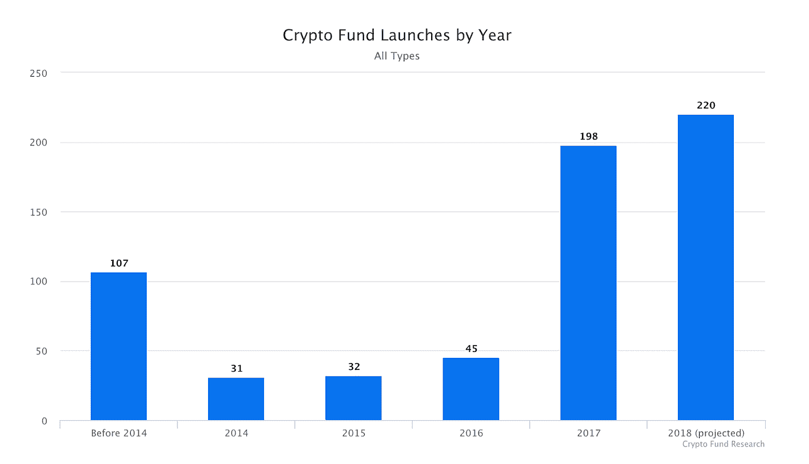

# 加密如何改变风险投资

> 原文：<https://medium.com/hackernoon/how-crypto-is-transforming-venture-capital-3af74cd5301d>

## *苦乐参半的舞蹈简史*

Source: Pixabay

在过去几年中，风险投资和区块链生态系统之间形成了一种有趣的动态:

> 风投们从忽视加密货币到被排除在 ICO 行动之外，再到夺回王位，最后，开始以有趣的方式与加密纠缠在一起。

这篇文章首先回顾了到目前为止发生的事情，并反思了我们现在所处的位置，而即将到来的后续文章将推测未来可能会发生什么。

*“第一，他们不理你”*。代币销售获得如此大的吸引力的主要原因之一是出于需要:没有传统投资者有兴趣资助名为 [Mastercoin](https://bitcoinmagazine.com/articles/mastercoin-a-second-generation-protocol-on-the-bitcoin-blockchain-1383603310/) 或自称为[世界计算机](https://www.ethereum.org/)的项目。通过利用加密资产作为筹资工具，发展成为 2017 年 ICO 疯狂的公众众筹成为一种全新的风险融资范式，感觉介于 Kickstarter 和 IPO 之间。

然而，一些风投确实很早就看到了这项技术的潜力，并投资(购买股权)了基于比特币的公司。然而，显而易见的是，大部分价值并没有积累在分散网络之上的公司中，而是积累在它们固有的资产中(例如，比特币本身更有价值，其平均价值增长速度超过钱包提供商区块链甚至领先的交易所比特币基地)。在风险投资(和区块链投资)界慢慢传播的解释这一现象的指导性叙事，今天仍然很普遍(但有争议)，围绕着“ [fat protocols](http://www.usv.com/blog/fat-protocols) ”(由当时的 USV 的 [Joel Monegro](https://twitter.com/jmonegro) 介绍)。投资假说提出，技术堆栈底层(“第 1 层”)的协议，如以太坊，将比它上面的“中间件”和应用层中的项目积累更多的价值。为了能够投资这些协议本身，风投们必须想出如何处理加密资产。

风投发现的第一种接触加密资产的方式是通过 [SAFTs](https://www.businessinsider.com/bitcoin-price-what-is-a-saft-blockchain-the-crypto-fundraising-craze-shaking-up-venture-capital-2017-11) (“未来代币的简单协议”)，这是一种通过修改早期股权投资的标准框架而创造的法律手段，并且变得非常受欢迎(尽管律师和监管机构等不断批评这种工具)。这种方法因 [Filecoin](https://filecoin.io/) 而变得流行，他们用它进行了一轮 2 亿美元的私人融资。因为 SAFT 本身最近也受到了一些关注，一些改进的解决方案(在德语中缩写不是“果汁”的意思)被提出来了。一些更细微的迭代在之后被称为[，在](/aboveboard-news/saft-is-dead-long-live-safter-4b3954403889)[之后被称为](/raising-the-entrepreneurial-boom/for-icos-startengine-introduces-rate-real-agreement-for-tokens-and-equity-2379e017ee76)。Republic Crypto 的[令牌 DPA](https://republic.co/token-dpa) 增加了可转换贷款的元素，而 [CrowdSAFE](https://republic.co/learn/investors/crowdsafe) 则针对股权众筹/安全令牌。

SAFT 成功的原因之一当然是创投资本家只需最低限度地改变他们的流程就能参与进来——一份法律合同基本上被换成了另一份。然而，总有一天，“未来令牌”会被分发出去，机构风投需要能够以一种安全的方式持有和管理这些资产。

因此，下一步需要考虑的是*监护权*。风险投资基金需要机构级托管，从安全性(以及监管，取决于基金的规模和管辖范围)来看，交易所账户甚至硬件钱包都不行。尽管托管仍然是一个重大挑战，可以说阻碍了许多机构参与者进入该资产类别，但生态系统从根本没有可行的解决方案发展到传统金融和专注于加密货币的公司提供越来越多的产品。

这包括符合基金法规(特别是与大型基金相关)的合格托管人，如 [BitGo Trust](https://www.bitgo.com/info/solutions#custody) ，甚至包括金融巨头在现有监管制度内寻求其他可行解决方案的努力，如花旗集团的[数字资产收据(DARs](https://www.businessinsider.de/citigroup-exploring-crypto-digital-asset-receipt-2018-9?r=US&IR=T) )。除此之外，交易所开始为机构提供托管和场外交易解决方案(如[比特币基地托管](https://custody.coinbase.com/))，就像零售托管提供商正在推出机构级冷藏解决方案(如[总账金库](https://www.ledger.com/pages/ledger-vault))。尽管托管领域的活动激增，但许多加密基金仍在定制的自我托管模式下运营，这表明当前的解决方案对大部分市场而言尚不可行。

有了这两种新的变通方法，SAFTs(及其新的迭代)和上述托管解决方案，2018 年的风投可以直接投资加密资产。他们就这样做了。继 [Filecoin](https://filecoin.io/blog/sale-completed/) 之后，出现了一系列看似不断增加的私人融资，从类似 [Basis](https://www.basis.io/) 的 1.33 亿美元私人风险投资轮(该项目最近[因监管担忧而关闭](https://www.theblockcrypto.com/2018/12/12/stablecoin-project-basis-is-shutting-down-and-returning-the-majority-of-capital-raised-to-investors/))的项目，一直到 Telegram 的[大型预售](https://www.ccn.com/telegram-cancels-public-ico-after-raising-1-7-billion-in-presale/)筹集了惊人的 17 亿美元。起初，这些私人销售甚至比 ico 更大(风投可能对能够加入 token razan 有点兴奋过度，对之前的 FOMO 进行了过度补偿)。然而，随着最近的市场崩溃，公开销售空间几乎枯竭，估值变得更加合理，尽管在接近今年年底时仍有争议(例如，[这一轮 3500 万美元的融资](https://www.coindesk.com/35-million-sequoia-baidu-back-turing-award-winners-blockchain-project)是一个高调的项目，有一轮精选的加密风投)。

另一个非常有趣的发展是加密风投开始直接从公共加密市场购买令牌，例如 a16z 以 1500 万美元购买了 MKR 令牌供应总量的 6%。对于风投来说，这是一个完全陌生的领域，假设这发展成为一种主要趋势，它可能会改变该领域在获得投资方面的竞争动态:尽管 a16z 是一家主要的加密风投公司，但任何人都可以在公开市场上购买 MKR，不像售前那样，通常只有最有信誉的风投才能获得投资。请注意，这可能会开始模糊“加密风投”(买入并持有)和加密对冲基金(流动性多头/空头策略)之间的界限，因为在公开市场上卖出头寸和买入头寸一样容易。

尽管 ico 看起来很像 2017 年，但数字却讲述了一个不同的故事:根据 [Coinschedule](https://www.coinschedule.com/) 的数据，2018 年通过代币销售筹集了超过 200 亿美元，几乎是 2017 年 65 亿美元的三倍。然而，其中很大一部分从未公开发行，而是只提供给私人投资者(不仅是风投，还有越来越多的家族理财室、HNW 个人等)。).其中一个原因是监管审查的加强——美国证券交易委员会(SEC)等金融机构已经开始起诉可能被视为未经授权向公众出售证券的案件，这使得风投(以及其他“专业”或“经认可”的投资者群体)的配售更具吸引力。除此之外，风险投资对最终的公开销售也有重要的信号作用。加密资产的整体市场低迷也将导致散户投资者的需求大幅下降，而机构投资者则有意以反周期的方式进行投资(至少是试图这样做)。

从发起的加密基金的数量来看，机构参与的增加也很明显。现在有超过 900 只加密基金，比 2014 年前增长了 10 倍。

Source: [Crypto Fund Research](https://cryptofundresearch.com/cryptocurrency-funds-overview-infographic/)

在这 900 多只基金中，相对来说很少像 A16z Crypto(股权、预售& ICOs、公共加密市场)这样跨阶段投资，而大多数专注于一两个集群。

Source: [Crypto Funds List](https://www.cryptofundslist.io/)

因此，风投从完全没有进入权，到占领了代币销售的大部分市场。但不要这么快——还有另一个转折:越来越多的项目正在推出这样的模型，要么令牌只能通过向网络提供一些价值来“赚取”(而不是出售)，要么根本就没有令牌。后者通常是所谓的“第二层”技术(在区块链平台之上添加扩展基础设施)。这就把风险投资带回了一个显而易见的投资悖论:如何直接捕捉分散技术的价值？

“广义矿业”是这个领域的最新术语，[由](/cambrial-capital/generalized-mining-and-the-third-party-economy-meetup-ee23442a4720)[投资基金](https://coinfund.io/)推出，由[纺织](https://www.fabric.vc/)和 [Cambrial](/cambrial-capital/generalised-mining-the-lps-perspective-72dfa2d22afd) 讨论；[符号](https://notation.vc/)更倾向于“[挖掘 2.0](/notation-capital/notation-blockchain-mining-2-0-dcf46a28f7eb) ”，提供了一个答案。这个想法本质上是投资者将积极参与他们投资的网络。因此，风投不只是出资，而是通过提供供应方服务来直接参与加密网络，帮助网络走向可用。换句话说，投资者充当“矿工、利益攸关者、验证者、债券人、管理者、争端解决者、节点、枢纽、观察者、网络路由器等。”。在实践中，积极参与通常与直接投资相结合，但有些项目不提供投资机会，参与其基础网络是获取这些特定技术价值的唯一途径。

从某种意义上来说，广义挖掘的发展可以被视为风险投资为其投资组合公司提供附加值的趋势的延续，应用于加密(因为[加密网络不是公司](/@cburniske/cryptonetworks-are-not-companies-a307ad6a61ae))。分散网络的供应方服务可能是迄今为止最引人注目的例子，说明加密投资者如何开始开发针对这一独特资产类别的特定能力([multi coin Capital](https://multicoin.capital/2018/10/23/the-evolving-role-of-crypto-investors/)撰写的本文详细阐述)。我很高兴看到早期投资者还能如何直接参与他们资助的网络。

> 概括地说，我们已经探索了风投是如何通过为新兴的代币和加密资产范式修改其基础设施，找到暴露于奇妙怪异的加密世界的方法的。投资代币的风险投资公司已经调整了他们的流程(加密资产的托管和代币销售参与的法律框架),加密本地风险投资公司开始更彻底地改变他们的行为:他们直接从公开市场购买资产，并通过广义挖掘直接参与加密网络。

对于大多数传统风投来说，这些更高级的操作仍然是不可想象的，他们可能会通过投资基金的基金模式中的加密基金来间接获得风险敞口(可以说，[这一趋势已经开始](/@suzhu/four-crypto-gospels-2-professional-funds-603e75ba0064))。

*通过对差异化需求的增加，我们可以理解上述市场变化。*新的资本来源(尤其是在牛市期间),包括散户投资者、传统风投、家族理财室、商业天使等。让投资最佳加密项目的竞争变得前所未有的激烈。通过专注于代币经济的独特需求和能力，加密本地风投正在创造一种竞争优势。

我相信，我们才刚刚开始看到区块链技术将对风险投资领域产生的影响，在接下来的文章中，我将探索不同的场景和可能性，这些场景和可能性将引领我们走向何方，未来会有哪些令人兴奋的发展。

*喜欢的请鼓掌，关注我(*[*Twitter*](https://twitter.com/janbrswl)*)获取未来帖子通知。*

*————*

*感谢@*[*NancyFechnay*](https://twitter.com/NancyFechnay)*对初稿提供反馈。*