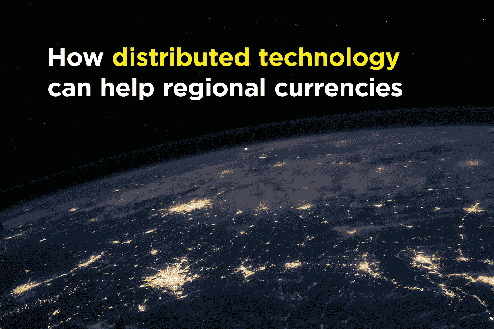

# 分布式技术如何帮助地区货币

> 原文：<https://medium.com/hackernoon/how-distributed-technology-can-help-regional-currencies-2b8341c23b59>

通常，地区(或当地)货币的创造和使用是由各自的社区发起的，也就是说，是自下而上的。以央行为代表的中央政府(表面上)促进了它们的系统。但它们经常禁止地区性“证书”、票据或其他形式货币的流通，认为这些会将控制权转移给国家货币体系。与此同时，政府往往意识不到引入当地货币的经济影响。

使用当地货币不仅可以刺激当地经济，还可以通过增加社会资本在社区内建立更紧密的联系。一般来说，通过使用区域货币进行内部贸易是一种抵御策略。它可以减少国家甚至全球经济危机的影响，以及对国际贸易(如化石燃料、食品等)的依赖。)，通过增强自给自足。此外，采用当地货币提高了社区成员对其自身经济活动的影响的认识，使他们能够更明智地采取行动，并为当地社区的共同利益服务。

在长期经济低迷和萧条时期，政府对当地社区货币项目的态度往往会发生变化。事实上，正是在这个时候，政府的“管理工具”没有真正起作用，公民对生活水平下降的不满变得更加强烈，社区意见变得更加苛刻。

大多数地区货币进入流通领域的例子都是相对现代的:在 20 世纪 20-30 年代(即大萧条)或更近几十年(特别是在最近的金融危机和随后的衰退之后)。特别是互联网和区块链技术的出现，带来了新的货币形式，并向我们介绍了它们的潜在应用。

当然还有很多有趣的共同体货币的例子，包括中世纪(10-13 世纪)的滞期费，甚至古埃及也有一些。然而，我们不会探究那些历史案例，因为缺乏足够的经济数据，而且它们与现代经济学不相容。

因此，我们将考虑几个实际实现的例子。如果你不想深入研究案例(因为我们已经选择了相当多的案例)，你可以直接跳到下一节——*新的秘密领域*——继续我们的整体思路。当然，你也可以随时回到案例研究，或者在网上搜索更多成功实施当地货币和共同体货币的例子。

# **案例**

## **奥地利:沃尔格勒**

首先，我们有必要考虑一下奥地利沃尔格勒市的次级货币。1932 年(大萧条时期)，这座城市的经济状况，说得委婉一点，并不怎么样。失业率达到 30%(当时该市总人口约为 50，000 人)，供水和其他重要基础设施急需修复，外债超过了城市预算的年收入，由于人们根本没有任何东西可以支付，收入迅速下降。

新当选的市长 Michael Unterguggenberger 只有通过创造奇迹才能将这座城市从经济灾难中拯救出来——所以他基本上就是这么做的。他用该市国库剩余的 40，000 先令(即使在当时也是微不足道的数额)作为发行市政证书的抵押。

**那么，这个系统是如何工作的:**

*   为了便于流通，发行了面值为 1 先令、5 先令和 10 先令的证书。
*   证书的有效期为 1 年。在任期结束时，它可以兑换成奥地利的国家货币。
*   每个月底，持有人必须购买并贴上一张特别邮票(价格为 1/100 先令)，否则证书将被视为无效。这一制度鼓励继续交换资金，而不是冻结积累所代表的资金。
*   市政货币可以用作交换手段，支付地方税或其他日常职能。

这些证书被市长用来重建城市，“沃尔格勒的经济奇迹”开始了。以工资形式收到第一批先令的人有动力立即使用它们，因为持有它们最终会导致它们价值的损失。因此，由于当地货币的流通速度比国家货币快 10 倍，当地经济得到了巨大的推动。

**结果:**

*   该市的供水得到恢复，修建了新的排污基础设施、道路和一座新桥，市政建筑被重新粉刷，其他项目也得以实施。
*   失业几乎完全消除了。
*   拖欠的全部市政税都已偿还。此外，人们开始提前纳税。

仅仅一年后，沃尔格勒成为奥地利唯一一个实现充分就业的城市。它的例子立即引起了全国 300 个其他社区的兴趣。在整个欧洲，媒体屏息关注着“经济奇迹”。但在宣传后不久，奥地利中央银行停止了这项实验，要求其独家垄断印钞。

## **巴西:库里蒂巴市**

库里蒂巴市的故事展示了额外货币的引入如何帮助巴西的一个极端贫困的城市启动了未使用的储备，并创造性地解决了改善环境、创造就业和重建城市的严重障碍。

库里蒂巴最大的挑战是贫困、失业和垃圾。人口从 1942 年的 12 万增长到 1997 年的 230 万。很大一部分人住在贫民区(由纸板和废金属片搭建的杂乱房屋组成的贫民窟)，垃圾车无法进入。这导致了不卫生条件的传播和疾病的爆发。根本没有资金来考虑显而易见的解决方案，比如购买街道维修和升级设备。与此同时，该地区拥有极其肥沃的土地和未充分利用的公共交通系统。

最终找到了解决办法:在贫民区的郊区安装垃圾桶。任何扔垃圾的人都会得到一个特殊的塑料芯片，作为额外的当地货币。这些可以用作公共汽车费，或者换成当地种植的蔬菜或水果。

**结果:**

*   在很短的时间内，库里蒂巴就被数万名儿童清理出了垃圾。
*   与此同时，成年人有机会在城市里四处旅行去工作。
*   库里蒂巴的人均 GDP 增长了 75%，高于该州的平均水平，比巴西的平均水平高出 48%。
*   失业率已经大幅下降。
*   环境恢复和城市复兴项目成功启动和实施。

这些成果都是在没有国家补贴或吸引外部贷款的情况下取得的。1990 年，这座城市被授予联合国最高环境奖。

## **巴西:军刀**

巴西另一个不同寻常的寻求解决方案的例子是 Saber 部门货币，它与教育直接挂钩。巴西 40%的人口年龄在 15 岁以下，因此在教育领域面临重大挑战。

当电信行业私有化时，政府出于教育目的对移动电话收取 1%的费用。因此，2004 年成立了一个 10 亿美元或 30 亿巴西雷亚尔的教育基金。但是如何处理这些钱呢？2004 年，Bernard Lietaer 教授提议引入一个名为“Saber”的代金券系统，以增加有能力接受高等教育的学生人数。军刀将与雷亚尔 1:1 提名，但只能用于支付高等教育。由于它每年会损失 20%的价值，没有人会去积累它。

这种模式比直接将资金重新分配到教育部门要有效十倍。

**军刀工作原理:**

*   向最年幼的学童(7 岁)发放代金券，条件是他们从高年级聘请了一名教师帮助他们提高薄弱科目。
*   军刀每年损失 20%的价值。
*   军刀流过各个年级，直到到达最高年级，在那里 17 岁的学生有机会用它支付部分高中教育费用。

## 德国:基姆高尔

基姆高尔是德国最早获得广泛认可的区域货币之一。2003 年 1 月，在经济学老师克里斯蒂安·盖勒里的指导下，基姆高尔被普里安·姆西市华尔道夫学校的高中生们引入。这种地区性货币的第一批使用者是学生自己和他们的父母。今天，罗森海姆和特劳恩斯坦地区有 600 多家企业使用奇姆高尔。

自 2006 年以来，chiem gauer(Elektronischer chiem gauer)一直使用塑料卡以电子形式提供，因此折旧是自动计算的。

**基姆高尔是这样工作的:**

*   任何社区成员都可以在 40 个发行办事处(该地区的银行和特殊机构)以 1:1 的比率使用欧元购买 Chiemgauer。
*   社区成员可以在商店和接受奇姆高尔的机构购买商品和服务。企业主可以在该地区使用欧元(支付工资或购买当地原材料)，或将其兑换回欧元。
*   基姆高尔有一个鼓励循环的结构。每三个月，它就会损失 2%的价值(或每年 8%)。这迫使人们更快地消费基姆高尔。
*   当三个月的期限到期时，一枚邮票被贴在一张契姆高尔票据上(其成本为票据面值的 2%)。没有邮票，基姆高尔笔记是无效的。发行后半年，必须有两张邮票，九个月后有三张邮票；一年后，整张钞票将被设计不同的新钞票所取代。在电子系统中，折旧是自动的。
*   100 基姆盖尔可以兑换 95 欧元(即加上 5%的佣金)。2 欧元用于地区货币系统的行政服务，用于印刷酋长、验证邮票等等。剩下的 3 欧元捐给了最初分发 Chiemgauers 的当地非营利组织。

**总成绩:**

*   极大地刺激了当地的商业周期。当地的商店更喜欢购买当地的产品和商品，这些可以通过 Chiemgauers 购买。
*   向当地非营利组织捐款约 35 万欧元。

该项目的成功鼓励了其他社区引入与欧元并行的当地货币体系。结果，到 2008 年，德国大约有 30 种地方货币。

## 瑞士:WIR

WIR 既是德语“经济圈”的缩写，也是“我们”的代名词。该项目成立于 1934 年，是一个商业合作社。根据他们的章程，WIR 的目标是“通过在组织内创造额外的购买力来增加销量”。

WIR 认为，在危机时期，它的活动遏制了经济下滑，稳定了瑞士经济(尽管一些经济学家对此持有异议)。

迄今为止，成员已达 62，000 家企业，年营业额超过 60 亿欧元。

WIR 银行创建了一个信用系统，允许客户以 WIR 等值货币发放贷款。信贷额度由参与者的资产提供，这些资产构成担保。交易完全是无现金的，并且只能在合作社内部进行。该系统减少了对瑞士法郎的使用需求，并允许购买未来所需的商品和服务。

## 意大利:萨德克斯特

Sardex 是一个区域性 B2B 贷款系统，于 2006 年在撒丁岛推出。这个网络允许撒丁岛的中小型企业通过以一种特殊的当地货币单位(Sardex Euros)相互赊账来进行商品交易，从而避免以本国货币支付现金。

2017 年，Sardex 的业务量超过 1 亿欧元，超过 9000 家企业参与了该网络。该项目侧重于改善当地经济，作为全球、国家和当地经济问题的答案。Sardex 贷款的具体目标是支持撒丁岛的地方企业。

它是如何工作的？通过贷记企业的远期购买。例如，牙医可以以 Sardex 信用的形式向会员提供服务，之后他可以使用该信用在杂货店购买食物。反过来，杂货商可以付钱给会员来翻新他的商店。因此，Sardex 结束了经济循环，而没有使用这些钱，也没有支付利息。

Sardex 是一种混合形式的货币:它既是电子货币，也是仅在该地区使用的本地支付系统(目前，意大利和法国的几个地区已经加入了该项目)。

## **荷兰:萨门登**

SamenDoen 是一个完全电子化的地区社区货币计划，目前在荷兰的 Tholen 和 Bergen op Zoom 市运行。目的是鼓励公民积极参与社区活动，同时支持当地经济。这种地区性货币鼓励人们购买当地产品，积极参与当地社区活动，并保持社区清洁安全。

SamenDoen 是自负盈亏的。该计划不需要任何外部资金。它有效地利用了参与者的储蓄，并在当地企业的参与下，通过志愿者的努力，提供更有效、更便宜的服务。

**萨门登有三个主要成分:**

*   忠诚度系统:当买家从加盟零售商处购买商品时，会获得 SamenDoen 积分作为奖励。SamenDoen 积分可以在同一加盟零售商网络中兑换购买。这有助于卖家吸引新客户，保持他们的忠诚度，并吸引他们更多或更频繁地购买。通过为自己赢得积分，消费者也可以为他们选择的当地协会(如体育俱乐部、青年团体或当地慈善机构)赢得积分，这在他们购物时会自动发生。
*   奖励方案:非商业组织，包括市政当局、住房协会、护理和福利机构、学校等。可以授予 SamenDoen 积分，作为对开展社会相关活动以提高社区活力和凝聚力的个人的奖励。这些活动可以是多种多样的:帮助老年人，参加社区清洁日，组织社区活动等。
*   共享经济倡议:SamenDoen 积分还可以在个人之间以点对点的方式转移，用于互助和援助活动。例如，参与者可以向他们的同伴支付小型维护工作、帮助完成家庭作业、协助报税、拼车或任何其他任务的费用。这加强了人与人之间的联系，提高了自力更生和社会凝聚力。

## **英国:布里斯托尔镑**

布里斯托尔英镑是 2012 年推出的当地和社区货币，目的是“改善布里斯托尔的当地经济”。此前，英国成功发行了其他几种区域货币:托特尼斯(2006 年)、刘易斯(2008 年)、布里克斯顿(2009 年)和斯特劳德(2010 年)。布里斯托尔镑是由布里斯托尔信用合作社和布里斯托尔镑社区利益公司联合创建的非营利企业。

想法是保持区域内的流通；例如，当地商店可以花布里斯托尔英镑购买当地生产的产品。当地农场收到这些布里斯托尔英镑后，可以用它们来购买当地服务，等等。通过这种方式，资金继续流通，使该地区的当地独立企业受益；这个概念被称为局部乘数效应。

相比之下，如果消费者在连锁超市消费英国国家货币，超过 80%的钱会立即流出当地。使用当地货币增加了使用该货币的企业之间的现金流，并极大地刺激了地区经济发展。

**工作原理:**

*   账户持有人可以以 1:1 的比例将布里斯托尔英镑兑换成英镑。
*   纸质版和电子版都有。
*   布里斯托尔市议会，以及其他一些组织，为他们的员工提供了以布里斯托尔英镑支付部分薪水的选择。前市长乔治·弗格森(George Ferguson)用当地货币接受了他的全部工资(5.1 万英镑)。
*   布里斯托尔是英国第一个可以用当地货币支付税收和商业税率的城市。
*   一些商家对用布里斯托尔英镑付款的顾客打折。
*   电费可以用布里斯托尔英镑在线支付。自 2015 年 6 月起，能源账单可以用布里斯托尔英镑支付给 100%可再生能源供应商 Good Energy。该公司的首席执行官声称，这是世界上第一次使用当地货币支付能源账单。

**结果:**

*   据布里斯托尔英镑首席执行官称，截至 2015 年 6 月，英国英镑已发行约 100 万英镑，仍有超过 70 万英镑在流通。
*   800 多家企业接受布里斯托尔英镑，1000 多名用户拥有布里斯托尔英镑账户。
*   布里斯托尔英镑促成了这座城市被授予 2015 年欧洲绿色之都的称号。

## **法兰西:索恩特斯**

SoNantes 于 2015 年由法国南特市政府在整个大南特地区推出，并与欧元并行，目标是刺激当地经济发展。这种货币完全电子化，允许 B2B 和 B2C 交易。

当地企业可以使用人民币相互交换商品和服务。同样，市民可以从当地零售商、服务提供商和咖啡馆获得各种各样的商品和服务。这使得企业和消费者都能节省欧元支出，并有助于增强当地经济。总的来说，这个想法和实现非常简单。

## **荷兰:马克基**

Makkie 是阿姆斯特丹东区望加锡广场(Makassarplein)附近的一项奖励计划。Makkie 的目的是鼓励当地居民在社区中发挥积极作用，提高该地区的生活质量。

尽管阿姆斯特丹东区的大部分地区都经历了城市重建，但望加锡广场社区需要额外的援助来克服高失业率、犯罪和其他与低收入、低教育成就和文化多样性相关的问题。市政当局、住房公司和当地居民携手合作，通过赋予公民社会权力来改善邻里关系。

## **工作原理:**

*   通常，一马克等于一小时工作的价值。
*   当当地居民积极为他们的社区做贡献，或者应市政当局、住房公司、福利机构或专业组织的要求帮助他们的邻居时，他们会得到 Makkies 的奖励——与 SamenDoen 非常相似。
*   Makkies 可以在当地商店和组织兑换商品和服务。这可能需要进入电影院、博物馆或游泳池，在当地独立商贩那里获得可观的折扣，或者在图书馆订阅。
*   该计划还鼓励参与者之间进行交易。比如保姆，行政帮助等。可以用马克支付。

# **新的秘密地平线**

正如我们所看到的，历史上和世界各地的社区都试图使用当地货币来改善当地经济和社区的福祉。即使除了印刷纸币或铸造金属代币之外别无选择，他们也能做到这一点。想象一下近年来加密货币的出现所带来的可能性。

社区似乎还没有采用这项技术，但加密货币的潜力被发现只是时间问题。如今，推出专有代币或加密货币相当容易且便宜。加密货币承诺更高的可靠性、更强的防伪或欺诈安全性，以及更高的透明度。

作为可编程货币，加密货币具有独特的能力来满足特定社区的需求。正如我们从上面的例子中看到的，本地货币比典型的国家货币有更多的可编程特性。货币发行者曾经不得不处理特殊邮票或其他交易媒介(包括定期重新印刷全部供应品)以证明有效性，管理价值随时间的减少，扣除任何佣金等。加密货币允许发行者轻松地对它们进行编程，以及更复杂和具体的功能，从而实现严格甚至自动化。这为共同体货币打开了新的视野。

# **经典加密货币是创造共同体货币的理想解决方案吗？**

尽管如此，就技术技能和资源而言，推出和支持传统加密货币可能相当具有挑战性(更不用说成本了)，尽管可能仍比印刷和管理一整批流通纸币或邮票便宜。拥有一定程度的技术专长是必要的，而有些社区可能无法获得。

幸运的是，以太坊、EOS 或 GEO 协议等项目可以提供帮助。使用现成的工具、用户群和基础设施来创建加密令牌是可能的。不需要初始投资:无论是打印和处理，还是构建和维护专用的服务器基础设施和编码。这大大降低了创造当地货币的入门和维护成本。

想象一下，一个社区选择了[地理协议](https://geoprotocol.io/)作为其新的本地加密货币的基础层。《地球观测组织议定书》提供了一系列机会。例如，它可以标记任何社区资产。这可能包括以本国货币计价的资金，土地或植物等实物资产，甚至另一种加密货币(如[比特币](https://hackernoon.com/tagged/bitcoin))等。令牌化仅仅涉及资产的加密等价物(跨单位)的发行，这反过来作为其价值的支持(即，可以在某个时间点交换)。正如沃尔格市长在发行自己的市政货币时对国库剩余的 40，000 奥地利先令所做的那样，他使用这些国家货币基金作为支持。

也可以创建一个无支撑的交叉单元；也就是说，GEO 网络内的交换单位不受任何外部资产的担保。在这种情况下，当地货币单位本身将是一个实体，没有任何外部关系(类似于法定货币)——纯粹是价值的抽象表示。这种会计单位也可以用来满足特定社区的需要。

与其他类似项目相比，GEO 协议的最大优势是能够在任何设备上访问它，包括普通的智能手机。通过设计，GEO 节点是非常轻量级的，并且比任何其他类似网络的节点使用更少的资源。然而，它仍然非常灵活，能够完全定制基于它创建的任何子网的管理规则和原则。这使得 GEO 协议——一个开源协议解决方案——成为创建任何种类的社区或区域货币的近乎理想的工具。

# **结论**

世界上已经有一千多种不同的辅助货币和当地货币。而且，由于全球经济衰退，他们的数量在不断增加。

我们应该继续追求经典的经济刺激，以税收、中央政府补贴和外部借贷的形式吸引资金吗？或者我们应该给一个被证明可行的选择一个机会，并在这个过程中创造我们自己的经济奇迹？

由于创新工具、灵活性、可靠性、透明性和其他特性，分布式技术可以成为产生和采用当地社区和区域货币的重要辅助手段。

## 遵循 GEO 协议:

[ [媒体](https://medium.com/geoprotocol/) | [推特](https://twitter.com/geo_protocol)|[GitHub](https://github.com/geo-protocol)|[Gitter](https://gitter.im/GEO_Protocol/)|[电报](https://t.me/geoprotocol)|[LinkedIn](https://www.linkedin.com/company/geoprotocol/)|[YouTube](https://www.youtube.com/channel/UC3jEvQvZAmCUXa7dCoX9_Lg/)]