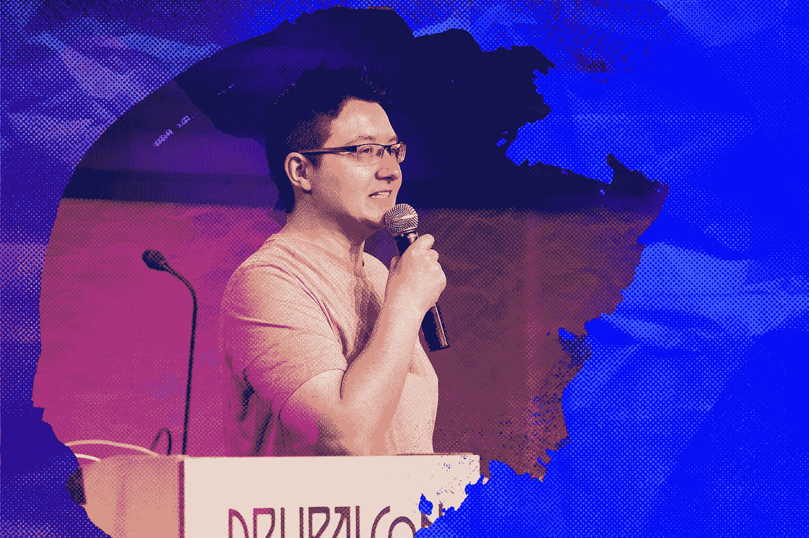

# Drupal 如何构建和促进多元化社区的发展

> 原文：<https://medium.com/hackernoon/how-drupal-structured-and-fostered-the-growth-of-a-diverse-community-3048b0a5441e>

Photo by [Dominik Kiss](https://www.flickr.com/photos/73490109@N02/37300507176/in/pool-drupalconvienna2017/)

安吉拉·拜伦在 VIC-20 上打出的第一批代码之一，是一个把红盒子变成蓝色的基本程序。从那个变色的广场，她将继续成为谷歌-奥莱利开源奖的获得者，第一个登上 Linux Journal 封面的女性，Drupal 的核心贡献者，以及奥莱利的一本书的合著者。然而，她不会通过最传统的途径到达那里。

十几岁的时候，拜伦没有选修大学计算机科学课程，也没有为了好玩而学习数学课本。她在一个由链锯唱片公司经营的留言板上闲逛，链锯唱片公司是一家来自波特兰的 Queercore 唱片公司。Byron 自学了 Perl、PHP 和 MySQL，为社区编写了新的功能。高中毕业后，她和女友一起搬到了加拿大，继续攻读计算机科学学位。在加拿大，拜伦做过一系列工作，包括为多个加拿大省级政府管理 IT。

用拜伦的话来说，她的工资如此之低，以至于她“没有资格获得工人签证”，所以她报名参加了一所社区大学以保留签证。在加拿大呆了五年多之后，她于 2005 年被谷歌的“代码之夏”录取，地点是在社区大学。正是在那里，她为一个名为 Drupal 的开源 CMS 做出了贡献——这个项目是她职业生涯的剩余部分。

自 2005 年以来，她已经成为开源软件最多产的贡献者之一，帮助指导 Drupal 完成了几十次迭代。一路走来，她帮助建立了当今最多样化、最受欢迎的开源社区之一。虽然 Byron 是第一个承认“我们并不完美”的人，但 Drupal 是一个将多样性放在首要位置的项目。

随着开源社区的[充分记录多样性问题](https://www.wired.com/2017/06/diversity-open-source-even-worse-tech-overall/)，她的建议尤为重要。下面，无论你是否在运行一个开源项目，我们已经分解了 Byron 关于建立一个多样化社区的三个关键建议。

# 1.制定全社区的行为准则

拜伦说，营造包容性环境的一部分是明确你的沟通标准——以各种形式。“我们采用了一套行为准则，既适用于我们的在线互动，也适用于我们的面对面活动，这很有帮助，”她说。“它让每个人都清楚什么样的行为是可以的，什么样的行为是不可以的。”

例如，Byron 制定了在 Drupal 文档中使用中性代词的策略，更广泛地说，是在代码库本身中使用中性代词。

她说，行为准则包括解决冲突的明确指导方针也很重要。Drupal 为此专门成立了一个四人小组。拜伦说:“我们引入了一种叫做社区工作组的东西，这是一个由一些人组成的团体，以防事情变得过于激烈，或者有人变得很混蛋。”“你可以升级到有调解经验的人，他可以试着让那个人冷静下来，让事情回到正轨。”

机构群体工作组的[文档](https://www.drupal.org/conflict-resolution)包括以下指南:

*   处理你和另一个贡献者之间的冲突
*   如果觉得无法解决或危险，就将冲突升级到 CWG
*   举报欺凌或骚扰，无论你是受害者还是旁观者

通过确保潜在的和现有的社区成员知道他们将受到尊重——如果他们没有受到尊重，他们有真正的权力来解决问题——Drupal 努力成为一个欢迎不同贡献者群体的社区。

# 2.提升多元化的领导团队

如果你想吸引一个多元化的贡献者群体，你必须首先展示一个多元化群体成为项目领导者的途径。促进不同的贡献者是 Drupal 发现的最有效的方法。

正如拜伦所指出的，这种心态不仅对于吸引一群具有不同身份、不同技能和背景的贡献者至关重要。吸引设计师、作家和其他非工程师贡献者加入开源项目很难，但 Byron 说，通过提升各种身份和背景的人，Drupal 已经能够吸引具有更难找到的技能组合的设计师、作家和其他创意人员，至少对于开源项目来说是这样。

> *我们已经做了很多工作，提升工作出色的人。例如，某个对可访问性或可用性充满热情的人，找到这些人，在屋顶上大声喊他们在做什么，并且经常将他们提升到项目的实际领导位置。例如，将他们提升为子系统维护者，该维护者对(开发)有一些签署，或者将他们提升为核心提交者团队的产品经理。诸如此类的事情。*

在 Drupal 社区中，还有一个独立的[多样性和包容性](https://www.drupaldiversity.com/initiatives)委员会，该委员会支持许多促进多样性和包容性的倡议，从专注于帮助代表性不足的人在技术领域找到工作的职业倡议，到帮助代表性不足的人为 Drupal 代码库做出贡献的 [D & I 贡献团队](https://www.drupal.org/drupal-diversity-inclusion-contribution-team)。正如 Drupal 的[价值观声明](https://www.drupal.org/docs/8/modules/drupal-diversity-inclusion/statement-of-values)中所说，“我们相信 Drupal 项目受益于多元化的贡献群体，我们努力在 Drupal 存在的任何地方——在活动中、在线上和在我们的工作场所——培养一种欢迎和包容的文化”

# 3.让不同的用户群能够访问您的项目

拜伦说，如果你想要一个多元化的贡献者群体，你需要做的不仅仅是表面上接受多元化。你需要向全世界展示，你的团队在所有决策中都考虑到了多样性和包容性，尤其是在产品层面。

> *我们不只是说，“哦，贡献的多样性很好。”我们实际上把它放到了我们的开发实践中。我们有一组核心关卡，在补丁提交到项目之前需要通过这些检查。除了一些标准的东西，比如自动化测试，性能，以及更多类似的技术，还有一些关于新功能的可用性，新功能的可访问性的门，以确保我们不会让这些东西从缝隙中掉出来。*

*   该项目符合 WCAG 2.0 和 ATAG 2.0(流行的可访问性指南)
*   HTML 结构符合 WCAG 2.0
*   文本颜色有足够的对比度
*   表单域被标记
*   JavaScript 是键盘可用的

Gate 还包括关于贡献者如何独立测试这些需求的说明，确保每个补丁可以被尽可能多的用户使用。对于任何开放源码项目，贡献者通常从用户开始，因此从逻辑上讲，拥有一个多样化的用户组，你就会受到一个多样化的贡献者组的喜爱。

Byron 承认，对于大多数工程师来说，开源工作是一种奢侈品，没有被充分代表的人负担不起。目前，Byron 在 Acquia 工作，这是一家由 Drupal 的创建者创办的公司，她的职位允许她差不多全职在 Drupal 上工作，但情况并非总是如此。

事实上，拜伦在描述她早期的职业生涯时说，“我可以说，我完全、不可持续地做了两份全职工作……我的全职工作是……实施工作。它向公司咨询基于 Drupal 的解决方案。它做架构，领导其他开发者的团队，诸如此类的事情。然后我有了另一份全职工作，那是我的志愿者，社区管理工作——审查补丁，为核心编写代码。我基本上是在做两份全职工作，这是不推荐的。它让我失去了一段婚姻。”

对于对开源项目感兴趣的工程师来说，这种安排并不少见，根据 Byron 的经验，这限制了许多未被充分代表的人做出贡献的能力。“传统关系中的大多数女性没有那种空闲时间……甚至没有时间去开源，”她说。根据她的经验，公司——尤其是那些从开源技术中获利的公司——可以通过给员工时间为公司使用的项目做贡献来解决这个问题。

拜伦说，对于“公司来说，利用这段时间，特别是如果他们从开源软件中赚了很多钱，这在道德上是正确的事情”。“这相当于公平竞争，因此我们可以让更多未被充分代表的群体为这些项目做出贡献。”

*最初发表于*[*【angel.co】*](https://angel.co/blog/drupals-angela-byron-on-building-a-diverse-community)*。*