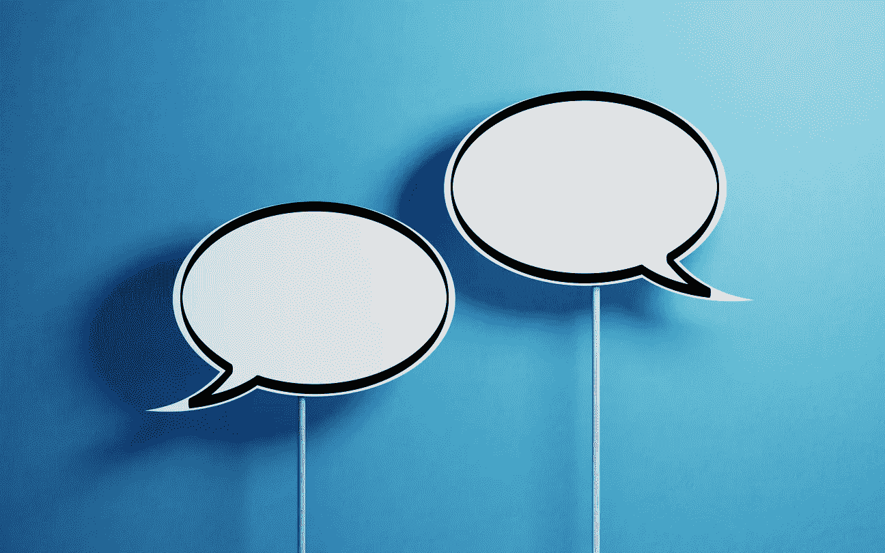

# 工程师如何像销售人员一样进行说服

> 原文：<https://medium.com/hackernoon/how-engineers-can-persuade-like-salespeople-38d2c928904f>

销售人员名声不好，有些人是罪有应得。他们通过向你发送垃圾邮件来破坏销售，只是为了在你同意接听电话时让你经历一段漫长、无聊的独白。

但是，用鄙视的眼光看待销售是具有讽刺意味的。销售是每个人工作的重要组成部分，学习如何像优秀的销售代表一样说服他人会让你成为一名不可或缺的工程师。它还将帮助您构建更好的产品。

*   你想增加下一次雇佣一个优秀工程候选人的机会吗？
*   如何最终实现你在过去 12 个月里一直困扰老板的第三方解决方案——他一直在“思考”的那个
*   想避免人们在演示过程中睡着吗？

我知道你很怀疑。一个销售人员知道什么？“如果我创作出高质量的作品，它自然会得到应有的关注。”

不对。

除非你恰当地提出你的想法，否则没人会在意。但是，不要害怕。有一个简单的系统可以让你更有说服力:

1.  STFU；
2.  让他们尽早、经常地交谈；和
3.  不要跳进杂草里。

# **STFU**

*“The more you say the more likely you are to say something foolish.”* — Robert Greene

你有没有参加过这样的会议，在你发言后，整个会议室变得鸦雀无声？几秒钟过去了，你开始扫视房间，祈祷有人会打破令人不安的沉默。更多的时间过去了。哦不，已经快 15 秒了。现在你得说点什么。也许再重复一遍你说过的话，或者深入杂草中。

如果有一种策略能让你更有效地表达自己的观点，那就是适应沉默。一开始会觉得不自然，但在黑巧克力上放海盐的想法也是如此。

以我的经验来看，正是在这些时刻，你才能了解你的听众对你所讲内容的真实感受。沉默之后的问题揭示了某人的真实立场。我共事过的很多人都错过了这个机会，他们在提出观点后马上就问了一个问题。这完全是自私的。这就像你在餐馆吃饭，服务员在你上完菜三十秒后回来问你觉得这顿饭怎么样。

你必须给人们一个机会来消化你所展示的信息。在做出批评性的陈述后暂停，不仅会让你看起来更自信，还能让你的听众思考并形成回应。利用尴尬沉默的力量为自己谋利。当你给人们喘息的空间时，你将获得有价值的信息，你将有更好的机会[控制你的听说比率](https://blog.hubspot.com/sales/best-sales-calls-25537-calls)。这就引出了我的下一个观点。

# **让他们尽早并经常交谈**

人们可能不会记得你到底做了什么，或者说了什么，但是他们会永远记得你给他们的感觉 —玛娅·安杰洛

让人们对与你的互动感觉良好的最简单的方法就是让他们说更多的话。想想看，当你不能和你那位喋喋不休的凯茜朋友插一句话时，这有多烦人。如果*你*说得最多，你可能会得到很多点头，然后带着对自己表现的由衷满意离开。但是，你猜怎么着？不是关于你的。《[如何赢得朋友和影响他人](https://www.amazon.com/How-Win-Friends-Influence-People/dp/0671027034)》销量超过 1500 万张。它最大的收获之一是什么？“做一个好的倾听者。鼓励别人说说自己。”

但是，让你的听众尽早发言并不意味着要求他们一个接一个地做介绍。这是一个糟糕的想法，也是经典过时的销售技巧之一。在会议开始时，你的听众的注意力水平是 70%,在会议中间，它下降到 20%,而在会议结束时又达到 100%。不要浪费那 70%的时间来提取你本可以在会议前谷歌搜索的信息。这就是所谓的吊床效应，在赢得复杂销售的[对话](https://www.amazon.com/Conversations-That-Complex-Sale-Opportunities-ebook/dp/B004H4XL7Y)中有详细介绍。我们的注意力持续时间短，并且要求立即得到满足。当我们参加会议——展示&演讲、采访、提案审查——并被冰冷的硬数据轰炸时，我们会不予理会。然后我们在结尾时又回来了，因为我们兴奋地想要逃离。

Your audience’s attention level is highest at the beginning and end of your meeting.

通过问你的听众一个开放式的问题，比如“你想解决的主要问题是什么？”来让他们尽早参与进来这将让他们交谈，并帮助你定制如何传递你的信息。这些可以包括:

*   你希望下一个角色最重要的是什么？
*   本季度我们必须推出的最重要的功能是什么？
*   你如何定义这个项目的成功？

即使你确切知道他们的答案是什么，你也应该这样做(另外，没有人喜欢万事通)。当他们揭示一些你没有想到的事情时，你会感到惊讶，特别是当你忙于关注一个症状时，这是根本原因。

对于后续对话，从快速回顾上次互动开始。这可能包括审查他们希望明确的要点。一旦你背诵了这些要点，问“你还有什么要补充的吗？”这非常有效地让你的观众告诉你什么是真正重要的。

但是，开放式问题不应该只保留在互动的开始。下次当你结束一个演示或报告，听到有人说“太酷了”，不要简单地回答“我知道，对吗？”相反，问“你觉得它的哪一部分最有价值？”他们很有可能会透露你意想不到的信息。另外，如果你是一个好的笔记记录者，你可以记下他们是如何描述你的功能的好处的，然后传给你的营销团队。他们会感谢你为他们节省了大量制作宣传材料的时间。我不是一个善于记笔记的人，所以我让 Zoom 默认记录我所有的电话。这已经改变了销售与工程在[gravity](https://gravitational.com)的合作方式。

# **不要跳进杂草里**

用事实和数字轰炸人们是无法让他们接受你的想法的。想想你那位关注福克斯新闻频道的亲戚，他认为人为气候变化的概念是个骗局。你认为给他们发一份同行评审的科学杂志会让他们最终明白吗？

人是被情绪驱动的，而不是事实。这就是为什么过早地跳入冰冷的硬数据是一个可怕的想法。有[科学支持这个](https://www.psychologytoday.com/us/blog/the-divided-mind/201207/logic-and-emotion)，但这里总结为一句话:人们用他们的杏仁核[大脑的“感觉中心”](https://www.neurologytimes.com/blog/how-brain-processes-emotions)做决定，但事实是由你的新大脑皮层传达的。你在说一种不同的语言。你必须引导人们接受复杂的想法，否则他们会走神。

当你推销想法时，从高开始，只到你需要的时候。在最高层次上，您希望分享相互冲突的力量，以创建对您构建的功能或您希望实现的第三方解决方案的明确需求。这个的重点是要说清楚超级脆，为什么*现在*是你的观众行动的时候了。如果你不能解释清楚，那么游戏就结束了。

"我们在协议层强制你的身份."这是我解释我们的产品[传送](https://gravitational.com/teleport)的一种方式。你会转身离开。或者，我可以从说明保护数据是企业面临的最大挑战之一开始。当您拥有员工旋转门和短暂的云计算基础架构时，这变得更加复杂。Teleport 通过让人们在适当的时间内适量访问您的基础设施来帮助您克服这一问题。一旦你已经准备好接受更多的技术细节，我会更深入地研究这些杂草。

一旦你进入杂草中，就再也出不来了。人们消化技术信息的能力就像肌肉——当它超负荷时就会萎缩。这导致了分析麻痹和惰性。你分享的信息越多，你就越淡化你的信息的核心。另外，最好让你的观众想要更多。这就是为什么人们在摇滚乐队离开舞台后会高唱“安可”。我说的摇滚乐队是指说唱歌手，因为没人再听摇滚了。

# **把所有的放在一起**

练习少说。走进你的下一次谈话，目的是让对方说更多的话。在你用冷酷无情的事实打击你的听众之前，先激发他们的情绪。你不仅会提升你的说服能力，还会提升你创造伟大事物的能力。毕竟，当你有合适的团队，合适的工具，以及哄骗人们测试你的最新作品的能力时，构建伟大的产品会更容易。